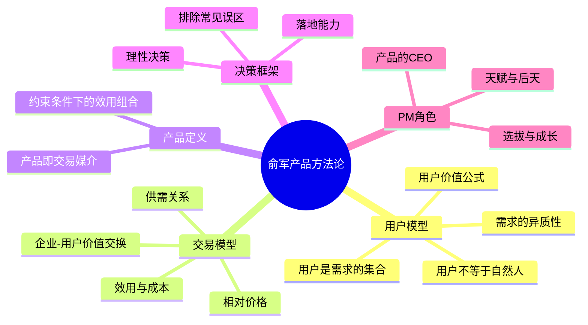
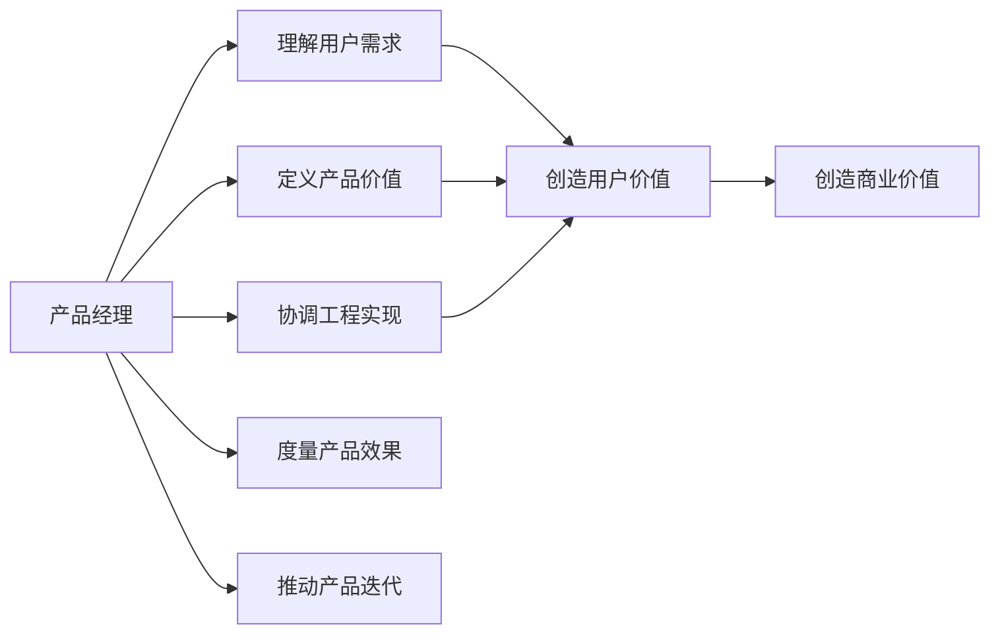
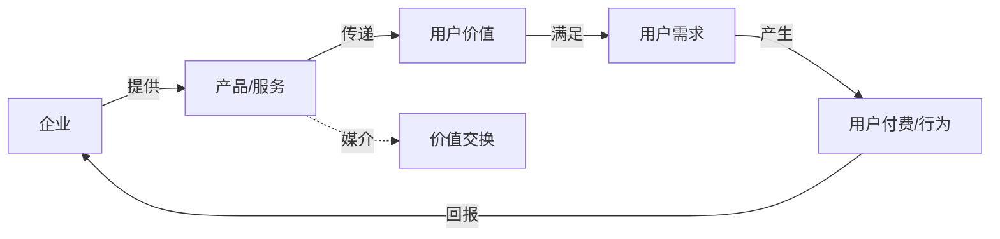
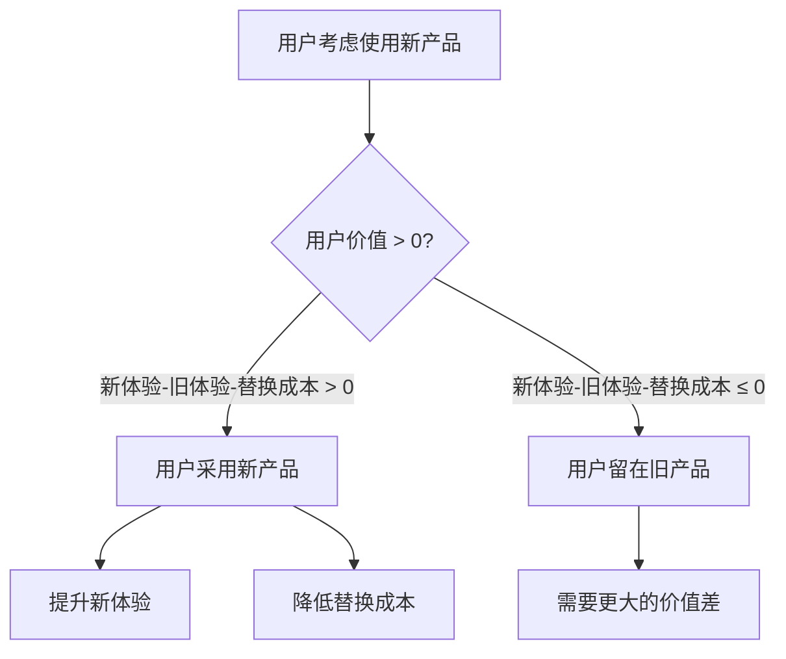
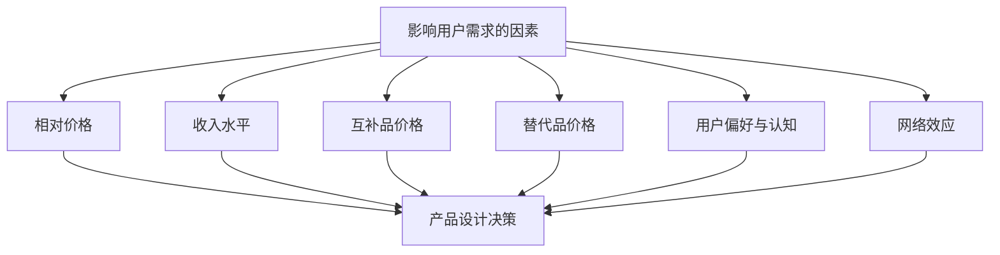
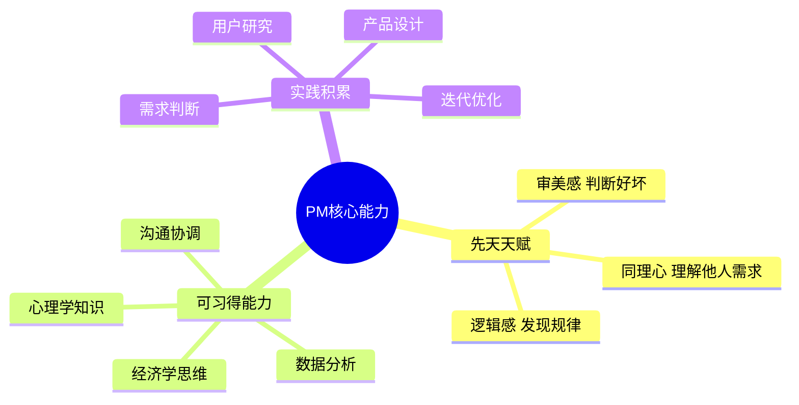
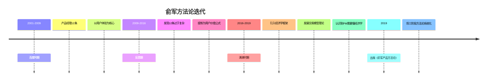

# 俞军产品方法论

> "产品经理是以创造用户价值为工具，为公司创造商业价值的人。"
> ——俞军

[[俞军]]的产品方法论，是中国互联网产品领域迄今为止最系统、最深刻的方法论体系之一。它不是一套技巧清单，而是一套思维框架——以经济学和心理学为基础，重新定义产品经理的工作本质。

## 方法论总体框架

## 第一章：产品经理是什么

### 历史溯源

产品经理这一职业起源于宝洁公司（1926年），当时宝洁用一个专职品牌经理来负责卡玫尔香皂的全面推广，打破了各职能部门"低优先级"的困境。

互联网时代的产品经理与消费品时代有根本差异：

| 维度 | 消费品产品经理 | 互联网产品经理 |
|------|--------------|--------------|
| 核心工作 | 品牌管理、市场推广 | 需求挖掘、产品设计 |
| 执行资源 | 工厂工人 | 工程师 |
| 迭代周期 | 年级 | 周级甚至日级 |
| 数据反馈 | 销售数据滞后 | 实时用户行为数据 |
| 用户理解 | 市场调研 | 数据分析+用户研究 |

> "为什么工业时代的企业没有产品经理，总经理就是产品经理，要做市场定位，通过工人实现，不断打磨迭代；互联网时代可以同时做很多产品，才把产品经理岗位从总经理身上剥离出来，做用户需求挖掘、产品设计，通过工程师实现。"
> ——俞军

### 产品经理的本质角色

俞军将产品经理定义为"产品的CEO"——需要像CEO一样全面思考，对产品全局负责：

## 第二章：企业、用户与产品

### 三方关系模型

俞军的核心框架是**企业-用户-产品**三方关系：

> 企业以产品为媒介，与用户进行价值交换，达成创造商业价值的目的。交换的不是产品这个媒介，而是产品背后的各种用户价值。

**用户价值 ≠ 商业价值**，但两者不是对立关系：
- 用户价值是**手段**，商业价值是**目的**
- 不能创造用户价值的产品，长期无法维持商业价值
- 无法转化为商业价值的用户价值，企业无法持续提供

### 如何理解用户

俞军最重要的认知突破之一：**用户不等于自然人**。

> 用户是需求的集合，是使用产品时的行为主体，而不是固定的个人。同一个人在不同情境、不同时间，是不同的"用户"。

这一观点的实践含义：
- 不要笼统地说"用户需要什么"
- 要分析的是"处于什么情境中的用户有什么需求"
- 用户需求具有**异质性**（不同用户的需求不同）和**情境性**（同一用户在不同场景中需求不同）

### 如何理解产品

产品的本质定义：

> **产品 = 约束条件下的效用组合**

- **效用**：产品能给用户带来的价值（满足需求的程度）
- **约束条件**：技术能力、资源投入、法律监管、用户认知等
- **组合**：没有完美产品，只有在约束下的最优解

## 第三章：交易模型

### 用户价值公式

俞军最广为人知的贡献，是将产品设计的逻辑提炼为一个公式：

$$\text{用户价值} = \text{新体验} - \text{旧体验} - \text{替换成本}$$

这个公式的深刻之处在于：用户评估产品价值，不是绝对判断，而是**相对判断**。

| 变量 | 含义 | 产品策略 |
|------|------|---------|
| 新体验 | 产品提供的效用价值 | 持续优化功能，提升体验 |
| 旧体验 | 用户当前使用方案的价值 | 分析竞品/替代方案的局限 |
| 替换成本 | 迁移的学习成本、数据迁移成本等 | 降低迁移门槛，提供导入工具 |

### 效用与成本分析

用户做出使用决策的逻辑：

**效用（用户获得的价值）**包括：
- 功能效用（解决了什么问题）
- 体验效用（使用过程的感受）
- 社交效用（来自他人的认可）
- 情感效用（心理满足感）

**成本（用户付出的代价）**包括：
1. **直接成本**：金钱、时间、隐私数据、注意力
2. **交易成本**：
   - 搜寻成本（找到合适产品的代价）
   - 议价成本（比较价格的代价）
   - 学习成本（掌握使用方法的代价）
   - 保障成本（确保质量的代价）

> 只有产品对用户的效用大于用户付出的成本，用户才会选择这个产品。

### 相对价格定律

俞军将这一规律称为"人间第一定律"：

$$\text{相对价格} = \frac{\text{直接成本} + \text{交易成本}}{\text{效用组合}}$$

**其他条件不变时，相对价格降低，需求量上升。**

应用此定律的关键是要识别"其他条件"——用户对产品的认知偏好、使用习惯、网络效应等都是约束条件，单纯降价不一定能增加需求。

### 供需关系与定价策略

## 第四章：决策框架

### 理性决策的核心

俞军将产品决策的本质定义为：**在约束条件下，找到效用最大化的选择**。

常见的决策误区：

| 误区 | 表现 | 正确做法 |
|------|------|---------|
| 把用户需求当成用户要求 | 用户说要什么就做什么 | 分析用户真实诉求，而非表面要求 |
| 以自己代替用户 | "我觉得用户会喜欢" | 建立用户模型，数据验证 |
| 忽视替换成本 | 只看新功能有多好 | 计算迁移门槛 |
| 短视决策 | 只看当期数据 | 考虑长期用户价值 |
| 忽略边际效益 | 继续投入已充分满足的需求 | 识别边际收益递减点 |

### 决策的落地能力

> "能落地的决策才有价值。"

好的决策需要：
- **可执行**：有清晰的行动计划
- **可度量**：有量化的成功指标
- **可迭代**：快速反馈，持续优化

## 第五章：产品经理的选拔与成长

### 优秀PM的天赋要素

俞军认为，产品经理有一些难以后天习得的天赋要素：

> "同理心是地基，想象力是天空，中间是逻辑和工具。"
> ——张一鸣对俞军观点的诠释

### 成长路径

俞军的成长框架是：**大量实践 → 深度反思 → 理论提炼 → 再次实践验证**

晋升评估的维度通常包括：绩效（战功、业务增长）、能力（产品设计、用户洞察、决策质量）、潜力（成长速度、认知边界）。

## 方法论的认知迭代

俞军自己的产品认知迭代史，是理解这套方法论的最好案例：

## 与其他方法论的对比

| 维度 | 俞军方法论 | 传统产品方法论 |
|------|-----------|--------------|
| 理论基础 | 经济学 + 心理学 | 用户体验设计 |
| 用户定义 | 需求的集合 | 自然人 |
| 价值衡量 | 公式化（新体验-旧体验-替换成本） | 主观评估 |
| 产品本质 | 约束条件下的效用组合 | 功能集合 |
| 决策框架 | 理性效用最大化 | 直觉+经验 |

## 参见

- [[俞军]] — 人物传记
- [[用户价值模型]] — 核心公式深度解析
- [[产品思维]] — 更广泛的产品方法论
- [[推荐系统概论]] — 产品方法论的实践案例
- [[王兴]] — 同时代产品人的思考
