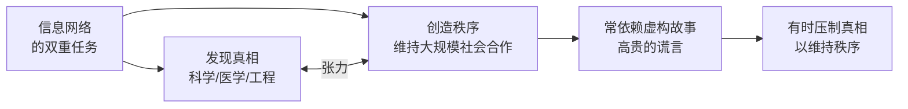

# 信息联结论

尤瓦尔·赫拉利在《[[智人之上]]》（2024）中提出的核心理论框架：**信息的本质是联结，而非呈现真相**。这一重新定义挑战了主流科技话语中的"天真信息观"，为理解人类文明史和AI革命提供了统一的分析框架。

---

## 核心命题

**信息是将不同的点联结成网络、从而创造新现实的任何媒介。**

这一定义与通常的理解截然不同：信息不必是"关于某件真实事物的准确描述"，而只需能够将行为者联结起来，形成协调行动。

---

## 论证基础

### 三类"信息"的统一理解

| 信息类型 | 联结方式 | 是否呈现真相 |
|---------|---------|------------|
| DNA | 联结有机体各部分，协调生物行为 | 不涉及真相概念 |
| 音乐 | 联结人们的情感与节奏，使集体行动同步 | 不呈现任何命题性真相 |
| 神话故事 | 联结信众，使大规模合作成为可能 | 内容可能是虚构的 |
| 法律条文 | 联结公民，建立行为预期 | 人造惯例，非自然事实 |
| 货币 | 联结陌生人，使市场交换成为可能 | 面值是集体约定，非客观价值 |

以上所有"信息"都在**发挥联结功能**，但未必在呈现外部现实。这说明信息的核心功能是联结，而非呈现。

### 批判"天真的信息观"

天真的信息观（由谷歌、扎克伯格、库兹韦尔等人代表）认为：
- 信息 = 现实的镜像
- 更多信息 = 更接近真相
- 更接近真相 = 更好的决策与福祉

赫拉利认为这一观点忽略了信息的联结功能，因而无法解释：
- 为何纳粹德国有世界最先进的科学，却同时坚持种族灭绝神话
- 为何宗教（内容大量为虚构）能维系数十亿人的合作数千年
- 为何民主社会并不是"信息量最大"的社会，却是最能自我修正的社会

### 批判"民粹主义的信息观"

民粹主义信息观（由福柯等人代表）认为信息只是权力武器，没有客观真相。赫拉利的回应：这同样片面——医学、工程、物理学的确在追求且能够接近客观真相，否则飞机不会飞、疫苗不会起效。

---

## 真相与秩序的根本张力

信息联结论的推论：人类信息网络必须同时完成两项互相矛盾的任务：

**历史案例：**
- **科学与宗教的冲突**：达尔文演化论威胁宗教秩序，许多政府禁止教学——为秩序牺牲真相
- **纳粹德国**：鼓励火箭科学，禁止质疑种族理论——力量强大但极度缺乏智慧
- **美国宪法**：大方承认自身是人类创造的惯例（不是神授），因此提供了修正机制——秩序建立在诚实的虚构之上

这个张力没有终极解决方案，每个社会都在走钢丝。

---

## 主体间现实

信息联结论的关键推论：人类创造了独特的"第三类现实"——**主体间现实**（intersubjective reality）。

| 类型 | 存在方式 | 案例 |
|------|---------|------|
| 客观现实 | 独立于信念而存在 | 引力、山脉、原子 |
| 主观现实 | 只在个人意识中存在 | 我的头痛、我的爱情 |
| **主体间现实** | **存在于集体信念网络中** | 货币、国家、法律、神祇 |

货币不是主观幻觉（一个人相信无效），也不是客观物质（纸本身没有价值），而是只要足够多人相信就真实存在的联结网络。这使"无意义的虚构"（金融系统、民族认同）能够产生完全真实的后果。

---

## 对AI的应用

信息联结论帮助理解AI的独特危险性：

**过去的信息技术**（印刷机、收音机）只是联结的**媒介**——扩大人类创造的联结，但自身不能创造新联结或做决定。

**AI**是第一个能够**主动创建联结**的非生物技术：它能自行决定什么内容传递给什么人（推荐算法），能生成新的故事（AIGC），能在人类之间制造或瓦解信任关系。

因此，AI不只是放大人类的信息联结能力，而是成为信息网络本身的**能动成员**——这是之前所有信息技术都不曾做到的事。

---

## 批判性评估

**理论价值：**
- 提供了一个统一解释DNA、语言、政治制度的信息框架
- 有效解释了"为何力量强大的社会可以同时极度愚蠢"
- 对AI威胁的定性（成员vs工具）比"AI会统治人类"的科幻叙事更精确

**可质疑之处：**
- DNA的"联结"是物理化学联结，与人类社会信息的"主体间联结"存在逻辑跨越——两者的"联结"是否属于同一类现象需要进一步论证
- "信息=联结"定义过于宽泛：如果任何联结都是信息，这个定义的边界在哪里？赫拉利未充分处理这个问题

---

## 相关文章

- [[智人之上]] — 提出信息联结论的原著书评
- [[信息网络政治学]] — 基于信息联结论的民主/极权分析框架
- [[奇点临近]] — 代表"天真信息观"的对照文本
