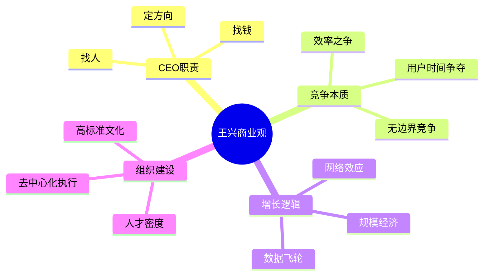

# 创业与商业

[[王兴]]的商业观通过十余年的饭否帖文逐渐成型。从早期对创业项目好坏的判断，到[[美团]]所处的激烈竞争中形成的战略原则，再到后期对整个商业生态的宏观观察，构成一个持续演进的思想脉络。

> **王兴论CEO职责** ："CEO只需要做三件事：找到合适的人，找到足够的钱，确定正确的方向。其他一切都是执行。"

## 对项目与机会的判断

王兴在早期就对市面上随波逐流的创业现象保持警惕。2007年，他说服一个朋友打消了一个"听起来不太靠谱"的项目的创业念头。同年，他观察到大量人打算复制Facebook的模式，评论道："非死不可啊非死不可"。他识别好机会的标准之一，是看有没有真正未被满足的用户需求，而不只是跟风热点。

他在2012年提到，当年早年调研过的两个项目，十年后被别人做出来了，且他"立刻觉得大有前途"，因为"外部环境不成熟，现在情况已经变好了"。这反映了他对时机的重视：好的项目若时机不成熟，等待比放弃更有价值。

他引用红杉资本的原则"Bet on the racetrack, not the jockey"（赌赛道，不赌赛手），并将其与孙子的"求之于势，不责于人"对应，倾向于后者作为中文表达（2007-07-27）。

## 竞争的本质理解

王兴对竞争有两个层面的认识。一是概念辨析："竞争竞争，何为竞，何为争？同向为竞，相向为争。"（2013-05-23）这一区分提示，市场份额之争（竞）与商业模式之争（争）在逻辑上并不相同。二是对竞争结果的清醒判断："Be No. 1 or No. 2, or dead."（2013-11-15，转引）他观察到智能手机行业三星和苹果利润之和超过全行业109%，视之为市场集中化规律的教科书案例。

他对"战略上打持久战，战术上打歼灭战"（2015-11-28）的信奉贯穿于美团的竞争策略中。他也观察到商业史上合并是常态，"著名的戴姆勒-奔驰公司就是一百多年相互竞争不相伯仲的两家公司合并而成的"（2015-12-13）。

## 对"免费"作为竞争策略的历史观

王兴在2015年将免费策略追溯至宗教竞争，以马丁路德改革为例：天主教构造了"什一税"的收费模式，而"新教开创者马丁路德站出来：不要鸟他，我也能救你，而且我免费！"（2015-05-17）。他由此指出免费作为一种竞争策略历史悠久，并非互联网的发明。最简单的产品最容易发展用户，"不但互联网产品如此，宗教也一样"。

## CEO的职责定义

王兴对CEO角色有明确的三项职责定义（转引自博客）："CEO最重要的三项工作：设定公司的愿景和总体战略并传达给所有利益相关方，招募并留住最最优秀的人才，确保始终有足够的现金。"（2011-01-24）

他也接受德鲁克的批评："CEO最大错误是把内部管理当成最主要工作，CEO真正的战场是客户不是管理。"（2014-01-12）这两者并不矛盾，但指向同一个判断：CEO应向外而非向内。

他在美团之星评选后的一条帖文体现了他的用人哲学："这些候选人中的多数在各自岗位上的表现都比我在CEO这个岗位上的得分高"（2014-12-25），这种自我评价方式既是谦虚，也是对团队的高度肯定。

## 公司与企业的差异

王兴对中文语境中"公司"和"企业"两词的区别有自己的观察："从'上市公司'和'家族企业'这两个常见词组里可以感受到。很少人说'上市企业'，没有人会说'家族公司'。"（2015-06-19）这个语言细节揭示了两者在治理结构上的本质不同。

## 商业道德与市场信任

王兴对市场经济的基本信仰是，商业的意义在于创造价值而非零和竞争。他引用福布斯杂志创始人的话："商业的目的是要创造幸福，而不仅仅是财富的堆积。"（2012-03-04）他也反复提醒自己和同事："在商业上，没有什么东西是免费的，也没有什么东西是无价的。"（2016-08-09）

他对中国商业道德问题有直接的观察。他转述了一位传统零售老大哥的感慨："中国社会的道德已经败坏到，几乎各行各业，养什么种什么的人都不吃什么。"（2015-06-14）这一观察映照了他在美团持续强调"靠谱"品牌价值的内在动机。

## 创业周期与行业节律

王兴对互联网行业周期有精炼的归纳。他在2016年初写道："2014年，该上市的上市；2015年，该合并的合并；2016年，该倒掉的倒掉。"（2016-01-08）这一判断不只是对过去三年的总结，也是对行业集中化趋势的前瞻。

他对创业者的警示也不乏幽默：他转发了一段关于"自己当老板就自由了"的专车司机段子，加注："谨以此段子献给那些以为去创业当了CEO就从此自由从此海阔天空的人们。"（2015-05-01）

## 人才与团队

王兴对用人哲学有明确立场。2013年，他转引一句被归于乔布斯的话，认为"太深刻了"："和聪明人一起工作，最大的好处就是不用考虑他们的自尊。"（2013-05-21）他在美团之星评选后写下，大多数候选人"在各自岗位上的表现都比我在CEO这个岗位上的得分高"（2014-12-25），这种自我评价方式既是谦虚，也是对团队的高度肯定。

他对[[亚马逊]]的长期主义尤为推崇。当[[亚马逊]]发言人被问到如何应对谷歌在云计算方面的竞争时，回答是"we know how to compete in a commodity business"；王兴的评语是"别的公司这么说有装B之嫌，amazon这么说就是真牛B"（2010-12-12，2020年再次转引）。

## 行业格局的长期视角

王兴对行业集中化趋势有跨年度的持续追踪。2014年，他在读书时注意到"上个世纪初，美国的汽车公司逐渐从1800家减少到3家。听起来也和'千团大战'差不太多嘛。只是速度稍微慢一点。"（2014-10-28）2020年，他对中国新能源汽车格局给出了精炼总结："中国车企格局基本是3+3+3+3角逐下两轮"，即3家央企、3家地方国企、3家传统民企、3家造车新势力（2020-01-05），并预测理想汽车能晋入下一轮。

他对公司阶段判断的标准是历经多重压力测试的综合能力："是否经历过主营业务的变迁、是否换过几任CEO、是否有能力在不同国家/语言/文化环境下开展业务、是否经历过几个大的经济周期"（2015-02-27）。
