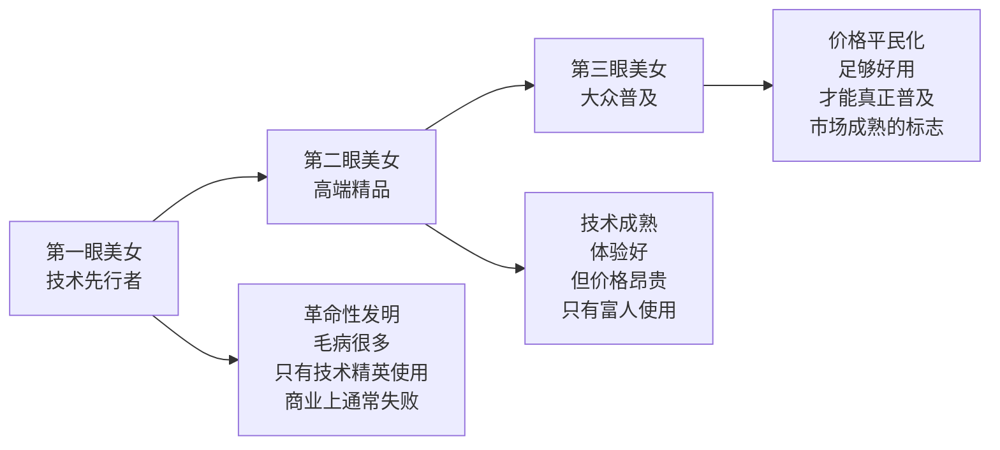
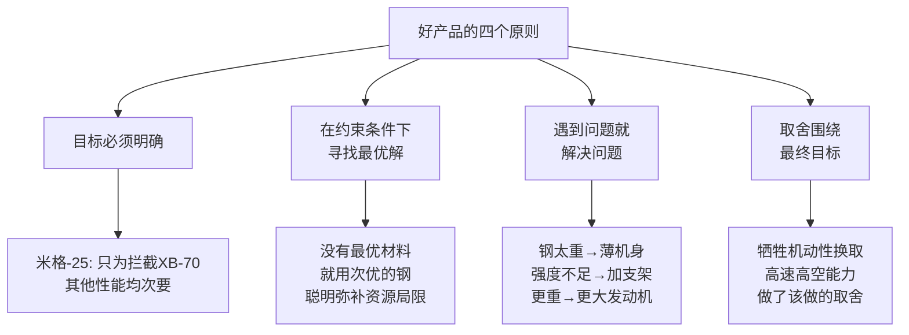

# 吴军产品观

[[见识]]中有三处集中讨论产品设计哲学：减少选择的反直觉原理、新产品进入市场的"第三眼美女"三阶段模型，以及用米格-25战斗机案例总结的好产品标准。

## 减少选择：好产品不迎合，只引导

吴军观察到一个反直觉的现象：**给用户更多选择，往往带来更低的满意度**。

苹果产品线极短，从不让用户在颜色、配置上做过多决策，却成为全球最被追捧的消费电子品牌。三星意识到这一点后，将上百款手机砍到屈指可数的几款，反而长期占据市场份额第一。欧米茄手表从上千种缩减到一百种，销量反而大幅上升。本田汽车只有雅阁、思域等几款车型，每款在美国都是同类最畅销。

谷歌的实验证明了同样的规律：当产品难以自定义设置、用户只能使用默认配置时，满意度反而更高。苹果曾推出颜色可选的 iPhone 5C，销量并未因此提升，此后苹果彻底放弃了这个方向。

吴军在腾讯的亲身案例尤为生动：部门年底出国旅游，秘书提供两个选项——北海道滑雪或普吉岛海滩。吴军让她只保留一个。理由是：给了两个选项，选北海道的人会想象普吉岛的阳光；选普吉岛的人会羡慕北海道的温泉美食，两拨人都回来觉得没选对。只给一个选项，大家会专注于当下的体验，反而更满意。

> "一个好的产品设计者会想办法引导顾客，而不会去做迎合每一个顾客的事情。"

选择过多带来的问题不只是选择困难，而是**永远在比较，无法满足**。这与[[俞军产品方法论]]中"减少用户决策成本"的思路高度一致。

## 第三眼美女：新产品的三个阶段

吴军用"第三眼美女"比喻新技术产品进入市场的规律：

**三个案例印证这一模型：**

**图形视窗操作系统**
- 第一代：施乐 PARC 研究中心发明（从未真正面世，只有极少数技术精英了解）
- 第二代：苹果 Mac（体验精致，但价格昂贵，兼容性差）
- 第三代：微软 Windows（不那么精致，但便宜、兼容性好，得以普及）

**智能手机**
- 第一代：微软、黑莓、诺基亚的早期智能手机（功能粗糙，只有技术爱好者尝鲜）
- 第二代：苹果 iPhone（体验革命性，但是高端产品，与大众距离远）
- 第三代：谷歌 Android（便宜实用，真正普及）

**电动汽车**
- 第一代：通用 EV-1（1996-1999，环保人士的炫酷玩具，续航极短）
- 第二代：特斯拉 Model S/X（性能出色，但售价 7-13 万美元，只有富人购买）
- 第三代：特斯拉 Model 3（发布一周订出 20 多万辆，超过特斯拉此前所有车型销量总和）

**核心推论：**

绝大多数产品的三个阶段由**不同公司** 领跑。第一、二阶段的公司往往在商业上不成功，本质上是在为第三阶段做基础建设。真正能走完全部三阶段的公司极为罕见（特斯拉是少数例外之一）。

对于创业者，这个模型的意义在于：评估一个市场时，判断它处于哪个阶段。在第一阶段进入的公司，需要有足够的资本耐心等到第三阶段；而进入第三阶段的公司，才能真正把规模做出来。

## 米格-25：好产品的四个原则

吴军以苏联米格-25战斗机为例，总结了工程与产品设计的底层原则。

**背景** ：美国研制超音速高空轰炸机 XB-70，苏联为应对威胁，在材料工业远落后于美国的条件下，设计出能够拦截它的米格-25。苏联无法使用昂贵的钛合金，就用钢来替代——钢虽然重，但在高温下能保持强度。钢制机身导致飞机超重，于是机身和机翼做得极薄；薄了又会变形，于是加支架；加了支架更重，于是装更大发动机……每一个问题的解决都派生出新问题，最终工程师靠一系列取舍，造出了这架创造多项世界纪录的飞机。

**原则一：目标必须明确**

米格-25 所有的技术指标只围绕一件事：拦截高空高速轰炸机。机动性差、拐弯半径大，都是可以接受的代价。一个没有明确目标的产品，不知道该做什么取舍，什么都想要，最后什么都做不好。

**原则二：在约束条件下找最优解**

工程与科学不同——工程没有绝对正确的答案，只有在当时条件下的最优解。等待完美条件，是产品死亡的最常见原因。美国评价米格-25："极善于用取之不尽的聪明才智来弥补资源的局限。"

**原则三：遇到问题就解决问题**

产品开发过程中，解决一个问题必然派生出新问题，这是常态而非意外。产品经理和工程师的核心能力就是对这种连锁问题保持平静和耐心，一个接一个地解决。

**原则四：目标变了就要改变方案**

米格-25 是为拦截轰炸机设计的，后来被伊拉克用来追击美军时速 0.15 马赫的无人侦察机，效果惨不忍睹。这不是飞机的问题，而是使用者刻舟求剑。同样，当市场需求变化时，继续沿用为旧目标设计的产品方案，是最常见的失败模式之一。
