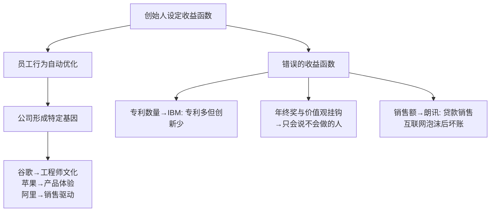
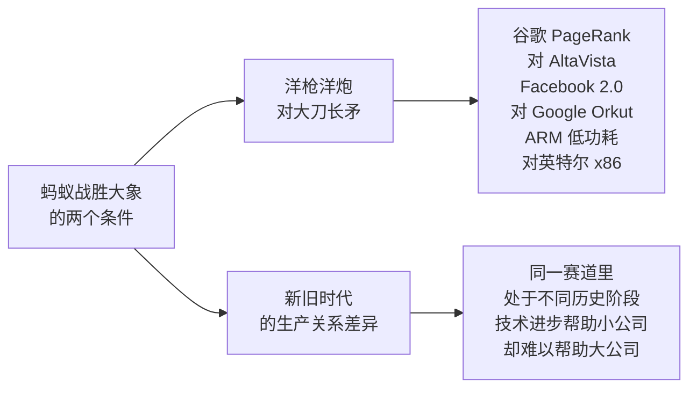

# 吴军创业观

[[见识]]第二、三章是吴军创业与创新方法论最集中的表达。核心论点是：**创新不是从 0 到 1，而是从 N 到 N+1**；小公司战胜大公司的路径不是靠勤奋，而是靠代际差异——洋枪洋炮打大刀长矛。

## 创新不等于从 0 到 1

吴军与《硅谷百年史》作者皮埃罗·斯加鲁菲梳理了硅谷最重要的科技产品，发现其中绝大多数**最初并不诞生于硅谷**：互联网、人工智能、触摸屏、GPS 等，很多源于麻省理工学院或其他研究机构，但这些发明在原产地往往"没有下文"。

**麻省理工 vs 硅谷的区别**：MIT 擅长从 0 到 1 的原创发明，但不擅长走完从 1 到 N 的商业化历程。硅谷的优势在于把别人发明的技术，靠叛逆和执着走完从 1 到 N 的全过程。

**N+1 创新的定义**：在前人工作的基础上，做出一个质的飞跃。仙童公司在晶体管基础上发明集成电路；英特尔在集成电路基础上开创超大规模集成电路。每一步都是"N+1"，而不是全新的"0 到 1"。

**山寨是 N-1**：抄袭后低水平重复，偷工减料降价销售，永远跟在别人后面，无法走到 N。

硅谷成功的两个关键词：**叛逆**（愿意挑战现有秩序，不畏惧大公司）和**执着**（有足够耐心将不成熟的技术走完商业化全程）。

## 期望值最大化：设置收益函数

吴军用信息论中的"期望值最大化原理"解释组织行为：

> 给定一个收益函数，组织中的所有人都会不自觉地调整自己的行为，朝着最大化这个收益函数的方向努力。

**足球高考的比喻**：如果高考成绩一半来自足球成绩，所有广场、家庭、学校都会转向培养足球，中国足球水平会迅速提升。这说明"收益函数"的设定，比"教育员工"更有力量。

**核心推论**：创始人最重要的工作之一，是在公司成立初期设定正确的收益函数（价值观）。没有一家成功公司的价值观是在成立五年后才确立的。

## 给创始人的三件事

吴军认为，一个创始人只需要做好三件事，其余应当授权：

**第一：招人**。招人是最重要的事，谷歌在 400 人规模时创始人仍亲自参与所有录用决策，面试占 1/4 的时间。早期员工占据关键位置，一旦招错难以纠正。招人原则：录用的人必须高于现有团队的平均水平，否则公司越大，平均素质越低。

**第二：起刹车作用，而不是引擎**。动力应该来自底层，刹车来自高层。创始人不要每天产出新想法、干预具体执行，而是负责判断"这件事该不该做"，防止业务过度发散。谷歌 100 人规模时，高管每周花一天时间听员工汇报，唯一的工作是判断"这件事在不在边界内"，而不发表建议。

**第三：确立价值观**。创始人的基因决定公司的基因。公司文化需要在早期、公司规模小、可塑性强的阶段确立。

## 蚂蚁如何战胜大象

小公司战胜大公司，在历史上有两个共同特点：

**洋枪洋炮的特点**：
1. 有一个"杀手功能"——在某个关键维度上形成代差
2. 这个优势能持续受益于当时相关技术的进步，而传统产品受益有限

蒸汽船取代大帆船，不只是靠逆风逆流的能力，更因为整个工业革命的技术进步都帮助了蒸汽船，却对大帆船没什么用。谷歌的搜索靠 PageRank 利用了互联网"连接"，随着互联网越大，谷歌越强；传统搜索靠关键词匹配，互联网变大对它帮助不大。

**什么不是洋枪洋炮**：靠概念和融资撑起的"独角兽"，没有真正的技术或产品差异，只是风口上的裸泳者，等风停就倒。

## 曼施泰因原则：进攻是最好的防守

吴军以二战德军元帅曼施泰因为例，说明小公司的创新策略：

曼施泰因指挥的所有战役几乎都是以少对多，他靠的是大胆奇袭和闪电战——进攻速度快到让对方来不及组织防御。哈尔科夫反击战中，他以 7 万兵力对抗 35 万苏军，通过主动出击歼灭 52 个师。

对比专利数量排名：真正创新力最强的公司（Facebook、特斯拉、早期谷歌）在最富创新阶段反而专利最少。因为**专利是防守工具，不是进攻工具**。当一个公司能靠创造力快速发展时，别人就算抄袭也只能跟在后面，没必要靠专利防守。当公司业务开始停滞，才需要用专利保护侧翼（微软就是典型案例）。

> 对于初创公司，进攻是最好的防守。把时间花在申请专利上，不如把时间花在做出下一个更好的产品上。

## 没有什么下半场

吴军批评"互联网下半场"这一概念：

任何历史都是延续的，不是割裂的。互联网→云计算→大数据→移动互联网→人工智能，这些技术强关联、紧耦合，前一个环节没做好会直接影响下一个环节。不可能跳过前面的阶段直接在后面的阶段领先。

"下半场"的说法，本质上是那些在过去十年踏空了互联网机会的公司，希望炒作一个概念让竞争清零，让自己重回起跑线。这在产业中并不奏效——产业竞争不是网球（每盘重头来过），更像足球（上半场的领先带入下半场）。

正确的做法是：承认落后，认真补课，找到管理和战略上的根本问题，而不是寄希望于概念重新洗牌。

> 后起之秀能够快速超越前面的公司的案例很多，但没有一个是靠炒概念做成的。
