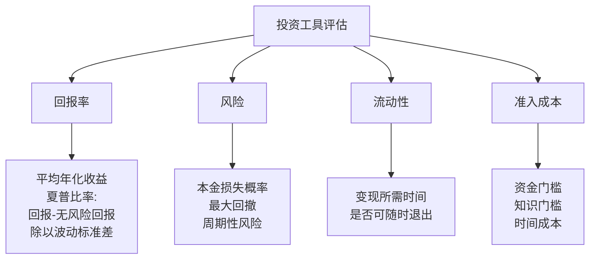
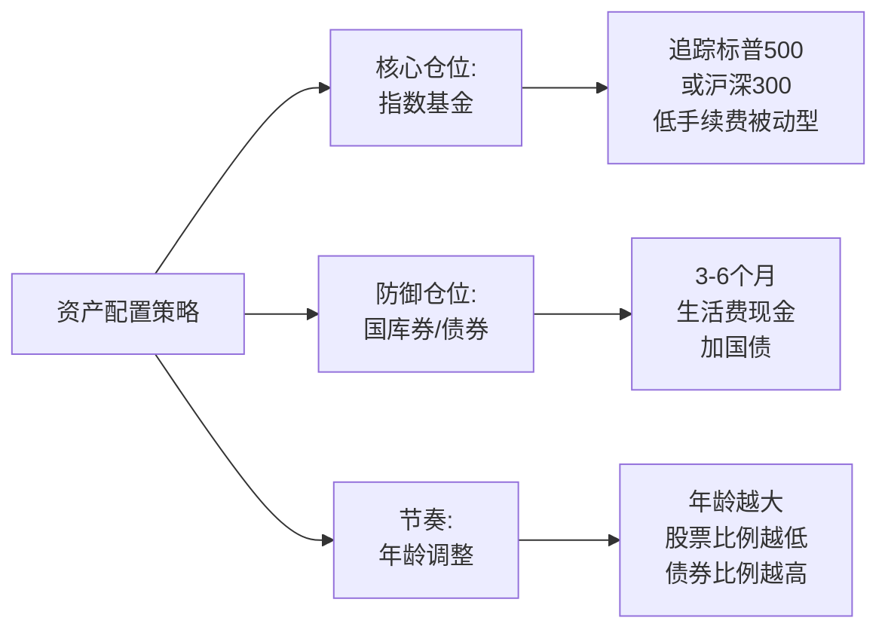

# 吴军投资观

[[见识]]第六章是吴军系统阐述个人理财与投资理念的核心章节。区别于大多数投资建议，吴军的出发点不是"如何赚更多钱"，而是"如何不被金钱困住生活"。

## 金钱观的五条原则

吴军的金钱观建立在一套清晰的前提上：

**钱是上帝存在你那里的** ：你得到的财富，是运气、能力、时代多种因素的叠加。没有人应当觉得"这笔钱完全是我自己挣的，所以我可以任意支配"，也没有人应当因为钱少就觉得自己低人一等。

**只有花出去的钱才是你的** ：账面上的财富不是真实财富。如果一个人存了一辈子的钱，最后躺在银行里也没花掉，那些钱对他的人生没有意义。钱是用来改善生活、实现目标的工具。

**钱是为了让生活更好，不是带来麻烦的** ：很多人的财富积累反而带来了焦虑、人际摩擦和价值观扭曲。如果钱没有让生活变得更好，说明金钱观出了问题。

**靠挣不靠省** ：穷人思维习惯于省钱，富人思维关注如何赚更多。省钱有上限，而赚钱没有上限。当然，这不是鼓励挥霍，而是说投资自己的能力、把时间花在提升上，比计较每一分支出更有价值。

**可以投光** ：如果一笔钱投出去能带来更好的回报（包括非金钱回报），就应该投出去，不必留着。过度留存现金是一种隐性损失。

## 风险意识：防御性驾驶模型

吴军用"防御性驾驶"比喻金融风险管理：

> 优秀的驾驶员不只关注自己怎么开车，还假设所有其他司机都可能违规——随时可能闯红灯、突然变道、急刹车。因此他永远保持足够的安全距离，永远准备好紧急制动。

中国短道速滑的案例印证了这一点：中国短道速滑队多次在奥运会上获得金牌，靠的不全是绝对速度，而是对对手失误的预判和应对能力。当其他选手摔倒时，他们能够及时规避并领先。

在投资中，风险意识意味着：

- **预设最坏情形** ：不只问"如果成功会怎样"，还要问"如果失败会怎样"，以及"我能不能承受这个失败"
- **不借钱炒股** ：杠杆在牛市放大收益，在熊市直接归零
- **预留流动性** ：任何时候都留有足够应对意外的现金储备

## 投资工具的选择框架

吴军将投资工具按四个维度评估：



**六类主要投资工具** ：股票、债券（含国库券）、不动产、风险投资、金融衍生品、高价值实物（艺术品、珠宝等）。

**夏普比率** （Sharpe Ratio）是评估投资组合性价比的核心指标：
```
夏普比率 = (投资回报率 - 无风险回报率) ÷ 波动性标准差
```
比率越高，说明单位风险对应的超额收益越高。诺贝尔经济学奖得主威廉·夏普在谷歌给工程师们上课时的核心结论：**解雇你的理财顾问，因为 65% 的专业基金长期跑不赢标普 500 指数**。

## 六大投资误区

**黄金不是好投资** ：黄金本身不产生现金流，长期实际回报率接近零，持有黄金更多是"避险心理"而非理性投资。

**专业理财顾问的局限** ：大多数主动管理型基金经理无法长期跑赢指数。他们收取高额管理费，但并不能保证超额收益。

**勤劳炒股不能致富** ：频繁交易产生大量手续费和税，同时需要投入大量时间和精力。普通人没有信息优势，频繁操作往往适得其反。

**追涨** ：在市场高点追入，是散户的典型错误。高点进入意味着下行风险大于上行空间。

**持亏不卖** ：很多人在股票亏损时选择"等回本"，但沉没成本不是继续持有的理由。如果一只股票不值得买，也不值得继续持有。

**便宜股陷阱** ：低价股不等于便宜，贵的股不等于高估。估值依赖的是市盈率、市净率等指标，而不是股价的绝对高低。

## 资产配置：最终建议



**指数基金优先** ：选择追踪宽基指数的被动型基金（如标普 500、沪深 300），手续费低，长期跑赢大多数主动管理型基金。

**股债比例按年龄调整** ：年轻时可以接受高风险，股票比例高；临近退休或有固定支出压力时，逐步增加债券比例，降低波动。每年微调一次，不需要频繁操作。

**巴菲特原则** ：别人贪婪时我恐惧，别人恐惧时我贪婪。市场下跌时是买入的机会，市场泡沫时是减仓的时机，而不是相反。

**投资的第一目标不是发财，是不亏损**。长期来看，不亏损加上市场平均回报，已经超越了大多数人的投资结果。
