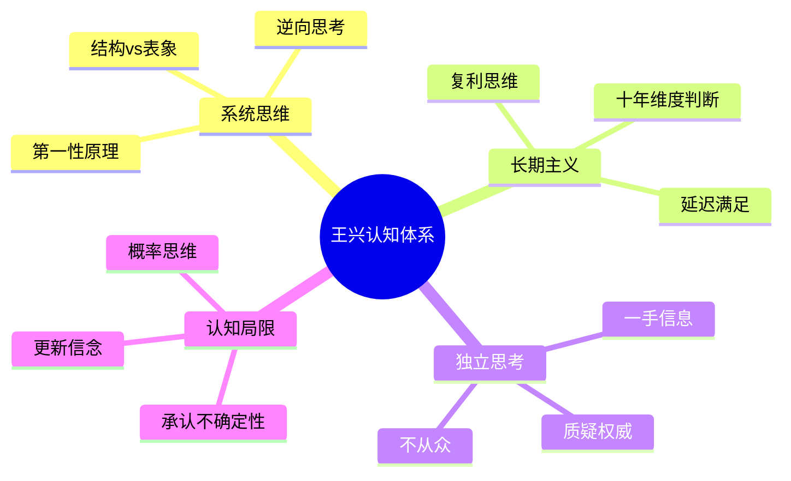

# 哲学与认知

[[王兴]]在饭否上留下的哲学性思考，涵盖系统思考、决策方法、认知偏误和长期主义等主题。这些思考并非系统论述，而是在日常阅读和交流中随机触发的碎片，但其中有若干反复出现的核心关切。

> **长期主义核心** ：大多数人高估一年能做的事，低估十年能做的事。王兴在多篇帖子中反复强调这一时间尺度的认知校准。

## 系统思考与整体视角

王兴对系统思考有持续的兴趣。他早年引用过一句话："诗人是最早的系统思考者，他们观察最复杂的环境，然后把复杂性消减到他们可以理解的程度。"（2007-08-05）这一对"复杂性化简"的向往，是他知识风格的底色。

他喜欢以历史和社会科学中的模式类比当下。他在读经济学时发现科斯理论可以解释IT行业变化，他在分析竞争时想到《孙子兵法》的"求之于势，不责于人"，与红杉资本的"Bet on the racetrack, not the jockey"相互印证。他认为，看问题时抓住规律比纠缠个案更有效，"如果不勤于思考，很容易把'同一套逻辑在不同条件下的呈现'误以为是'两套不同的逻辑'"（2016-09-15）。

他对INTP人格特质的自我认同也印证了这一点："我真是典型的INTP型，喜欢看全貌。所以，我基本每到一个城市都会去登高。"（2010-10-11）

## 长期主义

长期主义是贯穿王兴帖文的最稳定的价值判断。他在高中毕业纪念册中写下的话，在十几年后仍被他视为自己的信条："对未来越有信心，对现在越有耐心。"（2015-03-09）

他引用的那句被归于比尔·盖茨的话，"人们总是高估两年能发生的变化，总是低估五年能发生的变化"，在美团五周年时被他主动援引，是他在商业判断中保持耐心的重要依据。他对有些技术趋势被炒热又降温的现象保持冷静："有些事情不是不来，只是很慢"（2016-01-06）。

## 认知偏误与独立思考

王兴对人类思维的局限性有清醒的认识，尤其反感人云亦云的评论。他在AlphaGo击败李世石后不谈结果对AI的意义，而是感慨"很多人连基本的思考逻辑都不懂"（2016-03-09）。他引用过一句话："很多人认为他们在思考，其实他们只是重新排列了下自己的偏见。"（2015-07-16）

他对"为了逃避真正的思考，人们是不惜采取任何手段的"（约书亚·雷诺兹语）这句话特别推崇，多次转发。他认为，独立思考不只是意愿的问题，更是习惯的问题："有许多人的问题不是不独立思考，而是不思考。"（2016-08-18）

他也有对知识掌握程度的自我审视。他在意识到自己连"读书的一种境界"也是"从薄读到厚，再从厚读到薄"这样的分层结构后，自我评估"绝大多数都还在第一个阶段，包括正在学习商业逻辑的我"（2009-01-08）。

## 传统智慧的现代解读

王兴对中国传统哲学的兴趣不是复古式的，而是功能性的，他倾向于从传统格言中提炼出有现代适用性的管理或认知原则。

他认为"发上等愿，结中等缘，享下等福；择高处立，就平处坐，向宽处行"这二十四字"传统智慧内容真丰富"（2013-11-03）。他也从"任劳任怨"两词的并列中读出管理哲学，"关键依然是搞明白'有什么，要什么，舍什么'"（2014-12-12）。

他在2015年偶然发现一段关于领导力的英文引述，"原来是老子说的"，随手发帖表示惊讶，这个细节折射出他阅读时不设国界的习惯。

## 关于自由与责任

王兴在哲学上对"自由"有特定的界定。他在2014年引用萧伯纳的话："Liberty means responsibility. That is why most men dread it."（自由即责任，这就是大多数人畏惧自由的原因。）他对"不需要安全感就是自由"这句话也认为"充满了奇怪的魅力"（2015-11-14），但并未做简单的认同或否定。

他对《肖申克的救赎》的解读是："最可怕的隐喻是：我们所有人都在现实俗世这个大监狱里，但只有极少极少人在系统而坚持的挖逃出去的通道。"（2016-10-05）这句话映射出他对大多数人甘愿接受认知和行动局限的悲观观察，以及他对少数持续寻求突破者的敬意。

## 生物学与进化视角

王兴对进化生物学有持续的关注，这一兴趣可以追溯到2007年他引用《自私的基因》（The Selfish Gene）讨论人类本能时，他认为书中对"人的本能是生存和繁殖"的分析"还是蛮有道理的"（2007-07-22）。

2013年，他在读《The 10,000 Year Explosion》（科克伦与哈彭丁著）时，反思了人类文明史的野蛮本质，认为学校历史教育没有讲清楚"亡国灭种有多么常见"（2013-05-12）。同年，他提出了一个独特的人类起源视角：从进化史的角度看，"我们每个人都是loser的后代"，只有被逐出森林的猿人才不得不在草原上直立行走（2013-05-18）。这种将当代行为与进化压力相连接的思维方式构成了他理解人类本能的底层框架。

他对基因决定论保持一定距离，但承认在理解人类集体行为时，进化逻辑往往比道德评判更有解释力。

## 技术文明观与人工智能

王兴对技术革命有跨越多年的持续关注。2015年，他在高速公路上体验了沃尔沃的自动驾驶，并提出"到底是机器靠谱还是人靠谱"的问题（2015-03-26）。

2016年 AlphaGo 击败李世石后，他不关注结果本身，而是感慨"很多人连基本的思考逻辑都不懂"（2016-03-09），并援引威廉·吉布森的名言"The future is already here. It's just unevenly distributed"（2016-03-09）作为对 AI 进展意义的注脚。他还专门区分了"读过 AlphaGo 团队在《自然》上发表的论文的"和"没读过的"两类讨论者，指出讨论质量的高下来自信息掌握程度。

2017年，他注意到"随着人工智能的进展，人们开始讨论一个新概念：无用阶级"（2017-04-15），对此并未做简单乐观或悲观的表态。同年，一位从事 AI 研究的朋友告诉他"从深度学习的原理反过来可以解释人为什么必须做梦"（2017-08-16），他对这一跨学科联系表示着迷。AlphaGo Zero 发布后，他评价"相比之下，几千年来的人类围棋手们都太可怜了"（2017-10-19）。

2020年，他将互联网比作古登堡活字印刷，认为这是"IT方面最大的变革（比电报电话电视等更大）"，并将互联网时代与活字印刷之后欧洲发生的连锁反应相对照：宗教改革、大航海、科学革命、启蒙运动，由此判断互联网正在引发同等量级的文明变迁（2020-01-15）。

## 若干警句

王兴的哲学思考多以警句形式流传，以下几句在帖文中反复出现或被广泛引用：

- "时间是最坚挺的货币。"（2007-07-05）
- "Civilization is more than optimization."（2016-10-10）
- "战略上打持久战，战术上打歼灭战。"（2015-11-28）
- "只有浅薄的人才了解自己。"（王尔德，2016-08-29，转引）
- "互联网使买书变得容易了，但是它并不帮我们看书。"（2009-01-03）
