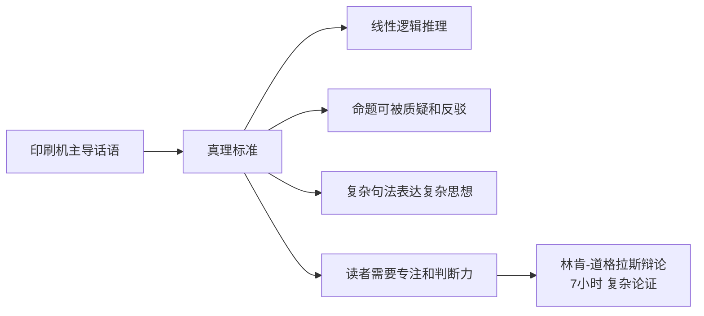
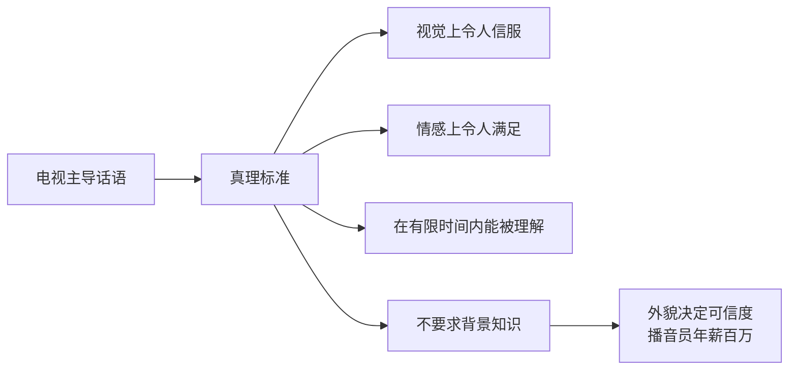

# 媒介即认识论

尼尔·波兹曼在《[[娱乐至死]]》（1985）中提出的核心哲学框架：**每种媒介都定义了不同的"真理"和"知识"标准**，因此改变主导媒介就等于改变一个文化对什么算作智慧、什么算作有价值的思想的理解。

---

## 核心命题

**媒介不是中立的信息传递管道；它是认识论的形塑力量。**

一个文化选择了什么媒介作为主导话语方式，就等于选择了对真理、知识和理性的特定定义——这种选择深入潜意识，通常不被当事人所意识。

---

## 从"媒介即信息"到"媒介即隐喻"

波兹曼承认继承了麦克卢汉的"媒介即信息"命题，但做出了关键修正：

**麦克卢汉（1964）**：媒介即信息——媒介本身的形式比它传递的内容更重要。

**波兹曼的修正**：用"**媒介即隐喻**"取代"媒介即信息"。原因：
- "信息"暗示媒介在"告诉我们关于世界的事情"
- "隐喻"更准确地描述了媒介的工作方式：**通过暗示而非明示**，帮我们对世界进行分类、排序、构建、放大和着色

媒介的独特危险在于：它指导我们看待和了解事物的方式，**但这种介入往往不为人所注意**。

---

## 三个历史案例

### 钟表：时间的认识论

刘易斯·芒福德的研究显示：钟表不只是测量时间的工具，而是重新定义了时间本身——将时间从人类活动中分离出来，使"分钟"和"秒"成为可独立存在的单位。

**认识论后果**：人类开始漠视日出日落和季节更替，因为在由分秒组成的世界里，自然的权威被机械替代了。**在钟表出现之前，"永恒"是有意义的时间概念；钟表的发明让永恒变得无法言说。**

### 字母/书面文字：逻辑的认识论

柏拉图认识到，将哲学诉诸书面文字不是终结，而是起点——书面文字使思想能够接受持续而严格的审查。

**认识论后果**：书面文字催生了语法家、逻辑家、修辞学家、历史学家和科学家——所有这些人都需要把语言放在眼前才能找出其错误。书面文字创造了一种崇尚逻辑命题和理性批评的文化气质。

### 印刷机：分析性理性的认识论

印刷文化在18-19世纪美国培育了波兹曼称为"阐释时代"的文化：

**完成标准**：能够有序地陈述、论证、反驳、做区分——这是印刷术定义的"智识能力"。

---

## 电视的认识论：娱乐性即真实性

电视定义了一套截然不同的认识论：

**关键推论**：当一个文化将电视设为主导话语媒介，"令人愉悦"就等同于"令人信服"，"有趣"就等同于"有价值"。这不是价值判断的堕落，而是认识论标准的替换——更难被察觉，也更难被抵抗。

---

## 两种认识论的核心差异

| 维度 | 印刷文化认识论 | 电视文化认识论 |
|------|-------------|-------------|
| 真理的形式 | 命题性陈述（可质疑） | 视觉呈现（"照片"不容置疑） |
| 时间结构 | 连续、线性、有前因后果 | 片段、瞬时、无语境 |
| 受众要求 | 需要背景知识和判断力 | 不需要任何背景，可即时消费 |
| 错误的可能 | 论证可以被反驳 | 形象无法被"反驳" |
| 信息与行动 | 信息指向行动 | 信息本身即目的（娱乐） |
| 注意力模式 | 专注、延伸、深入 | 跳跃、短暂、宽泛 |

---

## "伪语境"：无语境信息的安置方式

当信息大量生产而无法指导任何行动时，文化会发展出"伪语境"来安置这些信息：

- **纵横字谜**：为无用事实提供一个可以"使用"的场合
- **鸡尾酒会**：为片段知识提供炫耀的场合
- **问答游戏节目**（如《欢乐问答》）：将无用信息转化为娱乐商品
- **民意测验**：将公民的想法变成另一条新闻，而不是行动的基础

> 伪语境是丧失活力之后的文化的最后避难所。

---

## 认识论与民主的关系

波兹曼的政治论点：民主制度预设了公民能够进行理性判断。但如果主导媒介定义了"娱乐性即真实性"的认识论，公民的判断力基础就被侵蚀了——不是通过压制，而是通过替换。

**结构性悖论**：
- 言论自由的媒介（电视）可以比审查制度更有效地摧毁理性话语
- 因为前者不需要强迫，公民是自愿且快乐地接受娱乐化认识论的

---

## 批判性评估

**理论价值：**
- 将媒介批评从内容层面（"电视播了什么"）提升到认识论层面（"电视定义了什么叫做知识"），是真正的理论跃升
- 历史案例（钟表、字母、印刷机）的分析有说服力
- 对互联网和社交媒体时代同样具有解释力，甚至更为准确

**可质疑之处：**
- 印刷文化同样产生了煽情小报（19世纪便士报）和大量低质内容，波兹曼的历史叙述有美化之嫌
- 电视同样可以承载严肃内容——波兹曼用"严肃的电视是自相矛盾的说法"一笔带过，论证不够充分
- 认识论决定论：人是否只是媒介形式的产物？能动性在哪里？

---

## 与知识库的联系

- **[[娱乐至死]]** — 提出本框架的原著书评
- **[[信息联结论]]** — 赫拉利对媒介/信息本质的平行理解（信息=联结，非呈现真相）
- **[[信息网络政治学]]** — 信息架构如何定义民主与极权的本质差异
- **[[分析阅读方法]]** — 印刷文化培育的理性阅读能力，即波兹曼称颂的认识论产物
