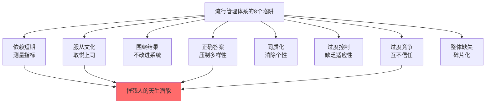

# 学习型组织

## 定义

学习型组织是一种能够持续学习、自我超越、适应环境变化的组织。其唯一可持续的竞争优势是**比对手更好、更快的学习能力**。

## 核心特征

### 1. 学习文化

- 错误被视为学习机会而非失败
- 鼓励实验与创新
- 重视反思与对话
- 支持个人与组织成长

### 2. 系统思考

- 员工能识别支配事件的模式
- 理解长期因果关系
- 发现杠杆点而非表面症状
- 看到个人行为与整体系统的联系

### 3. 内在动机

- 工作源于真实热望而非外部奖惩
- 个人愿景与组织目标对齐
- 保持创造性张力而非被迫执行

### 4. 集体智慧

- 团队能进行深度对话与讨论
- 化解分歧为创造力源泉
- 产生个人无法达成的协同

### 5. 领导力分布

- 不只依赖高管的决策
- 各层级都有影响力和主动性
- 推进变革的力量来自整个组织

## 五项修炼框架

### 系统思考（The Fifth Discipline）

见 [[系统思考]]

### 自我超越（Personal Mastery）

**定义**：个人持续扩展能力、提升精神境界的修炼。

**要素**：
- 明确个人真实愿景（非应该）
- 认清现实（客观诚实的评估）
- 保持创造性张力

**组织中的体现**：
- 鼓励员工追求真正关心的事
- 投资于人的发展
- 允许失败与学习
- 重视内在动机胜过外部激励

### 改善心智模式（Mental Models）

**定义**：觉察并改变深层思维假设。

**学习障碍的7种心智模式**：
1. "我就是我的职位"
2. "敌人在外部"
3. 掌控的幻觉
4. 执著于事件
5. "煮蛙寓言"（对渐进威胁的麻木）
6. 从经验中学习的错觉
7. 管理团队的神话

**修炼方法**：
- 反思性对话：暂停，问为什么
- 倾听与表达：真诚理解他人视角
- 集体觉察：在团队中识别假设

### 建立共同愿景（Shared Vision）

**定义**：在组织中激发并汇聚集体的真正渴望。

**与管理目标的区别**：

| 管理目标 | 共同愿景 |
|--------|--------|
| 自上而下 | 源于成员 |
| 应该 | 真心想要 |
| 合规 | 承诺 |
| 短期 | 长期 |
| 指令性 | 鼓舞性 |

**作用**：
- 激发集体热望
- 创造创造性张力
- 指引行动方向
- 超越短期利益

### 团队学习（Team Learning）

**定义**：团队通过对话共同思考，产生个人能力之和无法达成的创造力。

**两种关键对话形式**：

**深度汇谈（Dialogue）**
- 悬挂假设，开放探究
- 每个人贡献想法
- 寻求对真相的共同理解
- 目标：理解而非说服

**讨论（Discussion）**
- 交换不同观点与论证
- 达成最佳决策
- 利用多元视角
- 目标：得出结论

**修炼技能**：
- 学会暂停
- 认真倾听
- 在安全容器中暴露脆弱
- 识别防卫机制
- 演练新对话方式

## 流行管理体系的陷阱

学习型组织的建设需要克服现代组织中的根本性结构问题：

**根本问题**：这些做法摧残了人与生俱来的激情、内在动机、尊dignity、好奇心和学习的快乐。

## 领导力的新工作

在学习型组织中，领导力不再是权位，而是三种新工作：

### 设计师（Designer）

- **工作**：塑造愿景、价值观、目的
- **责任**：建立学习型基础设施
- **能力**：远见与系统设计思维

### 老师（Teacher）

- **工作**：帮助成员看清系统
- **责任**：发展反思与系统思维能力
- **能力**：倾听、提问、对话

### 受托人（Steward）

- **工作**：为更大目的服务
- **责任**：维护组织长期健康
- **能力**：谦逊、承诺、耐心

## 学习型社区的需要

从"学习型组织"到"学习型社区"是必然趋势：

**为什么需要**：
- 全球问题（气候、贫困、冲突）超出单个组织的范围
- 可持续发展需要跨界协作
- 孤立的组织创新难以产生系统影响

**特征**：
- 多种利益相关者参与
- 超越竞争的协作
- 共同学习与实验
- 面向集体利益

## 东西方融合

### 中国传统与学习型组织

**儒家传统的相关性**：
- "学而优则仕" — 强调修身后才能领导
- 终身修养 — 与持续学习的理想一致
- 个人修养与社会责任的统一

**修炼传统的演进**：
- 过去：个人修炼（瑜伽、禅修、儒学）
- 当今：集体修炼（团队学习、组织发展）
- 未来：系统修炼（面向全球可持续性）

### 融合的可能

- 古代修炼智慧 + 现代管理实践
- 内向精神修养 + 外向系统改造
- 个人成长 + 组织变革 + 社会进步

## 实践障碍

### 为什么难以实现

1. **思维惯性** — 等级制、竞争文化根深蒂固
2. **系统阻力** — 激励机制、流程、组织结构的相互强化
3. **时间压力** — 长期修炼与短期业绩的冲突
4. **领导力短缺** — 需要新型领导力仍未广泛存在
5. **测量困难** — 学习能力难以量化

### 突破策略

1. **从试点开始** — 小范围实验而非全面改造
2. **聚焦杠杆点** — 找到最小必要改变
3. **长期承诺** — 认识到修炼需要时间
4. **领导示范** — 高管亲身实践修炼
5. **建立社群** — 形成相互支持的网络

## 关键启示

1. **竞争优势的真正来源**不在产品、技术或资本，而在学习能力
2. **改变需要改变心智模式**，不只是流程或结构
3. **领导力是创造空间**让他人学习与成长，而非下达指令
4. **集体智慧超越个人英雄**
5. **长期可持续性需要**面向整体系统的思考

## 参考

- Peter M. Senge, *The Fifth Discipline*, 1990
- 彼得·圣吉，《第五项修炼》，2009年中文版
