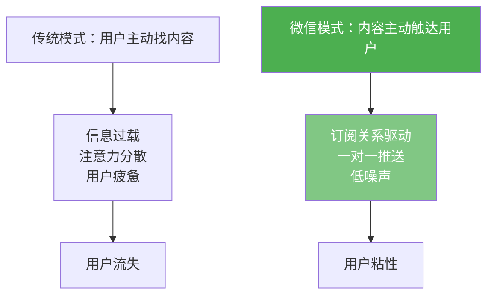
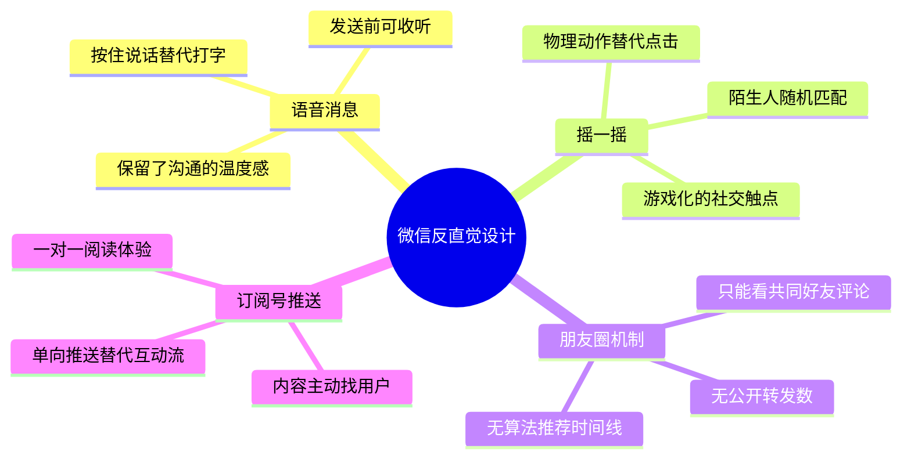
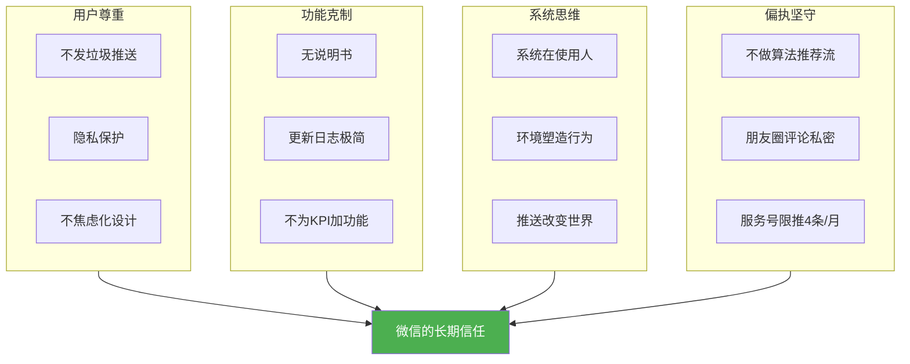

# 微信产品哲学

**微信产品哲学** ，是[[张小龙]]在创建和打磨微信（WeChat）过程中形成的一套设计价值观。它并非一份正式文档，而是在其饭否发言、内部演讲和产品行为中逐渐显现的系统性思想，核心可以归纳为：**尊重用户、克制功能、反直觉创新、系统即环境** 。

## 哲学根源：人是环境的反应器

微信产品哲学的第一原则，来自张小龙在饭否上发表的一段话：

> "人是环境的反应器。微博像是一个环境，但它不会主动刺激人，所以是个伪环境。到微博看东西是不人性的，哪有到环境里逛逛再决定做什么的，那不叫反应。而是当环境发生了点什么事情刺激到人了，人做出的行动才叫反应。所以，微博之后，将是推送。"

这一洞察成为微信"订阅号推送"模式的思想基础：**不是用户找内容，而是内容找用户** 。

## 七大核心哲学原则

### 1. 克制功能，反KPI驱动

> "每天都有很多产品发布或升级，介绍都是罗列功能指标。用户又不是按功能来付费的，你列那么多新功能去完成KPI没有问题，去糊弄用户就不对了。"

> "软件的'What's New'向导都是错的。不应该介绍功能，应该做成一个虚拟发布会。不应罗列功能，应告诉用户你给他们带来什么。带来的和功能是不同的。"

这两条原则，直接决定了微信历来的版本更新风格：**更新日志极短，功能增加极少，每次只做一两件真正有意义的改变** 。

### 2. 无需说明书

> "需要说明书的产品不是好产品。需要弹tip告知用户如何使用的功能不是好功能。"

这一原则在微信中体现为：核心功能（发消息、语音、朋友圈）都做到"零学习成本"，用户打开就会用，无需引导。

### 3. 系统即人，人即环境

> "是系统在使用人，而不是人在使用系统。"

> "人就是环境。人就像变色龙，进入到环境就会去适应，最终成为那个环境的一部分。"

这一哲学直接影响了微信对社交规范的设计：微信不设计转发数、点赞数的公开排行（防止焦虑性社交），朋友圈只能看共同好友评论（防止失控的公开场域），"已读"功能刻意不做（保护用户隐私与心理安全感）。

### 4. 反创新的创新

> "大部分的所谓创新，都是把问题搞复杂化而已。"

> "市场不会告诉Nokia说你们要做iPhone。"

张小龙相信，真正的创新是"做减法"和"逆常规"。微信的语音消息（按住说话）、摇一摇（LBS社交）、漂流瓶——这些功能无一是来自用研报告的，全是反常规的直觉设计。

### 5. 推送与懒惰是真理

> "推送改变世界。因为更懒。"

这句看似轻描淡写的饭否，实际上是微信公众号订阅逻辑的精华总结。张小龙深刻理解用户不愿主动操作的天性，将"减少用户操作成本"作为功能设计的第一优先级。

### 6. 偏执是一种能力

> "对于IT人来说，偏执来自于多年前Intel创始人写的书《唯有偏执狂才能生存》。偏执是种能力。"

> "偏执需要权力的辅佐才能进行到底。"

微信从诞生到现在，坚守的最大"偏执"是：**不在产品界面中做广告** （朋友圈广告严格限频）、**不做算法时间流推荐** （坚持按时间线显示）、**不推送垃圾消息** （服务号每月限4条推送）。这些"不做"的决定，才是微信最难得的产品理性。

### 7. 萌是生产力，情感是连接

> "萌是第一生产力。"

> "Line突然大火，可见萌很重要。"

张小龙观察到Line（韩国即时通讯）靠表情包爆火，早于大多数人意识到**情感符号在社交产品中的核心地位** 。微信表情（尤其是捂脸、发呆等原创表情）后来成为微信文化的重要组成部分。

## 微信设计哲学全景图

## 与算法推荐路径的根本分歧

| 维度 | 微信哲学（张小龙） | 算法推荐哲学（张一鸣）|
|------|-----------------|---------------------|
| 内容分发 | 社交关系链驱动 | 兴趣数据驱动 |
| 时间线 | 严格按时间排序 | 算法排序（权重优先）|
| 用户隐私 | 高度保护，不挖掘行为 | 深度挖掘行为数据 |
| 功能态度 | 克制，宁可不做 | 快速迭代，数据说话 |
| 广告形式 | 极少量、高质量 | 原生推荐广告（Feed流）|
| 核心驱动 | 用户信任 | 用户时长 |

这两种哲学代表了中国互联网产品设计的两极，而两者都取得了巨大成功，说明**不存在唯一正确的产品哲学，只有与自身定位匹配的设计一致性** 。

## 饭否中的微信设计预演

值得注意的是，张小龙在饭否上发布的多条帖子，事后都被证明是微信功能的"预演"：

> "这是一个声色世界。饭否需要更多图片。"
→ 对应微信的朋友圈图片动态功能

> "释放每个人心中被压制的摄影狂荷尔蒙"
→ 对应微信的随手拍分享文化

> "微博之后，将是推送"
→ 对应微信公众号的订阅推送模式

> "萌是第一生产力"
→ 对应微信丰富的情感化表情体系

这些碎片化的直觉，在微信中被系统化地实现了。

## 成功的本质：连接而非功能

张小龙最深层的产品哲学，或许在这两句话中：

> "距离就是，你发一条微博，这条微博要途经北上广，进出九九八十一台路由器，中间还要被拆包解包合并包，被两百个CPU进行过处理，再显示在我的电脑上。而你明明坐在离我几米的地方。——这条饭当年给我很深的印象，再次看到的时候才知道这是张小龙发的。"（饭否用户@能鞥 转发）

微信的成功，不是因为功能最多，而是因为它最接近了人与人之间连接的本质。

---

**相关文章** : [[张小龙]] · [[产品与算法思维]] · [[饭否文化与社区]] · [[王兴]]
