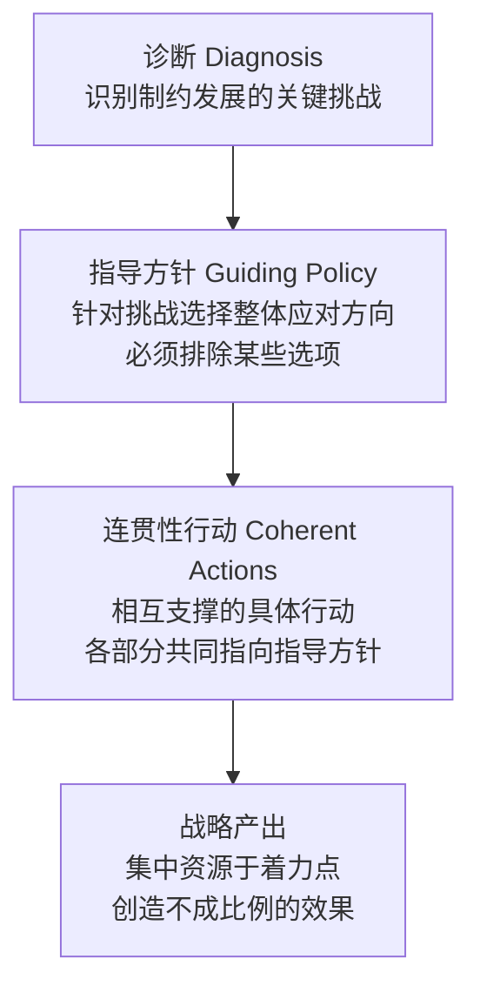
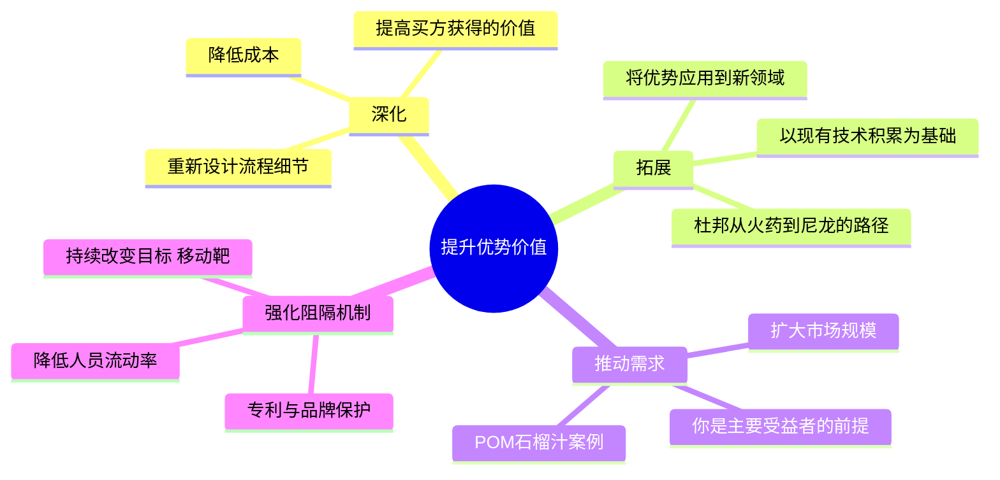

# 战略思维

战略思维是指能够在复杂局面中识别真正的挑战、选择应对方向并设计协调一致的行动方案的能力。这种能力不同于战术执行，也不同于愿景规划，处于两者之间，要求在约束条件下做出真正的取舍。

主要来源：理查德·鲁梅尔特《[[好战略坏战略]]》、安迪·格鲁夫《[[格鲁夫给经理人的第一课]]》、杰克·韦尔奇《[[赢]]》。

---

## 战略的基本结构：战略核

鲁梅尔特将好战略的内部结构称为"战略核"（the Kernel），由三个要素构成：

**诊断**不是描述现状，而是找出"这里真正的问题是什么"。好的诊断将复杂局面简化为一个核心约束。

**指导方针**必须排除某些路径。如果所有方向都被保留，那就没有方向。

**连贯性行动**要求各部分相互支撑。单独看每个行动可能平淡无奇，但组合在一起形成的整体才是竞争优势的来源。

### 特拉法尔加案例

纳尔逊1805年以33艘对阵40艘法西联合舰队：  
诊断 → 正面对阵必败，敌方数量优势显著  
方针 → 集中力量于着力点，以局部优势弥补整体劣势  
行动 → 两列纵队垂直切入敌阵腰部，切断前后段联系，逐段歼灭  
结果 → 英方零损失，俘获敌舰22艘

---

## 识别坏战略：四个症状

| 症状 | 表现 | 典型案例 |
|------|------|---------|
| 空话 | 用浮夸语言包装显而易见的内容 | "致力于成为以客户为中心的领导者" |
| 回避挑战 | 目标模糊到无法被否定 | DEC公司研讨会产出"致力于提供高质量产品" |
| 愿景模板 | 愿景+使命+价值观替代战略工作 | 安然公司愿景"成为世界主流能源公司" |
| 魅力替代战略 | 以感召力和激情代替对障碍的分析 | 1212年儿童十字军 |

**关键判断标准**：如果所有人都认可这个"战略"，那它大概什么都没说。真正有价值的战略会排除某些选项，因而会让某些利益相关方不满意。

---

## 竞争优势的四种增长方式

拥有竞争优势不等于创造财务回报（造银机器思想实验：零成本产银的机器，因为购买成本已将优势价值定价殆尽）。优势只有在**增长**时才转化为回报：

**有趣的优势**：你有具体方法主动提高其价值的优势。  
**无趣的优势**：价值固定，无法通过行动增长（如国库券）。eBay七年市值停滞，即便垄断了个人拍卖市场，也是无趣优势的案例。

---

## 焦点战略的真正逻辑

"焦点"不是缩小服务范围，而是找到内部协调的竞争方式。

皇冠瓶盖公司的官方战略是"专注气雾剂和软饮料容器"，这是表象。真正的战略逻辑是**专注短周期生产**：小客户、紧急订单、季节性产品、小批量高溢价。

这带来两个结果：
1. 定价高于行业平均40-50%（因为价值高）
2. 完全规避被大客户绑定压价的风险

继任者埃弗里将"焦点"误解为"限制产品种类"，大规模并购扩张后，成为世界最大容器制造商，但股东年收益率从康奈利时代的18.5%跌至2.4%。

**焦点的双重含义**：
1. 各方针内部协调，产生叠加效应
2. 将这种合力应用于正确的目标市场

---

## 格鲁夫的战略视角：战略转折点

格鲁夫在《[[格鲁夫给经理人的第一课]]》中提出"战略转折点"（Strategic Inflection Point）：当某个外部变化足够大，导致原有战略逻辑失效时，组织必须彻底重新思考方向，而不是在原有轨道上优化。

英特尔退出DRAM业务就是识别并主动穿越战略转折点的案例。格鲁夫的判断工具：**"如果我们被迫出局，新来的CEO会怎么做？"** 通过引入外部视角，绕开内部的情感障碍和利益纠缠，直接看清战略真相。

---

## 韦尔奇的战略简化原则

韦尔奇在《[[赢]]》中将战略去神秘化，归结为三个问题：

1. **竞争态势**：你的赛场现在是什么样的？（详细描述5年内会影响竞争的趋势）
2. **竞争对手的应对**：如果他们也做了这些，你还能做什么？
3. **你的制胜一击**：什么行动可以让你在这场竞争中获得可持续的优势？

"战略不需要复杂的文件。一张便利贴就够了——如果你真的想清楚了的话。"

---

## 战略思维的认知陷阱

**第一直觉定势**：复杂局面下，人倾向于采纳第一个出现的方案，因为它给人方向感。质疑第一直觉需要放弃这种安慰感，重新进入混沌。

**封闭循环**：当分析体系将股价或市场热度作为战略正确性的证明时，系统变成自我强化的循环，真正的风险判断在系统内部变得不可判定（哥德尔意义上）。1999年光纤泡沫、2008年金融危机均有此机制。

**内在视角**：相信"我们的情况是特殊的"，忽视历史先例和其他市场的教训。伯南克2004年庆祝"大稳健"，正是内在视角的典型表现。

**从众心理**：当其他人的行为成为自己判断的主要依据，而其他人又在做同样的事，信息循环断裂，所有人共同走向悬崖。

**对抗方法**：记录每次判断、对照事后结果；主动寻找与主流观点相悖的数据；引用其他时代和地区的先例。
