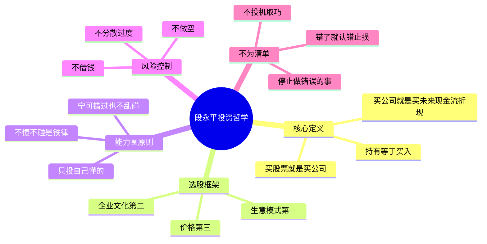
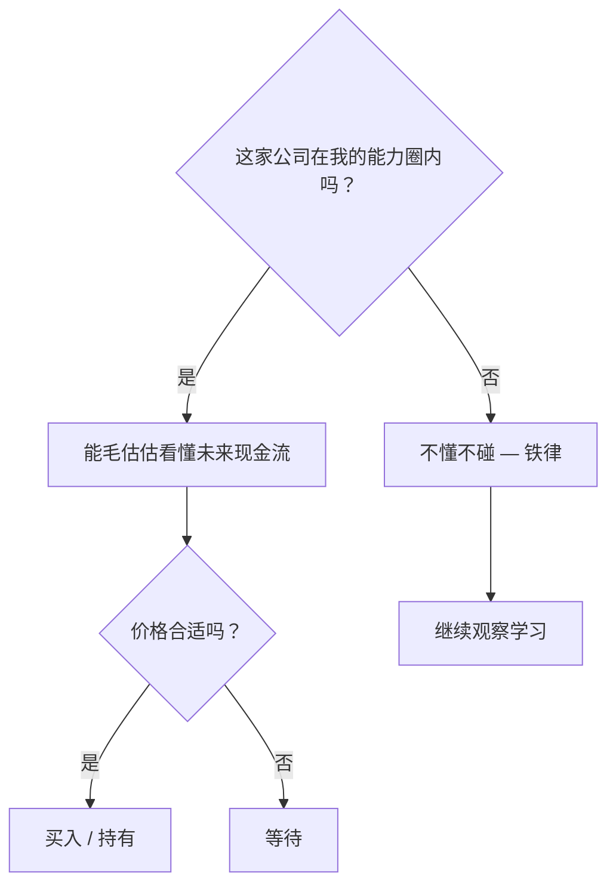
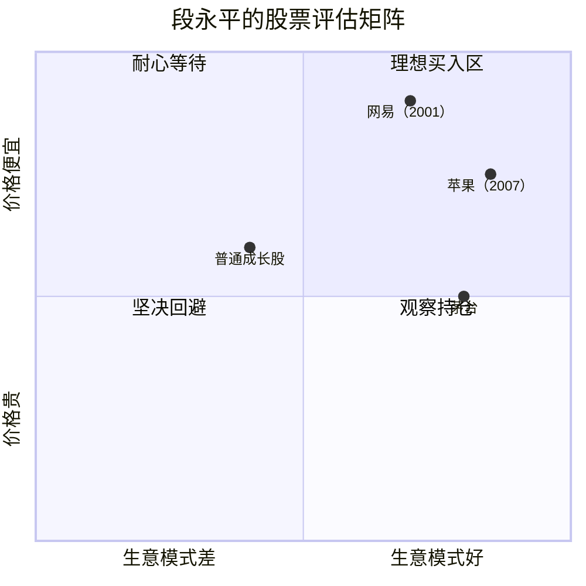
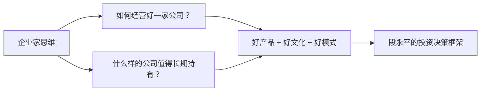

# 段永平投资哲学

> "投资就是买未来现金流。所谓能看懂公司，就是能看懂其未来现金流。"
> ——段永平，2012年

段永平的投资哲学建立在巴菲特/芒格价值投资体系之上，经过20余年企业经营与投资实践的淬炼，形成了独具特色的中国式价值投资范式。其核心是：**做对的事情（战略选择），把事情做对（执行落地）**。

---

## 投资哲学全景

---

## 一、投资的本质定义

段永平对"投资是什么"有三个层次的阐释：

### 基本版
> 投资就是买未来现金流。

### 说明版
> 买股票就是买公司，买公司就是买其未来现金流折现。现金流指的是净现金流，未来指的是公司的**整个生命周期**，不是3年，也不是5年。

### 深层含义
折现率实际上是相对于投资人的**机会成本**而言的。最低的机会成本就是无风险回报率（如美国国债利率）。所谓"能看懂公司"，就是能毛估估地看懂其未来净现金流折现值。

**重要澄清：** 未来现金流折现"只是一种思维方式，不是要套公式"。段永平强调没人真用公式，至少胜者都不用公式——因为公式中的变量无人能精确确定。

---

## 二、选股三要素体系

段永平将选股要素排列为明确的优先级：

| 优先级 | 要素 | 核心问题 |
|--------|------|---------|
| **第一** | 商业模式 | 这家公司的生意好不好做？护城河宽不宽？ |
| **第二** | 企业文化 | 管理层是否诚信？是否有"本分"的价值观？ |
| **第三** | 价格 | 现在的价格合适吗？ |

> "商业模式越好，确定性越高。再好的车手也难开好一辆烂车。"

### 好商业模式的特征
- 长期可持续的竞争优势（护城河）
- 无需持续大量资本投入就能产生现金流
- 差异化产品，用户具有强黏性
- 品牌价值积累，而非靠营销烧钱维持

### 企业文化的核心
段永平认为文化好坏直接决定企业寿命：

> "好的企业文化就是做对的事情。最重要的是知道什么不可以做。文化好的企业活得长些。"

他特别指出：**狼性文化最终会输给人性文化**。赚本分钱，才能睡得好。

---

## 三、能力圈原则

段永平在10年投资生涯中，真正"看懂"的企业不足10家，重仓的只有5家——"差不多两年一家"。他认为这是正确节奏：

> "超出一定量以后，投的企业越多赚得越少。"

**能力圈警示：**
- 不要"扩大"自己的能力圈——搞懂一个生意往往需要很多年
- 看到一两个概念就轻易跳入不熟悉的领域，早晚会栽

---

## 四、"不为清单"——最重要的投资纪律

段永平最独特的贡献之一是提出并践行"不为清单"（Stop Doing List）。这个概念同时适用于企业经营和个人投资。

> "不为清单"比"To-do List"更重要。很多时候，停止做错误的事，比开始做正确的事更关键。

### 投资中的"不为清单"

| 绝对不做 | 原因 |
|---------|------|
| 不做空 | "做空是愚蠢的" |
| 不借钱（不用margin） | "不用margin是投资的基本要求" |
| 不碰看不懂的公司 | "不懂不碰是铁律" |
| 不追热点/概念股 | 与未来现金流无关 |
| 不频繁交易 | "持有=买入" |
| 不关注短期价格波动 | "波动是朋友" |

> "用我这个办法投资，一生可能会失去无数机会，但犯大错的机会也很少（但依然没办法避免犯错）。"

---

## 五、关于价格与估值

段永平对估值有独到的"定性优先"思想：

- **定性比定量分析更重要** ——先判断生意好不好，再谈价格
- **看财报主要用于排除公司** ——看到不好的财报就排除，而非精算估值
- **不产生现金流的净资产没有价值** ——资产本身不重要，产生现金流的能力才重要
- **合适价钱就好** ——不需要等到"最低价"

> "对于大多数不太了解生意的人而言，千万不要以为股市是个可以赚快钱的地方。"

---

## 六、市场观与心态

段永平对市场先生（Market）的态度：

> "我总是假设市场绝大多数情况下是非常聪明的，除非我发现市场确实错了。"

他对波动的态度：
> "波动是朋友。"（好公司股价下跌是买入机会）

他的仓位管理原则：
> "越是懂投资，越应该集中。"（集中持仓，而非过度分散）

他对宏观的态度：
> "根基不变，没必要太关注宏观。"

---

## 七、投资与经营的统一

段永平有一个深刻洞见：**经营企业和投资没有本质区别**。

他从企业家视角看投资：
- 买股票 = 买生意的一部分
- 持有股票 = 每天在问"如果我今天才知道这家公司，我还会买吗？"
- **"持有=买入"**——如果你不愿意今天以现价买入，那就应该卖出

---

## 八、核心投资案例解析

### 网易（2001年）
> "就像自己经营的公司。好的游戏绝对是好生意。以铜价买金子不需要勇气。"

- 当时市场不看好，认为游戏市场有限
- 段永平凭借在消费电子行业多年经验，判断游戏市场潜力巨大
- 约1美元/股买入，后股价涨约160倍

### 苹果（2007年前后）
> "苹果最厉害的是生态系统。iPhone很可能是最便宜的手机（考虑到使用寿命和体验）。"

- 早于大多数机构投资者发现苹果生态护城河的价值
- 长期持有，是其重要财富来源之一

### 茅台
> "茅台生意模式强大。做好酒的文化。便宜或贵取决于对10年后状况的认识。"

---

## 总结：段永平投资哲学的精髓

> "至少85%的人不适合投资。"

段永平的投资哲学本质上是**企业家视角的价值投资**，核心是：

1. **搞懂生意模式**，而非预测股价
2. **待在能力圈内**，宁可错过也不乱碰  
3. **用"不为清单"**管理风险，比追求机会更重要
4. **长期持有**好公司，让时间成为朋友
5. **平常心**——赚本分钱，不赚投机钱

这与[[金字塔原理]]所强调的"结构化思维"异曲同工：先确定核心原则，再做一切衍生判断。

更多人物背景详见 → [[段永平]]
