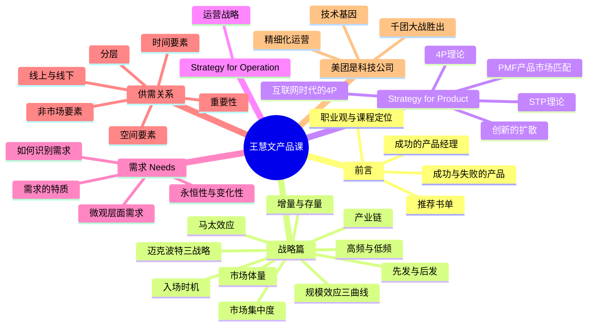
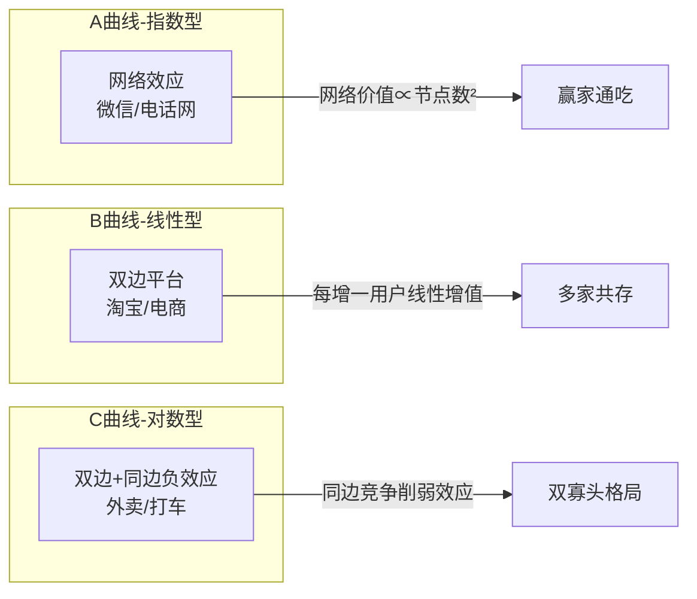
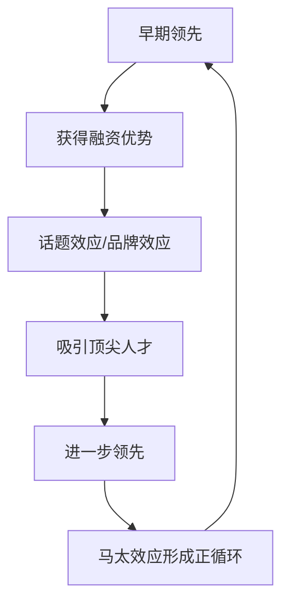
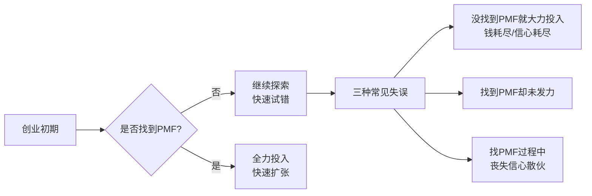
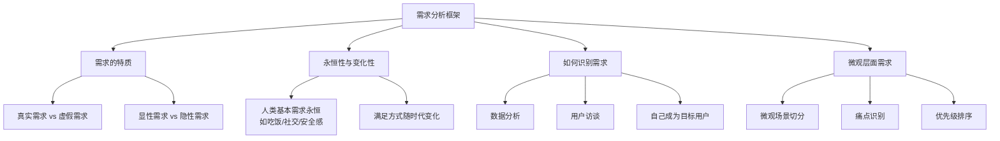
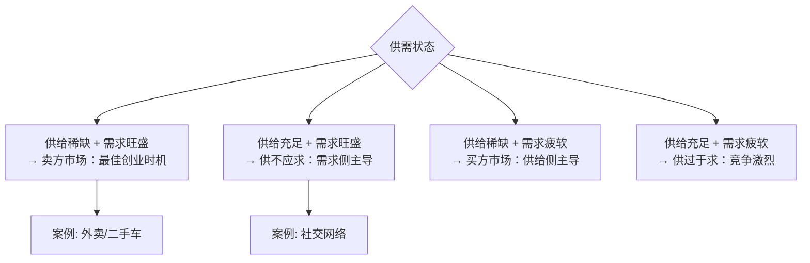
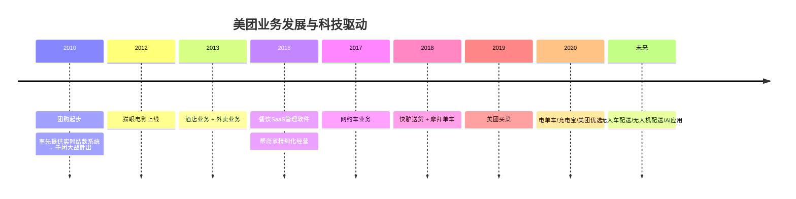

# 王慧文产品课

《王慧文清华产品课》是[[王慧文]]（美团联合创始人）在清华大学开设的产品管理课程讲义。课程由Allen整理，于2021年元旦完稿，被广泛传阅，被视为中国互联网产品方法论的重要文献。

> "这门课主要讲通用性的东西，尽量屏蔽掉特定领域专业知识的壁垒。产品经理的核心能力是关于方法论的。"——王慧文

---

## 课程结构总览

---

## 第一章：前言——成功与失败的产品

### 经典案例对比

王慧文用五组产品对比，揭示了"**成功的产品通常不是行业首创** "这一规律：

| 成功产品 | 失败/被颠覆产品 | 核心洞察 |
|---------|---------------|----------|
| iPhone | 诺基亚 | 体验革命重于技术领先 |
| iPod | MPMan（第一款MP3） | 产品设计和生态系统决定胜负 |
| 微信 | Kik、米聊、TalkBox | 后发者可以通过执行力超越先发者 |
| 搜狗输入法 | 智能ABC | 产品体验差距导致用户迁移 |
| Chrome | IE（系统自带） | 即使在劣势下也能通过产品力胜出 |

> "几乎在每一个大行业里，最终取得成功的通常都不是第一家。不是第一个，这说明技术可能已经不是瓶颈了，而真正关键的原因是产品经理。"

---

## 第二章：战略框架

### 规模效应——三条曲线

这是整个课程最核心的战略工具之一，王慧文将规模效应分为三种形态：

**规模效应的 Scope（作用范围）** ：

| 类型 | 代表业务 | 特征 |
|------|---------|------|
| 全球型 | WhatsApp、Facebook | 跨国界产生价值 |
| 全国型 | 淘宝 | 无法龟缩地域防守 |
| 城市型 | 打车、团购 | 一城内网络效应成立 |
| 蜂窝型 | 外卖 | 每个配送圈独立竞争 |

> "外卖这个业务，你在清华的占有率能达到90%和北大没啥关系，这就是外卖的难处，你在一个地方做成了，在下一个地方依旧要打巷战。"

---

### 马太效应与先发优势

马太效应的关键：
- 在行业早期，公司间差距可能只有**几周的时间**
- 率先获得头部投资（如红杉投雅虎）会产生话题效应
- 马太效应一旦形成，后发者追赶代价极高

王慧文核心建议：**尽可能抓住有规模效应的要素，尽可能减少反规模效应，尽快形成马太效应。**

---

### 增量市场 vs 存量市场

> "一旦一个市场进入存量市场，那么行业格局变化的可能性就降低太多了。"

- **增量市场**：渗透率低，获客成本低，格局未定，机会窗口大
- **存量市场**：渗透率超过50%后格局趋稳，获客成本是增量市场的**10倍以上**

---

### 高频 vs 低频

高频业务有天然优势，可以：
1. 培养用户使用习惯
2. 通过高频入口带动低频业务
3. 获得更多用户行为数据，优化产品

美团策略：用外卖（高频）带动酒店（低频）、旅游等业务。

---

### 迈克波特三战略

| 战略 | 适用场景 | 风险 |
|------|---------|------|
| 成本领先 | 规模效应强的市场 | 技术变革可能颠覆成本结构 |
| 差异化 | 竞争激烈、同质化市场 | 差异化可能被模仿 |
| 专一化/聚焦 | 细分市场切入 | 市场天花板较低 |

---

## 第三章：Strategy for Product

### PMF——产品市场匹配

> "很多早期公司成败的点就在于是否找到了PMF，不少创业团队没找到PMF却在发力，早早把钱花光了或把信心耗光了。"

---

### 创新的扩散——五类用户群体

| 用户类型 | 比例 | 特征 | 产品策略 |
|---------|------|------|---------|
| 创新者（Innovators） | ~2.5% | 技术爱好者，愿意冒险 | 种子用户 |
| 早期采用者（Early Adopters） | ~13.5% | 意见领袖，有影响力 | 口碑传播 |
| 早期大众（Early Majority） | ~34% | 实用主义者，需要案例 | 跨越鸿沟关键 |
| 晚期大众（Late Majority） | ~34% | 保守，需要确定性 | 规模化增长 |
| 落后者（Laggards） | ~16% | 极度保守，最后采用 | 长尾用户 |

**关键概念：跨越鸿沟**——早期采用者与早期大众之间存在巨大鸿沟，是产品能否规模化的关键关卡。

---

### STP 理论

- **S（Segmentation）细分**：按人口、地理、心理、行为细分市场
- **T（Targeting）定位目标**：选择最适合的细分市场作为切入点
- **P（Positioning）定位**：在目标用户心智中建立独特位置

王慧文强调：STP在这里的用途是**寻找切入点、找到PMF**，而非传统营销教材中用于设计最终目标市场。

---

### 互联网时代的4P

| 传统4P | 互联网演变 |
|--------|-----------|
| Product（产品） | 可以快速迭代，MVP验证 |
| Price（价格） | 补贴战、动态定价、免费+付费 |
| Place（渠道） | 线上渠道，App Store，私域流量 |
| Promotion（推广） | 病毒传播，KOL，内容营销 |

---

## 第四章：需求（Needs）分析

### 需求的永恒性与变化性

王慧文的核心洞见：**人类的基本需求是永恒的，但满足需求的方式和工具在不断变化**。

例如：
- 吃饭的需求永恒 → 从路边摊到外卖App，满足方式迭代
- 社交需求永恒 → 从线下聚会到微信，工具迭代
- 安全感永恒 → 从人身安全到信息安全，边界扩展

---

## 第五章：供需关系——核心方法论

供需关系是王慧文整个思想体系的**第一性原理**，详见 [[供需关系与产品设计]]。

核心判断框架：

---

## 第六章：美团是科技公司

王慧文对美团发展史的总结，揭示技术在看似"生活服务"业务中的核心地位：

> "所有公司如果想在长期有竞争力，不管表象是什么，内核都必须是科技公司。"

**技术的三重价值**：
1. **提升运营精细度**：从"店级经营"到"单品级经营（SKU级）"
2. **打击灰产黑产**：大数据识别异常行为，防范刷单补贴欺诈
3. **驱动新业态**：无人机配送、AI客服、智能推荐

---

## 课程核心金句

> "产品经理是CEO的学前班。"

> "管理是反规模效应的。千万不要以为多搞几个人就更强了，只要能把事干了，人越少越好。"

> "不管是供过于求还是供不应求，团队常常有很大动力搞反供需方向，因为做难的那一方让人难受，所以大家会逃避。"

> "找PMF是很难的，更多的团队是在找PMF的过程中丧失信心散掉了。"

> "创新的机会在时间上是不连续的，不是说你今天想做一个创新，恰好这个业务现在就有创新的机会。"

---

## 推荐参考资料

| 资料 | 类型 | 推荐程度 |
|------|------|---------|
| 《支付战争》(The PayPal Wars) | 公司传记 | ⭐⭐⭐⭐⭐ |
| 《精益创业》 | 方法论 | ⭐⭐⭐⭐⭐ |
| 《创新者的窘境》 | 战略理论 | ⭐⭐⭐⭐⭐ |
| 《定位》 | 营销理论 | ⭐⭐⭐⭐ |
| 《引爆流行》 | 产品传播 | ⭐⭐⭐⭐ |
| 《零售的哲学》（铃木敏文） | 零售实战 | ⭐⭐⭐⭐ |

---

## 相关条目

- [[王慧文]] — 课程主讲人，美团联合创始人
- [[供需关系与产品设计]] — 课程核心理论的深度解析
- [[王兴]] — 美团创始人，王慧文的创业伙伴
- [[俞军]] — 另一位顶级产品经理，俞军产品方法论的创立者
- [[金字塔原理]] — 产品经理结构化表达的基础工具
- [[推荐系统概论]] — 美团算法推荐的技术背景
