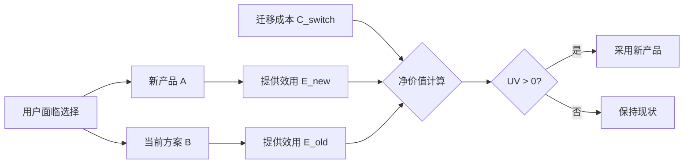
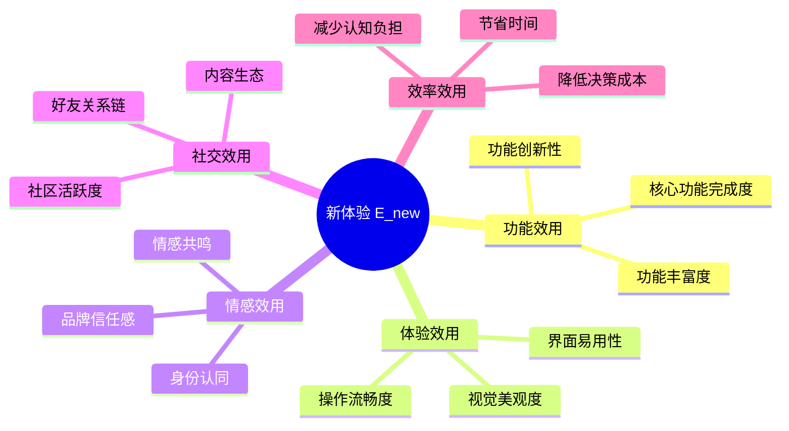
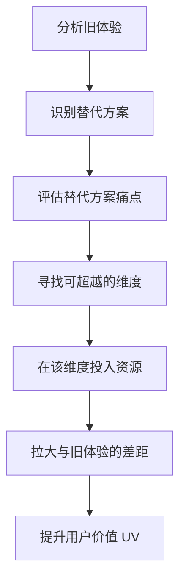
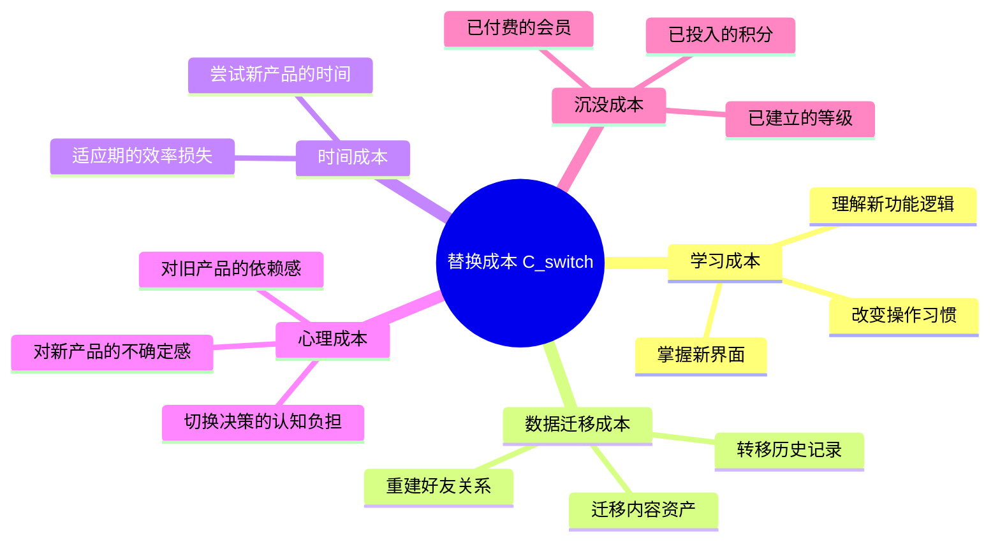
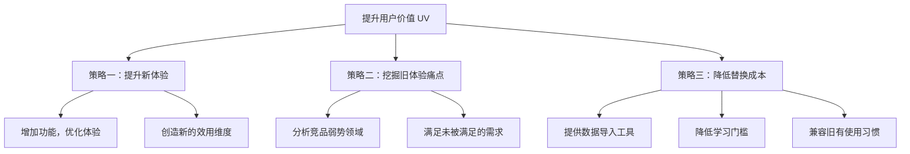
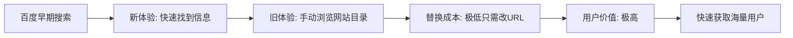
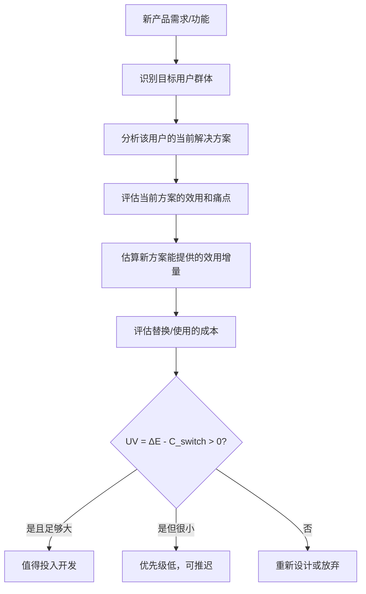

# 用户价值模型

> "用户价值＝新体验－旧体验－替换成本"
> ——俞军，在加入滴滴的第一次分享会上

用户价值模型是[[俞军]]将多年产品实践提炼为一个可操作公式的核心成果。这个公式看似简单，却蕴含着对用户决策心理、市场竞争结构和产品策略的深刻理解。

## 公式的完整形式

```
用户价值 = 新体验 - 旧体验 - 替换成本
```

更完整的表达可以写作：

```
UV = E(new) - E(old) - C(switch)
```

其中：
- $UV$（User Value）：用户采用新产品的净价值
- $E_{new}$（New Experience）：新产品提供的效用总量
- $E_{old}$（Old Experience）：用户当前方案的效用总量
- $C_{switch}$（Switching Cost）：从旧方案迁移到新方案的成本

**当 $UV > 0$ 时，用户有动力采用新产品；当 $UV \leq 0$ 时，用户倾向于保持现状。**

## 为什么这个公式是"相对的"

这是这个公式最重要的洞见：用户不是在真空中评估产品价值，而是永远在**比较**。



这意味着：
- 一个产品"好不好"，不取决于其绝对质量，而取决于它比替代方案好多少
- 替代方案的质量越高，新产品需要超越的门槛越高
- 即使新产品更好，如果替换成本太高，用户也不会迁移

## 新体验（E_new）：效用分解

新产品能提供的体验，可以从多个维度分解：



### 效用的边际递减

俞军引入了经济学中的**边际效用递减规律**：随着产品功能的不断增加，每新增一个功能带来的效用增量会逐渐减小。

| 投入阶段 | 效用增量 | 产品策略 |
|---------|---------|---------|
| 核心功能建设期 | 高 | 快速迭代，抢占用户心智 |
| 功能完善期 | 中 | 优化体验，提升留存 |
| 功能饱和期 | 低 | 探索新方向，避免过度设计 |

## 旧体验（E_old）：竞品与替代方案分析

"旧体验"不只是竞争对手的产品，还包括**所有替代方案**：

| 替代方案类型 | 举例 | 分析要点 |
|------------|------|---------|
| 直接竞品 | 微信 vs. 钉钉 | 功能对比，用户重叠度 |
| 间接竞品 | 打车 vs. 地铁 | 使用场景的重叠 |
| 线下替代 | 外卖 vs. 自己做饭 | 时间成本，便利性 |
| 无解决方案 | 新需求，用户原本凑合 | 从0到1的价值创造 |

关键洞见：**降低竞争对手的体验，等效于提升自己的相对价值**。这解释了为什么某些产品会打"差异化"战略，在对手弱势领域发力。



## 替换成本（C_switch）：迁移摩擦分解

替换成本是用户从旧方案迁移到新方案所需付出的代价：

### 替换成本的类型



### 高替换成本的产品护城河

替换成本是产品的天然护城河。当用户的替换成本很高时，即使竞品提供了更好的体验，用户也可能选择留在旧产品：

```
竞品需要超越的门槛 = E(old) + C(switch)
```

这解释了：
- 微信的用户粘性（社交关系链的替换成本极高）
- 企业级SaaS产品的锁定效应（数据迁移成本高）
- 游戏的付费留存（沉没成本高）

## 三种提升用户价值的策略



### 策略举例

**策略一：提升新体验**
- 微信红包：在转账场景增加了娱乐效用
- 抖音推荐算法：极大提升了内容发现效率

**策略二：挖掘旧体验痛点**
- 滴滴打车：打车难（旧体验）vs. 随叫随到（新体验）
- 美团外卖：自己做饭（旧体验）vs. 外卖（新体验，节省时间）

**策略三：降低替换成本**
- 微博对QQ空间用户的迁移：简化注册流程
- 各大浏览器提供书签导入功能

## 公式的局限性与进化

俞军自己也承认这个公式的局限性，并在滴滴时期进行了升级：

### 公式的进化

| 版本 | 公式 | 适用场景 |
|------|------|---------|
| 1.0 | UV = 新体验 - 旧体验 - 替换成本 | 工具类/内容类产品 |
| 2.0 | 产品 = 约束条件下的效用组合 | 强调资源约束 |
| 3.0 | 交易模型（含供需、效用、边际、成本） | 双边市场/平台产品 |

### 局限性

1. **网络效应难以量化**：社交产品的价值很大程度上来自用户规模，公式无法直接描述
2. **时间维度缺失**：公式是静态的，无法反映长期用户价值的动态变化
3. **异质性问题**：不同用户对"体验"的权重不同，公式需要分人群细化
4. **情感价值低估**：品牌认同、情感依恋等难以用效用量化

## 在不同产品类型中的应用

### 工具类产品（如搜索引擎）



### 双边平台（如出行平台）

在滴滴这样的双边平台中，用户价值公式需要同时考虑**乘客侧**和**司机侧**：

| 侧面 | 新体验 | 旧体验 | 替换成本 |
|------|--------|--------|---------|
| 乘客 | 快速叫到车，价格透明 | 路边招手，价格不透明 | 极低（下载App） |
| 司机 | 稳定订单来源 | 依赖路面揽客 | 较低（注册认证） |

双边平台的挑战在于：两侧用户价值需要同步提升，否则网络效应无法建立。

## 实践应用：产品需求评估框架

基于用户价值模型，可以建立一个产品需求评估框架：



## 用户价值模型与商业价值的关系

用户价值不等于商业价值，但两者密切相关：

```
商业价值 = 用户价值 × 用户规模 × 变现效率
```

这意味着：
- 提高用户价值 → 获取更多用户 → 提升商业价值
- 当用户价值为负（剥削用户）→ 用户流失 → 商业价值崩溃
- 最可持续的商业模式：产品创造的用户价值远超货币化的部分

## 参见

- [[俞军产品方法论]] — 完整方法论体系
- [[俞军]] — 人物介绍
- [[产品思维]] — 更广泛的产品框架
- [[推荐系统概论]] — 用户价值在推荐系统中的应用
- [[金字塔原理]] — 系统化思维的另一个框架
