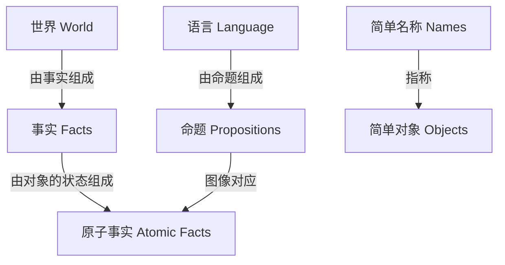
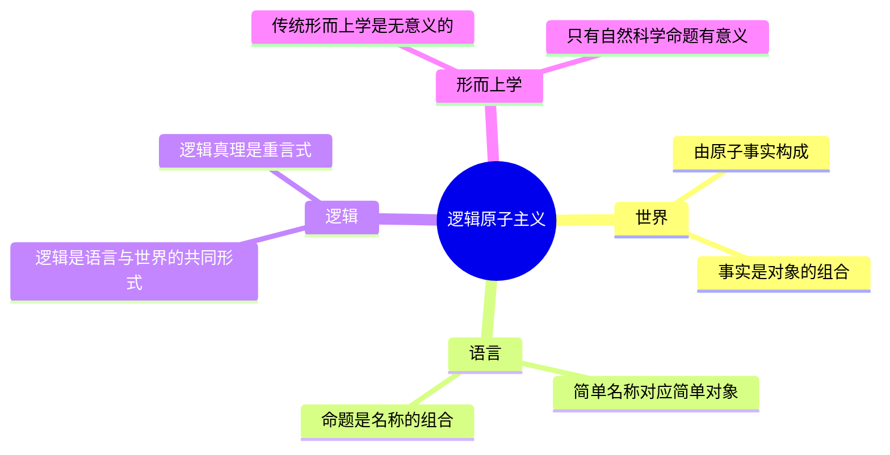
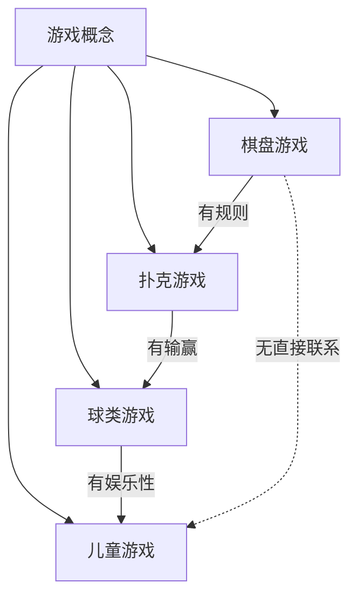
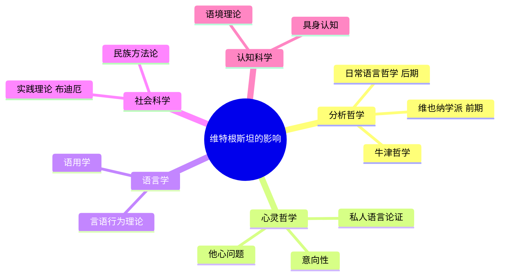

# 维特根斯坦哲学

> "凡可说的，都可以说清楚；凡不可言说的，必须对之保持沉默。"
> ——《逻辑哲学论》序言，维特根斯坦

维特根斯坦的哲学生涯呈现出一种罕见的彻底性：他不仅发展了20世纪最有影响力的两种哲学，而且第二种哲学是对第一种哲学的根本批判。前期的[[维特根斯坦]]相信语言与世界存在同构的逻辑图像关系；后期的维特根斯坦则认为这一观点本身就是一个"哲学病症"。

## 两期哲学的总体对比

```mermaid
graph LR
    subgraph 前期哲学 1921
        A1[《逻辑哲学论》] --> B1[图像论]
        B1 --> C1[语言描绘事实]
        C1 --> D1[不可说的必须沉默]
    end
    subgraph 后期哲学 1953
        A2[《哲学研究》] --> B2[语言游戏论]
        B2 --> C2[语言在使用中获得意义]
        C2 --> D2[哲学病症的治疗]
    end
    前期哲学 1921 -->|自我批判与超越| 后期哲学 1953
```

| 维度 | 前期《逻辑哲学论》 | 后期《哲学研究》 |
|------|-------------------|-----------------|
| 核心问题 | 语言的逻辑结构是什么？ | 语言实际上如何运作？ |
| 语言观 | 图像论：命题是事实的图像 | 语言游戏：使用即意义 |
| 意义理论 | 指称论：词语指称对象 | 使用论：意义在于使用 |
| 哲学任务 | 划定可说/不可说的界限 | 治疗哲学误解与混乱 |
| 文体风格 | 格言式命题，逻辑严密 | 对话式探究，开放流动 |
| 影响 | 维也纳学派，逻辑实证主义 | 日常语言哲学，心灵哲学 |

## 前期哲学：《逻辑哲学论》（1921）

### 图像论（Picture Theory of Language）

《逻辑哲学论》（英文：*Tractatus Logico-Philosophicus*）的核心是**语言图像论** ：命题（proposition）是事实（fact）的逻辑图像，就像一幅画描绘一个场景。



维特根斯坦认为：
- **世界** 由事实（而非事物）组成
- **命题**通过与事实共享的**逻辑形式** 来图像化事实
- 有意义的命题只能是**自然科学** 的命题
- 伦理学、美学、形而上学等问题无法被命题表达——它们是"不可说的"

### 可说与不可说

《逻辑哲学论》最著名的区分是**可说的**（sayable）与**不可说的** （unsayable）：

> "命题能够表达的，就是它所表达的；命题不能表达的，它也不能表达。"

可以用命题说清楚的：自然事实、逻辑关系
无法用命题说清楚的（只能"显示"）：逻辑形式本身、伦理价值、神秘之物、生命意义

最后一条命题（7号）："凡不可言说的，必须对之保持沉默。"（Whereof one cannot speak, thereof one must be silent.）

这一结论本身充满悖论：维特根斯坦承认，《逻辑哲学论》全书的命题从其自身标准来看都是"无意义的"——它们是帮助读者爬上去之后可以丢掉的梯子。

### 逻辑原子主义

前期哲学与罗素的逻辑原子主义相呼应，但维特根斯坦更为彻底：



## 后期哲学：《哲学研究》（1953，身后出版）

### 转变的契机

1929年重返剑桥后，维特根斯坦开始意识到《逻辑哲学论》的根本错误。促成这一转变的包括：与经济学家斯拉法（Piero Sraffa）的一次对话——斯拉法做了一个那不勒斯手势（用手背向下掸），问道："这个命题的逻辑形式是什么？"这个问题让维特根斯坦意识到，他的图像论无法解释手势、情绪、社会行为等非命题的表达形式。

### 语言游戏（Sprachspiel / Language Game）

后期哲学的核心概念是**语言游戏** 。维特根斯坦认为，语言不是一个统一的系统，而是由无数不同的"游戏"构成——每一种游戏都有自己的规则、目的和语境。

> "我们的语言可以被看作一座古老的城市：街道弯弯曲曲，有大有小，有新有旧，各式各样的房屋，各式各样的街区……"
> ——《哲学研究》§18

语言游戏的例子：
- 报告一个事件
- 玩棋盘游戏，描述游戏
- 唱曲子
- 猜谜
- 讲一个笑话
- 翻译一种语言
- 请求、感谢、诅咒、问候

**意义即使用** （Meaning is Use）：一个词语的意义不是它所指称的对象，而是它在语言游戏中的使用方式。

### 家族相似性（Family Resemblance）

维特根斯坦用"家族相似性"来反对本质主义——反对认为每个概念都有某个共同的核心特征。

以"游戏"（game）为例：棋盘游戏、扑克游戏、球类游戏、奥运会……没有一个共同特征贯穿所有的游戏，但它们之间有重叠的相似性，像一根由许多纤维交织而成的绳子。



### 生活形式（Form of Life）

语言游戏嵌入在**生活形式** （Lebensform）中。语言不是孤立的符号系统，而是人类活动、习惯、制度、教育的组成部分。

> "语言说话，是生活形式的一部分。"（To imagine a language means to imagine a form of life.）

理解一种语言游戏，就必须理解它所嵌入的生活形式。这就是为什么翻译不仅是词语的转换，更是文化和生活方式的转换。

### 遵守规则的悖论

《哲学研究》中最深刻的讨论之一是**遵守规则的悖论** （Rule-Following Paradox）：

任何一种行为都可以被解释为符合某个规则。那么，规则究竟是如何"指导"我们行动的？

维特根斯坦的回答：规则的应用不是基于解释，而是基于**实践**、**训练**和**共同体的认可** 。我们遵守规则，是因为我们被训练成这样做，并且生活在一个共同承认这些规则的社群中。

### 哲学作为治疗

后期维特根斯坦认为，哲学问题不是真正的问题，而是语言使用混乱造成的"智识痉挛"。

> "哲学家治疗一个问题，就像治疗一种疾病。"
> ——《哲学研究》§255


## 核心概念速览

| 概念 | 前期 | 后期 |
|------|------|------|
| 语言 | 图像事实的符号系统 | 多样语言游戏的集合 |
| 意义 | 词语所指称的对象 | 词语在语言游戏中的用法 |
| 命题 | 事实的逻辑图像 | 语言行为的一种 |
| 哲学 | 划定可说/不可说界限 | 治疗语言混乱的方法 |
| 逻辑 | 语言与世界的共同形式 | 语法规则的一部分 |

## 对后世的影响



前期《逻辑哲学论》影响了逻辑实证主义（维也纳学派），尽管维特根斯坦本人从未完全认同这种解读。后期《哲学研究》影响了奥斯汀（J.L. Austin）的言语行为理论、克里普克（Saul Kripke）的规则悖论研究，以及罗蒂（Richard Rorty）的实用主义转向。

## 私人语言论证（Private Language Argument）

这是《哲学研究》中最受争议的论证之一。维特根斯坦试图表明，"私人语言"——一种只有使用者自己才能理解的语言——是不可能的。

语言的意义依赖于公共标准和社群实践。即使是内省的词语（如"疼痛"），其意义也来自公共的语言游戏，而非私人的内在感受。

> "如果狮子会说话，我们也无法理解它。"
> ——《哲学研究》II，xi

## 参见

- [[维特根斯坦]] — 哲学家生平
- [[哲学与认知]] — 相关哲学主题
- [[逻辑思维框架]] — 逻辑推理工具
