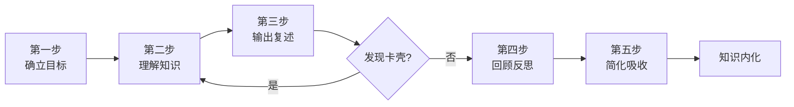
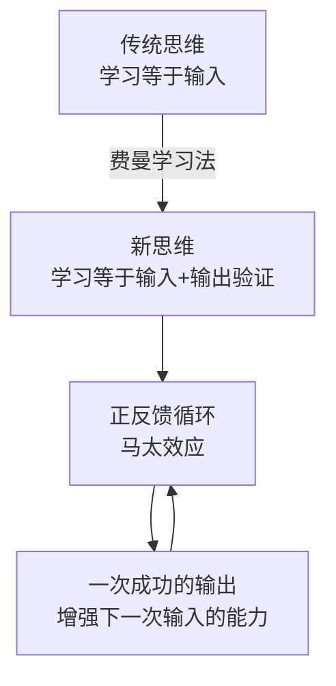
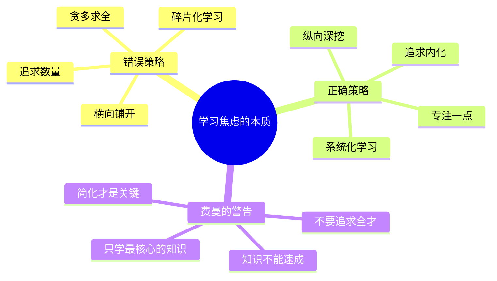

# 费曼学习法

费曼学习法是以诺贝尔物理学奖得主[[理查德·费曼]]的教学实践为基础总结的学习方法论，核心命题是：**验证我们是否真正掌握了一种知识，就看能否用直白浅显的语言把它讲清楚，让一个从未接触过这个知识的旁观者听明白。** 该方法以"用输出倒逼输入"为设计逻辑，分为五个步骤：确立目标、理解知识、输出复述、回顾反思、简化吸收。

> "如果你不能向其他人简单地解释一件事，那么你就还没有真正弄懂它。"（[[理查德·费曼]]）

---

## 两种知识的根本区分

费曼认为知识分为两种类型，大部分人关注的是错误的那种：

- **记住知识的名称**：一个公式、一个概念、一个数据。倒背如流，但只是将它们存储下来而已。
- **了解知识的内核**：知道它们是怎么回事，能从自己的视角重新解读，并向外传播让别人也能理解。

这两者绝非一回事。费曼本人曾向普林斯顿大学数学系的所有教授发起挑战，他说："不管是多么复杂难懂的数学知识，只要你们使用简单的术语描述，我就一定会算出正确的结果。"很多教授在实践中发现：这太难了。因为这意味着自己必须对相关的知识彻底地理解，能够重新组织一套语言进行精确的描述。这就是费曼学习法的精髓。

费曼的父亲曾告诉他一个道理，记录在《别闹了，费曼先生》中："当你看到一只鸟时，即便你知道它的名字，对它也仍然一无所知。因为你只是知道了人类赋予它的名字，仅此而已。至于它在夏天横跨整个国家并飞行上万英里时是怎样辨别方向的，没有人知道是怎么回事。"知道名字，不等于了解。

---

## 传统学习的三个缺陷

书中将大多数人使用的传统学习方式归纳为三个特点：

| 特点 | 优点 | 缺陷 |
|------|------|------|
| **以输入为主**：死记硬背 | 短期积累大量知识点 | 内容留存率低，今天记住的"十不留三" |
| **教条主义**：老师说什么是什么 | 节省接受知识的时间 | 屏蔽其他可能性，缩小视野 |
| **标准化应用**：生搬硬套 | 快速将知识落地 | 缺乏变通，场景变换时知识无法落地 |

传统学习的核心问题是：知识没有经过大脑的深度处理转化为智慧或技能，缺乏 **认知效率**，只有 **技术效率**。付出了学习的过程，储存了知识，却不具备输出这些知识的能力。

---

## 五步核心框架

### 第一步：确立目标

目标不是一个静态的台阶，而是动态变化的信标。费曼在 SMART 原则基础上提出目标的五个原则：**全面性**（匹配阅历和知识积累）、**重点性**（有侧重点和针对性）、**挑战性**（激发潜能，不能人为调低难度）、**可行性**（在能力范围内）、**可调性**（留有余地，准备备用计划）。

书中通过小周的案例说明目标错误的代价：27岁男性因婚姻失败想靠炒股致富，用 SMART 原则分析后发现 M/A/T 均不符合，这是错误的学习对象。他真正的优势是工商管理背景，正确目标应是提升管理和财务能力找更好的工作。

### 第二步：理解知识，系统化

将知识有逻辑地系统化，需要做好三件事：

1. **明白自己为何学习**：非功利、非倾向性、非偏执性，即"我就是想掌握这些知识，了解它们，产生自己的理解"
2. **保持足够宽阔的视野**：费曼认为，成人在学习上"问问题"的能力有时不如小孩。孩子看到一本书会问"作者为何写这本书""封面有何意义"；大人只问"有什么用"和"有没有便宜的版本"。**童真的心态能扩大视野，让你看到更多可能性。**
3. **建立客观科学的逻辑**：系统化就是为学习准备一张图纸，把材料安放到该去的地方

**筛选知识的三步骤**：提取关键知识点 → 锁定方向清单（我最需要什么）→ 保留与实际需求匹配的可靠知识。

**分辨假知识**：书中指出，我们一生中学到的90%都是假知识。假知识的特征是具有"强意志"的刺激性，接触时如打了一针兴奋剂，让人激情澎湃，好像发现了世间真理，但这种快感只是冲击了思维，却改变不了行为。创业失败的人热衷听"成功人士"讲座却继续失败，正是因为这些知识是不折不扣的"假知识"，有吗啡的特点，使人上瘾。

**思维导图的三种形式**：
- **概念图**：主题、用途图形化，突出理论和观点
- **结构图**：揭示目录、大章、概念之间的关系，形成层次结构
- **因果图**：列出观点的前因后果，论据与推理逻辑的关系

### 第三步：输出复述，三次递进

**内容留存率** 是费曼学习法的核心数据基础：

| 学习方式 | 24小时后留存率 |
|----------|--------------|
| 听讲 | 5% |
| 阅读 | 10% |
| 视听结合 | 20% |
| 演示 | 30% |
| 小组讨论 | 50% |
| 实践练习 | 75% |
| **教授他人** | **90%** |

费曼认为，不是学得越多效能越高，而是要最大限度提高"内容留存率"，达到90%以上才算高质量学习。

**第一次复述：讲给自己听**

三个阶段：
1. **凭印象复述**：不用顾虑是否准确，自由讲出最深刻的部分，然后统计哪些讲对了，哪些偏离原意
2. **复述中提出问题**：将新知识与已知知识对比，针对不能融合的部分写下一系列"为什么"
3. **加入自己的观点**：把自己的观点加进去，实现新知识与已有知识系统的衔接

第一次复述的五个价值：建立长时记忆、加深理解、更主动地学习、对知识展开联想、得到关于问题的反馈。

**第二次复述：讲给外行人听**

进入真实的传授场景，向从未了解过这个领域的人阐述。要求：只需一两句话，用对方听得懂的语言，精准无误，同时讲出一定深度。

书中最有力的案例：一位大字不识的农民，儿女分别考上北大和清华。他的秘诀是：每天让孩子回家后把老师当天讲的课对他讲一遍，"如果我有听不懂的地方，就让孩子解释；如果孩子解释不出来，就让他回到学校请教老师。"这位父亲在不自知的情况下完整地执行了费曼学习法。

四个要求：语言简洁易懂（让没文化的农民也能立刻听懂）、精准到位没有歧义、讲出一定深度、加上自己的理解。

**第三次复述：讲给质疑者听**

第三次复述的目标是达到学习的三个目的：**解释问题、解决问题、预测问题**。其中"预测"是最高境界，知识不是拿来搬开脚下的石头，而是帮你读懂未来。

这一阶段要求建立原创观点。班杜拉的"自我效能理论"指出：如果能积极评估自己的学习效能并深入持续学习，就可以逐步产生"原创观点"。最重要的是通过观察学习获取原创视角：**善于观察世界的10%的人贡献了我们所学知识的90%**。

**以教代学的四维输出场景**：
- 模拟解说者（演讲）
- 模拟受询者（面试）
- 模拟传授者思维（讲课）
- 模拟质疑者思维（辩论）

### 第四步：回顾反思，怀疑与探索

**"盲维"概念**：每次进入陌生的房间，第一次能描绘30%的特征，第二次补充更多，但总存在观察不到的盲点。知识的"盲维"越大，对知识的了解就越浅，输出时的表达力就越欠缺。消除盲维的方式是主动怀疑和深度探索。

费曼在回顾中提出两个关键问题：
- **如果正确**：重温后加深对知识的理解，形成长时记忆
- **如果不正确**：分析原因，是自身知识欠缺导致理解偏差，还是原知识本身观点和逻辑存在问题

**争议是深度学习的切入点**：

面对争议，两种处理方式：
1. **向上回避**：跳过有歧义的知识点，大脑只接收直白易懂的信息，即"浅学习"
2. **向下解决**：沉下来化解争议，从有争议的知识中获得宝贵的智慧，即"深度学习"

费曼曾在《自然》杂志上质疑天文学家卡尔·萨根关于地外文明信号的论文，认为"证据太苍白了，就好像一只苍蝇飞过婴儿的耳边，婴儿却以为那是一个高级玩具。"最终《自然》杂志向他道歉，承认这是"未经严谨评估就予以发表"的文章。他事后说："最好的学习是我们能从一个问题里找到新的问题，你不喜欢、不赞赏、不认可的东西，那才是知识这顶皇冠上的宝石。"

**否定式证据的四类来源**：相反的科学数据、逻辑漏洞、过时的知识、相反的权威观点。

**经验和好奇心的辩证关系**：
> "在学习中，经验保证你的下限，好奇心则决定着你的上限。"

### 第五步：简化吸收，知识内化

费曼说："如果你不能把一个科学概念梳理得逻辑简单，通俗易懂，三两句话就能讲明白，那就说明你对这个概念是一知半解的，并没有学好。"

简化的两个核心动作：
1. **找到核心**：所有复杂的知识体系都有一个简单的核心逻辑，就像一团乱麻的总线头，找到它，整团乱麻便轻松化解
2. **纵向拓展而非横向铺开**：不需要横向掌握所有知识点，只需对其中一两个点集中突破、深入研究，便能举一反三

**"以慢为快"原则**：想深入理解一门知识，必须习惯"以慢为快"，专注于一个学习对象，把它学精学通。作者用费曼学习法读一本书时，仅为制作不足1000字的知识结构图就花了三天，然后又花两天修正。正是因为看起来很"慢"，打通了许多知识阻塞，对书的理解上升到更高高度。

**"绿灯思维"vs"红灯思维"**：
- **红灯思维（自我中心主义）**：当感觉到自己的观点或立场受到挑战时，第一反应是警惕、防卫、拒绝反省
- **绿灯思维（事无禁止均可为）**：耐心倾听不同观点，懂得自我反省，从中汲取有价值的信息

费曼的建议：在涉及思想或观点的问题时，**一定要懂得区分什么是"我"，什么是"我的想法"**。两者并不是一回事。

**知识吸收能力的五个层次**：
获取知识 → 简化知识 → 吸纳知识（转化为长时记忆）→ 转化知识（与已有体系融合）→ 创新知识（在已有基础上创造新知识）

---

## 思维模式改造

费曼学习法的核心价值不在于技巧，而在于对思维模式的改造：

费曼认为，输出提供了三种与众不同的能力：
- **远见**：通过解读知识传递的信息，判断未来的趋势，而不是仅仅记住这些信息
- **穿透力**：从碎片化的知识中看清事物的本质，快速解决问题，掌握事物规律
- **智慧**：通过以输出的方式浓缩重演知识，汲取精华，使知识为我所用，形成自己的知识体系

---

## 学习焦虑的解药

书中引用数据：人类创造5艾字节信息的时间，从数百万年缩短到了不足10秒钟。知识增长速度已超乎想象，任何人都不可能赶上。因此，最有效的学习是 **只学习你需要的，只学习对你重要的，只学习知识之中最核心的知识**。

后记总结了学习的四个优先级：
> 主动的学习远比被动的学习重要；系统的学习远比碎片式的学习重要；向内的学习远比向外的学习重要；专业的学习远比跨界的学习重要。

---

## 费曼五条建议

费曼为知识内化提出五条具体建议：

1. **使用笔记记录知识的核心要素**：既帮助后续加工，也是辅助记忆的手段
2. **大幅度整理所学知识**：对输入的信息进行深层全面过滤，保留高价值知识并赋予清晰层次
3. **对知识进行结构化归纳与理解**：以自身角度和需求展开脑力活动，形成自己的见解
4. **输出和发布自己所理解的知识**：收取反馈，补充没想到的地方
5. **对知识进行简化、吸收和记忆**：产生自己的知识体系，创造新知识，转化为长时记忆

---

## 延伸阅读

- [[学会提问]]：批判性思维框架，是费曼学习法的输入侧对应物。费曼强调用输出验证理解；本书提供在接受输入之前检验论证质量的工具
- [[必然]]：凯文·凯利提出，在答案日趋可搜索、可生成的时代，提出好问题比记住答案更有价值。与费曼"无法简单解释就是没有真正理解"的核心命题形成呼应：两者都将高阶认知能力（提问与输出表达）置于知识积累之上
- [[金字塔原理]]：结构化输出的写作框架，与费曼第三步"输出复述"可配合使用
- [[逻辑思维框架]]：思维工具集，与费曼学习法在知识内化阶段互补
