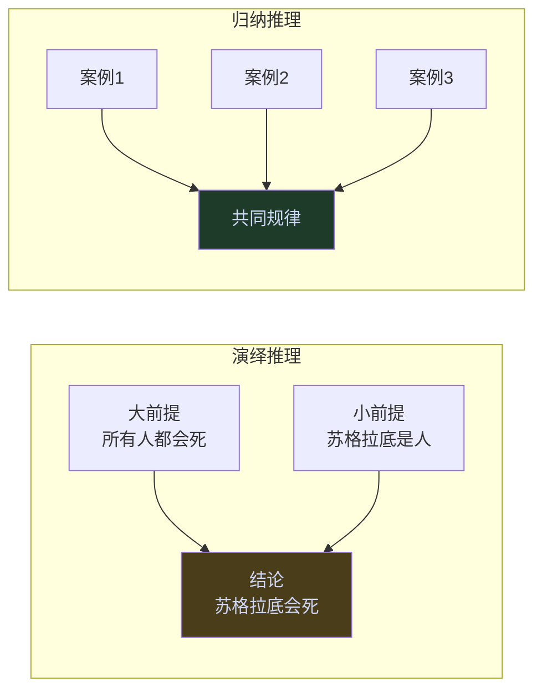

# 逻辑思维框架

逻辑思维框架是指通过明确的组织规则将离散信息整合为可被有效理解和传达的结构体系。金字塔原理所体现的逻辑思维框架，以层级化、有序化、归类化为核心特征，反映了人类大脑在处理复杂信息时的认知规律，也提供了一套可操作的结构化思维训练方法。

## 结构化思维的认知基础

结构化思维的必要性根植于人类大脑对信息量的处理限制。认知心理学中著名的"7±2 原则"（乔治·米勒，1956）指出，人类工作记忆在同一时间只能有效处理约5至9个独立信息单元。超出这一范围，信息便会相互干扰，导致理解失败或记忆丢失。

层级化结构通过将信息归入不同的分组，使得读者在任意一个层级上都只需同时处理少量项目，从而在不压缩信息总量的前提下，大幅降低单次认知负荷。金字塔结构的每一个节点都扮演双重角色：作为上层的支撑论据，同时作为下层的概括总结，形成既可自上而下演绎、也可自下而上归纳的双向通道。

这也解释了为什么未经结构化的信息往往"很难理解"——读者被迫同时追踪多个孤立的论点，既要识别它们各自的内容，又要猜测它们之间的关系，认知资源迅速耗尽。

## 自顶向下思维：从结论到论据

自顶向下（Top-Down）思维的起点是一个明确的核心判断，然后系统性地向下展开支撑这一判断的论据。这种思维模式要求在动笔或开口之前，先回答一个关键问题：*我最终要传达的结论是什么？*

自顶向下思维的优势在于：
- 强迫思考者首先明确立场，避免在信息海洋中漫无目的地搜集素材；
- 每一条论据都有明确的归属——它要支撑的上层论点是什么；
- 读者从第一句话起便知道文章的方向，可以主动用已知知识框架来接收和验证后续内容；
- 便于快速检验结构完整性：若某层级的所有论据加在一起无法推导出上层结论，则说明结论本身需要修改，或论据存在遗漏。

适用场景：已有明确观点、需要说服读者的报告；建议书；任何以"我的结论是X，理由如下"为骨架的沟通场合。

## 自底向上思维：从素材到结论

自底向上（Bottom-Up）思维的起点是一堆尚未组织的原始素材，通过归类分组和逐层归纳，最终浮现出统摄全局的中心论点。这种思维模式更接近实际的研究和分析过程，尤其适合在初始阶段尚不清楚结论为何的情形。

自底向上思维的操作步骤：
1. 将所有想法以有主语和谓语的完整句子写出；
2. 在这些句子的主语、谓语或隐含意义中寻找相似点；
3. 将具有共性的句子归入同一分组，并为每组提炼一个总结性论点；
4. 检验各分组的论点之间是否也存在共性，据此向上归纳；
5. 重复上述过程，直到形成唯一的顶端论点。

自底向上思维的风险在于过度陷于细节，迟迟无法提炼出有力的结论。克服这一风险的关键技巧是：在归纳时不满足于描述"这些素材都是关于X的"，而是追问"这些素材共同说明了什么判断或结论"。

## 演绎推理与归纳推理的比较

演绎推理和归纳推理是横向逻辑关系的两种基本形式，二者在结构和适用情境上存在根本差异。

**演绎推理** 的各论点之间具有**依存关系** ：第二个论点是对第一个论点的特殊化评注，第三个论点由前两者共同推导。去掉任意一个前提，结论便无法成立。演绎推理适合用于论证某个规律性主张，或说明某种现象为何必然发生。

**归纳推理** 的各论点之间具有**并列关系** ：每个论点都能独立成立，彼此之间不形成推导链条，但共同指向同一结论。归纳推理适合用于列举多个原因、步骤或证据，以支持一个更高层级的判断。

在实际写作中，归纳推理更为常用，因为它结构清晰、易于读者理解，且便于在后续调整中增删论点。演绎推理则更适合需要严密论证的场合，但若推理链条过长，应考虑将其简化为归纳形式呈现。

| 特征 | 演绎推理 | 归纳推理 |
|------|----------|----------|
| 论点关系 | 依存（第二论点评注第一论点） | 并列（各论点独立） |
| 结构 | 大前提→小前提→结论 | 共性观点1、2、3→总结 |
| 识别标志 | 可以说"因此" | 可以用单一名词描述全组 |
| 优先推荐度 | 论证严密时使用 | 多数情况下优先 |

## 逻辑顺序的四种类型及适用场景

在金字塔结构的任意一个分组内，各论点的排列必须遵循特定的逻辑顺序，而非随意陈列。逻辑顺序共有四种类型：

**时间顺序** ：按照行动发生的先后次序排列。适用场景：步骤性建议（先做A，才能做B）、流程说明、事件叙述。特征识别：各论点之间可以用"首先、其次、最后"连接，且顺序不可互换。

**结构顺序** ：按照实体对象的组成部分或空间位置排列。适用场景：组织架构分析、系统组成说明、地理区域分析。特征识别：各论点共同构成一个完整的整体，任意一部分去除后，整体即不完整。

**重要性顺序** ：按照论点的重要程度或影响力大小排列，通常由高到低。适用场景：并列的原因、风险、机会或描述性特征。特征识别：各论点彼此独立，可以用"最重要的是……其次……"连接。

**演绎顺序** ：按照大前提→小前提→结论的逻辑链排列。适用场景：演绎推理（参见上文）。特征识别：各论点之间可以用"因此"连接，且必须按此顺序，不可颠倒。

正确选择逻辑顺序的实践准则是：首先判断该组论点是行动性思想（步骤/建议）还是描述性思想（原因/问题/证据）。行动性思想优先考虑时间顺序（因为步骤通常有因果依存）；描述性思想优先考虑重要性顺序或结构顺序；若论点之间存在严格的推导关系，则使用演绎顺序。

## 结构化思维的核心价值

结构化思维框架的根本价值，不仅在于帮助他人更容易理解你的表达，更在于**迫使思考者自己把想法真正想清楚** 。

一般说来，若不先把构想说出来或写下来，人们很少能清楚地知道自己在想什么。而金字塔结构通过强制性的层级约束，迫使思考者在表达之前先完成两个认知任务：一是确定每个论点的逻辑归属（它要支撑什么、它由什么支撑）；二是确定同层级论点之间的关系类型（演绎还是归纳，什么顺序）。

这两个任务完成之后，思想便从模糊的直觉转化为可检验、可修改的显性结构。此时作者既能快速发现逻辑漏洞，也能向读者提供一条清晰的思维路径，使沟通效率大幅提升。

结构化思维的训练路径，从识别他人文章中的金字塔结构开始，逐步过渡到在空白页面上自主构建，最终形成在开口说话之前便已在头脑中完成结构化的思维习惯。

[[费曼学习法]] 提供了互补的视角：结构化思维解决「如何组织输出的结构」，费曼学习法解决「为什么必须输出」——两者结合，是高质量写作和演讲的底层逻辑。
