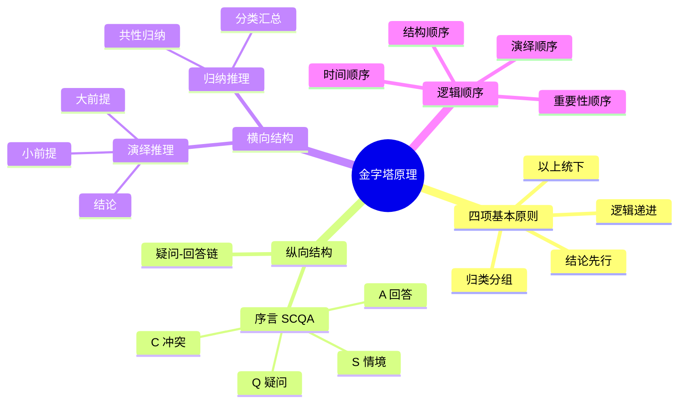
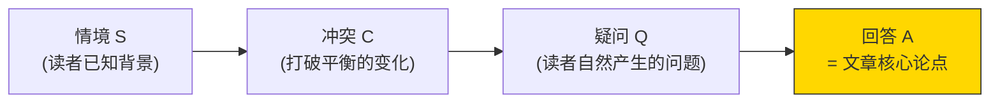

# 金字塔原理

金字塔原理（Minto Pyramid Principle）是由麦肯锡顾问芭芭拉·明托（Barbara Minto）提出的一套书面表达与结构化思维方法。其核心主张是：任何条理清晰的文章，在结构上总是呈现金字塔形状——顶端是统摄全文的中心论点，向下逐层展开支撑性论据，读者可以自上而下地获取信息。

> **核心原则** ：结论先行——永远先说你的结论，再给出支撑论据。这是金字塔原理最根本的思想，也是商业写作与学术写作的最大区别。

## 金字塔结构的四项原则

金字塔结构中各思想组之间的关系必须遵守三条原则，加上一条核心前提，共同构成完整的规范体系：

**原则一：结论先行。** 文章任意一个层次的思想，都是对其下一层次思想的总结概括。顶端的中心思想是整篇文章的结论，下面各层级为其提供支撑，而非平行罗列。

** 原则二：以上统下。** 上一层级的观点必须能够概括下一层级的全部观点，而非仅仅是其中一部分。若上下层级之间出现逻辑断裂，说明思想存在遗漏或无效。

** 原则三：归类分组。** 每组中的思想必须属于同一逻辑范畴。把性质不同的思想放在同一组内，会导致读者无法找到统一的归纳标签。

** 原则四：逻辑递进。** 每组中的思想必须按照逻辑顺序排列，包括时间顺序、结构顺序、重要性顺序或演绎推理顺序，不可随意排布。

> "条理清晰的文章，在结构上总是呈现金字塔形状，自上而下地阐述。"
> —— 芭芭拉·明托，《金字塔原理2》

## 纵向关系：疑问与回答的对话

金字塔结构的纵向维度建立在"疑问—回答"式对话之上。每当作者提出一个论点，就会在读者心中自动引发一个疑问；作者的下一个论点，就是对这一疑问的回答。这种对话机制使读者始终跟随作者的思路前进，而不会感到信息突兀或论证跳跃。

纵向结构引发的疑问通常属于以下三类：
- ** "如何"**：答案应陈述步骤或方法；
- ** "为什么"**：答案应陈述理由或原因；
- ** "你如何知道"**：答案应提供论据或证明。

序言（前言、引言）是纵向关系的起点。序言采用讲故事的形式，以** 情境（S）—冲突（C）—疑问（Q）—回答（A）**的模式构建，即著名的 ** SCQA 模型**：
- ** 情境（Situation）**：描述读者熟悉且认可的背景事实；
- ** 冲突（Complication）**：引入破坏原有平衡的变化或问题；
- ** 疑问（Question）**：冲突自然引发的核心疑问；
- ** 回答（Answer）**：文章的中心论点，是对疑问的直接回答。

序言的作用在于让读者在阅读开始的最初30秒内，便能掌握文章将要回答什么问题，以及答案的方向。

## 横向关系：演绎推理与归纳推理

金字塔结构的横向维度由两种逻辑推理方式构成，用于回答上一层级论点在读者心中引发的疑问。

| 维度 | 演绎推理 | 归纳推理 |
|------|---------|---------|
| 结构 | 大前提 → 小前提 → 结论（3段论） | 多个论点 → 归纳总结 |
| 适用 | 论证一个逻辑必然结论 | 列举分析多个并列观点 |
| 风险 | 大前提必须无懈可击 | 归纳须有代表性，避免以偏概全 |
| 纵向深度 | 不宜超过一层（否则变成归纳） | 可多层分类 |
| 典型场景 | 政策建议、逻辑推导 | 原因分析、方案列举 |

### 演绎推理

演绎推理采用经典三段论形式：
1. ** 大前提**：陈述某个普遍规律或已知事实；
2. ** 小前提**：对大前提所涉及的主语或谓语进行特殊陈述；
3. ** 结论**：由前两个观点推导出的逻辑结果。

判断是否为演绎推理的关键在于：** 第二个观点是否是对第一个观点的评论**。若是，则必然能得出"因此"引导的结论。演绎推理也可以扩展为连环式，但实际写作中不建议超过四个推理步骤，否则复杂度将超出读者的有效理解范围。

总结演绎推理时，应将最终推导的结论放在金字塔顶端，并在下层以"因此"连接前提与结论。

### 归纳推理

归纳推理将一组具有共性的独立观点并列排布，并从中归纳出总体结论。每组观点之间彼此独立，但共同指向同一主题或同一行动方向。

寻找归纳共性的方法是分析一组思想的主语与谓语：
- ** 主语相同，谓语属于同一范畴**：在谓语所指向的对象中寻找相似点；
- ** 谓语相同，主语属于同一范畴**：在主语中寻找相似点；
- ** 主语与谓语均不相同**：在各陈述所隐含的意思中寻找属于同一范畴的结论。

归纳推理摘要的难度高于演绎推理，因为做摘要本身就是完成推论的过程。常用的归纳分类单一名词包括：理由、步骤、证明，分别回答"为什么""如何""你如何知道"三类问题。

## 构建金字塔：自上而下法与自下而上法

实际写作时，构建金字塔结构有两种路径：

** 自上而下法（Top-Down）**：适用于已有明确论点的情况。步骤依次为：确定主题与中心论点 → 构思 SCQA 序言 → 找出关键句层级的论点（采用归纳法或演绎法）→ 逐层向下安排支撑论点，检验每层是否符合归类分组与逻辑递进原则。

** 自下而上法（Bottom-Up）**：适用于思路尚未明晰、素材零散的情况。步骤为：列出所有与主题相关的思想 → 寻找思想之间的共性，将其归类分组 → 为每组思想提炼总结性论点 → 逐层向上，直到形成顶端的中心论点。

无论采用哪种方法，最终都要检验整个金字塔是否满足四项原则：结论先行、以上统下、归类分组、逻辑递进。

## 提炼思想：逻辑顺序与结构检验

当金字塔结构初步建立后，需要对每一组思想进行严格检验，确保其排列符合逻辑顺序。逻辑顺序分为以下四种类型：

- ** 时间顺序**：适用于行动步骤或事件发展，按先后关系排列；
- ** 结构顺序**：适用于实体对象（组织、地理、系统），按空间或组成部分排列；
- ** 重要性顺序**：适用于描述性思想或平行原因，按重要程度从高到低排列；
- ** 演绎顺序**：适用于论证推导，按大前提→小前提→结论的逻辑链排列。

在检验行动性思想（建议、步骤、目标）时，需特别确认因果关系是否清晰：** 上层论点应陈述执行下层行动可以取得的结果**，而非只是对下层行动的类别标签或主题汇总。若上层只说"我们将采取以下措施"，而不说明这些措施将带来什么结果，则属于空洞主张，无法引导进一步思考。

> "你只需要找出'背景'和'冲突'就能决定应该如何安排故事情节，因为金字塔结构顶端的中心思想通常就是解决方案。"
> —— 芭芭拉·明托，《金字塔原理2》

## 论点标签与结构可见性

在构建和检验金字塔结构时，使用简洁的** 论点标签**（即用一个简短短语提炼每个论点的核心意思）是重要的辅助手段。论点标签不是论点的完整陈述，而是便于在金字塔结构图中快速识别和比较各论点关系的工具。

通过论点标签，可以直观地检验：同一层级的各论点是否真正属于同一逻辑范畴；上层论点是否真正是对下层论点的归纳总结；整体结构是否存在重复、遗漏或逻辑跳跃。

## 金字塔原理的实践价值

金字塔原理的根本价值在于，它将"写作是循环往复的试错活动"转变为"写作是遵循明确程序的建构活动"。通过在动笔之前先以金字塔模式架构思想，作者可以在与读者沟通之前先行发现并修补逻辑漏洞，从而大幅提升写作效率和表达清晰度。

该方法适用于报告、备忘录、提案、咨询文件等所有需要以书面形式传达复杂思想的场合，也同样适用于演讲等口头表达。
