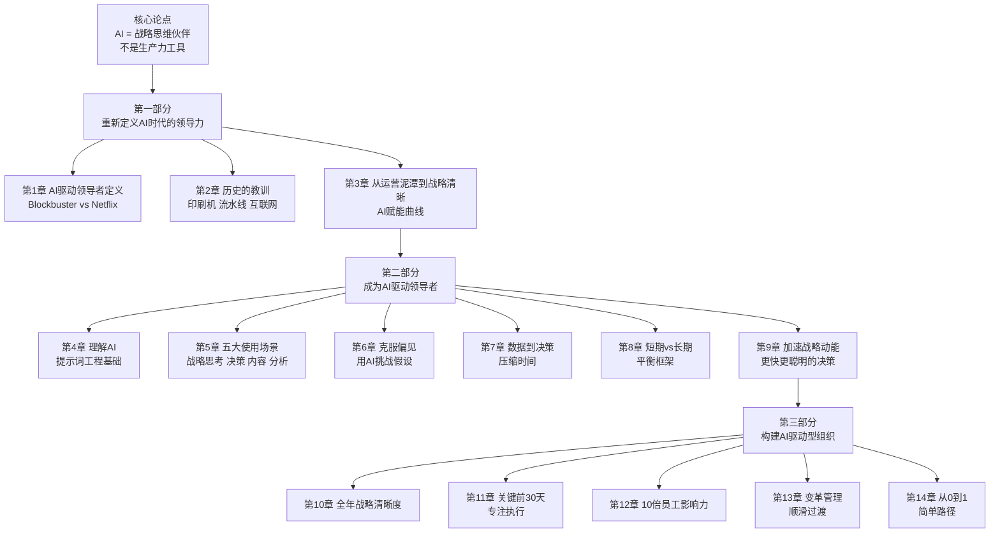
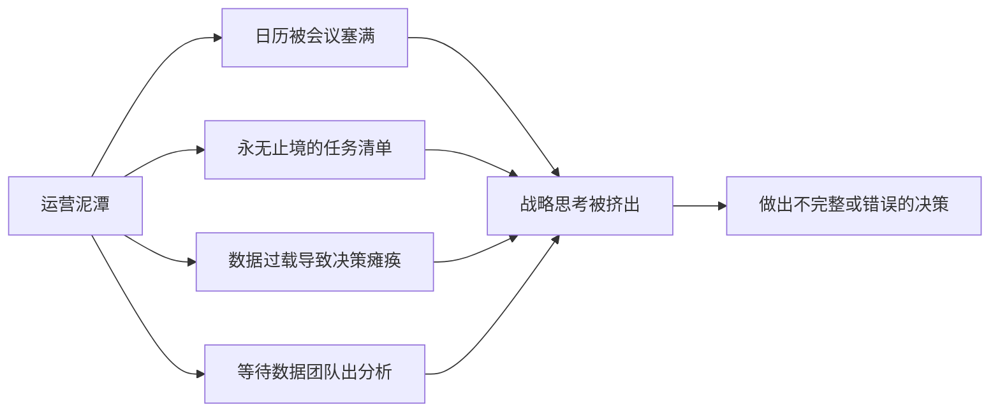
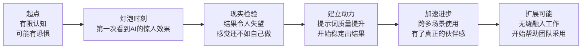
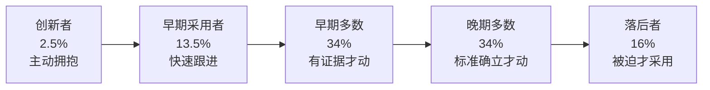

# AI驱动的领导力

> 作者：杰夫·伍兹（Geoff Woods）｜AI Thought Leadership™ 2024出版

---

## 一句话主旨

AI不是写邮件的工具，而是24/7随时待命的战略思维伙伴——掌握它的领导者能从运营泥潭中解脱出来，以战略清晰度做出更快、更明智的决策。

---

## 全书骨架



---

## 核心前提：为什么领导者失败

97%的高管认为战略思维是最重要的领导力行为。但他们没有时间去做。原因：



传统解法：出门做离线战略会议（费时费力）。新解法：AI as Thought Partner。

---

## 两个关键角色的分工

这是全书最重要的概念框架：

| 角色 | 谁来承担 | 职责 |
|------|---------|------|
| **Thought Leader（思维领导者）**| 你（领导者）| 提供背景、方向和战略判断；问正确的问题；做最终决策 |
| **Thought Partner（思维伙伴）**| AI | 澄清思路、分析数据、挑战偏见、生成选项、结构化沟通 |

关键原则：**AI缺乏你带来的背景和视角。它没有你的领导力。这就是为什么你必须保持在思维领导者的角色中。**

> "If you see AI as just another Google or a tool for writing better emails, you're selling yourself short."

---

## AI赋能曲线（5个阶段）

每个领导者在采用AI过程中都会经历的路径：



**灯泡时刻**是关键触发点。在此之前，人们缺乏推进AI赋能曲线的内在驱动力。

**创造灯泡时刻的提示词：**
```
I would like you to act as a Thought Partner by asking me one question 
at a time. Here's the situation: [背景]. Here's what I'm trying to solve: 
[问题]. Please help me think through potential solutions.
```

---

## 五个核心使用场景（第5章）

AI驱动领导者今天可以立即使用的五类场景：

1. **战略思考** —— 用AI挑战战略假设，发现盲点
2. **决策辅助** —— 分析多个选项，评估风险与收益
3. **内容创作** —— 从高层次要点生成沟通材料
4. **想法生成** —— 头脑风暴和创意探索
5. **数据分析与研究** —— 从数据集中快速提炼洞见

---

## 克服偏见：提问比答案更重要（第6章）

Keith Cunningham（《少走弯路》作者）在1980年代房地产投资中损失超过1亿美元，根本原因是**未受挑战的假设**。

核心提示词（挑战战略假设）：
```
Attached is our strategic plan. I want you to act as my AI Thought 
Partner™ by asking me one question at a time to challenge my biases 
and the assumptions we have made. I also want you to challenge if our 
plan has the sufficiency to achieve our goal. Once you have enough 
information, give me a summary of where you think our plan is strong 
and where you see potential weaknesses, and recommend ways we can 
improve it.
```

> "Nothing is worse than running enthusiastically in the wrong direction." —— Keith Cunningham

---

## 短期vs长期的平衡（第8章）

Blockbuster失败的深层教训：Antioco有正确的长期战略（流媒体+取消滞纳金），但被短视投资者Carl Icahn推翻。

AI驱动领导者的框架：用AI做**情景规划**，在短期压力下不放弃长期优先级。

**"20英里行军"原则**（来自Amundsen vs Scott南极竞赛）：
- 不管条件好坏，每天稳定前进20英里
- 好天气时不冒进，坏天气时不停下
- → 年度目标分解为每季度→每月→每30天的稳定执行节奏

---

## 技术革命的历史教训（第2章）

三次历史革命对AI时代的启示：

| 革命 | 赢家 | 输家 | 教训 |
|------|-----|------|------|
| 印刷机（1450s）| 率先采用的城市成为学习和商业中心 | 迟缓采用者错过浪潮 | 早采用者建立竞争优势 |
| 流水线（1910s）| 工业制造商 | 手工艺者 | 技能转移，但总体就业增加 |
| 互联网（1990s）| 数字原生企业 | 实体零售、印刷媒体 | 社会性风险被忽视（社交媒体）|
| **AI（现在）** | **掌握AI的领导者** | **不采用者** | 你的领导力决定AI是净正还是净负 |

**Rockefeller的教育工厂体系**：100多年前，工业革命把教育系统改造成培养服从者而非思考者的机器。AI时代正是打破这个遗产的机会。

> "AI won't replace you; those who harness AI will replace those who don't."

---

## 构建AI驱动型组织（第三部分）

### 采用曲线管理（第3章/第13章）



策略：**不要试图让所有人同时采用**。先帮创新者获得价值→早期采用者→早期多数。一旦50%的人上线，飞轮自动加速。

### 10倍员工影响力（第12章）

Google的20%时间政策案例：Gmail和Google Maps都来自员工的20%自由时间。

核心转变：从工业时代的"告诉人们要做什么"→AI时代的"告诉人们战略是什么，让他们决定怎么做"。

**员工层面的AI赋能路径：**
1. 明确员工角色中的高影响力优先项
2. 将其时间从低价值任务中解放出来
3. 用AI强化其高影响力工作
4. 成果：以更少资源做更多事

---

## 关键案例集

| 案例 | 教训 |
|------|-----|
| **Blockbuster vs Netflix** | 战略决策的质量决定公司命运；短视投资者可以推翻正确战略 |
| **Nokia vs Apple iPhone** | N95有iPhone 2G的14/15个特性，但营销策略决定了胜负 |
| **Satya Nadella的微软转型** | 增长型思维 + 押注Azure + OpenAI = 市值三倍；文化转型从"know-it-all"到"learn-it-all" |
| **Amundsen vs Scott** | 稳定的20英里行军原则：不冒进、不停歇；Scott死于目标设定和执行不稳定 |
| **Wyatt Graves的$1M突破** | 用AI挑战战略假设后，从平均$10K交易发现了$1M的机会 |
| **作者的One Thing经历** | 被Gary Keller当面说"你的产品烂"；三年后B2B转型，收入增长500% |

---

## 重要原文引用

> "Strategy first; technology second. While AI is a timely tool, strategy is timeless. That's why this is not an AI book; it's a leadership book."

> "I believe with the right leadership, you can create a world where the majority of your people's time is invested in high-impact priorities, aligned with their strengths, supercharged by AI."

> "The questions we ask shape our future. Unfortunately, many leaders ask the wrong ones."

---

## 批判性评估

**价值所在：**
- "AI as Thought Partner"的定位比泛泛而谈的"AI提升效率"更精准
- 历史技术革命框架为变革管理提供了心理支撑
- AI赋能曲线是实际观察而非纯理论，有操作价值
- 大量可立即使用的具体提示词

**局限性：**
- 书中所有AI案例都是生成式AI（ChatGPT/Copilot），没有讨论更复杂的AI系统集成
- 作者背景是中大型企业的战略顾问，对初创或小团队适用性有限
- "AI won't replace you"的乐观立场过于简单，缺乏对真实岗位风险的深度分析
- "Strategy first"是正确的但并未提供系统的战略框架

---

## 与知识库其他文章的对话

| 维度 | 本书（伍兹）| 《[[智人之上]]》（赫拉利）|
|------|-----------|----------------------|
| AI定性 | 工具/伙伴，人类始终是Thought Leader | AI是信息网络的能动成员，威胁更大 |
| 核心受众 | 企业领导者（实操层）| 政策制定者（宏观层）|
| 历史视角 | 印刷机→流水线→互联网→AI：历次革命都净正 | AI是史无前例的非生物成员加入网络 |
| 行动建议 | 学会用AI做战略思考 | 重排AI监管的政治优先级 |

→ 参见：[[高产出管理]]（格鲁夫的操作性领导力框架，与本书形成互补）

---

## 关键术语

- **AI Thought Partner（AI思维伙伴）**：24/7随时可用的战略思考辅助角色，挑战假设、澄清思路、分析数据
- **Thought Leader（思维领导者）**：提供背景、方向和判断的人类领导者角色，不可被AI取代
- **Operational Overwhelm（运营泥潭）**：领导者陷入日常运营细节无法做战略思考的状态
- **Strategic Clarity（战略清晰）**：领导者能够清晰定义长期目标并以此对齐日常行动的状态
- **AI Empowerment Curve（AI赋能曲线）**：个人和组织采用AI的5阶段旅程
- **Empathetic Strength（共情力量）**：在尊重员工恐惧和关切的同时，做出对组织最有利决策的领导风格
- **20-Mile March（20英里行军）**：无论外部条件好坏都保持稳定执行节奏的战略原则
