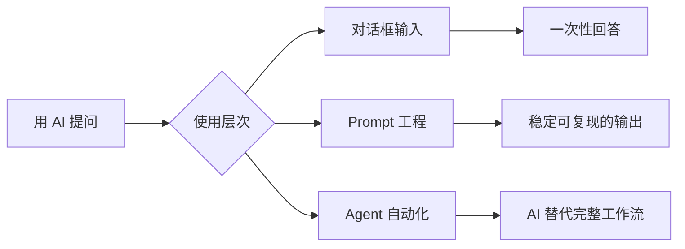
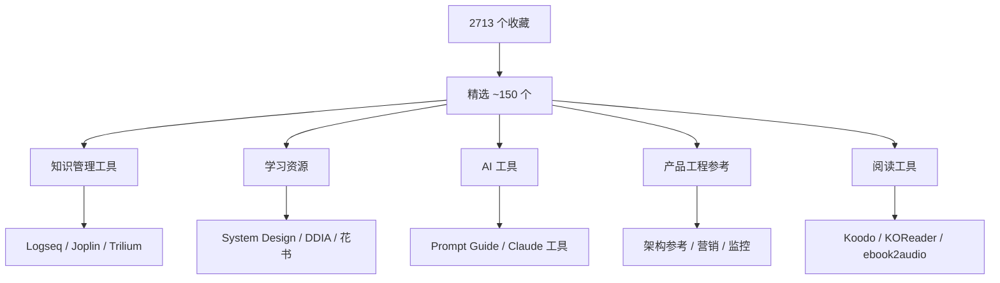

# GitHub 精选项目

从个人 2700+ 颗 GitHub Star 里筛出来的，按使用场景分类，每个项目附上它真正在解决什么问题。

---

## 个人知识管理

**核心问题：信息太多，但真正内化的很少。**

笔记工具本质上是在解决两件事：一是"存"——把信息放在找得到的地方；二是"连"——让不同来源的知识互相关联，形成理解而不是堆砌。

### 笔记与知识库

**[Logseq](https://github.com/logseq/logseq)** ⭐ 41,880

Roam Research 的开源平替。最大的设计差异：每条记录都是 block，而不是文档。这让你天然地做到"把大问题拆成小块"——这恰好是费曼学习法的第一步。支持双向链接，隐私优先，数据完全在本地。

> 如果你用过 Notion 却总感觉"东西存进去就找不到了"，Logseq 的图谱视图会让你看到知识之间真实的关联网络。

**[Joplin](https://github.com/laurent22/joplin)** ⭐ 54,224

Evernote 的完整替代。Markdown 原生，端对端加密，支持自托管同步（WebDAV/Nextcloud/Dropbox）。适合不想把笔记数据交给任何云服务的人。

**[Trilium Notes](https://github.com/TriliumNext/Trilium)** ⭐ 35,323

层级笔记 + 知识图谱。适合需要管理大量结构化知识的场景——比如维护一个技术 Wiki、记录复杂项目的决策脉络。支持脚本扩展，可以把笔记变成一个小型数据库。

**[Foam](https://github.com/foambubble/foam)** ⭐ 16,991

把 VSCode 变成双向链接笔记本。核心优势：你的笔记就是本地 Markdown 文件，没有私有格式，没有数据绑架。适合已经在 VSCode 里工作的人。

**[AppFlowy](https://github.com/AppFlowy-IO/AppFlowy)** ⭐ 69,215 / **[AFFiNE](https://github.com/toeverything/AFFiNE)** ⭐ 66,975

两个开源 Notion 替代品。AppFlowy 更接近 Notion 原版体验；AFFiNE 走得更远，把白板（Miro 功能）和文档合并在一起，适合既要写文档又要画图的场景。两者都支持自托管。

---

## 阅读工具

**核心问题：电子书格式乱，设备碎片化，高亮和笔记没法集中管理。**

**[Koodo Reader](https://github.com/koodo-reader/koodo-reader)** ⭐ 26,473

网页版 + 桌面端电子书管理器。支持 EPUB、PDF、MOBI、CBZ 等几乎所有格式，书架、高亮、笔记全部跨设备同步。本地书库 + 云备份，不依赖任何平台。

**[Readest](https://github.com/readest/readest)** ⭐ 19,260

更现代的跨平台阅读器，界面更干净，专注阅读体验本身。适合只想安静读书、不需要复杂管理功能的场景。

**[KOReader](https://github.com/koreader/koreader)** ⭐ 26,085

专门为墨水屏设备（Kindle、Kobo、PocketBook）打造的开源阅读器。解决的问题：Kindle 原生系统格式支持差、字体调节粗糙、不支持 PDF 重排。KOReader 把这些全解决了，是墨水屏用户的必装应用。

**[ebook2audiobook](https://github.com/DrewThomasson/ebook2audiobook)** ⭐ 18,621

把电子书转成有声书，支持声音克隆（用自己的声音朗读）和 1100+ 种语言。解决的问题：市面上没有好用的中文 TTS 有声书方案，这个项目让你自己生成。

---

## 学习资源

**核心问题：知道要学什么，但不知道从哪里入手，也不知道哪些材料真的值得读。**

**[System Design Primer](https://github.com/donnemartin/system-design-primer)** ⭐ 341,518

大规模系统设计的完整教程，是这个领域 GitHub 上引用量最高的资料。解决的问题：系统设计面试没有标准教材，面试官问的"设计一个 Twitter"背后有一整套方法论——这本书把方法论写清楚了。即使不面试，每个做过三年以上后端的人都值得读一遍。

配套有 Anki 卡片，支持间隔记忆复习。

**[DDIA 中文翻译](https://github.com/Vonng/ddia)** ⭐ 22,865

《Designing Data-Intensive Applications》是过去十年最重要的后端工程书籍之一。它解决的问题不是教你用某个具体数据库，而是教你**理解不同存储/计算系统背后的权衡**——为什么要用 Kafka 而不是数据库队列，为什么分布式系统里一致性和可用性不能兼得。Vonng 的中文翻译质量极高。

**[深度学习花书中文翻译](https://github.com/exacity/deeplearningbook-chinese)** ⭐ 37,223

Goodfellow 的《Deep Learning》是 AI 领域的基础教材，中文翻译版让阅读门槛降低了很多。适合想真正理解神经网络原理、而不只是调用 API 的人。

**[Papers We Love](https://github.com/papers-we-love/papers-we-love)** ⭐ 104,923

计算机科学经典论文收集，附带世界各地读书会的讨论资料。解决的问题：工程师通常知道某个技术"是什么"，但不知道"为什么这样设计"。读原始论文才能理解设计决策背后的思考。

**[PyTorch 实战教程](https://github.com/chenyuntc/pytorch-book)** ⭐ 12,828

《深度学习框架 PyTorch：入门与实战》配套代码。包含诗歌生成、图像风格迁移、漫画头像生成等趣味项目。解决的问题：纯理论书看完不会用，这本书用有趣的项目把理论落地。

---

## AI 工具与 Agent

**核心问题：AI 能力在快速演进，但大多数人用的方式还停在"ChatGPT 对话框"阶段。**

**[Prompt Engineering Guide](https://github.com/dair-ai/Prompt-Engineering-Guide)** ⭐ 72,869

从基础到前沿的 Prompt 工程完整指南，覆盖 CoT（思维链）、RAG（检索增强）、Agent 设计等。解决的问题：很多人知道要"好好写 Prompt"，但不知道具体怎么做。这本指南把方法论系统化了。

**[Claude Cookbooks](https://github.com/anthropics/claude-cookbooks)** ⭐ 37,466

Anthropic 官方出品的 Claude API 使用示例集。如果你在用 Claude 做开发，这里有大量现成的 Notebook，直接演示各种场景的正确用法。

**[learn-claude-code](https://github.com/shareAI-lab/learn-claude-code)** ⭐ 48,627

从零实现一个 Claude Code 类似物——一个极简的 agent harness。解决的问题：用 Claude Code 是一回事，理解它为什么这样设计是另一回事。读这个项目的代码，能真正理解"Bash is all you need"这句话背后的含义。

**[OpenViking](https://github.com/volcengine/OpenViking)** ⭐ 21,174

字节开源的 AI Agent 上下文数据库。解决的问题：Agent 没有持久记忆——每次对话都从零开始，无法积累知识。OpenViking 用文件系统范式统一管理 Agent 的记忆、资源和技能，让 Agent 具备"成长"能力。

**[karpathy/reader3](https://github.com/karpathy/reader3)** ⭐ 3,449

Andrej Karpathy 的实验项目：让 LLM 陪你一起精读书籍。解决的问题：读难书时缺少一个能随时答疑、帮你总结、追问细节的对话伙伴。这个项目很简单，但代表了一种阅读方式的可能性。

---

## 产品与工程参考

**核心问题：做产品的人需要参考真实系统是怎么设计的，而不只是看理论。**

**[互联网公司技术架构](https://github.com/davideuler/architecture.of.internet-product)** ⭐ 20,664

微信、淘宝、美团、OpenAI、Google、Facebook 等公司技术架构的系统性整理。解决的问题：公开技术分享很分散，这个项目把它们汇总在一起，方便横向比较不同公司的技术选型思路。

**[Marketing for Engineers](https://github.com/goabstract/Marketing-for-Engineers)** ⭐ 13,087

工程师做产品营销的资源合集。解决的问题：技术背景的人做产品，通常最薄弱的是增长和营销。这个合集从工程师视角出发，讲 SEO、内容营销、增长实验的具体方法，而不是营销学教材式的空话。

**[free-for-dev](https://github.com/ripienaar/free-for-dev)** ⭐ 120,556

各类 SaaS/PaaS/IaaS 免费套餐汇总，按类型整理。创业或做 Side Project 时，这个清单能帮你把基础设施成本压到接近零。

**[美团 CAT](https://github.com/dianping/cat)** ⭐ 18,969

美团开源的分布式实时监控系统，在美团内部支撑了 MVC 框架、RPC 框架、数据库框架的全链路监控。解决的问题：微服务多了之后，一个请求失败了你根本不知道在哪个环节出的问题。CAT 把全链路可观测性做到了生产级别。

**[Discourse](https://github.com/discourse/discourse)** ⭐ 46,695

目前最成熟的开源社区论坛平台。解决的问题：想搭建一个有质量沉淀能力的技术社区或用户社区，而不是微信群（没有搜索，内容即消即散）。Discourse 的 SEO 友好和内容沉淀能力是它的核心价值。

---

## 推荐系统

**核心问题：推荐系统的原理散落在各种论文和代码里，没有完整的系统性入门路径。**

**[SparrowRecSys](https://github.com/wzhe06/SparrowRecSys)** ⭐ 2,756

深度学习推荐系统的完整教学项目，作者是《深度学习推荐系统》的作者王喆。从召回、排序到工程实现，代码和原理并重。解决的问题：推荐系统面试和入门的最大障碍是"理论一堆，但不知道代码长什么样"——这个项目补上了这个缺口。

与书籍 [[推荐系统实践]] 配合阅读效果最好。

---

## 项目分布总览

## 筛选方法

这 2713 个收藏用以下逻辑精选：

1. **排除合集类**（awesome-* 列表）：合集收录标准宽泛，质量参差不齐，不如直接看精选
2. **排除停更超过半年的工具类**：工具停更意味着 bug 不修、依赖不更新，用起来有隐性成本
3. **排除明确过时的内容**（TF 1.x 教程、2016年技术周刊等）
4. **用 star 数作为质量信号**，但不是唯一信号——star 数反映的是传播度，不是对你的适用度

最终保留原则：**这个项目能帮我解决一个具体问题，而且文档/代码质量足够我真正用上它。**
