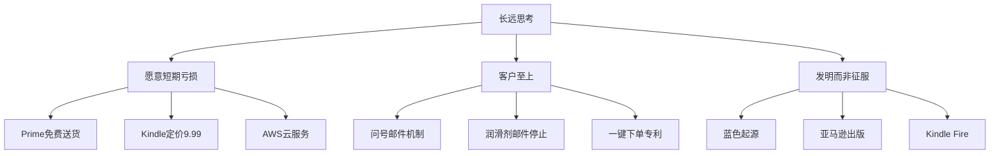
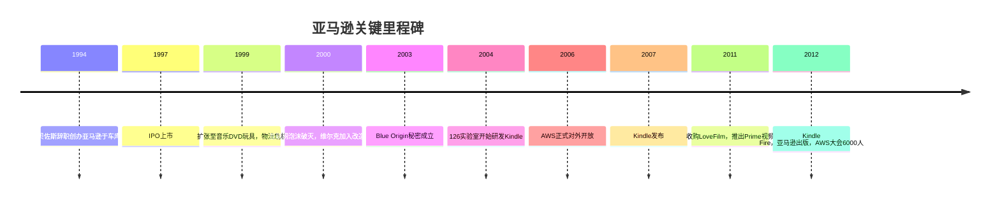

# 一网打尽：贝佐斯与亚马逊时代

布拉德·斯通（Brad Stone）著。作者历时数年采访贝佐斯本人、亚马逊历任高管及离职员工，2013年出版。书名"The Everything Store"揭示了贝佐斯最初的愿景——建立一家什么都卖的商店，而后演变为"一家万事通公司"。

---

## 贝佐斯其人：理解一家公司的密钥

贝佐斯1964年出生于新墨西哥州。生父泰德·乔根森（Ted Jørgensen）是一个失职的丈夫，在贝佐斯婴儿时期便与其母离婚，此后双方断绝联系长达45年。贝佐斯后由古巴移民迈克·贝佐斯收养，继父将自己的工程师思维和勤奋精神传递给了他。

童年时贝佐斯在外祖父位于得克萨斯科图拉的农场度过大量时光，外祖父教会了他动手修理一切——从布线到推土机。这段经历塑造了他对实操问题的直接态度。

1986年毕业于普林斯顿大学计算机科学与电气工程专业，后加入量化对冲基金D.E.Shaw，成为最年轻的高级副总裁之一。1994年，他看到互联网流量每年增长2300%的数据，决定辞职创业。他在去西雅图的途中在车上写下商业计划书，妻子麦凯奇开车，他写文件。

> "我在内心里做了一件思想实验：当我80岁的时候，我不会为这次尝试后悔，哪怕它失败了；但我肯定会为没有尝试而遗憾。"

---

## 起步：从车库书店到互联网冲击波（1994—1999）

亚马逊1994年在贝尔维尤的车库创立。选择书籍作为切入点，理由是：书目数量极其庞大（远超任何实体书店），书籍是标准化商品（无需看实物），且书是贝佐斯本人热爱的产品。

创业初期的节俭文化从第一天便开始：办公桌由门板和四条腿组成，这成为日后亚马逊节俭原则的物理具象。早期员工在亚马逊网站上线首日就要到处购买书籍以填满订单。

1997年上市时，亚马逊已是最大的网络书店。IPO后贝佐斯立即宣布扩张策略——不仅仅卖书。他的愿景从未只是一家书店。

1999年前后，亚马逊迅速扩张至音乐、DVD、玩具、电子消费品。为此，贝佐斯从沃尔玛大量挖人，包括供应链专家吉米·莱特（Jimmy Wright），后者花费数亿美元建立了全国性物流网络。沃尔玛随即起诉，指控商业秘密盗窃，最终庭外和解。

---

## 泡沫破灭与凤凰涅槃（2000—2004）

2000年互联网泡沫破灭，亚马逊股价从107美元跌至6美元。外界认为公司将破产。贝佐斯没有收缩战略，而是将危机转化为重建机会：

**杰夫·维尔克（Jeff Wilke）的物流革命。** 维尔克2000年加入，接替混乱的沃尔玛旧班底，将六西格玛（Six Sigma）方法论引入仓储。他不与零售老员工共事，直接组建了一支技术团队，开发预测算法，解决"在哪个仓库存什么商品、如何整合同一客户的多件订单"等问题。物流从成本黑洞变为竞争壁垒。

**两个披萨团队（Two-Pizza Teams）。** 贝佐斯确立了一个规则：任何一个团队都不能大到两个披萨喂不饱。这是对会议和协调成本的本能厌恶，也是对官僚主义的主动防御。大组织的失败往往不是因为坏决策，而是因为信息太多次手传递变形。

**贝佐斯的API强制令。** 贝佐斯内部发出一封著名的电子邮件，命令所有团队必须通过服务接口（API）暴露数据和功能，任何不遵守者将被解雇，毫无例外。这一看似内部IT架构决策，实际上为日后的亚马逊网络服务（AWS）埋下了种子。

---

## 数字革命：Kindle与AWS（2004—2010）

**Kindle的诞生。** 2004年前后，苹果的iPod正在颠覆音乐行业，亚马逊的CD销售受到冲击。贝佐斯得出结论：如果亚马逊不主动颠覆自己的图书业务，别人会替它颠覆。

他在硅谷秘密组建"126实验室"，任务是开发专用电子阅读器。这一决定受到内部强烈反对——包括维尔克和皮亚琴蒂尼（Diego Piacentini）。贝佐斯对此嗤之以鼻："我知道这很难，但我们必须学会怎么做。"

Kindle 2007年发布时，贝佐斯将电子书定价为9.99美元，低于出版商允许的价格，用零售利润补贴价差——这是亚马逊长期战略的经典体现：为了客户的长期价值，短期不盈利。

**与苹果的数字音乐谈判。** 2003年，亚马逊高管飞往库比蒂诺，提出与苹果合作销售音乐。乔布斯亲自接待，随后在白板上解释了为什么必须是"端到端体验"的iTunes商店。亚马逊提案落空。几个月后iTunes音乐商店上线，随即成为美国第一大音乐零售商。

> "我们吓坏了。iPod对亚马逊的音乐业务产生了那么大的影响，我们担心苹果或其他人会再抢走另一个核心业务：书籍。"——约翰·杜尔

---

## 商业生态的扩张与摩擦

**第三方市场与供应商战争。** 亚马逊允许第三方卖家在平台上销售，2012年时已占总销售量的39%。但平台模式产生了内在矛盾：亚马逊监控热销品后自行采购销售，实际上是用卖家的数据打击卖家。

**MAP定价冲突：以三叉刀具为例。** 德国刀具品牌三叉（Wüsthof）两度与亚马逊决裂。原因是亚马逊的定价机器人会自动找到更低价并打破制造商的最低广告价格（MAP），还会利用清仓库存（Warehouse Deals）绕过MAP要求。三叉于2011年第二次退出亚马逊，一位亚马逊采购经理对此的反应是威胁在三叉品牌关键词下投放竞争对手广告。

**"海洛因效应"。** 亚马逊内部将第三方卖家的处境比作毒品依赖：初期销量爆发带来快感，随后亚马逊压价并引入竞争，卖家利润消失，却无法退出，因为2亿活跃用户的流量无可替代。

---

## "亚马逊·爱"备忘录：商业哲学的自我画像

贝佐斯在一次高管会议后分发了一份名为"亚马逊·爱"的内部备忘录，分析为什么有些公司令人喜爱，另一些令人恐惧：

```
酷的事：年轻、承担风险、礼貌、打败更大的无情的公司、发明、探险、授权他人、领导力、信念、坦率、大胆设想、传教士

不酷的事：粗鲁、击败小公司、密切监控、过分关注竞争对手、只为公司捕捉价值、虚伪、迎合大众、雇佣兵
```

他认为苹果、耐克、迪士尼、谷歌令人喜爱；沃尔玛、微软、高盛令人恐惧。他的结论：**仅有创新不够，还必须有开拓精神，并得到客户的认同。**

---

## 组织文化：14条领导原则

亚马逊有14条领导原则，被贝佐斯亲自制定，经常被讨论和灌输给新员工。书中重点呈现了几条：

**敢于谏言，服从大局（Have Backbone; Disagree and Commit）：** 领导者必须不卑不亢地质疑无法苟同的决策，但一旦做出决定，全身心投入实现。

**勤俭节约（Frugality）：** 不在与客户无关的地方花钱。会议室桌子用门板拼，餐厅无补贴，停车费只报销一部分。

贝佐斯每年进行两次全公司审查（OP1和OP2），各团队须提交6页叙述性文件，禁止使用PPT。他认为幻灯片遮蔽了逻辑漏洞，而散文写作逼迫清晰思考。

**"严重度B级"邮件。** 贝佐斯会将客户投诉直接转发给相关员工，仅附一个问号"?"。这一个字符意味着：全员停止手头工作，立即处理。这是他让客户声音穿透所有层级的机制。

---

## 蓝色起源：第二个梦想

贝佐斯自幼痴迷太空。2000年在华盛顿州悄悄注册"蓝色起源"（Blue Origin），在垃圾桶里发现的溅了咖啡的草稿纸中，记者拼出了公司的太空永久居住目标。

格言"Gradatim Ferociter"（循序渐进，勇往直前）刻画了既是亚马逊也是蓝色起源的核心气质：向着不可预知的目标，接受挫折，忽略唱反调的人。2011年飞行器坠毁，贝佐斯在博客写道："这是我们都不愿看到的结果，但我们当初就想象到了它的困难。"

---

## 关键人物速记

| 人物 | 角色 | 一句话 |
|------|------|--------|
| 杰夫·贝佐斯 | 创始人/CEO | 长远思考，客户至上，不允许内部安逸 |
| 麦凯奇·贝佐斯 | 妻子、小说家 | 驾车横穿美国的那个人，诺贝尔奖提名作家 |
| 杰夫·维尔克 | 物流主管 | 用六西格玛改造仓储，被称为贝佐斯的"大脑延伸" |
| 迭戈·皮亚琴蒂尼 | 欧洲业务 | 从苹果欧洲区总裁跳槽，反对Kindle但全力执行 |
| 安迪·雅西 | AWS | 把内部IT基础设施变成了云计算行业标准 |
| 谢尔·卡芬 | 早期员工 | 和贝佐斯一起验证了"万货商店"概念 |
| 泰德·乔根森 | 亲生父亲 | 在凤凰城开了30年自行车店，不知道贝佐斯是谁 |

---

## 核心观点提炼





---

## 这本书最反直觉的结论

**1. 规模是保护客户的武器，不是剥削客户的武器。** 贝佐斯认为低价=效率提升转移给消费者，而非边际利润。亚马逊的商业逻辑是：低价→更多客户→更高议价能力→更低成本→更低价。循环本身就是护城河。

**2. 最大的竞争对手不是竞争对手，而是客户期望。** 贝佐斯从不开竞争对手分析会议，但会在会议室放一把空椅子代表顾客。

**3. 失败是被鼓励的，但要快速失败。** "如果你知道它一定会成功，就不叫实验了。"亚马逊的Fire Phone是公开的失败，但Fire TV、Echo、AWS都从同期失败的项目中学到了关键洞察。

**4. 传教士赢过雇佣兵。** 书的最后一章引用贝佐斯在股东信中的话：亚马逊既是传教士又是雇佣兵，"但传教士赢得更多，因为他们更在乎结果"。
