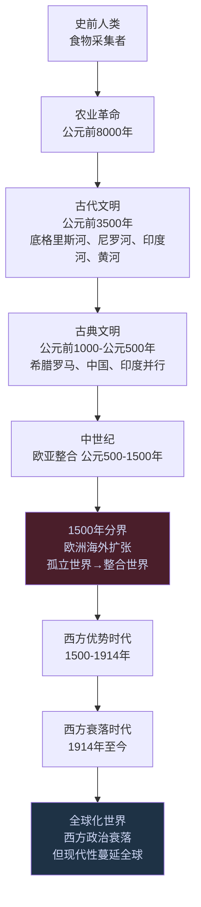
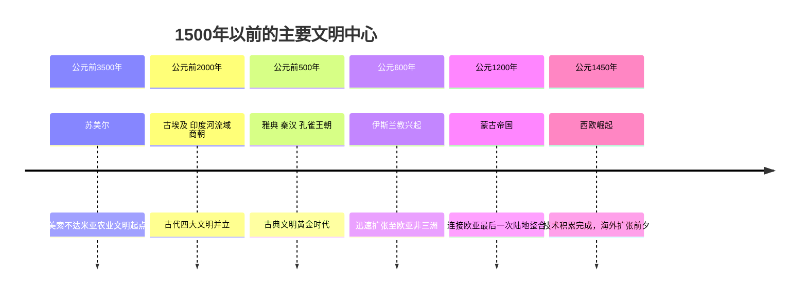

# 全球通史（A Global History）

《全球通史：从史前到21世纪》（*A Global History: From Prehistory to the 21st Century*）是美国历史学家 L. S. 斯塔夫里阿诺斯（Leften Stavros Stavrianos，1913—2004）的代表作。初版于1970—1971年，此后经六次修订，1999年第7版为最终定本。全书约110万字，被认为是当代"全球史"思潮最重要的奠基之作。

斯塔夫里阿诺斯将整部人类历史分为两大阶段：**1500年以前诸孤立地区的世界** 与 **1500年以后西方兴起并占优势的世界** 。这一分法打破了传统的"古代-中世纪-近代"三分法，是全书最重要的结构性主张。

---

## 读这本书的起点

和许多历史书不同，这本书试图回答一个元问题：**为什么是西欧人，而不是中国人或阿拉伯人，完成了将人类连接成一个整合世界的事业？**

斯塔夫里阿诺斯的回答不依赖"种族优越论"或"文化优越论"。他提供了一个结构性解释：1500年前后，西欧恰好处于"足够落后、足够接近、足够被迫改变"的交汇点。

这个答案与[[创新者的窘境]]里克里斯滕森关于"颠覆性创新来自低端市场"的逻辑高度呼应；也与[[历史与文明]]里王兴对郑和与哥伦布动机差异的观察形成印证。

---

## 斯塔夫里阿诺斯的核心框架

---

## 1500年：全书的枢纽

斯塔夫里阿诺斯认为，1500年是人类历史唯一真正的全局性断裂点。在此之前，各大洲基本是孤立地发展，各自演化；在此之后，欧洲海上扩张将所有孤立地区整合入一个相互依存的全球体系。

1500年以前的世界格局：

这一框架对中国读者特别重要：它迫使人们接受"中国衰落早在1840年之前数百年就已开始"的判断——中国的近代落后不是清朝偶发性的失职，而是一个更早埋下的结构性问题。

---

## 最反直觉的论断

### 先进者的诅咒

斯塔夫里阿诺斯在全书最重要的分析节点之一写道：

> "中国人享有高度发展的文化、先进的工艺、大规模的商业……中国人认为他们的文明优于其他任何文明，并认为外国人是野蛮人……这种态度虽然是可理解的，但却使中国人在一个巨变的时代没有发生变化。"

这是他所说的"受到阻滞的领先"（Retardation of the Advanced）：**最成功的社会在历史转折期最难改变，因为它们的成功已成为自身转型的障碍。**

与此对照，中世纪西欧——被斯塔夫里阿诺斯称为"欧亚大陆骚乱的前哨"——恰恰因为落后而保有开放性。它拿来中国的印刷术、火药、指南针，并将这些发明的潜能发挥到了中国人从未设想的方向。

这个逻辑在今天完全有效：当一家公司极度成功时，它最难进行根本性的自我颠覆，因为每一个既有业务都在反对变革。

### 西方的悖论

20世纪，西方国家在政治上确实衰落了：两次世界大战，殖民帝国瓦解，美苏冷战消耗，国内贫困和社会分裂持续。然而斯塔夫里阿诺斯指出，西方政治霸权的衰落恰恰与西方现代性的全球胜利同步发生。

民族主义、社会主义、自由民主——这些概念起源于欧洲，在20世纪蔓延到亚非拉所有后殖民地国家。土耳其凯末尔革命、中国的共和革命、印度的独立运动，每一场反抗西方殖民主义的运动，在思想源头上都使用了西方的政治语言。

### 种族与发展水平

斯塔夫里阿诺斯在讨论欧洲扩张时明确指出，公元1500年后西方对全球的支配"并不意味着西方人的基因优势"。他引用弗朗兹·博厄斯的研究：**决定不同民族发展水平的关键，是各民族之间的"可接近性"（Accessibility）** 。

西塞罗曾在公元前1世纪对朋友说，不要从不列颠买奴隶，"因为他们非常愚蠢，完全没有受教育的能力"——而不列颠人在那个时代的落后，恰恰和1500年后美洲印第安人的落后出自同一原因：地理隔绝带来的文化接触不足，与基因无关。

---

## 技术变革与社会变革的滞差

斯塔夫里阿诺斯全书贯穿的核心焦虑是：**技术变革总是超前于社会变革，这种滞差是人类灾难的根本来源。**

农业革命提高了生产率，创造了剩余，但也产生了阶级、不平等和战争——社会制度没有及时跟上技术变化带来的新现实。工业革命创造了工厂体系，但工人每天工作12-16小时的现实持续了几十年，社会保障体系才逐步建立。

在全书结尾的最终一章"历史对今天的启示"中，他警告：

> "我们面临的新挑战，要求我们从聪明的灵长类转化为明智的人类——从聪明（clever）转变为明智（wise）。"

核武器是最极端的案例：人类的技术能力已经可以制造"核冬天"，但人类的政治制度和伦理框架还没跟上。

---

## 与其他读过的书的关联

| 主题 | 《全球通史》的视角 | 相关词条 |
|------|------------------|---------|
| 先进者的滞后 | 受到阻滞的领先法则 | [[创新者的窘境]] |
| 技术必然性 | 技术变革超前于社会变革 | [[必然]] |
| 历史的非线性 | 落后者往往在转型期突破 | [[历史与文明]] |
| 郑和 vs 哥伦布 | 可接近性与激励结构 | [[历史与文明]] |

---

## 书中最有价值的分析框架

从认知工具的角度，这本书提供了两个直接可用的框架：

**框架一：可接近性原则** 。任何民族或组织的发展水平，很大程度上由它与外界的接触频率决定。孤立产生停滞，接触产生压力，压力产生变革。这个框架可以用来分析企业生态位（封闭市场vs竞争市场）、个人成长（信息茧房效应）以及创新规律。

**框架二：技术-社会滞差框架** 。每次重大技术变革之后，都有一段"过渡期灾难"——因为人类的制度、文化、伦理跟不上技术改变了的世界。这段滞差期往往是历史上最动荡的时期，同时也是新制度、新文化形成的窗口。今天的AI浪潮如果符合这个规律，那么现在正处于滞差期的起点。

---

## 一处有意义的局限

斯塔夫里阿诺斯被批评者指出，他虽然反对西方中心论，但仍无法摆脱把"现代文明"理解为"西方文明向全球传播"的叙事框架。东方文明对欧洲三大革命（科学革命、工业革命、政治革命）的贡献，在全书中着墨甚少。

这一局限是真实存在的。但它不影响这本书的核心贡献：提供了一个以"可接近性"和"技术-社会滞差"为底层逻辑、能够解释文明兴衰的分析框架。
