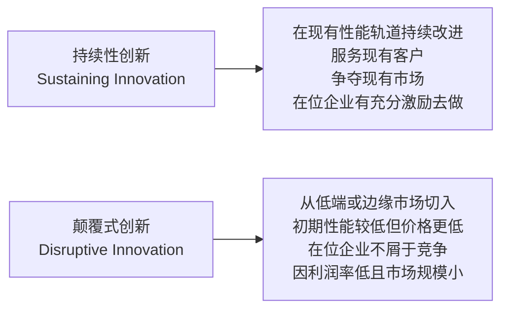
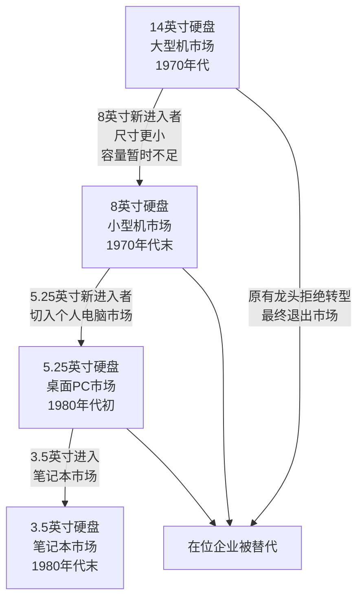
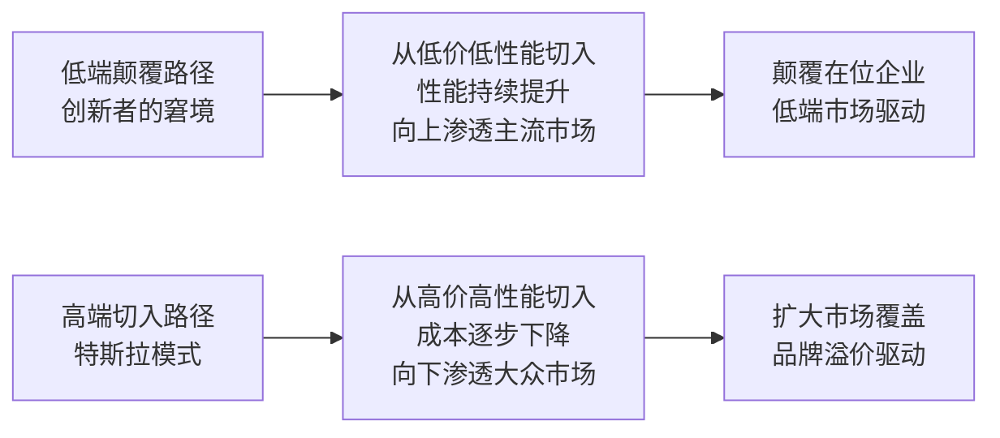

# 创新者的窘境

《创新者的窘境》（The Innovator's Dilemma）由哈佛商学院教授克莱顿·克里斯坦森（Clayton Christensen）于1997年出版。本书以硬盘行业为核心案例，系统阐述了为何管理良好的企业会在颠覆式创新面前失败——不是因为管理失当，而恰恰是因为遵循了正确的管理实践。[[王慧文产品课]] 将此书列为必读书目，概括为"从硬盘行业案例看颠覆式创新规律"；[[产品分层框架]] 直接援引本书逻辑解释低端颠覆现象。

---

## 两类创新的区分

克里斯坦森将创新分为两种本质不同的类型：

**持续性创新** 沿现有性能轨道改进产品，服务现有客户的核心需求。**颠覆式创新** 则从低端进入，以更便宜但性能较差的产品开辟新市场，或服务被主流市场忽视的低端用户群。

---

## 硬盘行业的历次更迭

克里斯坦森以1975年至1990年代硬盘行业的数据，记录了颠覆如何循环发生：

每次更迭中，新进入者的产品在主流客户重视的性能指标（容量、速度）上均不如现有产品，却在体积、重量、功耗等当时不被主流客户重视的维度具有优势。原有龙头企业在现有客户的需求驱动下持续改进主流产品，无暇顾及新兴细分市场，最终被替代。

---

## 低端颠覆的运作机制

低端颠覆遵循一个可识别的四阶段模式：

1. 新进入者以较低价格切入低端或边缘市场，在位企业不愿跟进（利润率低、市场规模小）
2. 新进入者沿自身改进轨道持续提升产品性能
3. 产品性能最终超过低端客户的实际需求，开始向上侵蚀主流市场
4. 在位企业此时才意识到威胁，但已失去低端客户群，转型代价极高

> "公司越是认真倾听顾客的声音、越是积极投资于满足顾客需求的创新，就越容易在破坏性技术出现时陷入困境。"

书中援引的其他案例包括：微型钢铁厂（minimills）从低端螺纹钢起步，逐步蚕食大型整合钢铁厂；个人电脑从家用娱乐进入企业商用市场，替代小型机；液压挖掘机从小型建筑工地替代钢绳挖掘机。

---

## 在位企业为何失败

在位企业的失败并非管理无能，而是以下合理决策的叠加结果：

- **资源依赖** ：资源分配流向利润率最高、现有客户需求最强的产品线，低端新市场无法竞争内部资源
- **客户导向** ：认真倾听现有客户的要求，而现有客户不需要低端新产品
- **价值网络锁定** ：企业嵌入由供应商、渠道商、客户构成的价值网络，颠覆式创新的价值网络不同，切换代价高
- **财务逻辑** ：低端市场毛利率低，在位企业的成本结构难以在该市场盈利

---

## 与本知识库产品框架的关联

[[产品分层框架]] 将本书的低端颠覆逻辑直接应用于产品分层分析，将PC替代IBM大型机列为"分层产品不同"情形下低端颠覆的典型案例，并指出应对策略只有一个：**在颠覆发生之前选择历史正确的一边**。

[[供需关系与产品设计]] 在"分层维度"中援引本书作为低端切入路径的理论依据，与特斯拉高端切入路径形成对照：

[[好战略坏战略]] 对战略清晰度的要求与本书互为补充：识别颠覆式创新的威胁是制定有效战略的前提条件之一。

---

## 相关条目

- [[王慧文产品课]] — 将本书列为核心推荐书目，评价其揭示颠覆式创新规律
- [[产品分层框架]] — 直接应用低端颠覆逻辑的产品方法论
- [[供需关系与产品设计]] — 在分层维度分析中援引本书作为低端切入路径的依据
- [[好战略坏战略]] — 战略清晰度框架的互补读物
