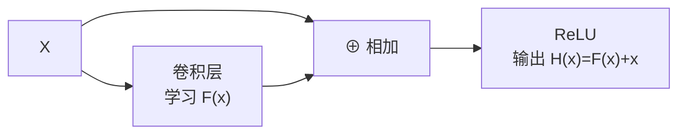
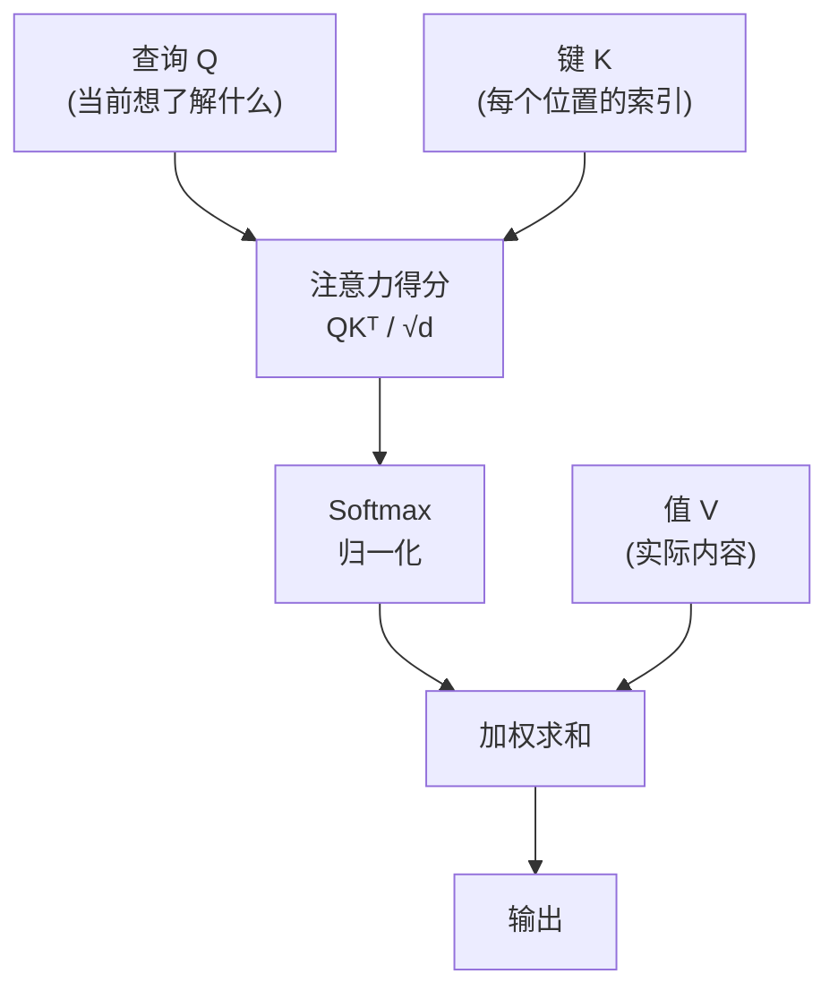
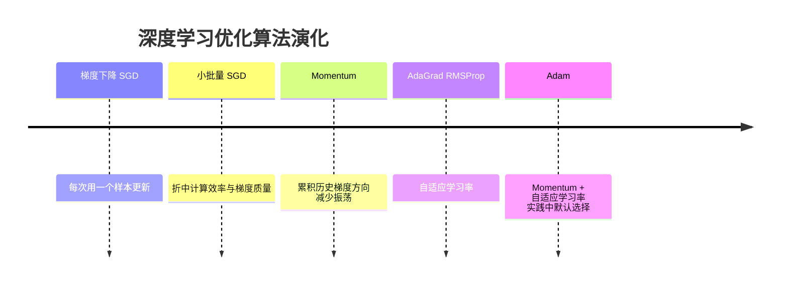

# 动手学深度学习

《动手学深度学习》（Dive into Deep Learning，D2L）由李沐、Aston Zhang、Zachary Lipton 等人撰写，是深度学习领域最具影响力的开源教材之一。全书以 PyTorch 实现为主，强调"概念、背景和代码"三位一体，让深度学习对工程师和研究者都平易近人。第二版覆盖从线性回归到 Transformer 的完整路径，共 17 章，797 页。

## 核心命题：用数据编程

传统软件开发依赖程序员手写规则。但对于语音识别、图像分类、机器翻译等问题，即便是顶级工程师也无法写出明确的规则。机器学习的根本转变是：**用数据编程（programming with data）** ——不再手写规则，而是定义一个灵活的模型，让数据决定参数。

任何机器学习问题都由四个核心组件构成：
- **数据** ：样本集合，每个样本有特征（features）和标签（labels）
- **模型** ：将数据转换为预测的函数族
- **目标函数** ：量化模型好坏的指标（通常是损失函数）
- **优化算法** ：搜索最优参数的方法（通常是梯度下降的变体）

深度学习与经典机器学习的区别在于：深度学习使用多层神经网络，学习数据的逐级表征，而不依赖人工设计的特征。

## 从线性模型到深度网络

线性回归和 softmax 回归是入门基础。softmax 回归用于多分类，输出层将线性分数转换为概率分布，交叉熵是标准损失函数。从信息论角度看，交叉熵等价于最小化"模型对真实分布编码所需的惊异程度"。

多层感知机（MLP）是第一个真正的深度网络，在线性模型基础上增加隐藏层和非线性激活函数。关键挑战是**过拟合** ——模型在训练集上表现优秀但泛化差。解决方案包括：
- **权重衰减（L2 正则化）** ：对大权重施加惩罚
- **Dropout** ：训练时随机丢弃神经元，强迫网络学习冗余表示

## AlexNet 与深度学习革命

2012 年之前，计算机视觉领域主流是手工设计的特征提取器：SIFT、HOG、bags of visual words。以 Yann LeCun、Geoffrey Hinton、Yoshua Bengio 为代表的一批研究者始终坚信特征应该被学习，而非设计。

**2012 年 ImageNet 挑战赛是深度学习的奇点时刻。** Alex Krizhevsky、Ilya Sutskever 和 Geoffrey Hinton 提出的 AlexNet 以大幅优势赢得比赛。AlexNet 能成功，归因于两个此前缺失的要素：

- **数据** ：李飞飞团队于 2009 年发布 ImageNet，100 万张标注图像覆盖 1000 类。此前研究通常只有几百到几千张图片
- **硬件** ：NVIDIA GPU 的矩阵并行计算能力与卷积层的计算需求高度匹配。Krizhevsky 用两块 GTX 580（各 3GB 显存）实现了可行的训练，其 cuda-convnet 库随后影响了整个行业

AlexNet 相比此前的 LeNet 有几处关键改动：
1. 使用 **ReLU** 替代 sigmoid——ReLU 在正区间梯度恒为 1，避免了梯度消失
2. 使用 **Dropout** 正则化全连接层，而非仅依赖权重衰减
3. 大量**数据增强** ：翻转、裁剪、变色

## 残差网络：解决深度的难题

随网络加深，理论上应该更强大，实际却出现**退化问题**——更深的网络在训练集上也表现更差。2015 年，何恺明团队的 **ResNet** 通过残差连接（residual connection）解决了这个问题。

残差块的直觉：与其让每层学习完整的映射 H(x)，不如让它学习残差 F(x) = H(x) - x，原始输入通过跨层捷径直接相加到输出。当最优解接近恒等映射时，让权重近似为零比学习恒等映射容易得多。

ResNet 使训练 100 层以上的网络成为可能，并深远影响了此后的深度学习架构设计。DenseNet 是 ResNet 的逻辑扩展，将每层与后续所有层连接，进一步强化了特征复用。

## 循环神经网络与序列建模

处理序列数据（文本、语音、时间序列）需要不同的模型。循环神经网络（RNN）通过隐状态在时间步之间传递信息。但标准 RNN 有两个问题：梯度消失导致难以捕获长距离依赖；以及信息必须逐步流过所有时间步，无法并行计算。

门控循环单元（GRU）和长短期记忆网络（LSTM）通过门控机制有选择地保留和遗忘信息，缓解了梯度消失问题。

编码器-解码器架构（seq2seq）是机器翻译的基础：编码器将变长输入序列压缩成固定维度的上下文向量，解码器从上下文向量逐词生成目标序列。

## 注意力机制与 Transformer

RNN 的根本瓶颈是将所有输入信息压缩进单一隐状态。注意力机制允许解码器在每一步直接访问编码器所有位置，按相关性加权提取信息。

**Transformer** 完全抛弃了卷积和循环，完全基于自注意力（self-attention）构建。核心机制是查询-键-值（Query-Key-Value）框架：

Transformer 的主要优势：
- **并行计算** ：所有位置同时处理，训练速度远超 RNN
- **最短路径** ：任意两个词之间的依赖只需 1 步（RNN 需要 n 步）

代价是计算复杂度与序列长度呈二次方关系，对超长序列代价高昂。Transformer 使用位置编码（正弦余弦函数）注入序列位置信息。

## 优化算法：鞍点比局部极小值更危险

深度学习的优化面临三大挑战：

**局部最小值** ：被过度担忧。实践中，小批量随机梯度下降产生的噪声往往能帮助模型跳出局部极小值。

**鞍点** ：真正的威胁。鞍点是梯度为零、但既不是极小也不是极大的点。对于高维问题，黑塞矩阵（Hessian matrix）同时有正特征值和负特征值的概率极高，鞍点出现的频率远高于局部极小值。优化停滞的主因往往是鞍点，而非局部极小值。

**梯度消失** ：sigmoid 函数在饱和区梯度接近零，导致早期深度网络难以训练。ReLU 激活函数彻底解决了这个问题。

优化算法演化路径：

Adam 是目前深度学习的默认优化器，结合了动量（累积过去梯度方向）和自适应学习率（为不同参数使用不同学习率）两个优点。

## NLP 预训练：从词向量到 BERT

自然语言处理的表示学习经历了两代范式转变：

**第一代：静态词嵌入（Word2Vec、GloVe）**

独热向量（one-hot vector）无法编码词之间的语义相似性，任意两个词的余弦相似度都是 0。Word2Vec 用自监督学习解决这个问题：

- **Skip-gram 模型** ：给定中心词，预测周围上下文词
- **CBOW 模型** ：给定上下文词，预测中心词

训练后，语义相似的词在向量空间中距离相近，且呈现类比关系：`king - man + woman ≈ queen`。

静态词嵌入的局限：同一个词无论上下文如何，向量永远相同。"bank" 在"go to the bank to deposit money"和"go to the bank to sit down"中是同一个向量。

**第二代：上下文感知表示（ELMo、GPT、BERT）**

BERT（来自 Transformers 的双向编码器表示）通过两个预训练任务学习上下文感知表示：
1. **掩蔽语言模型（MLM）** ：随机遮掩 15% 的词元，让模型根据上下文预测被遮掩的词
2. **下一句预测（NSP）** ：判断两个句子是否在原文中相邻

BERT 之所以强大，在于它把 ELMo 的双向性和 GPT 的 Transformer 架构结合在一起，并在海量无标注文本上预训练，然后以少量标注数据微调应用于下游任务。

## 书的价值与局限

这本书最大的价值是**工程导向** ：几乎每个概念都有完整的 PyTorch 实现，可以立即运行。它解释了"如何做"，也解释了"为什么这样做"的直觉，但对数学推导的深度不如 Bishop 的 PRML。

对于想理解深度学习工作原理、又希望能动手实践的人，这是最好的入门材料。

> "我们的目标是让深度学习平易近人，教会人们概念、背景和代码。"——前言
