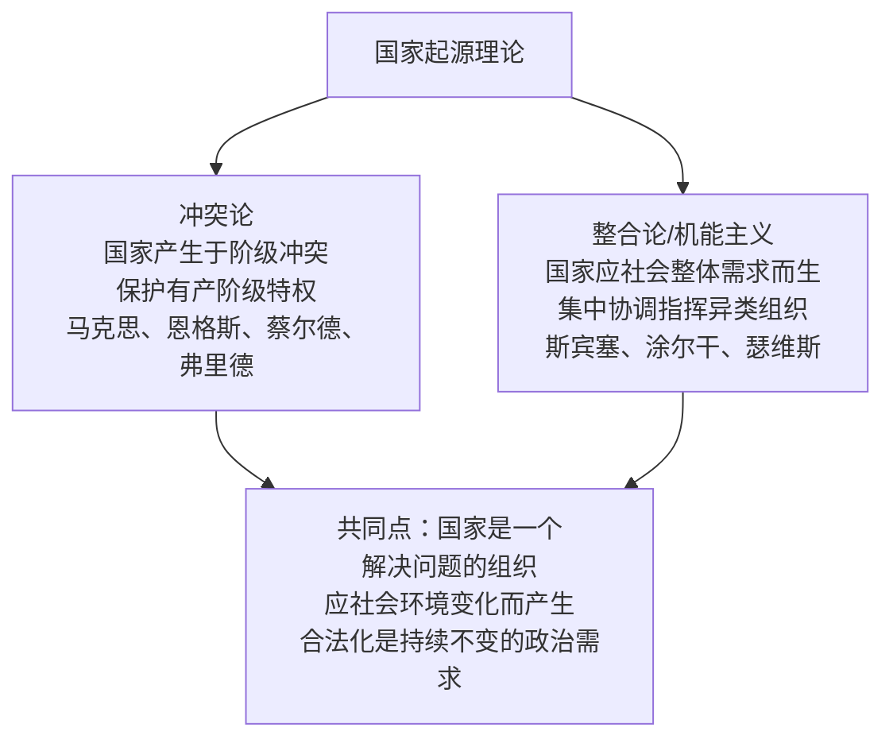
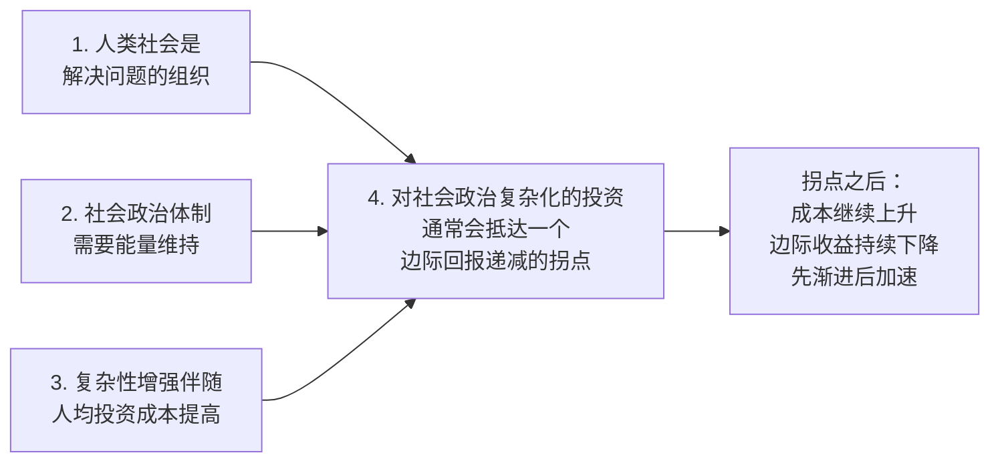
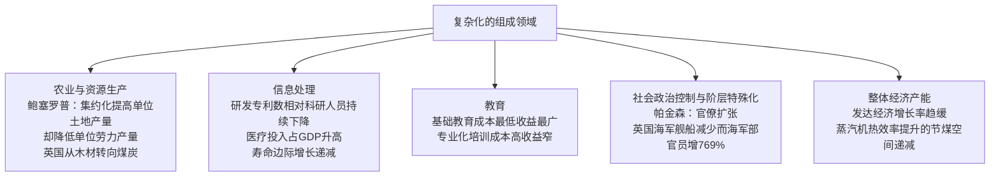
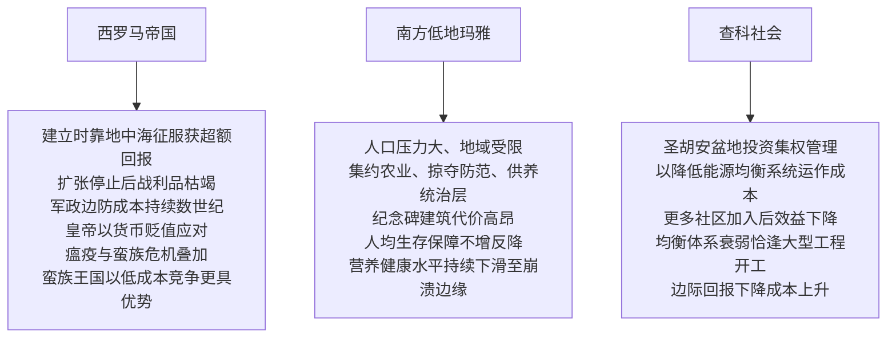
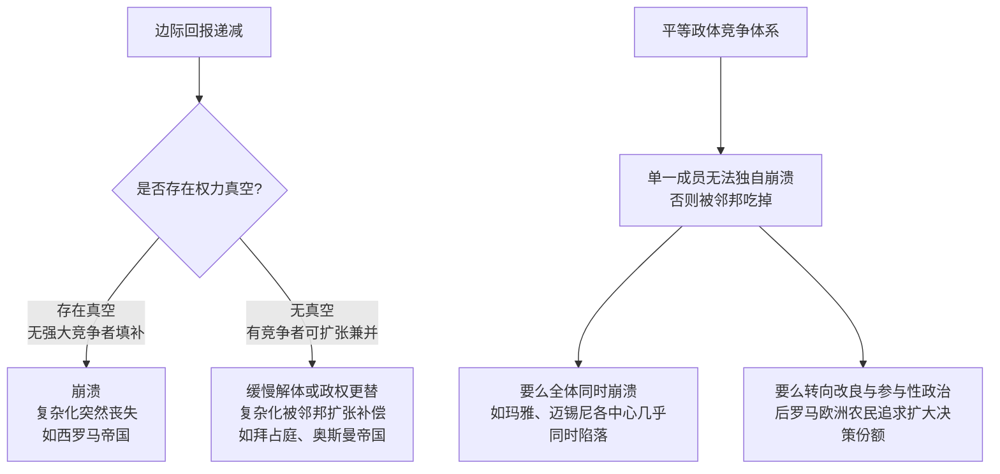

# 复杂社会的崩溃

《复杂社会的崩溃》（The Collapse of Complex Societies）由美国人类学家、考古学家约瑟夫·A·泰恩特（Joseph A. Tainter）于1988年出版，是解释文明崩溃问题的一部奠基性著作。泰恩特摒弃了此前流行的道德衰败、资源枯竭、外敌入侵、气候灾变等零散解释，提出一个可以适用于从狩猎采集群体到庞大帝国的统一框架：**社会复杂化是一种用来解决问题的投资，这种投资遵循边际回报递减规律；当边际回报下降到一定程度，崩溃就成为一种符合经济逻辑的选择**。

全书分为六章：第一章界定崩溃概念并罗列全球范围内的崩溃案例；第二章分析复杂社会的本质；第三章系统评价既有的崩溃理论；第四章提出核心的边际回报框架；第五章用三个案例检验该框架；结束章总结全书并推导出对当代工业社会的启示。

---

## 什么是崩溃

泰恩特把崩溃严格界定为一个**政治进程**，而非经济、艺术或文学现象。崩溃是"一个社会在社会政治复杂化的既定层次上出现快速的、实质性的衰败"。两个限定词至关重要：一是"既定层次"，一个社会必须曾经处于某种复杂化水平；二是"快速"，衰败必须在几十年内完成，历时过长只能算作缓慢的衰落。

一个崩溃了的社会会突然变得更小、更简单、组织层次更少、社会差别更小，专门化功能减弱，中央调控减少，信息流通、贸易和纪念性建筑投资都急剧下降，人口往往缩减，黑暗时代随之而来。

泰恩特强调，崩溃并不限于帝国。定居的园艺者退回流动采集，中央酋长制退回独立村落，同样是崩溃。复杂化程度是一个连续变量，崩溃是在这条刻度尺上的大幅后退。

---

## 复杂社会是解决问题的组织

第二章考察复杂社会的起源，指出国家起源的众多理论最终可归纳为两大派别：

泰恩特认为两派各有缺陷，冲突论的心理简化难以成立（若权力野心是人类共性，为何原初国家仅独立出现过六次），需要综合两者。但两派在最根本处是一致的：**国家是一个解决问题的组织**。这一属性构成理解崩溃的出发点。维持复杂社会的运转需要持续的能量流动，而且复杂化程度越高，人均成本越大。斯图尔德的对比说明了这一点：早期北美原住民的文化制品约三千到六千种，而二战美军登陆卡萨布兰卡时携带的人工制品超过五十万种。

---

## 核心命题：复杂化的边际回报递减

第四章是全书的理论核心。泰恩特把理解崩溃需要的观念浓缩为四条，前三条是第四条的基础：

边际回报递减（diminishing marginal returns）是经济学少数可预见的"法则"之一。泰恩特借用平均产量与边际产量的概念，论证复杂社会在几乎所有关键领域都会遇到这条特色曲线。理性的人类总是先利用成本最低、最易获取的资源和最经济的组织方案；当它们被用尽，后续投资只能转向成本更高、更难处理的选项，收益却不再同比增长。

他用大量近代数据逐一展示这一趋势：

在农业领域，鲍塞罗普（Ester Boserup）指出土地集约使用是过量劳力投入的结果，单位土地产量增加但单位劳力产量下降。在能源领域，英国因人口增长砍光森林后被迫转向成本更高、更脏、更难运输的煤炭。在研发领域，弗里茨·马克卢普的数据显示，1900年后美国科学家与工程师人数激增，人均专利产出却急剧下降。在阶层控制领域，帕金森记录了英国海军1914至1967年主力舰减少78.9%，而海军部官员增加769%，殖民部官员在帝国缩水时反而增加447%。

---

## 崩溃为什么会发生

当复杂化投资进入边际回报递减区间，两种普遍因素会将社会推向崩溃：

第一，**净储存的枯竭**。任何社会都必须为极端气候、外来入侵等重大危机保留农业、能源或矿产的剩余储备。但一个仍在向低回报领域大量投资的社会，会逐渐耗尽这些储备。当重大危机突然到来时，它已无力应对，一次冲击就使社会虚弱，面对下一次危机的可能性更大，最终酿成崩溃。

第二，**解体开始变得诱人**。边际收益下降使复杂化不再是最优的问题解决方案。随着税率升高、公共服务失修、地方收入减少，社会的各组成部分越来越看到"另立门户"的优势。农民对整体利益持冷漠态度，富商与贵族抗拒填补复杂化费用的摊派。行为的互相依赖让位于各自独立，社会要么在地方分离中逐渐解体，要么因过于虚弱而毫无抵抗地被军事力量推翻。

泰恩特指出，技术革新与地域扩张可以暂时逆转这条曲线（获得新的能源补给），但两者本身也受边际回报递减制约。古代社会缺乏化石能源，主要靠征服扩张续命，而扩张遵循一条逻辑曲线：最初缓慢，投入能源后加速，当边界防卫、行政管理成本过高时开始下跌。

---

## 崩溃是一种理性的经济化选择

这是全书最反直觉的论点。多数学者把文明视为人类活动的终极成果，把崩溃视为灾难与"失乐园"。泰恩特反对这种价值判断。

由于复杂社会只是人类历史的近期现象，崩溃并非返回原始混沌，而是**回到复杂化程度较低的正常人类生存状态**。当更大的复杂化投资只带来过低的边际效益时，失去复杂化反而能在经济上（也许还有政治上）获得收益。崩溃是一个"经济化"（economizing）进程，是把组织化投资的边际回报恢复到优势状态的调整。

> 崩溃从本质上讲并非一场灾难。它是一个理性的、经济化的、可能给大多数人口带来实际利益的社会进程。

这解释了为什么后罗马帝国的平民有时会支持入侵的蛮族，为什么查科人没有奋起抵抗最后一场旱灾——因为维持复杂体系的成本太高、收益太少。第三章批评的"适应失败说"由此显出弱点：这些社会并非不能适应，从经济学角度看它们适应得非常好，只是不符合珍视文明成果者的意愿。

---

## 三大案例

第五章用三个最著名的崩溃案例检验框架，结论是它们都可理解为复杂化投资边际回报持续下降的必然结果。

罗马帝国是最精彩的例证。共和后期的征服几乎无成本，被征服国为罗马的继续扩张垫付账单。但奥古斯都终止扩张后，收入中断，此后大多数皇帝都面临资金不足。尼禄于公元64年开始使第纳留斯银币贬值，成为后代皇帝越来越难以抵抗的政策。戴克里先和君士坦丁的重组增加了官僚与军队的复杂化，把赋税推到超出民众承受限度的地步，以至于后期罗马平民在蛮族入侵面前几乎没有抵抗。泰恩特由此得出一个尖锐推论：即使罗马不被日耳曼人征服，随后也会被阿拉伯人、蒙古人或土耳其人征服，因为一旦进入边际回报下降阶段，崩溃就成为一个只需时间的数学概率。

---

## 平等政体与权力真空

结束章提出一个关键问题：为什么西罗马崩溃后欧洲再未出现社会政治崩溃？答案引出全书对崩溃概念的最后界定。

泰恩特借用柯林·伦弗鲁的"平等政体"（peer polities）概念。当若干政体在大致平等的层次上相互竞争时，任何单一成员都无法独自崩溃——因为它留下的权力真空会立即被竞争对手兼并。因此每个成员都必须把复杂化投资维持在与对手相当的水平，无论边际回报降到多低。

由此得出最终的崩溃法则：**崩溃只有在权力真空存在时才会发生**。玛雅与迈锡尼的众多城邦几乎同时崩溃，正是因为它们同为平等政体，同时触及经济枯竭点，且周边没有强大外部势力乘虚而入。而拜占庭和奥斯曼帝国之所以是缓慢解体而非崩溃，是因为它们的衰弱总被邻邦的扩张所补偿。泰恩特还指出，正是因为平等政体竞争排除了崩溃这一廉价选项，欧洲农民和边缘阶层才转而追求参与性政府；而幅员辽阔的中国在西周崩溃后的战国竞争中，则孕育了孔子、墨子的"仁政""惠民"思想与天命观。

---

## 对当代工业社会的启示

泰恩特把框架推向当代。工业社会同样在农业、信息处理、社会政治控制和整体经济生产率各领域经历着成本上升而边际回报下降的趋势。现代社会之所以能持续推迟崩溃，主要是因为开发了化石能源和原子能源这一巨大的新能源补给。

但这带来一个更危险的处境：整个工业化世界如今构成一个单一的、相互竞争的平等政体体系。这意味着任何单一国家都不会独自崩溃，而一旦崩溃发生，将同时波及所有成员，是一场全球性的、共同的崩溃，其波及地区更广、灾难程度更深。对化石资源严重依赖的现代社会，一旦能源补给的边际回报开始下降，就将重新面临崩溃的可能。

---

## 与既有崩溃理论的关系

第三章系统评价了十一类既有崩溃理论，并指出经济学阐释在逻辑与结构上最强：

| # | 理论类型 | 泰恩特的评价 |
|---|---------|-------------|
| 1 | 资源枯竭论 | 应对资源危机是复杂社会的常规能力，枯竭非直接诱因 |
| 2 | 新资源论 | 仅适用于简单社会 |
| 3 | 自然灾害论 | 复杂社会通常历经灾难而不崩溃 |
| 4 | 应对不足论 | 对复杂社会本质的假设有误 |
| 5 | 其他复杂社会竞争论 | 通常导致扩张收缩循环而非最终崩溃 |
| 6 | 外来入侵论 | 强国被弱国推翻本身仍需解释 |
| 7 | 矛盾冲突失职论 | 剥削与管理不当是复杂社会的常态特征 |
| 8 | 社会功能紊乱论 | 未指出危机根源与原因机制 |
| 9 | 神秘因素说 | 依赖生物学类比与价值判断，无科学价值（斯宾格勒、汤因比） |
| 10 | 事件连锁与巧合论 | 随机因素无法解释重复进程 |
| 11 | 经济学阐释 | 确认因果机制与因果链，逻辑结构最优，本书在此基础上建构 |

泰恩特的边际回报理论正是对第十一类经济学阐释的普遍化：既有的经济学解释（路易斯论奥斯曼、拉铁摩尔论中国改朝换代、罗伯特·亚当斯论美索不达米亚）都识别了内在的成本收益机制，但无人尝试把个案上升为通用理论，而这正是本书的贡献。

---

## 关联与影响

该书的核心洞见与多个知识领域相通。它与[[创新者的窘境]]共享"投资于既有优势反而导致失败"的反直觉逻辑；它对战略取舍的强调呼应[[战略思维]]与[[好战略坏战略]]；它把社会当作能量与反馈系统来分析的视角，与[[系统思考]]中的杠杆点和延迟概念相通；它对文明演化的宏观判断可与[[全球史观与文明演化]]和[[全球通史]]的分析框架相互参照。泰恩特提出的"复杂性收益递减"已成为讨论现代官僚化、技术复杂度失控与可持续发展时被反复引用的分析工具，详见[[边际回报递减与文明崩溃]]。
