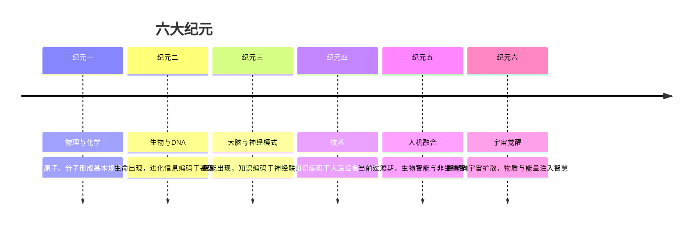

# 奇点临近

《奇点临近》（*The Singularity Is Near: When Humans Transcend Biology*）由发明家、未来学家雷·库兹韦尔（Ray Kurzweil）于2005年出版。比尔·盖茨称其为"预测人工智能未来最权威的人"之一。全书约700页，围绕一个核心命题展开：信息技术的指数级增长将在21世纪中叶引发一次历史性的转折点——奇点，届时非生物智能将超越人类生物智能，人类与技术的边界将消融。

## 加速回归定律

库兹韦尔将书中的核心洞见命名为"加速回归定律"（Law of Accelerating Returns）。其要点是：进化过程——无论生物进化还是技术进化——本身也在加速。每一次范式创新都为下一次更快的范式创新提供了工具。

摩尔定律（集成电路晶体管数量每两年翻倍）是这一规律的一个局部表现。库兹韦尔展示的数据跨度更长：从1900年代的机电计算机，经过电子管、晶体管、集成电路，直至今日的3D纳米电路，每一次范式切换都在原范式接近极限时无缝接续，保持了整体指数曲线的平滑延续。同样的指数增长规律出现在DNA测序成本、网络带宽、信息存储价格等多个维度。

指数增长的反直觉性是全书的出发点。人类直觉适应的是线性变化，因此系统性低估加速进程。"如果32步线性迈出，你移动了32步；如果32步指数翻倍，你走了43亿步。"

## 六大纪元

库兹韦尔将宇宙和地球的演化划分为六个纪元，每个纪元的"信息"载体不同，演化速度逐纪元加快。

第六纪元是库兹韦尔叙述的终极图景：宇宙中大部分物质和能量被组织为计算基质，整个可观测宇宙成为一个"有意识的"信息处理系统。

## GNR 三大革命

书名中的"奇点"由三项技术革命叠加驱动，库兹韦尔称其为GNR：

**遗传技术（Genetics）** ：生物学正在变成信息科学。基因组测序成本遵循指数下降曲线，RNA干扰、基因疗法、蛋白质折叠模拟正在将"软件重写生物"的能力付诸实现。库兹韦尔预测在2020年代，大多数传染病将被消灭，癌症死亡率降低90%。

**纳米技术（Nanotechnology）** ：以埃里克·德雷克斯勒的分子汇编理论为基础，纳米机器人可在血管中循行，修复细胞损伤、清除血栓、向神经元传递信号。这是"人体2.0"的核心基础设施——骨骼、血液、消化系统逐渐被更高效的非生物子系统替代。

**机器人/强AI（Robotics/AI）** ：这是三者中影响最深远的。库兹韦尔估算人类大脑的计算能力约为10¹⁶ cps（每秒计算次数），以当时算力增长曲线推算，1000美元的计算机将在2020年代达到这一水平，2049年将达到全人类大脑计算总量（10²⁶ cps）。

## 脑逆向工程与时间线

大脑逆向工程是AI实现人类智能水平的具体路径：通过逐渐提高的脑扫描分辨率（fMRI已每隔数年提升一倍），对每个大脑区域建立数学模型并以软件模拟。

库兹韦尔给出的时间线：
- **2029年** ：计算机通过图灵测试（即非生物实体能够以语言行为骗过人类评判者）
- **2030年代** ：脑上传技术可行，意识的非生物"镜像"成为可能
- **2045年** ：非生物智能全面超越生物智能，奇点到来
- **2099年** ：地球文明向宇宙扩散，可观测宇宙的物质能量开始被组织为智能计算基质

## GNR 的威胁与防御

第8章是全书最谨慎的部分。GNR技术既带来极大收益，也带来前所未有的风险：基因工程可能制造高传染性病原体，纳米技术失控可能触发"灰雾"（grey goo，自我复制纳米机器人消耗全部物质），强AI可能目标偏离人类价值观。

库兹韦尔明确拒绝比尔·乔伊（Sun公司联合创始人）在《Why the Future Doesn't Need Us》中提出的"主动放弃"策略，认为禁止某项技术只会将其发展权让渡给监管意愿最弱的行为者。他的替代方案是：防御性技术比攻击性技术更容易扩散，应将资源集中于开发免疫系统式的防御机制，而非封锁知识本身。

## 对批评者的回应

第9章逐一回应超过10类批评：

- **马尔萨斯批评** （资源枯竭）：可逆逻辑门极大降低计算能耗；2030年仅需捕获0.3‰太阳能即可驱动所有计算。
- **软件滞后批评** ：软件在能力和性价比上同样呈指数发展；语音识别从1985年5000美元/100词汇到2000年50美元/10万词汇。
- **塞尔的中文房间** ：该论证是循环论证，首先预设了结论；人类的理解力也分散于神经元联结之中，单个神经元并不"理解"什么。
- **意识客观化批评** ：意识问题的"难题"（查莫斯）无法通过第三人称实验解决；但库兹韦尔认为，当非生物系统拥有完整的情感表达和行为细节时，人类将自然倾向于承认其意识。

## 局限性

全书乐观倾向明显，部分批评者认为：①对"软件复杂性壁垒"的处理过于轻描淡写；②时间线依赖外推，局部突破的时间点难以用总体指数曲线预测；③意识问题被功能主义简化，跳过了主观体验（qualia）的哲学困境；④对贫富不均的应对（"技术终将普惠"）过于乐观。

库兹韦尔本人的预测记录混杂——部分硬件发展预测相当精准，AI能力时间线整体偏乐观但误差幅度正在收窄。

## 延伸阅读

- [[必然]]（凯文·凯利，2016）：从类似的技术加速视角出发，讨论不可避免的12个技术趋势，风格更具叙事性
- [[创新者的窘境]]（克里斯滕森，1997）：技术S曲线与范式跃迁的产业分析版本

## Backlinks

- [[必然]]
- [[创新者的窘境]]
