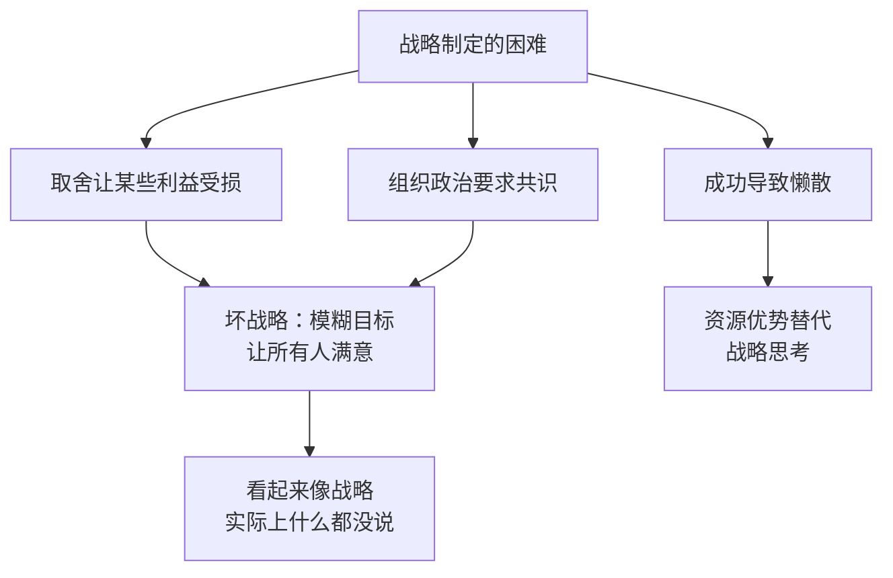
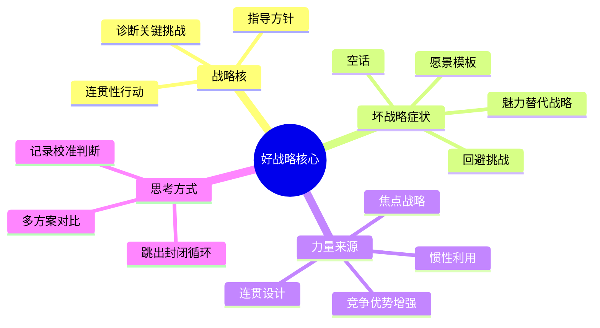

# 好战略坏战略

理查德·鲁梅尔特（Richard Rumelt），美国加州大学洛杉矶分校安德森商学院战略学教授，麦肯锡战略学奠基人之一。本书2011年出版，是迄今最清醒的战略学批判：它不教你制定战略，而是先摧毁你对战略的所有误解。

全书分三部分：第一部分剖析好战略与坏战略的区别；第二部分分析战略力量的来源；第三部分讨论如何像战略家一样思考。

---

## 好战略的结构：战略核

好战略有且只有一个结构，鲁梅尔特称之为"战略核"（the Kernel），包含三个必备要素：

**诊断（Diagnosis）**：识别当前形势中哪一个关键挑战真正限制了发展。不是描述现状，而是找出"这里的难题究竟是什么"。好的诊断通常能将复杂局面简化为一个核心问题。

**指导方针（Guiding Policy）**：针对诊断出的挑战，确定整体应对方向。这一方针必须排除某些选择，对某些方向说"不"。没有排除的战略不是战略。

**连贯性行动（Coherent Actions）**：一组相互协调、共同指向指导方针的具体行动。各行动之间必须相互支撑，而非各自为政。

"好战略不是一大串目标，而是一个内部相互协调的整体。"

### 特拉法尔加海战案例

1805年，纳尔逊率英国舰队对阵法西联合舰队，己方33艘对阵40艘，处于劣势。纳尔逊的战略：将舰队分成两列纵队，垂直切入敌方阵线腰部，集中摧毁中段和后段，让前段来不及回援。结果英方零损失击毁或俘获对方22艘战舰，彻底消灭拿破仑的制海权。

诊断：敌方数量优势，正面对阵必败。  
指导方针：集中力量于关键着力点，以局部优势弥补整体劣势。  
行动：两列纵队斜插，切割敌阵，逐段歼灭。

---

## 坏战略的四个症状

坏战略并非战略缺失，而是一种主动制造的幻觉。

**1. 空话（Fluff）**  
用浮夸语言包装显而易见的内容。"我们致力于成为以客户为中心的行业领导者"不是战略，是废话。

**2. 回避挑战（Failure to Face Challenge）**  
DEC公司1988年战略研讨会：高管们在三种战略方向之间陷入"孔多塞悖论"：任意两人联盟都不稳定，无法达成多数共识。CEO要求必须达成共识，最终"战略"是：致力于提供高质量产品和服务，成为数据处理行业领军企业。这是政治压力的产物，五年后公司被收购。

**3. 愿景模板（Wrong Goals）**  
愿景/使命/价值观三件套已成为规避真正战略工作的工业流水线。安然公司的愿景是"成为世界主流能源公司"，所有人都同意，内容全无。普遍认可往往意味着抉择缺失。

**4. 魅力领导替代战略**  
1212年儿童十字军：两位少年领袖号召数千儿童前往耶路撒冷，结果一批溺死，一批被卖为奴隶。魅力和愿景能调动人，但无法替代对障碍和行动方式的认真思考。甘地有魅力，但同时有周密的组织策略：示威路线、媒体曝光、监狱中的组织建设。

---

## 为什么坏战略普遍存在

**取舍的痛苦**  
战略的本质是在资源有限时做出选择，选择意味着放弃，放弃意味着有人的利益受损。英特尔1985年 DRAM 转型：格鲁夫用了一年多才完成，阻力来自研究人员的认同感、销售团队的客户关系，以及整个公司对"存储器公司"身份的情感依附。格鲁夫的解法：

> "如果我们被迫出局，董事会新请来的CEO会怎么做？他会带领我们摆脱DRAM业务。我们现在为何不主动点儿呢？"

这个思想实验通过引入外部视角，绕开了内部情感障碍，直接触达战略真相。（关于英特尔转型的更多细节见 [[格鲁夫给经理人的第一课]]）

**组织政治**  
要求"必须达成共识"的CEO实际上放弃了战略权力，把战略决策变成政治妥协。在等权力结构中，无法通过共识机制产生有实质内容的战略。

---

## 战略力量的来源

### 焦点战略：不止是聚焦于某个市场

皇冠瓶盖公司（Crown Cork & Seal）是理解焦点战略的最佳案例。公司连续35年股东年收益率19%，而行业平均同期为亏损边缘。

表面上的解释：专注于气雾剂和软饮料容器（不便携带的产品）。但这个解释不对，皇冠公司的单位成本实际上**高于**竞争对手。

真正的逻辑：**专注于短周期生产**。

皇冠公司的每个工厂有多个客户（而不是被一个大客户绑定），保持额外产线随时待命，提供快速响应和技术援助。其客户是：规模较小的罐装商、季节性产品生产者、新产品测试者、需要紧急订单的厂商，即所有需要短周期、小批量、快速交付的客户。

这种定位带来两个结果：一是定价高于行业平均40-50%（因为价值高），二是完全规避了被大型客户要挟的风险（大客户通常绑死一个供应商压价）。竞争对手无法复制，因为它们已经建立了大规模标准化生产的整个体系。

**焦点的真正含义有两层**：
1. 各方针内部相互协调，通过叠加效应创造额外价值
2. 将这种力量应用于正确的目标

1989年，康奈利退休，继任者埃弗里立即开始并购扩张。4年内完成20项并购，成为世界最大容器制造商。结果：
- 康奈利时代（1980-1989）：年收入增长只有3.1%，但股东年收益率18.5%
- 埃弗里时代（1990-2006）：成为全球第一，但股东年收益率只有2.4%

原因：埃弗里把皇冠公司的优势理解为"规模"，实际上优势来自**协调一致的短周期运营体系**。并购带来的大规模标准化业务彻底摧毁了这个体系。

### 连贯设计：帕卡卡车的整体协调

帕卡卡车（PACCAR，旗下品牌 Kenworth、Peterbilt）在高度竞争的重型卡车行业，过去20年净资产收益率16%（行业均值12%），自1939年至今从未亏损。

其战略不在于任何单一要素，而在于所有要素的协调：
- 只做重型卡车，不做轻型卡车
- 只做高端，不做经济型
- 以卡车司机（非车队管理者）为核心影响者，按订单定制
- 培养长期经销商网络和工程师积累

这些行为相互支撑。任何一家想要竞争的公司必须同时复制品牌积累、工程师知识、经销商网络，这需要几十年时间。

### 不要与大猩猩摔跤

一家开发出自适应温度微孔材料的新公司，希望进入服装市场。风投苏珊的建议："你在1500米比赛夺金，有望在10000米夺金，但你现在想放弃赛跑去和大猩猩摔跤——这是个坏主意。"

优势的发挥必须在己方有优势的地方。美国在阿富汗战争中的失策，就是在一个需要耐心、对人员伤亡和附带损害不敏感者更有优势的战场上作战，塔利班比美国更有耐心，而且永远知道美国终将撤走。

### 竞争优势 ≠ 财务收益：造银机器

鲁梅尔特与同事提出的思想实验：一台外星人留下的机器，每年零成本制造价值1000万美元的白银，无需任何能源或劳动力。以10%利率计算，这台机器值1亿美元。

购买这台机器的买家在白银市场上拥有竞争优势。但这个优势并没有让买家变更富：买家花了1亿美元买到的是年收益1000万，投资回报率恰好10%。竞争优势被定价到了购买成本里。

这说明：**拥有竞争优势不等于创造财务回报**。只有当竞争优势增强，或者市场对其背后资源的需求增加时，财富才会增加。

### 有趣的优势 vs. 无趣的优势

农产品企业家斯图尔特·雷斯尼克的框架："有趣的优势"是指你有办法主动提高其价值的优势。

造银机器的优势不有趣：无法提高生产效率，白银无法差异化，无力影响全球银价。eBay的优势也停止增长多年，尽管它在个人网络拍卖领域仍是绝对垄断者，市场价值却连续7年不增长。

斯图尔特的坚果业务则不同：通过大规模种植掌握话语权，投资研究提高坚果的健康认知，刺激市场需求增长，而这增长的主要受益者是最大的种植者。POM奇迹石榴汁也是同样逻辑：资助石榴功效研究→建立健康认知→打造品牌→成为主导生产者→需求增长全部转化为自己的收益。

### 4种提升竞争优势价值的方法

1. **深化竞争优势**：降低成本或提高买方获得的价值（如吉尔布雷思通过重新设计砌砖工艺，将效率提高一倍）
2. **拓展竞争优势**：将优势应用到新的领域（杜邦从火药→赛璐珞→氟聚合物→特氟龙→尼龙，技术积累不断拓展）
3. **推动需求增长**：让竞争优势背后的稀缺资源市场更大
4. **强化阻隔机制**：防止竞争对手复制（专利、品牌、网络效应、移动目标）

### 利用对手的惯性

成功的战略往往利用竞争对手的惯性。三种惯性类型：

**工作日程惯性**：大陆航空在航空业管制放松后，继续使用波音提供的"机队规划师"软件，这个软件的定价逻辑是"成本加利润"，完全忽略市场竞争，是管制时代为和政府谈判而开发的工具。管制放松两年后，大陆航空高管仍然相信长途航线票价会涨。1981年损失2.4亿美元，CEO在办公桌前举枪自尽。

**文化惯性**：AT&T 贝尔实验室是基础科研殿堂，但开发消费产品的能力极弱。1983年测试视讯系统，连测试市场所需的软件都无法交付，由分包公司完成。这不是个人能力问题，而是数十年文化定型。鲁梅尔特为AT&T拟定的市场战略全部落空。

**熵**：即便战略正确，管理松弛也会使组织逐渐失去焦点。领导者必须持续维护组织的目的和方法。

---

## 像战略家一样思考

### 避免第一直觉陷阱

在高管 TiVo 战略研讨中，几乎所有学员都抓住第一个跃入脑海的方案不再探索。这是认知规律：第一个答案给人方向感，质疑它需要放弃这种安慰。好的战略思维要求有意识地产生多个方案，再进行对比权衡。

### 跳出封闭循环

借用哥德尔不完全定理：当分析系统封闭于自身时，某些关键问题在系统内部不可判定。1999年光纤泡沫：分析师用股市行情证明光纤业务可行，股价被分析师报告推高，雷曼兄弟看到产能过剩，随即写道"市场相信增长"，用股价否定了自己的产业分析。跳出封闭循环需要系统外的数据：产业结构（波特五力）、历史先例、其他国家经验。

2008年金融危机的五种失误：过度设计、顺境谬论（没有崩溃≠不会崩溃）、偏好风险的激励结构、从众心理、内在视角（相信自己的情况是特殊的）。伯南克2004年庆祝"大稳健"时，低利率和宽松信贷已在积累下一次危机。

### 战略思维三项能力

1. **多种工具**：拥有克服目光短浅的思维工具，而非只依赖单一框架
2. **自我怀疑**：勇于对自己的第一判断提出质疑
3. **记录判断**：记录每次预测和判断，事后对照现实，提升判断力的校准精度

---

## 本书最反直觉的观点

**好战略稀少是因为难以制定，不是因为难以执行**。大多数"战略"失败发生在制定阶段：没有做出真正的取舍，就没有真正的战略。

**真正的焦点战略逻辑往往不在公开声明里**。皇冠公司官方说法是"专注气雾剂和软饮料容器"，实际逻辑是"专注短周期生产以保持议价权"，两者完全不同，后者才是竞争力来源。

**竞争优势不等于财务回报**。造银机器的寓言：优势的价值可以在购买成本里被完全定价。有价值的优势必须是你能主动增长其价值的，即"有趣的"优势。

**成功企业不是学习战略的好对象**。成熟企业大多依靠历史积累的资源惯性获利，其战略已经空洞化。新兴企业在资源有限时不得不依靠真正协调的战略竞争，才是学习战略的最佳案例库。

---

## 延伸阅读

- [[格鲁夫给经理人的第一课]]：英特尔DRAM转型的第一视角，以及中层管理者如何在大组织中执行战略
- [[赢]]：韦尔奇版本的战略执行，涵盖人才梯队、坦诚文化、简单的三步战略，与鲁梅尔特形成有益对照
- [[战略思维]]：综合鲁梅尔特、格鲁夫、韦尔奇三本经典的战略框架提炼
- [[价值投资]]：段永平的护城河思维，本质上是对竞争优势"阻隔机制"的长期押注
