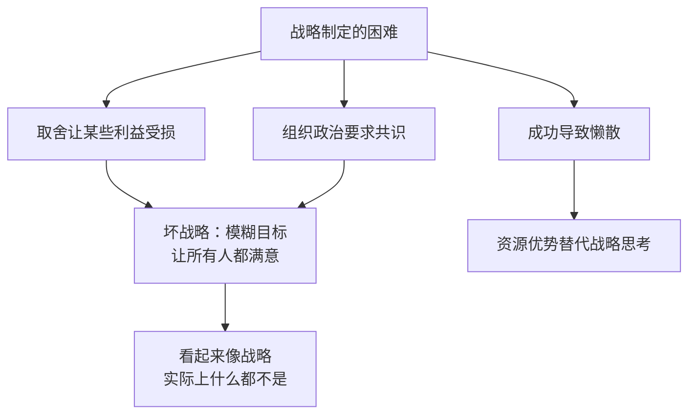
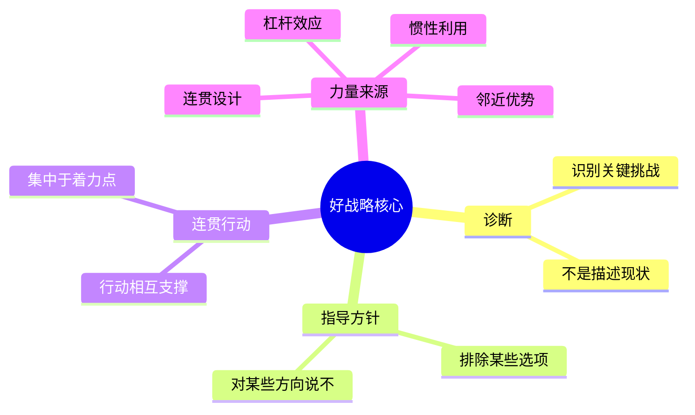

# 好战略坏战略

理查德·鲁梅尔特（Richard Rumelt）于2011年出版，美国加州大学洛杉矶分校商学院战略学教授。本书是迄今最清醒的战略学批判——它不教你制定战略，而是先摧毁你对战略的所有误解。

全书分三部分：好战略的本质、战略力量的来源、像战略家一样思考。

---

## 什么是好战略

好战略有且只有一个结构，鲁梅尔特称之为"战略核"（the Kernel）：

**诊断（Diagnosis）**：识别当前形势中哪一个关键挑战真正限制了发展。不是描述现状，而是找出"这里的难题究竟是什么"。

**指导方针（Guiding Policy）**：针对诊断出的挑战，确定整体应对方向。这一方针必须排除某些选择，对某些方向说"不"。

**连贯性行动（Coherent Actions）**：一组相互协调、共同指向指导方针的具体行动。各行动之间必须相互支撑，而非各自为政。

"好战略不是一大串目标，而是一个内部相互协调的整体——诊断揭示挑战，指导方针确定方向，行动落地执行。"

### 特拉法尔加海战

1805年，纳尔逊率英国舰队对阵法西联合舰队，己方33艘对阵40艘，处于劣势。纳尔逊的战略不是寻求均衡接触，而是将舰队分成两列纵队，垂直切入敌方阵线腰部，集中摧毁中段和后段，让前段来不及回援。结果英方零损失击毁或俘获对方22艘战舰，彻底消灭拿破仑的制海权。

诊断：敌方数量优势，正面对阵必败。  
指导方针：集中力量于关键着力点，以局部优势弥补整体劣势。  
行动：两列纵队斜插，切割敌阵，逐段歼灭。

---

## 坏战略的四个症状

鲁梅尔特指出，坏战略并非战略缺失，而是一种主动制造的幻觉。其四个特征：

**1. 空话（Fluff）**  
用浮夸的语言包装显而易见的内容。"我们致力于成为以客户为中心的行业领导者"——这不是战略，是废话。

**2. 回避挑战（Failure to Face Challenge）**  
DEC 公司1988年战略研讨会：高管们在三种战略方向（保守路线、芯片战略、解决方案战略）之间形成了"孔多塞悖论"——任意两人联盟都不稳定，无法达成多数共识。CEO 要求必须达成共识，最终得到的"战略"是：DEC致力于提供高质量的产品和服务，成为数据处理行业的领军企业。这是政治压力的产物，不是战略。五年后公司被收购。

**3. 错误目标（Wrong Goals）**  
愿景/使命/价值观模板已成为规避真正战略工作的工业流水线。陶氏化学的"战略"是"优先投资于技术密集型业务"，安然公司的愿景是"成为世界主流能源公司"——所有人都同意，所以这些内容毫无价值。普遍认可往往意味着抉择缺失。

**4. 魅力领导替代战略（Bad Objectives）**  
1212年儿童十字军：两位充满魅力的少年领袖号召数千儿童前往耶路撒冷，结果一批溺死、一批被卖为奴隶，一批死于途中。魅力和愿景能调动人，但无法替代对障碍和行动方式的认真思考。甘地也有魅力，但他同时有周密的组织策略——示威路线、媒体曝光、监狱中的组织建设。

---

## 为什么坏战略普遍存在

**取舍的痛苦**  
战略的本质是在资源有限时做出选择，选择意味着放弃。放弃意味着有人的利益受损。在一个成熟的组织里，任何有实质意义的战略转变几乎都会遭到某些群体的反对。

英特尔1985年 DRAM 转型：公司在存储器上深耕多年，转型就意味着否定大量研究人员的工作、否定销售团队的客户关系。格鲁夫用了一年多才完成转型，阻力不亚于外部竞争。"如果我们被迫出局，董事会新请来的 CEO 会怎么做？他会带领我们摆脱 DRAM 业务。"——格鲁夫用这个思想实验打破了组织内部的情感障碍。

**组织政治**  
要求"必须达成共识"的 CEO 实际上是在放弃战略权力，把战略决策变成政治妥协。DEC公司的孔多塞悖论表明：在一个等权力结构中，通过投票或共识机制无法产生有实质内容的战略。好战略需要有人真正拥有权力说"不"。

---

## 战略力量的来源

### 杠杆效应

好战略不是均衡分配资源，而是找到着力点（pivot points），将有限资源集中于此，产生不成比例的效果。特拉法尔加、英特尔转型、苹果1997年回归——都是集中力量于关键点，而非全面推进。

### 连贯设计

帕卡卡车（PACCAR）案例：在高度竞争的重型卡车行业，帕卡过去20年净资产收益率16%，远超行业均值12%，且从1939年至今从未亏损。帕卡的战略不神秘，但内部高度协调：

- 只做重型卡车，不做轻型卡车
- 只做高端，不做经济型
- 以卡车司机（而非车队管理者）为主要用户影响者
- 按订单生产，每辆定制，用普通零部件降低维修成本
- 培养长期经销商网络和工程师团队

这些行为相互支撑。如果只抽取其中一条，价值不大。组合在一起，就构成竞争对手难以复制的整体。施乐拥有专利技术，无需协调战略即可获利，但专利过期后，在纸张处理技术上落后于佳能，即是依赖资源而忽视设计型战略的代价。

### 邻近优势与规模

从现有优势出发，向相邻市场延伸。新兴企业打败成熟企业，几乎每次都是通过紧密协调的设计型战略，而非靠资源碾压：微软打败 IBM，沃尔玛打败凯马特，戴尔从惠普、康柏抢份额，网飞打败百视达。成熟企业的优势会因惯性而退化。

### 利用对手的惯性与熵

惯性是企业不愿或无力适应变化的属性。三种类型：

**工作日程惯性**：大陆航空在航空管制放松后继续使用波音公司的"机队规划师"软件预测票价——而这个软件的逻辑是按成本加利润计算"应该"收多少钱，完全忽略市场竞争。这是管制时代的遗产，但公司仍将其当作预测工具。管制放松两年后，大陆航空的高管仍然相信长途航线票价会涨。结果1981年损失2.4亿美元，CEO 在办公桌前举枪自尽。

**文化惯性**：AT&T 贝尔实验室是基础科研的殿堂，但开发消费产品的能力极弱。1983年测试视讯系统时，连测试市场所需的软件都无法交付，最终由分包公司完成。这不是个人能力问题，而是数十年文化定型的结果。鲁梅尔特为 AT&T 拟定的市场战略全部落空，因为执行层的能力和文化无法支撑。

**熵**：即便战略正确，管理松弛也会导致组织逐渐失去焦点。领导者必须持续维护组织的目的和方法。

---

## 像战略家一样思考

### 警惕第一直觉

鲁梅尔特在高管培训中观察到：面对复杂的 TiVo 战略问题，几乎所有学员都抓住第一个跃入脑海的方案，不再探索其他可能性。这不是能力问题，而是认知规律：面对不确定性，第一个答案能给人方向感，而质疑自己的第一直觉需要放弃这种安慰感，重新进入混沌。好的战略思维要求有意识地产生多个方案，然后对比权衡。

### 避免封闭循环

鲁梅尔特借用哥德尔不完全定理的逻辑：当分析系统封闭于自身时，某些关键问题在系统内部不可判定。1999年光纤泡沫：分析师用股市行情证明光纤业务可行，而股价又被分析师的报告推高。雷曼兄弟的分析师看到产能过剩，但随即写道"市场相信增长"，用股价否定了自己的产业分析。跳出封闭循环，就需要用系统外的数据：产业结构分析（波特五力）、历史先例、其他国家的经验。

2008年金融危机中的五种失误：过度设计、顺境谬论（没有崩溃≠不会崩溃）、偏好风险的激励结构、从众心理、内在视角（相信自己的情况是特殊的）。美联储主席伯南克在2004年庆祝"大稳健"，而此时低利率和宽松信贷正在积累下一次危机。

### 战略思维三项能力

鲁梅尔特总结战略家必须养成的习惯：

1. **多种工具**：拥有克服目光短浅的思维工具，而非只依赖单一框架。
2. **自我怀疑**：勇于对自己的第一判断提出质疑。如果推理经不起自我审视，面对真正的竞争更撑不住。
3. **记录判断**：记录下每次预测和判断，事后对照现实，提升判断力的校准精度。

---

## 本书最反直觉的观点

1. **好战略稀少是因为难以制定，不是因为难以执行**。大多数"战略"失败发生在制定阶段：没有做出真正的取舍，就没有真正的战略。

2. **愿景+使命+价值观≠战略**。这套模板恰好帮助组织回避了真正困难的工作——诊断挑战、做出取舍。

3. **普遍认可通常意味着内容为空**。真正有价值的战略会得罪某些利益群体。如果所有人都满意，那这个战略大概什么都没说。

4. **研究新兴企业，不要研究成熟企业**。成功的成熟企业大多在依靠历史积累的资源惯性获利，其"战略"已经空洞化。新兴企业在资源有限时，不得不依靠真正协调的战略去竞争，才是学习战略的最佳案例库。

---

## 延伸阅读

- [[格鲁夫给经理人的第一课]]：英特尔 DRAM 转型的第一视角叙述
- [[赢]]：韦尔奇版战略=使命×价值观×行动，与鲁梅尔特形成有益对照
- [[价值投资]]：段永平的护城河思维与"战略资源"概念的交集
