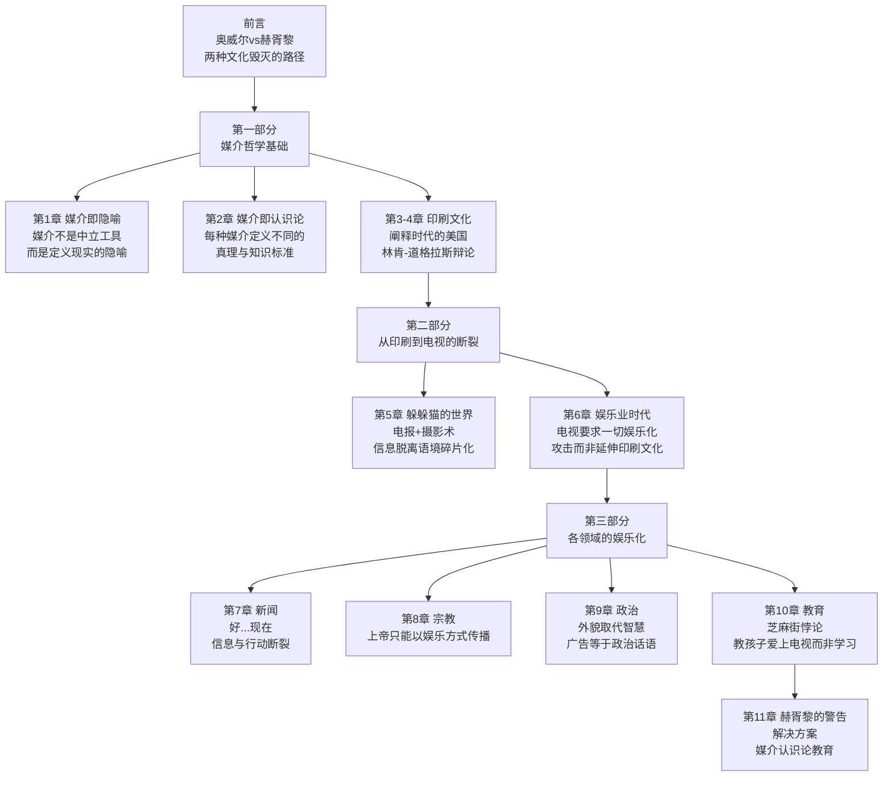
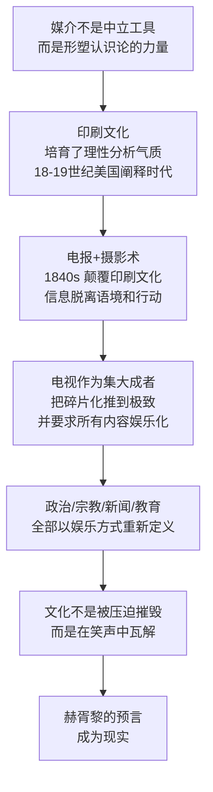

# 娱乐至死

> 作者：尼尔·波兹曼（Neil Postman）｜1985年出版｜中信出版集团 2015 中译版

---

## 一句话主旨

每种媒介都以隐蔽的方式定义"真理"的标准；电视将娱乐设为唯一允许的话语形式，使政治、宗教、新闻、教育全部沦为表演——我们不是被压迫致死，而是被娱乐致死。

---

## 全书骨架

---

## 核心问题

**为什么电视时代的人们更愿意被娱乐，而不是被教育？这种转变对民主文化意味着什么？**

---

## 奥威尔vs赫胥黎：两种预言

波兹曼认为，大多数人只记得奥威尔的警告（《1984》），却忘记了更危险的赫胥黎预言（《美丽新世界》）：

| | 奥威尔（《1984》）| 赫胥黎（《美丽新世界》）|
|--|-----------------|----------------------|
| 威胁来源 | 外来压迫 | 自我放纵 |
| 被什么控制 | 痛苦 | 享乐 |
| 真理的命运 | 被隐瞒 | 被淹没在娱乐中 |
| 文化的命运 | 受制文化 | 充满感官刺激的庸俗文化 |

> 「奥威尔担心我们憎恨的东西会毁掉我们，而赫胥黎担心的是，我们将毁于我们热爱的东西。」

---

## 五个核心概念

### 1. 媒介即隐喻

媒介不是中立的信息传递工具，而是以隐蔽但强大的方式"定义现实"的隐喻系统。

**案例对比：**
- 用烟雾信号无法表达哲学论证（形式排除了内容）
- 电视时代，体重300磅的塔夫脱总统不可能被选上（外貌定义了政治能力）
- 摩西"十诫"第二诫禁止制作偶像——波兹曼解读为：以色列神是抽象文字之神，图像会引入另一种认识论

### 2. 媒介即认识论

不同媒介定义了不同的**"真理"标准**——什么算作事实，什么算作论证，什么算作智慧。

- **印刷文化**：真理=命题性陈述，可被逻辑质疑和反驳
- **电视文化**：真理=令人信服的视觉呈现，"好看"等于"可信"

波兹曼的核心主张：当一种文化用电视作为主要话语媒介，它就接受了电视对真理的定义——娱乐性是评判一切的标准。

### 3. 阐释时代 vs 娱乐业时代

**阐释时代**（18-19世纪美国）：印刷术培育了崇尚逻辑、论证和严肃公众话语的文化气质。

经典案例——林肯-道格拉斯辩论（1858）：
- 7小时辩论，听众自带干粮
- 复杂的修辞、法律文本引用、微妙的逻辑区分
- 听众被要求像读者一样用理性而非情感参与

**娱乐业时代**（20世纪后期）：电视时代要求所有公众话语都以娱乐形式出现，包括新闻、政治、教育和宗教。

### 4. 电报+摄影术的认识论革命

19世纪中叶，两项技术共同瓦解了印刷文化：

**电报（1840s）的三重破坏：**
- 使信息脱离语境合法化——信息价值取决于新奇性而非用处
- 打破了"信息—行动比"——人们面对无数无法指导任何行动的信息
- 引入"伪语境"——纵横字谜、问答节目为无用信息提供表面用途

**摄影术的破坏：**
- 照片只能表现特例，无法表达概念和命题
- 照片本身无法被质疑为真假（"真实照片"就是不容置疑的事实）
- 照片和电报共同制造碎片化的"躲躲猫世界"

梭罗早在《瓦尔登湖》中就预见：电报建起缅因州到德克萨斯州的线路，但两地可能没有任何值得交流的东西。

### 5. "好……现在"：碎片化话语的象征

电视新闻的口头禅"好……现在"是波兹曼对现代话语的核心批判：这个连词的作用是**切断**而不是连接，告诉观众前一条新闻和下一条没有任何关系，所有内容都可以在45秒后抛诸脑后。

> 「再残忍的谋杀，再具破坏力的地震，再严重的政治错误，只要新闻播音员说一声"好……现在"，一切就可以马上从我们的脑海中消失。」

---

## 电视对四个领域的改造

### 新闻

电视新闻本质是"假信息"（disinformation）——不是因为内容虚假，而是因为：
- 用娱乐包装让严肃内容失去重量
- 22分钟覆盖"整个世界"的荒谬比例
- 播音员的外貌比报道质量更重要（克里斯蒂娜·克拉夫特因"太老、太丑、对男性不够尊重"被解雇）

### 宗教

电视宗教要求传教士成为表演者。上帝和娱乐的矛盾在于：宗教需要连续性、深思熟虑和超时间的专注，而电视需要即时性、娱乐和流动感。结果是"宗教内容变成了娱乐的附庸"，而不是相反。

### 政治

> 「理查德·尼克松曾把他的一次竞选失败归罪于化妆师的蓄意破坏。」

- 政治家的外貌取代智识成为核心竞争力
- 30秒广告等同于政治哲学陈述
- 总统候选人的体重已成为实质性政治问题

### 教育

《芝麻街》的悖论：这个节目有效地教会了孩子字母和数字，但同时教会了他们"学习应该是有趣的"和"娱乐是获取知识的首选方式"——这两个预设与任何严肃教育体系都是对立的。

---

## 论证链

---

## 重要原文引用

> 「奥威尔害怕的是那些剥夺我们信息的人，赫胥黎担心的是人们在汪洋如海的信息中日益变得被动和自私。」

> 「烟雾信号无法表现哲学，它的形式已经排除了它的内容。」

> 「一个自认为可以在22分钟内评价整个世界的文化还会有生存的能力？除非，新闻的价值取决于它能带来多少笑声。」

> 「人们感到痛苦的不是他们用笑声代替了思考，而是他们不知道自己为什么笑以及为什么不再思考。」

---

## 批判性评估

**论证有力之处：**
- "媒介即认识论"框架超越了内容批评，直击媒介结构本身
- 对林肯-道格拉斯辩论的详细分析令人信服地展示了话语质量的历史断裂
- 对电视的分析在今天仍然适用，而且在短视频时代更加准确

**可质疑之处：**
- 对印刷文化的理想化：18-19世纪美国同样充斥低俗小报和煽情新闻（《纽约太阳报》《纽约先驱报》）
- 论证悲观：没有充分讨论印刷文化在电视时代的韧性（书籍销量并未崩溃）
- 解决方案（媒介认识论教育）过于简单，波兹曼自己也承认"无法超越赫胥黎的智慧"

**今日视角：**
- 书写于1985年，针对电视时代；但互联网和短视频让波兹曼的诊断更为精准
- 社交媒体把"伪语境"、"信息—行动比失衡"和"躲躲猫世界"推到了比电视时代更极端的程度
- 算法推荐系统等于一个全自动的"好……现在"生成器

---

## 与知识库其他文章的对话

| 问题 | 波兹曼 | 赫拉利（[[智人之上]]）|
|------|--------|-------------------|
| 媒介的本质 | 认识论定义者，非中立工具 | 联结的创造者，非真相呈现者 |
| 更多信息= | 不一定更好；取决于媒介的认识论 | 不一定更智慧；真相与秩序存在张力 |
| 最大威胁 | 娱乐化使公众无法理性思考 | AI成为能动成员，改变信息网络本质 |
| 时代 | 电视时代（1985） | AI时代（2024）|
| 相同洞见 | 媒介/技术不是工具，而是塑造力量 | 同上 |

→ 参见：[[媒介即认识论]]、[[信息联结论]]

---

## 思考问题

1. 波兹曼说"严肃的电视是自相矛盾的说法"——你同意吗？纪录片、TED演讲算是反例吗？
2. 短视频（抖音、Reels）相比电视，在"娱乐化认识论"方面是更严重还是有所不同？
3. 书中的"伪语境"——为了让无用信息派上用场而制造的包装——在今天最典型的形式是什么？
4. 如果波兹曼是对的，媒介教育是解决方案，那么这种教育应该教什么，让孩子"疏远某些信息形式"意味着什么？

---

## 关键术语

- **媒介即隐喻**：媒介以隐蔽方式定义和构建现实，而不是中立地传递信息
- **媒介即认识论**：每种媒介定义了不同的"真理"和"知识"的标准
- **阐释时代**：18-19世纪以印刷术为主导的美国，崇尚逻辑、论证和严肃话语
- **娱乐业时代**：以电视为主导，一切公众话语都必须以娱乐形式出现
- **伪语境**（pseudo-context）：为脱离语境的无用信息提供表面用途的包装（如游戏节目、纵横字谜）
- **信息—行动比**：信息获取与实际行动之间的比例关系；电报打破了这一平衡
- **"好……现在"**：电视新闻的话语象征，表示各信息之间完全无关联，均可立即遗忘
