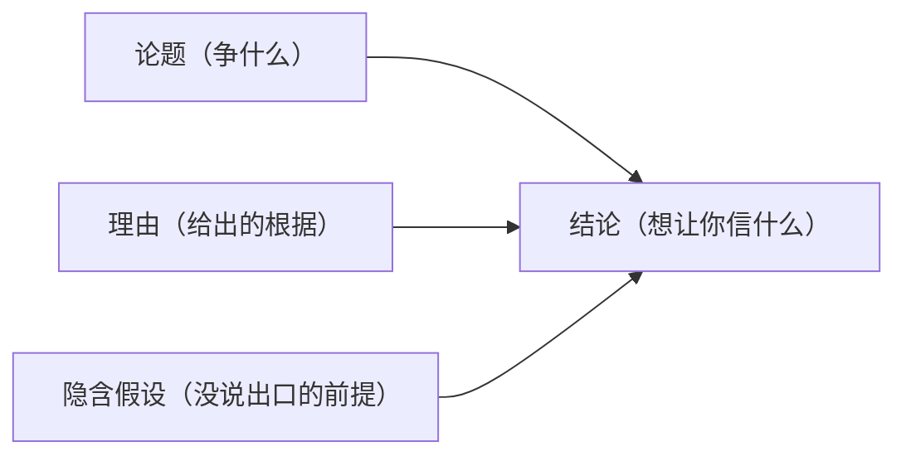
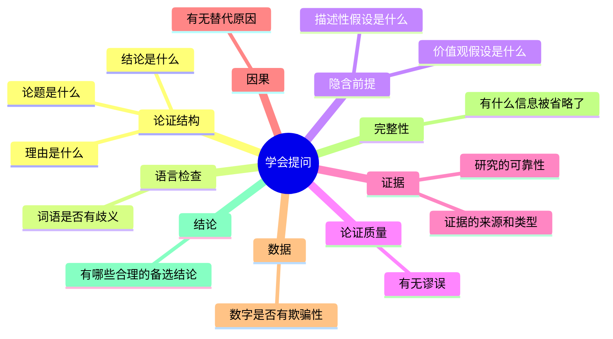

# 学会提问

《学会提问》（*Asking the Right Questions*）是美国学者尼尔·布朗（Neil Browne）和斯图尔特·霍尔（Stuart Keeley）合著的批判性思维入门教材，已出至第十一版，在美国高校广泛采用。中文版由北京联合出版公司出版，第十版译者为吴礼敬。

全书的核心论点只有一句话：**面对任何论证，你都可以用一组固定的关键问题来检验它**，而不必依靠直觉或权威。

---

## 海绵与淘金：两种阅读模式

书中用一个比喻来区分两种信息处理方式。

**海绵模式**：吸收一切，不加过滤。读到什么就信什么，信息越多越好，脑子里装满别人的结论。这种方式处理日常信息效率高，但遇到要做决策的时候会失效，因为脑子里的每一条信息都是别人替你消化过的，你只剩下一堆结论，没有判断的基础。

**淘金模式**：带着问题去筛。不是每句话都值得相信，也不是每个"理由"都真的支撑了"结论"。淘金者不怕遇到立场不同的论证，因为他有一套工具来评估它的价值。

布朗认为，学会提问的目的不是让人变得刻薄或挑剔，而是**让自己的同意或不同意变得有根据**。

---

## 论证的基本结构

在检验任何论证之前，先要把它拆开。布朗给出三个基础问题：

1. **论题是什么**（What is the issue）：这场讨论在争什么？是价值判断（应不应该）还是事实判断（是不是）？
2. **结论是什么**（What is the conclusion）：作者想让你相信什么？结论常常藏在"因此""所以""我们应该"这类指示词后面。
3. **理由是什么**（What are the reasons）：作者给出了哪些根据来支撑结论？

这三者组成最小的论证单元。找不到理由的结论只是断言；理由无法支撑结论的论证只是包装。

---

## 词语歧义：争论往往在定义上

第五章专门讲歧义，是全书最实用的章节之一。

很多争论看上去在争对错，实际上在用同一个词表达不同的意思。"教育质量下降了"，质量指什么？是毕业生的批判思维能力，还是考试过关率，还是博士导师的数量？不同的定义会导致完全不同的结论。

找到重要歧义的方法：
- 在论题、结论和理由里寻找**抽象词语**，越抽象越容易有多重含义
- 用**反串法**：如果你持相反立场，你会怎么定义这个词？
- 将不同含义代入论证，看看结论会不会变化

布朗还区分了词语的**外延意义**（描述性含义）和**内涵意义**（感情色彩）。政客使用"死亡税"而不是"遗产税"，使用"减税"而不是"免税"，是刻意选择了带有特定感情色彩的词汇来影响判断。

---

## 假设：论证里没说出口的黏合剂

这是全书理论密度最高的部分。

任何论证都有两层：说出来的理由，和没说出来的前提（假设）。没有这些前提，理由根本无法支撑结论。布朗把假设分为两种：

**价值观假设**：立论者默认某种价值比另一种价值更重要。例如"政府应该强制执行公共场所禁酒"这个论证，背后隐含的价值观假设是"集体安全比个人自由更重要"。如果你的价值排序相反，理由就无法说服你。

**描述性假设**：立论者默认某个事实为真，但未加证明。例如"加入联谊会有助于找工作"，隐含的描述性假设是"雇主会把联谊会经历看作正面信号"，这是一个未经验证的事实断言。

找到假设的方法：持续问"理由和结论之间的逻辑跳跃在哪里？要让这一步成立，还需要相信什么？"

---

## 论证谬误：常见的欺骗手段

第七章列出了多种谬误。布朗的处理方式是强调"自己问自己"而非死记硬背名称。以下是书中反复出现的几种：

| 谬误名称 | 核心问题 | 例子 |
|---------|---------|------|
| **人身攻击** | 攻击人而不是论证 | "他当然支持增税，他是左派" |
| **滑坡谬误** | 假设一步会导致无法阻止的连锁反应 | "禁止酒类广告，接下来就会禁糖果广告" |
| **诉诸公众** | 流行的就是对的 | "73%的人支持，所以应该这样做" |
| **诉诸可疑权威** | 引用无专业资质的权威 | "某协会支持这个立场" |
| **诉诸感情** | 用情绪反应代替论证 | 精心挑选情绪化词汇来绕过理性判断 |
| **虚假两难** | 把多种选择压缩成非此即彼 | "要么支持我，要么是反对者" |
| **追求完美解决方案** | 因为方案不完美就否定方案 | "这种药不能根治，所以没用" |
| **事后归因** | 因为乙在甲之后发生，就认为甲导致乙 | "找到幸运币之后考了高分，所以幸运币有效" |

---

## 证据评估：哪些信息值得相信

第八章和第九章专门处理"用什么来支撑断言"的问题。

布朗区分了几种常见的证据类型，并指出它们的局限：

**直觉**：私密性最大的问题，别人无法核实。经验丰富者的直觉有时依赖大量隐性信息，但无法解释的"第六感"不构成有效论证基础。

**个人经历**：容易犯以偏概全谬误（hasty generalization）。一次突出的经历不代表普遍规律，样本不具有代表性。

**典型案例**：生动具体，诉诸感情，因此极具说服力，但正因为如此危险。一个案例展示的是可能性，不是概率。

**当事人证言**：选择性（只展示最好的反馈）、个人利益（提供证言者可能有利益关联）、省略信息（没有足够背景来评估）是三个主要问题。

**专家意见**：比证言更可靠，但仍需追问：这个专家在相关领域有多深的专业积累？是否有利益冲突？其他领域专家是否同意？

评估证据的核心习惯："研究表明……"之后，要问**研究是怎么设计的、样本是谁、谁资助了这项研究**。

---

## 替代原因：相关性不等于因果性

第十章是统计思维的核心。

冰淇淋销量上升时犯罪率也上升，但这不是"吃冰淇淋导致犯罪"。背后的第三变量是夏天的气温。布朗用四种解释框架来拆解任何因果声明：

1. **甲导致乙**（论证者的原始解释）
2. **乙导致甲**（因果方向颠倒）
3. **第三变量丙同时导致甲和乙**（忽略常见原因谬误）
4. **甲和乙相互影响**（双向因果）

找替代原因是一种创造性过程。方法：问"如果这个解释不对，还有什么能解释这些数据？"；换不同的视角，社会学家、心理学家、经济学家对同一现象会优先考虑不同的原因。

> **相关性永远不能证明因果关系**，但大多数声称存在因果关系的证据只建立在相关性上。

---

## 数据欺骗：数字也会撒谎

第十一章拆解统计数字的常见欺骗手法：

**平均值的陷阱**：平均数、中位数、众数是三种不同的"平均"。美国国家橄榄球联盟球员2010年工资**平均数**是180万美元，但**中位数**只有77万美元，少数顶级球星拉高了平均数。当你想让数字显得高，选平均数；想让数字显得更"真实"，用中位数。

**用一件事的结论证明另一件事**：地铁盗窃中70%是电子设备，但这不能说明"乘地铁十有八九会被偷手机"。前者是偷窃结构，后者是被偷概率，两个完全不同的问题。

**省略关键信息**：
- 有绝对数字时，问百分比
- 有百分比时，问绝对数字和基数
- "大学生肥胖率上升4.8个百分点"，和哪个群体相比？

---

## 省略信息：每个论证都是不完整的

这是书中最具反思意义的章节。

布朗认为，论证者几乎总是把自己的立场放在最有利的光线下展示。他们有充分动机隐瞒不利的信息：研究失败的案例、药物的副作用、政策的成本、对立的专家意见。

找省略信息的方向：
- 反对方会给出什么理由？
- 有没有和这项研究结论相矛盾的研究？
- 被提倡的行动有哪些潜在的**负面效果**，特别是长期的？

> "不同的东西到底是什么样，主要取决于你坐在什么地方。"（电影《谍影重重3》）

---

## 合理结论：告别非黑即白

最后一章专门对抗"二分式思维"（dichotomous thinking）。

大多数重要问题不是"是/否"两选一，而是条件式的："如果……那么……"。给结论加上条件限制，不是在回避判断，而是在做更诚实的判断。

应对二分式思维的工具：
- 问"这个结论在什么时候、什么地方、为了什么目的才成立？"
- 把问题从"我们该不该做甲"重新表述为"我们该怎么处理乙问题"，前者逼迫二选一，后者打开了解决方案空间

---

## 十三个关键问题

---

## 费曼视角：用一句话说清楚

批判性思维的核心动作只有一个：**在你说"我同意"或"我不同意"之前，先问"凭什么"**。

凭什么接受这个结论？理由是否真的支撑了它？理由成立的前提是什么假设？这些假设我接受吗？支撑理由的证据可靠吗？还有没有别的解释？作者隐瞒了什么？

这七个问题，就是这本书的全部内容。

---

## 与其他方法的关系

- [[费曼学习法]] 强调"用简单语言解释"来检验是否真正理解；批判性思维则是在接受别人的解释之前先检验它的质量
- [[金字塔原理]] 教你如何**输出**结构清晰的论证；本书教你如何**输入**时识别论证的漏洞
- [[逻辑思维框架]] 提供思维工具；批判性思维提供使用这些工具时的自我保护机制
- [[好战略坏战略]] 中鲁梅尔特区分"真正的战略"和"披着战略外衣的目标清单"，本质上也是在用同样的问题框架：理由支撑结论了吗？
- [[必然]] 中凯文·凯利提出，在知识可被搜索、答案日趋廉价的时代，提出好问题比拥有答案更有价值；本书提供的批判性提问框架，正是培养这种能力的操作路径

---

## Timeline

| 年份 | 版本 |
|------|------|
| 1980 | 第一版出版 |
| 2015 | 第十一版出版 |
| 2015 | 中文第十版翻译出版（译者吴礼敬） |

## Backlinks

- [[费曼学习法]]
- [[逻辑思维框架]]
- [[好战略坏战略]]
- [[必然]]
