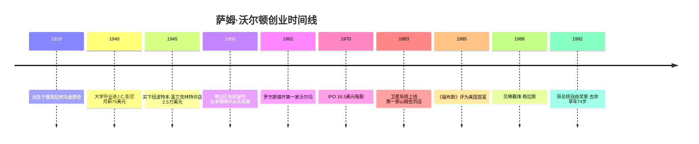
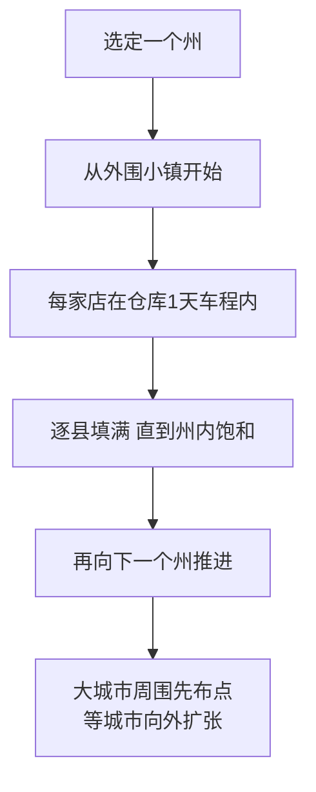
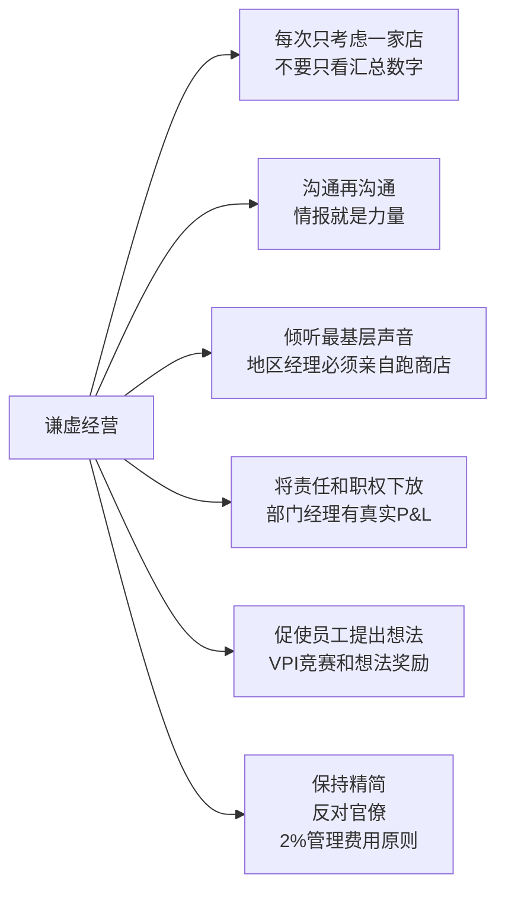

# 富甲美国

> 作者：萨姆·沃尔顿、约翰·休伊｜自传，1992年出版于沃尔顿去世前三周

---

## 一句话主旨

一个在大萧条时期学会珍惜每一美元的小镇男孩，用47年时间将阿肯色州的一家杂货铺发展成全球最大零售商——靠的不是宏大战略，而是比竞争对手多一点勤奋、多一点便宜、多一点真心对待员工。

---

## 全书骨架

---

## 两次关键失败与转折

### 纽波特教训（1945—1950）

萨姆以25000美元买下纽波特的本·富兰克林特许店——其中2万元是向岳父借的。当时完全不懂租约谈判，签了一份营业额5%的房租合同（同行标准是1-2%）。

五年后，他把这家年亏损7.2万美元的破店做成了阿肯色州最好的本·富兰克林门店，年营业额达到25万美元。就在这时，房东（想把店传给儿子）拒绝续约。

> "我们根本就不能继续待在纽波特……这完全是我自己的过错，我没有在原始合同中确立续签的权利。"

**教训：法律细节和商业直觉同等重要。** 他从此对合同从不大意。但更深的教训是：**失去纽波特的店让他在本顿维尔从零开始，而本顿维尔正是沃尔玛帝国的起点。**

### 大萧条铸造的消费观

1918年出生，在大萧条中成长，家境拮据。读高中时送报纸，大学时管理多条送报线路并雇人帮忙，年收入4000-5000美元（当时极高）。这段经历奠定了他对金钱的全部态度：**每一美元都有价值，浪费是罪恶的。**

他一生驾驶破旧皮卡，戴沃尔玛自己卖的棒球帽在小镇理发店理发——即使在成为美国首富之后。

---

## 核心战略：小镇包围城市

1962年开第一家沃尔玛时，凯马特不进5万人以下的小镇，吉布森百货的标准是1-1.2万人。沃尔顿的原则：**5000人以下的小镇也照开。**

**为什么有效：**
- 口耳相传代替广告：75家店密布阿肯色州，不需要媒体投放
- 竞争对手没有意识到威胁——把他们当"阿肯色州的乡巴佬"
- 凯马特最终进入密苏里时，面对的是40家沃尔玛的强大包围网

**飞机选址的优势：** 萨姆从1950年代就亲自驾驶小飞机低空勘察选址——比竞争对手早了10年。他能从空中看出交通流向、城镇发展走势和竞争格局，前400多家门店的选址几乎都是他亲自飞行勘察定下的。

---

## 核心武器：低成本结构

沃尔玛的护城河不是商品，而是成本率。

| 指标 | 沃尔玛 | 行业平均 |
|------|--------|---------|
| 商品运输成本/销售额 | <3% | 4.5-5% |
| 一般管理费用/销售额 | ~2% | ~5% |
| 仓库供货覆盖率 | 85% | 50-60% |
| 从订单到补货时间 | 约2天 | 5天以上 |

**低成本来源：**
1. 绕过中间商直接向制造商采购（从纽波特时期就开始）
2. 自有卡车车队（2000辆卡车+11000辆拖车）
3. 自建分销体系（20个配送中心）
4. 1983年上线卫星系统（2400万美元，萨姆一开始强烈反对）

> "我们将商品运往商店的成本只有不到3%，而我们的竞争者相应则需要4.5%至5%。这里的算术非常简单：同样的价格，同样的商品，我们比竞争者多挣2.5%的额外利润。"

---

## 员工合伙制：让每个人都是股东

1971年推出利润分享计划——比大多数大公司早了20年。任何工作满一年、每年工作超过1000小时的员工都能参与分红，分红比例与员工工资挂钩。

**"店中有店"（Store Within a Store）：**
每个部门经理得到真实的成本、利润数据，承担真正的P&L责任。一个没上过大学的员工可以管理一个年营业额超过早期整个沃尔玛的部门。

**10英尺规则：**
萨姆通过卫星对全国所有门店员工直播，要求他们举起右手宣誓："从今天起，每当顾客与我相距10英尺以内时，我必定笑脸相迎，看着他的眼睛并问候他。"他随后宣布，超越凯马特和西尔斯所花的时间比华尔街最乐观的分析家预测的早了两年。

---

## 沃尔玛文化：让工作变成游戏

每周六早晨7:30，数百名管理人员和员工聚集开会。萨姆带头呼喊拉拉队口号：

> "一个沃！一个尔！一个玛！那是什么？沃尔玛！谁是上帝？顾客！"

会议没有固定议程，可能会有健美操、唱歌、吐柿籽比赛，也可能有总裁穿着工装裤骑驴子接受《财富》杂志采访。

1984年，萨姆因打赌输了，必须穿着草裙在华尔街跳草裙舞。他不仅照做了，还被各大媒体报道，第二天变成全国头条。

**核心逻辑：** 零售业极度枯燥，只有让工作本身有趣，才能让员工保持激情——而激情是无法用工资买到的。

---

## 谦虚经营的六条原则（第15章核心）

**"每次只考虑一家店"的含义：**
沃尔玛在佛罗里达巴拿马城有两家店，相距5英里，但一家卖沙滩用品，一家卖工作服——是完全不同的两家店。周六晨会讨论的是亚拉巴马州某个具体商店的销售情况，不是"整个地区"。

**"地区经理必须跑商店"：**
18名地区经理每周一出发，周四回来，必须带回至少一个"不虚此行"的具体想法。周五业务会议，这些想法和本顿维尔的采购员当面对碰，当天作出决定，周六执行。

> "一台计算机无法——而且绝不可能——替代到商店巡视和学习的功效。换句话说，一台计算机能够告诉你已经售出了多少，但它绝不能告诉你将可以售出多少。"

---

## 企业成功经营的十大规则（原文）

1. **敬业**：用绝对热情克服每一个缺点
2. **与同事分享利润**：把他们视为真正合伙人
3. **激励合伙人**：仅靠金钱和所有权不够，每天想新的激励方式
4. **沟通**：同事知道越多，理解越深，越愿意关心公司
5. **感激**：几句适时真诚的感谢比任何东西都珍贵，且不花一分钱
6. **庆祝成功**：充满乐趣，让对手摸不着头脑
7. **倾听**：第一线员工才是唯一知道实际情况的人
8. **超越顾客期望**：妥善处理过失，诚心道歉，不找借口
9. **控制费用**：比对手更好地控制费用，这永远是竞争优势
10. **逆流而上**：打破一切规则——"这才是第十条规则真正的精神"

---

## 关键案例

| 案例 | 教训 |
|------|-----|
| **纽波特租约失误** | 商业直觉不能替代法律保护 |
| **从竞争对手垃圾桶学习** | 店员约翰从吉布森商店垃圾桶翻出价格情报；萨姆要求所有人系统研究竞争对手优点，而非缺点 |
| **NYC采购之旅** | 出差费用不超过采购额1%；住最便宜的旅馆；早晨6点就进展销室等候 |
| **月亮馅饼失误** | 把南方热卖品大量运往威斯康星——结果无人问津。成功不能盲目复制 |
| **迎宾员发明** | 路易斯安那一家店的经理想出来的——萨姆在全国推广。一半感谢顾客，一半防止盗窃 |
| **华尔街草裙舞** | 打赌税前利润达不到8%，输了就得表演；最终表演了，利润也实现了 |
| **卫星系统上线** | 萨姆一开始强烈抵制，被迫签了2400万支票；10年后成为最大竞争优势 |

---

## 重要原文引用

> "如果你必须将沃尔玛体制浓缩成一个思想，那可能就是沟通，因为它是我们成功的真正关键之一。"

> "规模大就必须更注重基本。越大，越要把每家店当成唯一的一家店来经营。"

> "我猜想，任何成功总要付出代价，而我经历艰难困苦学到这一教训是在1985年10月，当时，《福布斯》杂志称我为所谓的'美国第一富豪'。"

---

## 与知识库其他文章的对话

| 维度 | 萨姆·沃尔顿 | [[安迪·格鲁夫]]（《[[高产出管理]]》）|
|------|-----------|-----------------|
| 核心管理哲学 | 让员工成为合伙人；分享所有数据 | 高杠杆活动；一对一会议；OKR |
| 信息流动 | 卫星+Saturday Meeting 实现实时分享 | 通过会议和报告构建信息管道 |
| 规模管理 | "每次只考虑一家店"防止抽象化 | "经理的产出=组织的产出" |

→ 参见：[[沃尔玛]]、[[零售业竞争哲学]]

---

## 关键术语

- **VPI（Volume Producing Item）**：单项产品销量竞赛，鼓励部门经理选一个商品大力促销并创造创意陈列
- **谦虚经营（Humble Business）**：越大越要用小公司的方式思考——每次只想一家店，不被规模迷惑
- **店中有店（Store Within a Store）**：给部门经理真实的P&L数据和决策权，让他们像经营自己的生意一样管理部门
- **合伙人文化**：员工被称为"associate"而非"employee"，持有公司股份，分享利润
- **10英尺规则**：任何员工看到顾客在10英尺内，必须主动问候
- **Saturday Morning Meeting（周六晨会）**：沃尔玛文化核心，每周六7:30全体管理人员聚集，分享成功、揭露问题、做决策
