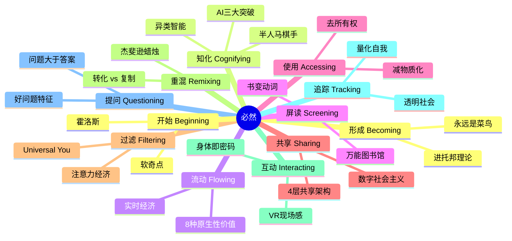
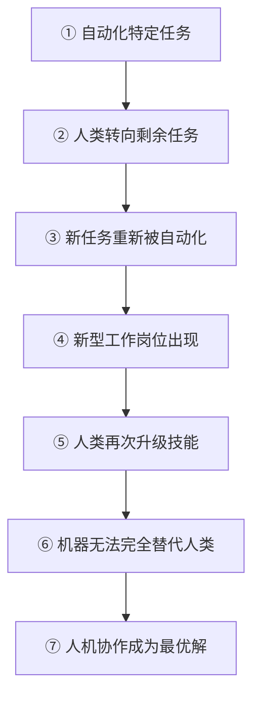
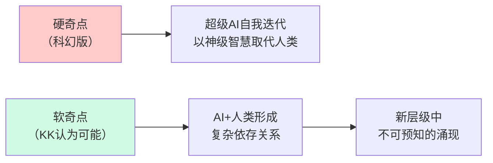
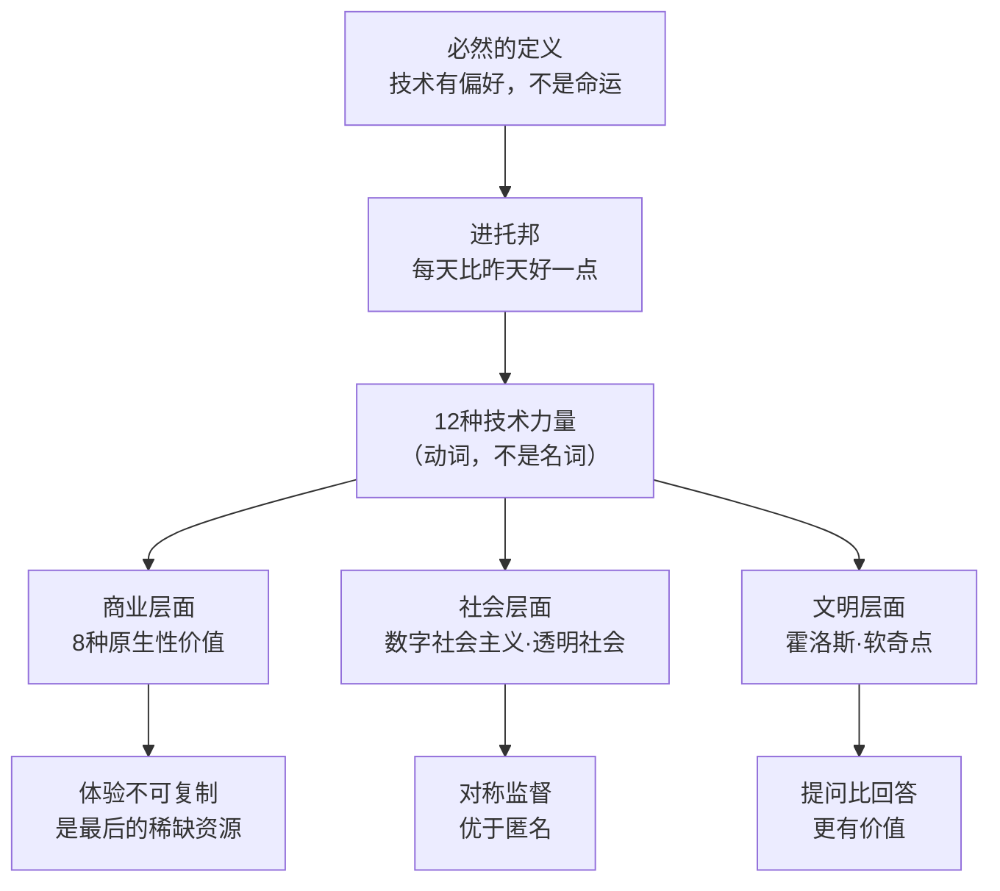

# 必然（The Inevitable）

《必然》（The Inevitable）是 [[凯文·凯利]] 2016 年出版的著作，中文版由周峰、董理、金阳翻译，电子工业出版社出版。KK 是《连线》杂志创始执行主编，1989 年亲历早期 VR 诞生，2007 年与加里·沃尔夫共同创立量化自我运动。全书提出 12 种"必然的科技力量"，称它们将在 2016—2046 年持续重塑人类文明。

> "这些必然趋势不是由个人选择或公司政策决定的，而是由发明技术本身的深层逻辑驱动的。"

---

## 什么是"必然"

KK 定义的"必然"并非强硬的决定论。技术有偏好（preferences），不等于不可改变的命运。就像河流一定向低处流，但具体流过哪里，仍受地形影响。iPhone 不是必然，即时通信是必然；Uber 不是必然，交通服务化是必然。

这种框架被 KK 称为"**进托邦**"（Protopia）——区别于乌托邦和反乌托邦，是一种每天只比昨天好一点点的渐进式进步。进托邦不浪漫，不吓人，但它是技术演化的真实轨迹。

KK 将互联网比作相变（phase transition）——分子间基本关系在临界点上重组，产生全新特性。水变成水蒸气不是量的变化，是质的跃迁。我们正处在人类有史以来最大规模相变的开端。

---

## 12 种技术力量总览

---

## 形成（Becoming）

**核心论点：** 一切都处于生成状态，没有任何事物是完成的。

软件永远有漏洞要修，平台永远在升级，你永远是菜鸟。KK 称之为"升级军备竞赛"——这不是失败，是科技时代的正常状态。

计算演化三阶段：批处理时代（文件夹/桌面）→ 网络时代（页面/超链接）→ 流动时代（流/标签/云端）。实时模式正在取代存储模式。

这也是他为什么认为今天是创业最佳时刻的原因——大多数伟大产品还未被发明，互联网才在"开端的开端"。

---

## 知化（Cognifying）

**核心论点：** AI 是异类智能，不是仿人智能，正因为不同才有价值。

三大技术突破同时发生：
1. 廉价并行计算（GPU 普及）
2. 海量大数据（十年互联网行为积累）
3. 深度学习算法

KK 将 AI 比作廉价的电力——19 世纪末电力普及后，所有行业被重组。AI 将以同样方式重组所有行业。**极简商业框架：取某行业 + 加 AI = 新创业公司**（"10,000 家创业公司框架"）。

**半人马棋手**（Centaur Chess）：人类和 AI 协作的"自由式国际象棋"中，"人+AI" 组合赢得 53 场，纯 AI 赢得 42 场。人机协作是最优解。

**机器人替代 7 步骤：**

---

## 流动（Flowing）

**核心论点：** 互联网是全球最大超级复印机，一切接触互联网的事物都会流动，问题是如何从流中获取价值。

**8 种比免费更好的原生性价值**（数字时代商业模式核心框架）：

| 原生性价值 | 含义 |
|-----------|------|
| **即时性** (Immediacy) | 正版比盗版先到达你 |
| **个性化** (Personalization) | 为你量身定制 |
| **解释性** (Interpretation) | 帮你理解复杂内容 |
| **可靠性** (Authenticity) | 你能信任的来源 |
| **获取权** (Accessibility) | 随时随地可用 |
| **实体化** (Embodiment) | 线下体验/签名/演出 |
| **可赞助性** (Patronage) | 支持创作者 |
| **可寻性** (Findability) | 被找到的能力 |

Spotify 颠覆音乐产业不靠降价，而是让音乐"流动"起来。音乐经历四个阶段：实体 → 数字文件 → 流媒体 → 音乐即服务。

---

## 屏读（Screening）

**核心论点：** 屏幕正在替代书本成为第三次媒介革命，书将从名词变为动词。

三次媒介革命：口语 → 书写 → 屏幕。每次革命不消灭上一种，而是叠加。印刷术将"权威"注入文化；屏幕将流动性注入知识，真相由受众实时拼接。

KK 梦想中的"**万能图书馆**"——将人类迄今出版的所有书籍数字化、互联、可搜索。**超链接加标签是过去 50 年最重要的发明**，让静态文本变为可航行的知识网络。

书一旦数字化，就成为动词：你不只是"读书"，你是在"使用书"、"参与书"、"重混书"。KK 描绘了 2050 年屏读生活的一天：增强现实让你在罗马斗兽场遗迹上看到完整未毁的 3D 斗兽场。

---

## 使用（Accessing）

**核心论点：** 所有权让位于使用权，拥有不再重要，使用才重要。

五大驱动力：减物质化、去中心化、即时性、平台协同、云端存储。

软件即服务（SaaS）只是开头。优步将此模式推广到汽车，Airbnb 推广到房间。比特币区块链提供了去中心化所有权的实验案例。KK 描述极端无所有权场景：一个靠订阅服务生活的人，家里没有任何物品，一切按需获取，感觉像回到了游牧的原始状态。

---

## 共享（Sharing）

**核心论点：** 数字社会主义正在崛起，但与政治社会主义无关。

KK 用"**数字社会主义**"描述维基百科、Linux、GitHub——人们无需报酬、无需命令，自发合作创造价值。这是第三条道路：同时最大化个人自主性和群体协同力量。

共享的四层架构（从低到高）：

1. **分享**（Sharing）：给别人看/用
2. **合作**（Cooperation）：调整自己以配合他人
3. **协作**（Collaboration）：共同创造新事物
4. **集体主义**（Collectivism）：完全融合，个体消失在群体中

**维基百科管理悖论**：表面上无政府主义，实际上有约 1500 人的精英管理层维护秩序。纯粹的扁平化行不通，需要少量自上而下的权威作为锚点。

---

## 过滤（Filtering）

**核心论点：** 注意力是最稀缺的资源，体验是最后不可商品化的领地。

人类注意力的经济价值约为每小时 2–3.5 美元（以广告 CPM 计算）。每年产生 800 万首新歌、200 万本新书、1.6 万部新电影——信息过剩时代，过滤比信息本身更有价值。

推荐引擎的极致形态是"**Universal You**"——完整的个人化档案，预测你在想什么，在想它之前就推送给你。**过滤器泡沫**（Filter Bubble）是副作用：推荐系统只给你喜欢的，世界观越来越窄。

> 体验是不可商品化的最后一块领地。音乐会门票 1981—2012 年涨了 400%，现场演出、个性化定制服务——这些是算法无法完全替代的。

---

## 重混（Remixing）

**核心论点：** 所有创新都是重混，转化（transformation）是评判重混合法性的核心标准。

经济学家罗默：经济增长不是来自物质积累，而是来自想法的重新组合。哲学家布莱恩·亚瑟：新技术来自旧技术的组合。

**杰斐逊蜡烛比喻**：
> "一个人从我这里获得了一个观点，他在接受这个观点指导的同时并没有对我造成损失；就像是借用我的烛火点亮他的蜡烛一样，他收获光亮的同时并没有让我变得暗淡。"

比特与实体房产不同：给出去，自己还有。这是知识产权困境的根源。衡量重混合法性的核心问题：**是否进行了转化？** 安迪·沃霍尔将金宝罐头汤变成艺术，这是转化。未来版权法应以转化程度而非复制行为来界定边界。

---

## 互动（Interacting）

**核心论点：** VR 不是娱乐升级，而是全新的交互平台；你的身体将成为密码。

KK 1989 年第一次体验杰伦·拉尼尔（Jaron Lanier）发明的 VR，认为 5 年内普及。VR 沉寂了 25 年，救世主竟然是智能手机——手机屏幕和传感器直接降低了 VR 硬件成本。

VR 的两大核心价值：
- **现场感**（Presence）：让你相信自己身处另一个地方
- **互动效果**（Interactivity）：维持用户沉浸的关键

未来交互三大方向：
1. 给所有设备添加传感器（视觉、听觉、嗅觉、情感检测）
2. 设备越来越近（手机 → 可穿戴 → 植入）
3. 人直接"跳入"技术（VR → AR → 混合现实）

**身体即密码**：虹膜、步态、心跳模式、打字节奏——每个人的生物特征组合是独一无二的元模式，比任何密码都难仿造。MIT 研究的情感感知软件可检测 24 种情绪，能判断你是否抑郁。

---

## 追踪（Tracking）

**核心论点：** 无处不在的追踪是必然的，问题不是能否阻止，而是选择哪种追踪。

KK 与加里·沃尔夫于 2007 年在旧金山创立"**量化自我**"（Quantified Self）运动，现全球 150 个团体、超过 30,000 名成员，追踪一切可测量的个人数据。

**N=1 实验的价值**：传统医学追求大样本，但个性化医疗需要 N=1——以你自己为样本，发现对你有效的方案。N=1 实验的主要挑战是自我误导，但廉价传感器的长期记录可部分克服这一问题。

**生活流**（Lifestream）：大卫·格勒恩特 1999 年提出，所有个人数字内容按时间顺序形成的流，成为新型计算界面。脸谱网时间线是其不完整实现。

**美国常规追踪清单**（普通人日常可能遇到的）：汽车 OBD 芯片、高速公路摄像头、手机 GPS、信用卡消费、网页 Cookie、智能家居传感器、人脸识别……

**透明社会**（Transparent Society）：KK 认为对称的互相监督是可行出路——警察可以监控公民，但公民也能监控警察；企业收集你的数据，你也能查看和纠正。不对称的监控是地狱，对称的互相监督可以接受。

> 关于匿名：匿名是稀土金属，少量必要（保护举报人和边缘人），大量有毒（充斥匿名的系统必然失败）。

---

## 提问（Questioning）

**核心论点：** 答案正在变得廉价，好问题才是最稀缺的资源。

谷歌每次搜索成本约 0.3 美分，收益约 27 美分。答案趋向免费，但：

> **知识的悖论：每个答案孕育至少两个新问题。我们的无知正在以指数速度增长。**

**维基百科颠覆了 KK 的三个认知**：
1. 人类不能被信任 → 错，合适工具下人们会善意协作
2. 集体写作产生平庸 → 错，群体智慧可以超越精英
3. 无政府结构必然失序 → 错，需要极少规则即可运作

**好问题的 12 个特征**：

1. 值得拥有 100 万种好答案
2. 不能被立即回答
3. 挑战现存的答案
4. 与能否得到正确答案无关
5. 出现时让你特别想回答，但提出之前不知道自己关心这个问题
6. 创造新的思维领域
7. 重新构造自己的答案
8. 是创新的种子
9. 处于已知和未知的边缘
10. 不能被预测
11. 是机器将要学会的最后一样东西
12. 能生成许多其他的好问题

> 毕加索 1964 年：**"计算机是无用的，它们只能给你答案。"**

---

## 开始（Beginning）

**核心论点：** 我们正处于最大历史转变的开端，这个星球正在形成一个整体。

KK 将全球互联网命名为"**霍洛斯**"（Holos）——包含所有人类集体智慧、所有机器集体行为、自然界智能相结合的整体。德日进（Teilhard de Chardin）称之为"心智圈"（Noosphere）。

规模对比：人类大脑约 860 亿神经元，而霍洛斯运行在 10²¹ 个晶体管上，比人脑复杂 4 亿倍。

**硬奇点 vs 软奇点**：

未来 30 年，霍洛斯将沿着同样方向推进：**更多的流动、共享、追踪、使用、互动、屏读、重混、过滤、知化、提问以及形成**。

> "已经开始。当然，也仅仅是个开始。"

---

## 核心框架速查

---

## 反直觉观点

**AI 的价值恰恰在于它不像人类思考**。我们过去认为"真正的智能"需要通用性和自我意识，现在才发现最有用的智能是窄而深的异类能力——如同一把能预测你下一步棋的下棋引擎，而不是一个能和你聊天的通用伙伴。

**技术进步带来更多问题，不是更少**。搜索引擎普及后，人类每天问的问题数量爆炸式增长。KK 预言："到处都是超级智能答案的世界将鼓励人们对完美问题的追求。"

**追踪是必然的，隐私的出路是透明而非封锁**。法律限制追踪的效果，就像法律禁止复制一样无效。KK 支持爱德华·斯诺登，不是因为他减少了追踪，而是因为他增加了透明度。

---

## 与其他知识的连接

- **[[人工智能观察]]**：知化一章是理解当前 AI 浪潮的早期预判；"10,000 家创业公司框架"与王兴对 AI 时代判断高度呼应
- **[[科技与互联网]]**：流动、屏读、使用三章描述了互联网经济的底层逻辑
- **[[创业与商业]]**：8 种原生性价值是数字时代最实用的商业模式框架之一
- **[[费曼学习法]]**：KK 的"量化自我"和"N=1 实验"与费曼的"自我检验"精神相通
- **[[学会提问]]**：尼尔·布朗的批判性思维与本书"提问"章节互补；前者是评估论证的工具，后者是关于提问本身在 AI 时代的战略价值
