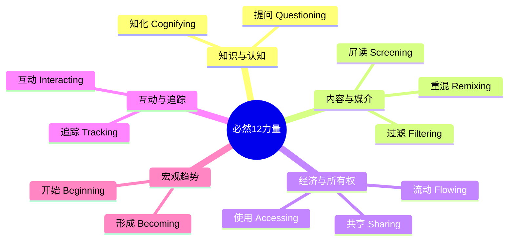
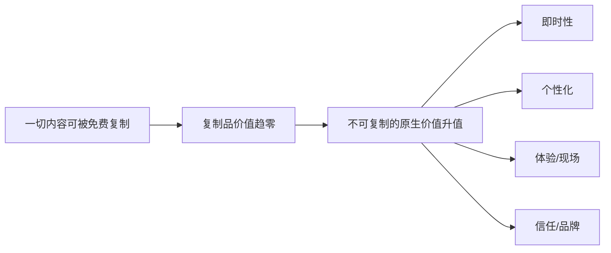

# 必然

《必然》（The Inevitable）是 [[凯文·凯利]] 2016 年出版的著作，中文版由周峰、董理、金阳翻译，电子工业出版社出版。全书提出 12 种"必然的科技力量"，称它们将在 2016—2046 年持续重塑人类文明。

## 核心框架

KK 的论证基础是一个关于"必然性"的定义：技术有其内在偏好，使其朝向某种特定方向。这种偏好来自比特和网络的物理与数学特性，与国家、公司、文化无关。个体产品不是必然，而底层趋势是必然。iPhone 不是必然，即时通信是必然；Uber 不是必然，交通服务化是必然。

**进托邦（Protopia）**是本书的哲学底座：既不是乌托邦（一步到达完美），也不是反乌托邦（技术导致灾难），而是一种渐进改善的过程。每年的收益略多于每年的损失，"今天的问题来自昨天的成功，今天的解决方案是明天问题的种子"。进托邦不引人注目，很难成为电影桥段，但正是这种微小积累构成了文明。

## 12 种必然力量

### 形成 Becoming
一切都在成为别的东西，没有终态。软件永远有漏洞要修，网站需要持续维护，产品在更新中成为服务。KK 将计算的演化分为三个阶段：批处理时代（文件夹/桌面比喻）、网络时代（页面/超链接）、流动时代（流/标签/云端）。我们正在从存储物切换到流动物，从批处理模式切换到实时模式——"要么实时发生，要么不存在"。

### 知化 Cognifying
廉价、强大、无处不在的 AI 是这 12 种力量中影响最深的一种。三个驱动因素支撑了近年的 AI 突破：廉价并行计算（GPU 的普及）、大数据（十年的互联网行为积累）、更好的算法（深度学习）。KK 的核心判断：AI 的价值不在于"更快更聪明的人类"，而在于它是一种"异类智能"，其思考方式和人类根本不同。IBM 沃森发明的"酸橘汁腌鱼配油炸车前草"食谱，就是任何人类厨师都不会想到的组合，这才是 AI 的真正价值所在。

> "人工智能也可以表示异类智能（Alien Intelligence）。" — KK

**半人马棋手**（Centaur Chess）是这一章的最佳案例：让人类和 AI 协作下棋的"自由式国际象棋"中，"人+AI"组合赢得了53场，纯 AI 赢得42场。当今评分最高的棋手马格努斯·卡尔森和 AI 一起训练，被认为是最接近电脑思维的人类。这个案例的结论：AI 没有削弱人类棋手，反而刺激了人类棋手水平的提升。

KK 给了一个极简的商业框架："接下来10,000家创业公司的商业计划：挑选一个领域并加入人工智能。"这与[[人工智能观察]]中王兴对 AI 时代的判断高度呼应。

### 流动 Flowing
互联网是世界上最大的复印机。数字经济运转在"免费复制品的河流"之中。这一章的重点是回答一个问题：如果一切都可以被免费复制，什么东西还有价值？

**8 种"比免费更好"的原生性（Generative）价值**：

| 原生价值 | 核心含义 |
|---------|---------|
| 即时性 | 在发布第一时间拿到，首映式、精装版的逻辑 |
| 个性化 | 针对你的 DNA 调配的阿司匹林 |
| 解释性 | 代码免费，理解代码的技术支持收费 |
| 真实性 | 签名版，作者亲口解说 |
| 可及性 | 随时随地可调用，胜过本地备份 |
| 具身性 | 现场演出、现场讲座，不可复制 |
| 赞助性 | 为创作者存续而付费，而非为内容付费 |
| 可发现性 | 在海量中被找到，聚合平台的价值 |

这 8 种价值的共性：只能当场生成，无法储存或伪造。

### 屏读 Screening
文化经历了三次媒介革命：言语之民，书籍之民，屏幕之民。印刷术将"权威"注入文化——律法、科学、专家体系皆来自书面文字。屏幕带来了流动性：真相由受众实时拼接，不再由权威固化。"屏读"不只是阅读，还包括观赏、互动、注释、链接——是一种综合行为。KK 描绘的 2050 年场景：早上醒来屏读新闻，厨房橱柜上有屏幕告诉你里面有什么，建筑物外墙针对你的车辆投放只有你能看见的广告。

"书是一种变化，一种流程，而非制品。'书'这个字不再是名词，而成了动词。"

### 使用 Accessing
优步没有汽车，Airbnb 没有房产，Netflix 不卖碟片。KK 将这种趋势归结为五个驱动力：减物质化、去中心化、即时性、平台协同、云端。所有权让位于使用权不是因为人们变穷了，而是因为使用权比所有权更灵活、更合算。KK 描述了一个极端情景：一个完全靠订阅服务生活的人。他的衣服、玩具、相机、交通、餐食、娱乐全部通过订阅获取，没有任何东西被拥有，却感到与"原始社会的狩猎者"有着深刻联系——"他穿行于复杂的自然环境中时不会去拥有任何东西，却可以在需要时随时随地获得工具"。

### 共享 Sharing
比尔·盖茨称开源软件倡导者是"当下的共产主义者"，但 KK 认为这是对一种"新政治操作系统"的误解。技术共享是第三条道路，同时最大化个人自主性和群体协同力量。维基百科、Linux、Apache、Reddit 都是例子。四个层级的共享：分享（Sharing）、合作（Cooperation）、协作（Collaboration）、集体主义（Collectivism）。

### 过滤 Filtering
每年产生800万首新歌、200万本新书、1.6万部新电影。信息过剩时代，过滤比信息本身更有价值。推荐算法是过滤的主要形式，但"过滤器泡沫"（Filter Bubble）是主要风险：只接触你已经喜欢的东西，会陷入自我强化的漩涡。KK 描述了理想过滤器的三个属性：推荐你已经喜欢的、推荐你朋友喜欢的、推荐你现在不喜欢但将来会喜欢的。最后一种最难，也最有价值。

当所有商品的价格趋向零时，唯一仍在增值的是人类体验——"那是无法复制的"。音乐会门票1981—2012年涨了400%，私人健身教练是增长最快的职业之一。体验不是商品，因此不受过滤器驱动的价格下行压力影响。

### 重混 Remixing
经济学家 Paul Romer："可持续的经济增长来自将已有资源重新安排后使其产生更大价值。"Brian Arthur："所有新技术都源自已有技术的组合。"媒介同理：每种新媒介都是旧媒介重混的结果。KK 以数字电影为例：卢卡斯的《星球大战》是在绿幕框架上逐层叠加视觉素材，像写作一样"写"电影，而非像拍照一样"捕捉"现实。关键问题是："这种重混是否实现了转化？"转化的重混不是复制，是创新。

### 互动 Interacting
VR（虚拟现实）即将成熟。1989 年 KK 在杰伦·拉尼尔的实验室首次体验 VR，至今已等待了25年。智能手机的意外推动（廉价高分辨率屏幕、动作传感器）让消费级 VR 终于变得可行。互动性越高，学习成本越高，但价值也越高。你的动作模式、步态、击键节奏构成独一无二的"元模式"，身份识别从密码转向身体本身——"你的身体就是你的密码"。

### 追踪 Tracking
量化自我运动（Quantified Self）的基础是廉价传感器的爆炸式普及。David Gelernter 1999年提出的"生活流"（Lifestream）概念：所有文档按时间顺序排列，构成你的数字生活档案。追踪的最终形态不是数字，而是新的身体感觉。德国工程师乌多·瓦赫特把罗盘变成腰带振动器，一周后他就能无意识地感知北方。追踪创造的数据流将被 AI 知化，产生我们目前无法预见的自我认识。隐私与追踪的核心矛盾：匿名是稀土金属，少量必要，大量有毒。

### 提问 Questioning
谷歌每天处理121亿次查询。答案正在变得免费，因此问题的价值在上升。毕加索1964年说："计算机是无用的，它们只能给你答案。"KK 总结了好问题的特征：不能被立即回答；挑战现存答案；提出之前不知道自己关心这个问题；创造新的思维领域；能生成许多其他好问题。

> "一个好问题值得拥有100万种好答案。"

维基百科是这一章的核心案例，用来说明集体智能在大规模协作中的意外力量。KK 最初认为维基百科不可能成功——他错了。

### 开始 Beginning
这是一个元章，KK 提出"霍洛斯"（Holos）的概念：所有人类集体智能、所有机器集体行为、自然界智能相结合的整体。它不是乌托邦，是一次相变。目前地球上有150亿设备接入这张网络，运行在10^21 个晶体管上，比人类大脑的860亿神经元多了4亿倍。"硬奇点"（AI无限自我改进直到接管世界）KK 认为不太可能；"软奇点"（人与技术形成复杂依存关系，产生新的层级）更可能成为现实。

## 反直觉观点

本书最反直觉的论点是：AI 的价值恰恰在于它**不像人类**思考。我们过去认为"真正的智能"需要通用性、自我意识，现在才发现最有用的智能是窄而深的异类能力——如同一把能预测你下一步棋的下棋引擎，而不是一个能和你聊天的通用伙伴。

另一个反直觉结论：技术进步的结果不是更少的问题，而是**更多的问题**。一个免费的答案只会生成更多的问题。搜索引擎普及之后，人类每天问的问题数量爆炸式增长，而不是减少。KK 的预言："到处都是超级智能答案的世界将鼓励人们对完美问题的追求。"

## 与其他文章的关联

本书与知识库中多篇文章形成直接对话：

- [[人工智能观察]] — 王兴的 AI 观察与本书"知化"章节高度互补。本书提供了理论框架（AI 作为异类智能），王兴的帖文提供了具体观察（AlphaGo 时代的公众讨论质量问题）。
- [[科技与互联网]] — "流动""使用""共享"三章是对当今互联网平台经济的宏观解释。
- [[哲学与认知]] — "进托邦"概念是王兴"长期主义"和"对未来越有信心"的一个西方理论背景。
- [[创业与商业]] — "知化"章节的"10,000家创业公司"框架，以及"8种原生价值"对理解商业模式有直接帮助。
- [[费曼学习法]] — "提问"章节关于"好问题比好答案更有价值"，与费曼"输出倒逼输入"的方法论有内在呼应。
- [[学会提问]] — 尼尔·布朗的批判性思维方法论与本书"提问"章节形成互补：前者是评估论证的工具，后者是关于提问本身在 AI 时代的战略价值。
