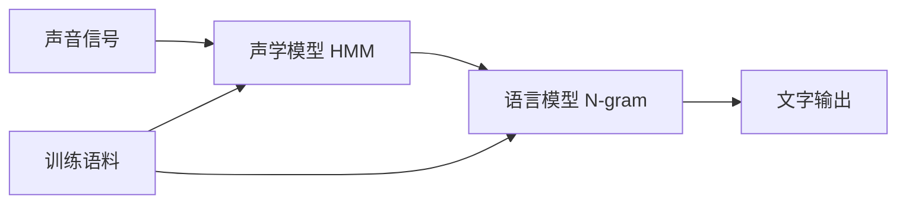
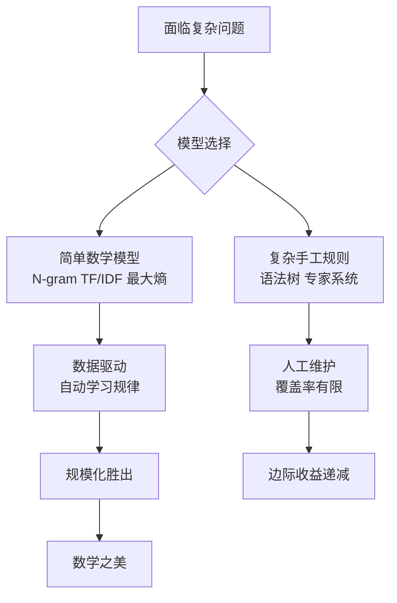

# 数学之美（吴军）

《数学之美》是吴军在 Google 任职期间（约 2006–2010 年）于 Google 中国博客发表的系列文章合集，共 25 篇。原为面向工程师的科普文章，后整理成书出版。书中以自然语言处理（NLP）和搜索引擎为主线，讲述简单数学模型如何屡屡胜过复杂的手工规则。

---

## 核心命题：简单之美

全书最核心的一个命题：**正确的数学模型在形式上一定是简单的。**

吴军用天文学史来类比这一原理。托勒密的地心说用 40 个小圆套大圆，精密无比，却是错误的。哥白尼提出日心说，只需 8–10 个圆，模型更简单，但最初精度反而不如托勒密。开普勒发现椭圆轨道，一个方程彻底取代了层层嵌套的小圆。牛顿用万有引力解释了为什么是椭圆。

四个结论：

1. 正确的数学模型在形式上是简单的（托勒密太复杂）
2. 一个正确方向的模型，开始时可能不如精雕细琢的错误模型准确——但应该坚持
3. 大量准确的数据对研发至关重要
4. 模型受噪音干扰时，要找噪音根源，而不是打补丁

在 NLP 领域，这条原理被反复验证：统计语言模型（N-gram）、TF/IDF、最大熵模型，都是"椭圆"——形式简单，却持续击败各种"小圆套大圆"的手工规则。

---

## NLP 的统计革命

### 贾里尼克的语言模型革命

自然语言处理在 1970 年代之前，主流方法是语言学家设计语法规则。贾里尼克（Fred Jelinek）在 IBM 华生实验室，提出了完全不同的路径：**把语音识别当作通信问题，用统计模型（HMM）来处理，而不是写语法规则。**

他留下了一句流传业界的名言："我每开除一名语言学家，语音识别系统的错误率就降低一个百分点。"

这个框架至今仍是语音识别和语言模型的基础：



### 为什么统计方法赢了

统计方法的优势不在"聪明"，而在于**规模化** ：

- 语言学家写规则，覆盖率有限，每一条规则都是人力
- 统计模型从数据中自动学习，语料越多，模型越准
- 简单的二元语言模型（bigram）在实践中就已经显著优于复杂的语法分析

贾里尼克的框架：识别一段语音的本质是找到最可能的文字序列 W，使得 P(W) × P(声音|W) 最大——其中 P(W) 是语言模型，P(声音|W) 是声学模型。两者都用统计训练，不需要人工规则。

---

## 核心数学工具

### 信息熵（香农，1948）

信息量 = 不确定性的度量。一条消息的信息量取决于它消除了多少不确定性。

32 支球队猜冠军：每猜一次二分，最多猜 5 次，即 5 比特。信息熵：

```
H = -(p1·log p1 + p2·log p2 + ... + pN·log pN)
```

应用：衡量语言模型的好坏（困惑度 Perplexity）。李开复的 Sphinx 语音识别：
- 无语言模型：困惑度 997（每个位置有 997 种可能）
- 二元语言模型（考虑概率）：困惑度降到 20

### TF/IDF（信息检索最重要的发明）

词频（TF）× 逆文档频率（IDF）= 词的相关性权重。

- 常见词（"的"）：IDF 接近 0，几乎不影响排名
- 专业词（"原子能"）：IDF 大，对排名贡献高

IDF 由剑桥大学斯巴克-琼斯于 1972 年提出，但多年被忽视。后由康奈尔的萨尔顿推广，成为搜索引擎相关性计算的基础。本质上是交叉熵的特例——信息检索回到了信息论。

### 最大熵模型

**原理：** 在满足已知约束条件的前提下，保留最大的不确定性，不做任何主观假设。即"不把鸡蛋放在同一个篮子里"的数学表达。

吴军举了一个色子的例子：对于一个一无所知的色子，猜每面等概率（1/6）是风险最小的做法。如果知道"四点朝上概率是 1/3"，那么在满足这个约束的前提下，其余五面等概率，同样是最安全的猜测——这正是最大熵原理。

最大熵模型能同时综合几十甚至上百种信息（语言模型、主题、语法……），在形式上是最漂亮的统计模型，但训练极为复杂。吴军博士论文的核心贡献之一，就是将最大熵模型的训练时间再缩短两个数量级。

达拉皮垂孪生兄弟在 IBM 改进了训练算法后，离开学术界加入文艺复兴技术公司，用最大熵等数学工具做股票预测，年均回报 34%（1988–写作时），远超巴菲特同期 16 倍总回报。

### 余弦定理与新闻分类

每篇新闻用 TF/IDF 向量表示（64000 维词向量），两篇新闻的相似度 = 两个向量夹角的余弦值。余弦为 1 = 完全重复；余弦接近 1 = 相似。中学的余弦定理，直接用于 Google 新闻自动分类。

### 布隆过滤器（1970）

判断一个元素是否在集合中的高效工具。用哈希表存 1 亿个 email 地址需 1.6GB；布隆过滤器只需 1/8 到 1/4 的空间，代价是极小的误判率（万分之一以下）。

### 动态规划

从北京到广州的最短路径：若最优路径经过郑州，则北京→郑州这段也必须是最优的，否则可以替换以得到更优的全局路径（反证法）。

拼音输入法本质上也是最短路径问题：每个拼音对应多个汉字，组成一张图，动态规划找出最优的汉字序列。导航系统和拼音输入法，数学模型完全相同。

---

## 关键人物群像

### 贾里尼克（Fred Jelinek，1932–2010）

语音识别之父。犹太裔，父亲死于二战集中营，移民美国后极度贫困，靠母亲卖点心为生。在 MIT 先后受香农、乔姆斯基、Jakobson 影响，融合信息论与语言学。

在 IBM 华生实验室领导了语音识别革命，与波尔共同提出统计语音识别框架，改变了整个领域。后在约翰·霍普金斯大学建立 CLSP 实验室，桃李满天下（学生均就职于 IBM、微软、AT&T、Google 研究院）。

生活俭朴，一辆老式丰田车开了二十多年，比组里学生的车都破。聚会的食物"实在难吃，无非是些生胡萝卜和芹菜"，后来掏钱让别的教授替他举办聚会。对中国的了解就是"清华大学和青岛啤酒"，有时会把两个名字搞混。

### 阿米特·辛格（Amit Singhal）

Google 排序算法之父，在公司内部，Google 的排名算法以他的名字命名。

核心理念：好的算法要像 AK-47 冲锋枪——**简单、有效、可靠、易懂** ，而不是故弄玄虚。

吴军刚加入 Google 时，曾和辛格打赌：若能减少 40% 的搜索作弊，工程副总裁罗森就带四个团队成员去夏威夷度假。吴军原想设计精巧的分类器（需 3–6 个月），辛格坚持用简单方法，一两个月内就减少了一半作弊，轻松兑现承诺。辛格的每一个"阿卡47"，后来几乎每次都被证明接近最优，远快于复杂方案。

### 马库斯（Mitch Marcus）

NLP 教父，宾夕法尼亚大学计算机系主任。本人发表论文不多，但门下弟子遍布各大顶级实验室：柯林斯（Collins）、布莱尔（Brill）、雅让斯基（Yarowsky）、拉纳帕提（Ratnaparkhi）。

最大贡献：花十几年建立 LDC 语料库（Penn TreeBank），成为全世界 NLP 学者共用的标准数据库。马库斯看到了统计方法必须依赖大规模标注数据，在其他人还没意识到时提前布局，为整个领域奠基。

另一远见：网络泡沫最热时，看到了生物信息学（bioinformatics）的重要性，提前在宾州大学设置专业并招聘教授，等泡沫破裂后其他大学转向时，优质教授已经抢先被招满。

### 柯林斯 vs. 布莱尔：繁与简的两极

**柯林斯（Michael Collins）** ：追求完美，将文法分析器做到极致，每个细节都研究透彻。博士论文被称为 NLP 领域的范文，论文像优秀的小说，把所有来龙去脉介绍得清清楚楚。

**布莱尔（Eric Brill）** ：追求简单，永远找"简单得不能再简单"的方法。基于变换规则的机器学习方法，在很多 NLP 任务中得到了几乎最好的结果，因为方法过于简单，容易被人追上超越，但他"当人们超过他时，他已经调转船头驶向别的方向了"。

---

## 密码学：数学的另一面

系列二十二（《暗算》章节）是全书最具人文色彩的一篇，从密码学史切入信息论的本质。

凯撒密码可用字母频率统计破译——密码学的核心挑战是让密文统计独立、均匀分布，使得敌人截获后信息量不增加。

香农信息论提供了理论基础：最好的密码使密文熵最大、统计独立。现代公开密钥体系（RSA）的数学原理极其简单：找两个大素数 P、Q，构造公钥 E 和私钥 D。要破解需要对大数 N=P×Q 做质因数分解，这是目前计算机无法高效完成的问题。

吴军指出：《暗算》里提到"冯·诺依曼是现代密码学的祖宗"是错误的，应该是香农。冯·诺依曼的贡献在于发明计算机和博弈论。

---

## 工程哲学总结



吴军在书中反复强调的三个原则：

1. **简单才是美** ：形式简单的模型，往往比复杂的模型更接近真理
2. **数据比算法重要** ：有大量准确数据的简单模型，会胜过没有数据的复杂模型
3. **不要打补丁** ：用小圆套大圆修正错误模型，不如寻找正确的新模型

这些原则在吴军后来的其他著作（[[见识]]）中以不同面目反复出现：不选择"伪工作"，不追求局部优化，不在错误框架内精雕细琢。

---

## 延伸阅读

本书涉及的数学工具：信息论（香农）、统计语言模型（贾里尼克）、隐含马尔可夫模型、TF/IDF（斯巴克-琼斯）、最大熵（GIS/IIS 算法）、奇异值分解（SVD）、贝叶斯网络、布隆过滤器、动态规划（维特比算法）。

同类延伸：[[奇点临近]] 讨论了 AI 加速发展的长期预测；[[见识]] 中吴军的人生观与本书的工程观一脉相承。
