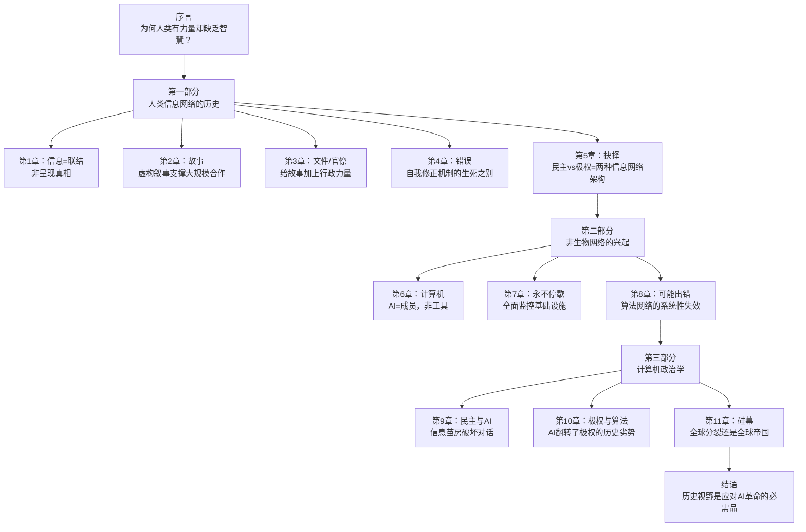
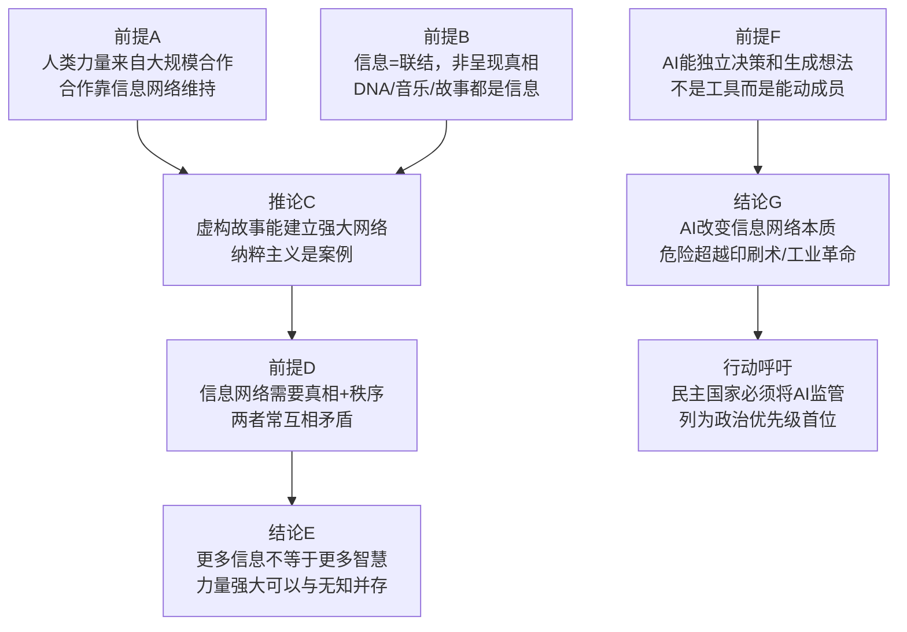

# 智人之上：从石器时代到AI时代的信息网络简史

> 作者：尤瓦尔·赫拉利（Yuval Noah Harari）｜译者：林俊宏｜中信出版集团 2024

---

## 一句话主旨

人类文明建立在信息网络之上；信息的本质是**联结**而非呈现真相；AI作为第一个能自主决策的非生物成员加入信息网络，其威胁超越所有历史先例。

---

## 全书骨架

---

## 核心问题

**信息技术的进步，是否必然带来人类福祉的进步？AI革命与以往信息革命有何本质区别？**

---

## 关键概念

### 信息的重新定义

赫拉利反对"天真的信息观"（naive view of information）——即认为信息=呈现真相，更多信息=更多真相=更好决策（谷歌、库兹韦尔代表这一立场）。他也反对"民粹主义的信息观"——认为信息只是权力武器，没有客观真相（福柯、特朗普代表这一立场）。

赫拉利的定义：**信息是将不同的点联结成网络、从而创造新现实的任何媒介**。DNA联结有机体的各个部分，音乐联结人们的情感，《圣经》联结信众。信息的首要功能不是呈现现实，而是**联结**。

### 主体间现实

国家、货币、法律、神祇——这些既不是客观物质（石头），也非纯粹主观幻觉，而是通过**集体相信的故事**创造出的"主体间现实"（intersubjective reality）。这类现实极为真实，但只存在于人们的信念网络中。

### 真相与秩序的根本张力

人类信息网络必须同时完成两件互相矛盾的事：
1. **发现真相**（医学、科学、工程需要准确信息）
2. **创造秩序**（社会合作需要人们接受共同的故事，哪怕故事是虚构的）

这个张力无法消除。虚构故事（高贵的谎言）通常比真相更容易维持秩序，因此人类社会常常为了秩序而压制真相。纳粹德国有世界顶尖的火箭科学，却禁止质疑种族理论——这正是"力量强大但缺乏智慧"的原型案例。

### AI是成员，不是工具

历史上所有信息技术——泥版、印刷机、收音机——都只是被动工具：能储存、复制、传播信息，但无法决定要储存什么、复制什么、传播什么，也无法生成新想法。

AI打破了这条界线：它能**自行做决定**，能**生成全新想法**（包括超出人类认知范围的内容）。这使AI成为信息网络的主动**成员**，而非工具。

> 「在广岛投下的原子弹"小男孩"，爆炸威力相当于12500吨的TNT炸药，但脑力却是零，什么都无法决定。计算机就不同了。」

### 硅幕

类比冷战的"铁幕"：AI军备竞赛可能将世界切割成互不相容的信息技术生态圈，形成新的全球分裂（硅幕，Silicon Curtain），或走向以AI优势为基础的新帝国扩张。

---

## 主要论证链

---

## 五个核心观点

### 1. 信息的本质是联结，不是呈现真相

这是全书最重要的概念革新。赫拉利用DNA（生物信息）、音乐、故事、货币等例子论证：信息的基本功能是建立联结，创造秩序；真相呈现只是信息的众多功能之一。

### 2. 人类文明一直在走钢丝

自古至今，每个社会都在"真相"与"秩序"之间寻找平衡。过度追求真相会瓦解维持秩序的神话；过度维护秩序会扭曲真相，让社会失去自我修正能力。没有这种平衡，社会要么陷入混乱，要么走向强力但愚蠢的极权。

### 3. 民主与极权是两种信息网络架构

- **极权**：高度集中 + 不欢迎对中央的挑战 = 强大但缺乏自我修正
- **民主**：分布式 + 强大的自我修正机制 = 较慢但能纠错

AI的出现改变了这个平衡——它翻转了极权的历史劣势（信息无法集中处理），并可能让全面监控成为现实。

### 4. AI的最大威胁不是机器人起义

威胁来自**人类自己的缺陷**：偏执的独裁者可能把核武器控制权交给会犯错的AI；恶意行为者可能用AI合成前所未有的生物武器；信息战可能摧毁人类社会的基本信任。

### 5. AI军备竞赛是比AI本身更危险的威胁

即使大多数社会都有意负责任地发展AI，少数不负责任的行为者就足以危害全人类。气候变化和AI都是全球性问题，无法由任何单一国家独立解决。

---

## 重要原文引用

> 「信息并非现实的镜子，而是联结各个点以创造全新现实的一张网。」

> 「在广岛投下的原子弹"小男孩"，爆炸威力相当于12500吨的TNT炸药，但脑力却是零，什么都无法决定。计算机就不同了。」

> 「威胁人类文明的不只是原子弹或病毒这些实体或生物性的大规模毁灭性武器，人类文明也可能被社会性的大规模毁灭性武器摧毁，例如用故事来破坏人类的社会联结。」

> 「回顾人类信息网络的历史会发现，这并不是一场进步的游行，而是像在走钢丝，试图在真相与秩序之间取得平衡。」

---

## 批判性评估

**论证有力之处：**
- "信息=联结"框架对理解政治制度、宗教、货币等社会现象有很强的解释力
- "民主/极权=两种信息网络类型"是原创且有说服力的分析框架
- AI是"成员"非"工具"的区分点明了当前AI革命的本质

**可质疑之处：**
- DNA的"联结"是生化意义上的，与人类社会信息的"联结"是类比关系，并非同一类现象的证明，存在概念跳跃
- 对全球南方（非西方、非东亚）国家在AI时代的处境讨论不足，历史案例偏重西方
- 对欧盟《AI法案》等现有监管实践着墨较少，可能低估了民主制度的应对韧性

---

## 与知识库其他文章的对话

| 问题 | 本书（赫拉利） | 《奇点临近》（库兹韦尔） |
|------|--------------|----------------------|
| AI的未来影响 | 历史危机；改变信息网络本质 | 技术奇点；解决所有人类问题 |
| 信息越多越好？ | 否；真相与秩序存在张力 | 是；信息密度增加等于进步 |
| 如何应对 | 政治优先级重排；历史理解 | 技术进步自然解决 |
| 人类的独特性 | 协作网络；主体间现实 | 生物+技术的融合升华 |

→ 参见：[[奇点临近]]、[[第五项修炼]]（系统思考与AI网络失效的共鸣）

---

## 思考问题

1. 赫拉利说"更多信息不等于更多智慧"——你能在自己的生活或工作中找到一个这个命题成立的案例吗？
2. 民主制度的核心优势是"自我修正机制"。AI时代，哪些具体机制会强化或削弱这种能力？
3. "硅幕"与冷战"铁幕"最大的不同是什么？这种不同对我们预测未来有何意义？
4. 如果信息的本质是联结而非呈现真相，那么"假新闻"问题的本质是什么？单靠事实核查能解决它吗？
5. 赫拉利认为AI是"成员"，不是工具。你在日常使用AI的体验中，有没有感受到这种区别？

---

## 关键术语

- **天真的信息观**：认为信息=真相呈现，更多信息=更好决策的科技乐观主义立场
- **主体间现实**：存在于集体故事和信念中的现实，如国家、货币、法律
- **高贵的谎言**（柏拉图语）：为维持社会秩序而讲述的虚构故事
- **极权主义**：将所有信息和决策权集中于单一中枢的信息网络类型
- **硅幕**：类比铁幕，AI时代可能形成的全球信息/权力分裂格局
- **自我修正机制**：允许信息网络发现并纠正错误的制度安排（独立法院、自由媒体、反对党等）
