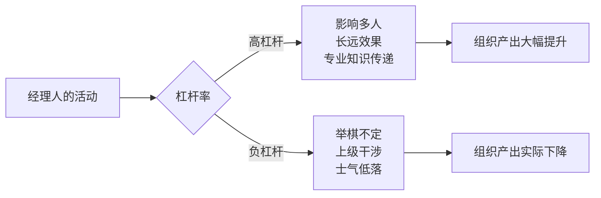
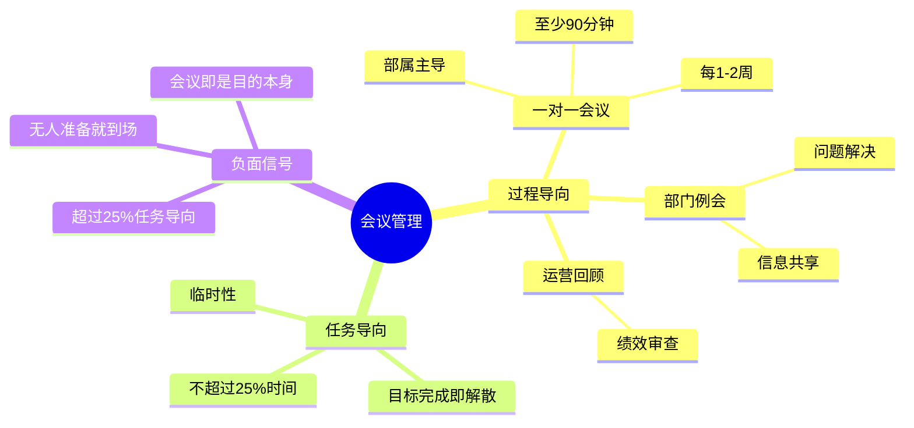

# 格鲁夫给经理人的第一课

> "经理人的产出，等于他直接管辖和影响力所及的组织产出的总和。"
> ——安迪·格鲁夫

《格鲁夫给经理人的第一课》（High Output Management，1983年）是[[安迪·格鲁夫]]在担任英特尔总裁期间写给中层经理人的实战手册。全书用一家早餐店类比企业管理，把抽象的管理问题变成可以操作的生产问题。谷歌、亚马逊、LinkedIn将其列为管理必读书目。

---

## 核心问题：经理人到底在生产什么？

工厂工人的产出容易衡量——多少个零件、多少吨钢铁。但经理人的产出是什么？

格鲁夫给出一个公式：

**经理人的产出 = 所有管理活动的（杠杆率 × 时间）之和**

经理人自己不是产出，他管辖和影响的组织产出才是产出。这意味着一个经理人的工作好坏，不看他个人多努力，而看他的活动对整个组织产生了多大的倍增效果。

---

## 早餐店：让管理看得见

全书用一家早餐店来解释所有管理概念，这是格鲁夫最聪明的写法。

早餐店有三个核心指标：**产出（几份早餐/小时）、库存（蛋白质和原料）、质量（顾客满意度）**。每个管理决定都可以在这三个维度上找到对应。

关键原则：**找到限制步骤，围绕它设计流程。** 煮鸡蛋最慢，所有其他工序都应该配合鸡蛋的节奏。管理工作中，永远存在限制步骤——找到它，不要在非限制步骤上浪费优化精力。

**质量检验的时机**：在产品价值最低时检验。鸡蛋坏了，在打碎前检查比煮熟后检查便宜。这个原则对应管理中的"在早期发现问题"。

---

## 高杠杆率活动：把时间放对地方

格鲁夫列出三类高杠杆率活动：

| 类型 | 例子 | 杠杆率来源 |
|------|------|-----------|
| 一个动作影响多人 | 培训课程、年度计划、全员演讲 | 规模效应 |
| 一个动作产生长远效果 | 绩效评估、招聘面试、建立索引系统 | 时间复利 |
| 专业知识传递给群体 | 技术培训、专家评审 | 知识扩散 |

负杠杆率同样存在，且往往危害更深：

- **举棋不定**：拖延决策等于作出了错误决策，组织在等待中停滞
- **上级干涉**：频繁越级干预，部属逐渐失去独立解决问题的能力
- **愁云惨雾**：一个经理的低落情绪会迅速传染整个部门

---

## 会议：不是活动，是媒介

格鲁夫把会议定义为"管理活动的媒介"，不是目的本身。他区分了两类会议：

**过程导向会议**（固定、周期性）：
- **一对一会议**：每周或每两周，与直属部属一对一，至少90分钟。由**部属**主导议程——因为这是他的会议，目的是让他解决问题，而不是让经理教导他。格鲁夫认为这是经理人最重要的单项活动。
- **部门例会**：每周，经理人+所有直属部属，互相分享信息，解决跨人员问题
- **运营回顾**：定期，更广泛的绩效审查

**任务导向会议**（临时、目标明确）：一旦任务完成即解散。这类会议不应超过全部会议时间的25%。

---

## 决策三步骤：自由讨论 → 明确决策 → 全力支持

格鲁夫对决策过程的描述简洁而深刻：

1. **自由讨论**：任何人都可以提出意见，包括反对意见，越充分越好
2. **明确决策**：到某个时间节点，必须作出清晰决定，不能模糊
3. **全力支持**：决定一旦作出，即使你在讨论中持反对意见，也必须全力执行

第三步最难，也最重要。如果讨论中的失败方带着情绪消极执行，整个组织的损耗远大于执行了一个略差的方案。

---

## 混血型组织与双重报告

**所有大型组织都是混血型**——任务导向（各自为战，贴近市场）和功能导向（集中资源，规模经济）的结合体。

以早餐连锁店为例：各分店有权调整本地菜单（任务导向），但设备采购、品质标准由总部统一管理（功能导向）。两者缺一不可，关键是找到合理的分界点。

**双重报告**（矩阵管理）是解决方案：一个员工同时向职能上司（知识权威）和项目经理（日常绩效）汇报。这源于美国国家航空航天局登月计划——当分包商的专业经理人和项目经理同等重要时，双重报告自然产生。

格鲁夫承认双重报告复杂，但认为没有更好的替代方案。它能否有效运作，取决于企业文化——健全的文化比任何组织图都重要。

---

## 任务相关成熟度：管理风格不能一成不变

这是格鲁夫最反直觉的观点之一：**没有一种普遍适用的领导风格。**

正确的管理风格取决于**任务相关成熟度**——员工在**这个具体任务**上的经验和能力，而不是他整体上是不是优秀员工。

| 任务相关成熟度 | 适合的管理风格 | 特征 |
|--------------|--------------|------|
| 低（新手） | 指令式 | 明确告知做什么、怎么做 |
| 中（有经验但不确定） | 辅导式 | 解释原因，双向沟通 |
| 高（熟练） | 授权式 | 设定目标，放手执行 |

同一个员工，在他熟悉的领域适合授权，在新领域必须退回指令式管理。经理人最常犯的错误是对熟练员工用了指令式，或对新手用了授权式。

---

## 绩效评估：最难的管理工作

格鲁夫用整整一章谈绩效评估，称它是"经理人最艰难的工作"。

**评估的目的是提升未来绩效，不是审判过去。** 评估结束时，部属应该知道：他的绩效怎么样，如何才能做得更好。

**评估的常见误区**：
- 对明星员工只有赞美，没有改进建议——格鲁夫认为这正好弄反了。应该在明星员工身上花更多时间，因为他们能产生更高的杠杆率
- 把评估变成说教，而不是要求行动承诺
- 混淆"同意我的看法"和"愿意行动"——格鲁夫说，只要部属愿意改进，不需要他同意你的评估

**突破性评估（处理问题员工）的五个阶段**：

1. 忽视问题存在
2. 否认问题（拿出证据后）
3. 怪罪他人（承认有问题，但推卸责任）
4. 担负责任（关键一步）
5. 寻找解决方案

上司的工作是帮助部属从第1步走到第4步，第4步之后的解决方案双方共同承担。

---

## 培训：杠杆率最高的管理活动

格鲁夫的计算值得记住：

> 如果你为10人团队投入16小时准备和讲授4堂课，假设培训使绩效提升1%，第二年这10人的工作时间约2万小时——1%就是200小时回报，回报率超过12倍。

**经理人自己负责培训，不能外包给咨询公司。** 原因：外部培训师传授的方法和公司实际运作方式不一致，反而会降低士气（格鲁夫在书中举了真实案例）。培训师必须是员工的榜样，有可信度和权威性。

---

## 激励：马斯洛的实用版

格鲁夫把马斯洛需求层次理论应用到薪酬激励上：

- 当员工关注薪资**绝对值**时，说明他还在满足基本需求，此时物质激励有效
- 当员工关注薪资**相对值**（和同事比较）时，说明他已进入自我实现需求，此时金钱只是计分工具

高层经理人的绩效奖金可占总报酬50%，中层经理约10%-25%——用浮动比例传递"绩效重要"的信号。

---

## 这本书在说什么

《格鲁夫给经理人的第一课》的底层逻辑只有一句话：**经理人的工作是生产，不是表演。**

管理不是开很多会、写很多报告、看起来很忙。管理是找到高杠杆率的活动，把时间集中在那里，让组织产出最大化。

格鲁夫给出了一个测试自己的框架：拿出上周的日程表，把每项活动标注高、中、低杠杆率。如果低杠杆率活动占多数，说明管理方式需要调整。

---

## 延伸阅读

- [[安迪·格鲁夫]]：格鲁夫的生平、英特尔转型、OKR起源
- [[俞军产品方法论]]：另一位科技管理者的思维框架
