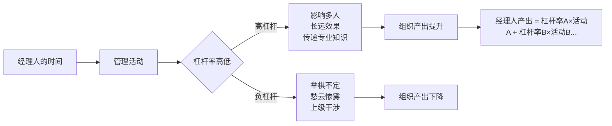
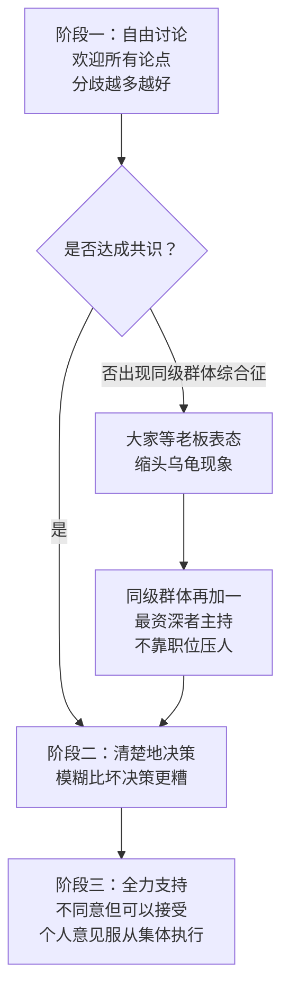
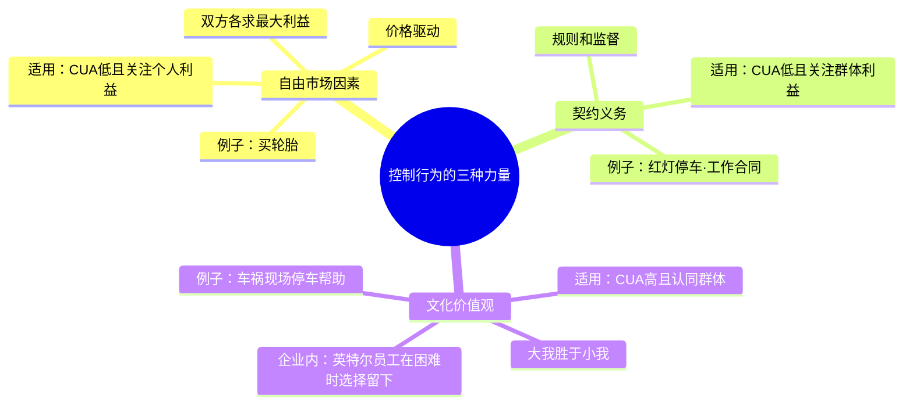

# 格鲁夫给经理人的第一课

> "让混沌丛生，然后掌控混沌。"
>
> 安迪·格鲁夫

《格鲁夫给经理人的第一课》（High Output Management，1983年初版，1995年增订）是[[安迪·格鲁夫]]在担任英特尔总裁期间写给中层经理人的实战手册。谷歌、亚马逊、LinkedIn将其列为管理必读，本·霍洛维茨称格鲁夫是他见过的最好的经理人。全书从一家早餐店回答同一个问题：**经理人到底在生产什么？**

---

## 早餐店：让管理看得见

格鲁夫让读者想象自己是餐厅服务生，负责同时端上热腾腾的煮3分钟鸡蛋、奶油面包和咖啡。

**找限制步骤。** 煮鸡蛋3分钟，烤面包1分钟，咖啡已在壶里。限制步骤是鸡蛋，所有其他工序都应倒推配合鸡蛋节奏，称为**时间互偿**。格鲁夫把同样的逻辑用在英特尔校园招聘：飞来公司参观面试的费用最高，所以先用校园面试和电话面试过滤候选人，让昂贵的步骤只处理最优质的申请者。

**及早发现，及早解决。** 生产流程中，原料价值最低时检验最便宜：坏鸡蛋在打碎前找出来，比煮熟后发现划算得多。格鲁夫用这个逻辑分析美国司法系统：花上百万美元定罪一个人，却因缺少8万美元一间的牢房让罪犯重回街头，这是把限制步骤搞错了。

**指标系统。** 格鲁夫设计了四类指标来监控产出：

| 指标类型 | 作用 | 早餐店的例子 |
|---------|------|------------|
| 先行指标 | 在问题显现前预警 | 机器故障记录、客户满意度 |
| 线性指标 | 对比实际与理想进度曲线 | 4月就能看出6月招聘目标是否无法完成 |
| 趋势指标 | 本月产出与过去数月比较 | 每日出货量是否挤在月底 |
| 重复印证表 | 每月更新预测，追踪预测准确性 | 格鲁夫称之为"企业发展上最重要的指标" |

每个指标必须有**配对指标**：只看存货水平会削减过度，配对上缺货率才能找到均衡点。

---

## 经理人的产出公式

**公式：经理人的产出 = 杠杆率A × 活动A + 杠杆率B × 活动B……**

经理人自己的工作成果不是产出，他管辖和影响的组织产出才是。提升产出有三条路：加速每项活动的速度、提高各项活动的杠杆率、用高杠杆活动替换低杠杆活动。

**高杠杆率活动举例：**
- 英特尔财务经理罗宾提前设计200人参与的年度财务计划流程，一人的周全思考省去了200人的混乱
- 绩效评估：几小时的工作对部属影响持续全年
- 走动管理：格鲁夫用"清洁周评审"让经理必须走到平时不去的角落，顺手收集第一手信息

**负杠杆率活动：**
- **举棋不定**：拖延决策等于作出错误决策，绿灯不亮就是红灯，整个组织在等待中停滞
- **愁云惨雾**：一位英特尔经理因部门无法盈利而沮丧，很快整个部门都笼罩在阴云里
- **上级干涉**：经理越级替部属解决问题，部属渐渐失去独立判断的直觉，转而事事等待上司

---

## 经理人的一天

格鲁夫在书中记录了自己实际一天的活动：共25项，2/3的时间花在开会上。他把管理活动归纳为五类：

| 活动类型 | 占比 | 例子 |
|---------|------|------|
| 信息收集 | 最多 | 看报告、餐厅偶遇培训部门同事 |
| 传递信息 | 较多 | 对200名新员工演讲公司历史和目标 |
| 制定决策 | 经常 | 否决离谱的加薪申请 |
| 给予提示 | 经常 | 打电话建议同事怎么做 |
| 为人表率 | 无处不在 | 如何打私人电话、如何对待部属 |

> "最重要的信息往往来自简短而非正式的谈话。书面报告的作用是建立数据文件，但更重要的是迫使撰写者进行自律。"

格鲁夫承认："事情永远做不完。就像家庭主妇一样，经理人永远有忙不完的事。"他的解决方案不是减少工作，而是识别并优先做高杠杆率的工作。

---

## 会议：不是目的，是媒介

格鲁夫把会议定义为"管理活动的媒介"，不是目的本身。任务导向会议不应超过全部会议时间的25%，超过则说明组织日常运营出了问题。

**一对一会议**是格鲁夫最重视的单项管理活动：每1-2周，至少90分钟，由**部属**主导议程。它的核心目的是互相传授技能和交流信息。判断传授是否成功的标志：谈话中，有没有看到部属的眼睛一亮？

---

## 决策：不挥舞权杖

**在信息和科技驱动的公司，知识力和职位权分离。** 工作5年后的高管对最新技术的了解，已不如刚入职的大学毕业生。"每个经理人每天都在折旧。"因此，好的决策必须让懂的人说话，而不是让权力最大的人说话。

**同级群体综合征**：格鲁夫在英特尔培训中做过实验：一群同等级经理开会，主席被支开后，15分钟仍找不到问题核心，只是漫无边际地打转。解决方案是**同级群体再加一**：加入一位资深经理，他未必最懂，但知道决策该如何产生。

**制定决策前的六个问题：**
1. 决策的内容是什么？
2. 决策的时限？
3. 谁是决策人？
4. 在决策前应先咨询谁？
5. 谁能否决这个决策？
6. 决策后应通知谁？

格鲁夫用英特尔菲律宾扩厂为例：旧厂附近建高楼 vs 另觅新址建平层厂房，双方僵持。用六问框架厘清：时限一个月（根据完工两年半的目标倒推）、决策人是施工和制造两方经理、最终决策者是格鲁夫、董事长摩尔需知晓。结果选扩建旧厂，建4层楼（再高成本大幅增加）。

---

## 组织结构：混血型与双重报告

**所有大型组织都是混血型**：任务导向（分权，贴近市场）和功能导向（集权，规模经济）的结合。早餐连锁店：各分店调整本地菜单（任务导向），但设备采购和质量标准由总部统一（功能导向）。

**双重报告（矩阵管理）：** 格鲁夫以制程工程师辛迪为例。她80%的时间向本厂资深工程师汇报；同时作为跨厂制程协调小组成员，向小组主席汇报。她出现在两张组织图上，专业知识的杠杆率覆盖了所有工厂，而非只有一个厂。

---

## 三个"长官"：行为控制的三种模式

**CUA**（Complexity 复杂性、Uncertainty 不确定性、Ambiguity 指令模糊性）越高，文化价值观越重要。英特尔运输经理迈克因搞不清楚到底该听命于谁（高Ambiguity）而辞职，这是组织设计失败，不是个人问题。

新员工刚入职，关注自身利益，管理者应给明确架构降低CUA；随着他对公司产生归属感，文化主导的行为逐渐生效。外聘"空降部队"担任高级经理时风险最高：面对烫手山芋（高CUA），又尚未建立企业价值观，两种不利因素叠加。

---

## 激励：把办公室变成竞技场

格鲁夫的激励逻辑从一个测试开始：**如果这个员工的命靠做这件事才能保住，他肯不肯做？** 如果肯，之前不做是"不为"（缺乏诱因）；不肯，是"不能"（能力不足）。

格鲁夫借用运动竞赛的比喻：将办公室变成竞技场，培养**运动家精神**：求胜但不怕输，随时向自己的极限挑战。员工需要看到跑道（知道怎么赢）、感受到比赛（目标有挑战性）、获得即时反馈（看到分数）。

**马斯洛应用：** 当员工关注薪资绝对值，说明还在满足生理和安全需求；当员工关注薪资相对值（和同事比），说明进入自我实现层次，金钱只是计分工具。高层经理人绩效奖金可占总报酬50%，中层约10%~25%，用浮动比例传递"绩效重要"的信号。

---

## 任务相关成熟度

格鲁夫最反直觉的观点之一：**没有普遍适用的管理风格，正确的风格取决于员工在这个具体任务上的成熟度。**

| 任务相关成熟度 | 管理风格 | 具体做法 |
|--------------|--------|--------|
| 低（新手或调岗） | 指令式 | 明确告知做什么、怎么做 |
| 中（有经验但不确定） | 沟通式 | 解释原因，双向讨论 |
| 高（熟练专家） | 授权式 | 设定目标，放手执行 |

格鲁夫做过一个调查：90%的上司认为自己比部属认为的更擅长授权和沟通。原因之一：上司给的"建议"，下属常当成"命令"来执行。

---

## 绩效评估：最具杠杆率的管理工作

格鲁夫称绩效评估是"经理人最具高管理杠杆率的活动"，评估结果对部属影响持续全年。**评估的唯一目的：提升未来绩效，不是审判过去。**

**评估维度的权衡：**
- **产出评估 vs 流程评估：** 格鲁夫犯过一个真实错误：某经理第一年产出数据漂亮，给了高分；第二年数据惨淡才发现，第一年的高产出是消耗员工队伍的结果，流程评估本应很差
- **短期 vs 长期绩效：** 当期产出和为未来铺路的活动都要纳入，用现值换算
- **潜力陷阱：** 有人业绩亏损、进度落后，但上司说"他很杰出，只是部属没干好"，格鲁夫拒绝核准，"否则等于暗示大家：只要表演得像个精明经理人，不用真的努力工作"

**告知结果的三原则：坦诚、倾听、忘了你自己。**

格鲁夫对"倾听"有特殊定义：动用所有感官确保部属真正听进去：如果他的肢体语言显示没有真正理解，你有责任换个角度再解释，直到信息真正输送进他的脑子里。好老师知道学生到底懂没懂；只对着黑板自言自语、故意躲避学生眼光的教授，是格鲁夫最反对的管理典型。

---

## 培训：杠杆率最高的活动

格鲁夫的算术：为10人团队准备并讲4堂课，合计16小时投入。假设培训使绩效提升1%，这10人第二年工作时间约2万小时，1%等于200小时回报，回报率超过12倍。

**英特尔的离子注入机事故：** 一台精密机器运转失调，操作员是新手，培训时没人教他如何判断机器是否正常。他让机器继续运转，导致近一天的半成品全部作废，损失约100万美元，还拖延了客户交货时间。这是培训缺失的直接成本。

**经理人必须自己负责培训，不能外包给咨询公司。** 格鲁夫的案例：咨询顾问建议英特尔员工按照职业生涯规划做工作轮调，但英特尔传统是"自由市场"（员工主动应聘公开空缺），这种不一致让受训员工士气低落了一阵子。英特尔员工有2%~4%的工作时间在课堂上，绝大多数讲师是内部经理，课程超过50种，包括"如何操作离子注入机"（200小时在职培训，比拿飞行执照还长5倍）。

---

## 招募、薪酬与爱将辞职

**招募面试的七个考察维度：** 技术知识、过去实际做了什么（不只是知道什么）、简历和言谈的不一致之处、成功和失败各自的原因、同僚对他的评价、在管理职责上做了什么（招聘、评估经历）、价值观是否与公司一致。

**爱将突然提出辞职**是格鲁夫所说的"经理人最大的梦魇"。正确处置：立刻放下手头一切，请他到办公室坐下，问为什么，不争辩。让他说完事先准备好的那套词，真正的理由往往在那之后才出现。然后争取时间，向自己的上司求援，以整个公司的利益考虑，即便最终要调到其他部门也要尽力留住这个人才。

**彼得原理与再回收：** 一个成就导向型的人会一直在"及格"和"表现优异"之间交替，直到停在"及格"线上。如果一个人被提升到超出能力太多的职位，解决方案是"再回收"：放回他曾表现优异的岗位。格鲁夫认为这是管理层的错误，应该勇于认错。以他的经验，这样的人重建信心后，往往成为炙手可热的晋升候选人，而且第二次大多成功。

---

## 底层逻辑

这本书只有一句话：**经理人的工作是生产，不是表演。**

管理不是开很多会、写很多报告、看起来很忙。管理是找到高杠杆率的活动，把时间集中在那里。格鲁夫在最后给出了一个自测方法：**拿出上周的日程表，把每项活动标注高、中、低杠杆率。如果低杠杆率活动占多数，管理方式需要调整。**

全书以"期末考"结尾：25道具体作业，每道10~20分，满分超过100分才算合格经理人。例如：为所有直属部属排好一对一会议时间表（20分），找出上周日程表中高中低杠杆率活动（10分），列出公司未来三个月最重要的三个目标并一路验收（20分）。

---

## 延伸阅读

- [[安迪·格鲁夫]]：格鲁夫的生平、英特尔DRAM危机与转型
- [[高产出管理]]：本书核心框架的详细拆解
- [[OKR]]：从iMBO到谷歌的传播路径
- [[赢]]：韦尔奇的管理哲学对比
- [[好战略坏战略]]：战略层面的管理思维
- [[学会提问]]：批判性思维框架，与格鲁夫的"坦诚反馈"和"决策前六问"在认知工具层面互补
