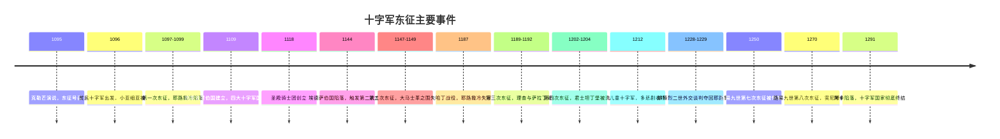
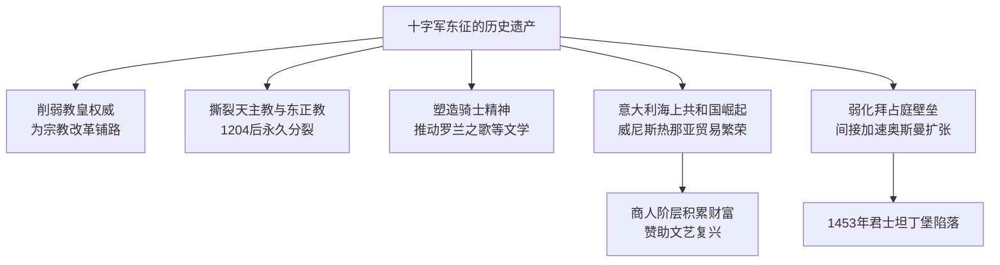

# 燃烧的远征：十字军东征简史

拉尔斯·布朗沃思（Lars Brownworth）著。本书以叙事史的笔法，从拜占庭皇帝阿历克塞一世向教皇求援写起，一路追踪8次主要东征，直至1291年最后一个十字军城市阿卡陷落。全书的核心立场是：十字军东征不是无端的侵略，而是数百年伊斯兰扩张之后基督教世界的防御性回应。

## 人物速记

> 这本书人名密集，都是陌生的拉丁语/希腊语拼音。每个人配一句记忆钩子，帮助快速建立印象。

### 幕后推手

| 人名 | 记忆钩子 | 关键一幕 |
|------|---------|---------|
| **阿历克塞一世**（拜占庭皇帝） | 精明的"乙方"——本来只是想要几百名雇佣兵，结果来了十五万人 | 讽刺要求当大统领的博希蒙德："你不配当我的朋友，也不配当我的敌人" |
| **乌尔班二世**（教皇） | 一场演讲改变历史的人，自己也被反应吓到了 | 克勒芒演说结束，红布被抢光，他之前还在努力控制参与人数 |
| **隐士彼得** | 狂热传教士，带着农民冲进屠刀 | 率数万平民先于正规军出发，在小亚细亚被土耳其人几乎全歼 |
| **恩里科·丹多洛**（威尼斯总督） | 90岁近全盲的老狐狸，把整个东征劫持成威尼斯的商业行动 | 第四次东征：胁迫十字军攻打基督教城市扎拉，再引导洗劫君士坦丁堡 |

### 第一次东征：四位亲王

| 人名 | 一句话定性 | 记住他的原因 |
|------|----------|-----------|
| **布永的戈弗雷** | 名义上的第一任耶路撒冷统治者，拒绝戴王冠 | "基督在这里戴荆冠，我不能戴金冠"——自称"圣墓守护者"而非国王 |
| **博希蒙德一世** | 最有野心的诺曼冒险者，攻下安条克据为己有 | 要求当"大统领"遭拒，最终因野心过大被阿历克塞玩弄于股掌，郁郁而终 |
| **图卢兹的雷蒙德** | 最富有、最老、最自命不凡，与博希蒙德互掐 | 军队在拜占庭境内被揍，后来攻打的黎波里时被塌下来的屋顶砸成重伤，数月后去世 |
| **鲍德温一世** | 最务实的人，把耶路撒冷真正建成了一个国家 | 弟弟戈弗雷死后接任，东征大佬里死得最晚，在埃及吃鱼吃坏了肚子驾崩 |

### 高光人物

| 人名 | 记忆钩子 | 关键一幕 |
|------|---------|---------|
| **萨拉丁** | 库尔德人出身，一统伊斯兰世界，夺回耶路撒冷，却出人意料地宽容 | 哈丁大胜后亲手砍了雷纳尔的头，却给国王居伊倒了杯冰水，礼待贵宾 |
| **鲍德温四世**（麻风王） | 最悲壮的国王——13岁即位，全身溃疡、失明、双手废用，仍亲自上战场 | 1177年蒙吉萨，浑身缠满绷带被抬上马，突袭萨拉丁，对方骑骆驼逃跑 |
| **狮心王理查** | 军事天才但政治白痴——赢了所有战役，却始终没踏进他誓要解放的耶路撒冷 | 阿尔苏夫战役：在弓骑兵连续骚扰下保持队形，精准时机骑兵冲锋，打垮萨拉丁主力 |
| **腓特烈·巴巴罗萨**（红胡子皇帝） | 欧洲最强大的君主，率10万大军出发，渡河时溺死了 | 1190年穿越安纳托利亚，在萨雷夫河渡河时落水身亡，德意志军队随即崩溃 |
| **腓特烈二世** | 被教皇开除教籍，却用外交谈判夺回了刀剑几十年没能保住的耶路撒冷 | 与埃及苏丹卡米勒签约换回耶路撒冷控制权，随后在没有教皇祝福的情况下自己给自己加冕 |
| **路易九世**（圣路易） | 最虔诚的国王，两次东征都失败，临死最后一个词是"耶路撒冷" | 第八次东征在突尼斯染痢疾，要求穿悔罪白袍卧于灰烬中，次日清晨去世 |

### 反派角色

| 人名 | 记忆钩子 | 下场 |
|------|---------|-----|
| **沙蒂永的雷纳尔** | 东征史上最鲁莽的人，每次都在最坏的时机做最坏的决定 | 袭击萨拉丁的骆驼商队，成为哈丁战役的导火索，哈丁大败后萨拉丁亲手砍下他的头颅 |
| **阿历克塞四世**（拜占庭皇子） | 空头支票开出去了，发现国库根本兑付不了 | 许诺给十字军的钱付不出，开始洗劫教堂圣物，被暴民推翻，父子俩关在地牢里死去 |

---

## 起源与背景

### 阿历克塞一世的政治算计

1095年，拜占庭皇帝阿历克塞一世的处境岌岌可危。1071年曼齐克特之役，拜占庭军队被塞尔柱土耳其人击溃，皇帝本人被俘，小亚细亚的精锐土地几乎丧失殆尽。他没有足够的军队收复失地，于是向教皇乌尔班二世求援，希望获得几百名可靠的西方重甲骑士来充当自己军队的中坚。

他得到的远不止这些。

### 克勒芒演说的意外连锁反应

1095年11月，乌尔班二世在法国克勒芒的布道超出了所有人的预期。他描绘了土耳其人在耶路撒冷迫害基督徒朝圣者的暴行（书中引用了兰斯的罗贝尔的记录，描述被剖腹、逼绕柱爬行至死的图景），呼吁基督教骑士为解放圣地而战。

讲话结束时，人群中响起"上帝的旨意"（Deus vult!）的呼喊，贵族们争先恐后地要在衣服上缝上十字标记，红布很快用尽。乌尔班本人也对这样的反响感到意外。

布朗沃思的分析：这场运动之所以爆发，不仅因为教皇的口才，更因为11世纪欧洲整体的宗教意识觉醒——距耶稣降生已满千年，末日审判的焦虑弥漫，朝圣风潮盛行，而耶路撒冷是这一切的终极目的地。

## 八次东征全景

## 第一次东征：从混乱到奇迹（1095—1099）

### 贫民十字军的覆灭

隐士彼得率领的这支杂牌军是东征号召的第一批响应者。由农民、平民和底层骑士构成，严重缺乏补给和组织。在匈牙利和拜占庭境内沿途抢劫，抵达小亚细亚后，被基利杰·阿尔斯兰的土耳其军队在尼西亚附近几乎全歼。隐士彼得本人侥幸生还，后来加入了正规军队。

书中一个细节：土耳其人堆起了基督徒的尸骨，以至于那堆白骨成为之后正规军经过时触目惊心的警示。

### 亲王十字军的组成与性格

正规军的四位主要领袖各有鲜明性格：

拜占庭皇帝阿历克塞一世的表演令人叹服：他轮流向每位亲王施以礼遇、赠予重礼、索取效忠誓言。博希蒙德要求当"大统领"时，阿历克塞讽刺道："让你的行为来评判自己，去赢得属于你自己的帐篷吧……你不配当我的朋友，也不配当我的敌人。"

### 安条克之围与圣枪的力量

安条克之围是第一次东征最漫长也最戏剧性的环节（1097年10月至1098年6月）。围城八个月后，十字军通过内奸攻入城中，随即自己被来自摩苏尔的卡布卡大军包围。粮绝、疾病蔓延之际，法国神秘主义者彼得·巴塞洛缪声称梦见圣枪（长刺耶稣的长矛）埋于城内某教堂地下。挖掘出铁器后，士气立刻逆转。历史学家至今争议那是否真是圣枪，但布朗沃思的判断很清晰：无论真伪，相信的心理效果是真实的。

### 耶路撒冷陷落与屠城

1099年7月15日，第一次东征的目标实现：耶路撒冷陷落。随之而来的是一场骇人的屠杀。穆斯林、犹太人，乃至东方基督徒，无论老幼，被大规模杀死。骑士们涉血及踝，在圣墓教堂前跪下祈祷。

布朗沃思没有为这场屠杀辩护，但他指出了历史语境：拒绝投降的城市遭到洗劫是当时普遍认可的战争惯例，穆斯林军队在征服城市时同样如此。

## 十字军国家的建立与危机（1099—1187）

### 四国并立的结构性弱点

耶路撒冷王国、安条克公国、埃德萨伯国、的黎波里伯国——四个十字军国家的关系如同松散联盟，耶路撒冷国王名义上是最高领主，但实际约束力有限。鲍德温一世以罕见的政治手腕维持了团结，但他去世后，这个弱点就不断暴露。

### 圣殿骑士团与医院骑士团的诞生

1118年，法国骑士于格·德·帕英带着8名同伴来到耶路撒冷，请求以宗教方式守卫朝圣之路。耶路撒冷牧首在修道士三誓（清贫、顺从、纯洁）之外为他们增加了第四条：以武力保护朝圣者。这是基督教戒律与军事技巧的第一次结合。鲍德温二世将圣殿山的宫殿分出一部分作为总部，"圣殿骑士团"由此得名。

书中的原创观察：圣殿骑士团迅速成为世界最早的国际银行——朝圣者可以在欧洲存钱，持收条在圣地提款，骑士团从中收取手续费。

### 血地之战（1119）的警示

罗杰摄政王不顾鲍德温二世的劝阻，率领安条克全部战力深入叙利亚腹地，被阿勒颇埃米尔精心布置的包围圈歼灭。十字军此后建立起的战无不胜神话就此破灭。这场战役的教训布朗沃思认为是：**内部争权夺利** 与 **高估自身实力** 的结合，是十字军国家危机的根本来源。

## 萨拉丁的崛起与哈丁之战（1187）

### 萨拉丁的历史形象

布朗沃思笔下的萨拉丁是全书最立体的人物。库尔德出身的他通过叔父谢尔库赫进入努尔丁麾下，逐步统一了埃及和叙利亚的伊斯兰世界。他的形象有两个维度：

- **军事与政治的冷静**：收复耶路撒冷后，他拒绝了大规模屠杀，允许有钱赎身者离开，并保留了圣墓教堂的开放。
- **圣战狂热的一面**：他的私人传记作家白哈艾丁记载："他从来不谈其他事，也不支持讨论其他事或鼓励其他行动的任何人。"处决圣殿骑士团和医院骑士团的俘虏时，他有意制造恐怖效果来动摇骑士们的信仰。

### 麻风王鲍德温四世

这是书中最令人动容的人物。十三岁即位，全身溃疡，最终失明、双手废用、无法骑马。但他多次在绝境中挺身而出——1177年蒙吉萨奇袭，以极少的骑士击败萨拉丁，让后者骑骆驼狼狈逃窜。书中引用他给路易七世的信："阿拉伯人入侵的威胁每日萦绕在圣地上空，在这样的时刻，如我这般虚弱的人无力掌控这里的权力。"

他无子嗣，指定了鲁莽的居伊做继承人，却无法阻止继任者的错误决策。

### 哈丁战役（1187年7月4日）

沙蒂永的雷纳尔袭击了萨拉丁的骆驼商队，撕毁了和约。居伊被迫应战，中了萨拉丁的诱敌之计，在无水平原上行军到哈丁角，被完全包围。萨拉丁的军队彻夜燃烧灌木，让浓烟熏向基督徒营地。第二天，一场没有悬念的歼灭战结束了十字军国家的全部战斗力。

1187年10月2日，耶路撒冷投降。自1099年至今，基督徒统治了88年。

## 第三次东征：理查与萨拉丁（1189—1192）

三位欧洲大君主响应号召：腓特烈·巴巴罗萨（神圣罗马帝国皇帝）、腓力二世（法国）、理查（英格兰）。

巴巴罗萨率领近10万人出发，是历史上装备最精良的东征军。结果他在穿越安纳托利亚时，渡过萨雷夫河时溺死，德意志军队随即崩溃瓦解——这是第三次东征最大的悲剧性意外。

理查一世（狮心王）是书中公认的军事天才。阿尔苏夫战役中，他在弓骑兵连续骚扰之下保持队形不乱，然后在精准时机发起骑兵冲锋，歼灭了萨拉丁的主力。布朗沃思的判断：理查是纯粹的战术大师，但缺乏政治眼光——他宁愿打仗也不愿谈判。

最终双方达成协议：基督徒可以自由前往耶路撒冷朝圣，但耶路撒冷由穆斯林统治。理查未曾踏入耶路撒冷。

## 第四次东征：威尼斯的阴谋与帝国的覆灭（1202—1204）

这是整本书最具讽刺意味的篇章。威尼斯总督恩里科·丹多洛（据称已年近90岁、近乎全盲）将整支十字军操控成威尼斯的工具：先是胁迫攻击同为基督徒的扎拉城，再是引导十字军洗劫君士坦丁堡。

1204年，攻破君士坦丁堡后，西方骑士对这座全球最富有的基督教城市实施了三天的蹂躏——圣索非亚大教堂的祭坛被破坏，法国妓女在牧首宝座上跳舞，古希腊雕像、皇帝陵墓、手抄本被熔化或焚毁。教皇英诺森三世震惊谴责，但为时已晚。

> 布朗沃思的核心论断：第四次东征实质上是东方基督教势力的自我消灭。拜占庭帝国虽于1261年夺回君士坦丁堡，却再未恢复元气，从而移除了基督教世界抵御伊斯兰扩张的最大屏障。

## 后期东征的衰竭

### 儿童十字军（1212）

德意志少年尼古拉斯·冯·科隆和法国牧童斯蒂芬各自率领数万儿童出发，声称上帝会在他们面前分开大海。两支队伍均未抵达圣地——德意志的在阿尔卑斯山折损大半，法国的据说被威尼斯商人贩卖为奴。这一章节集中体现了布朗沃思对东征"宗教狂热淹没理性"的批判。

### 腓特烈二世的外交奇迹（1228—1229）

第六次东征是个例外。被教皇开除教籍的腓特烈二世没有通过武力，而是与埃及苏丹卡米勒谈判，通过条约换来了耶路撒冷、伯利恒和拿撒勒15年的控制权。他在没有任何教皇祝福的情况下在圣墓教堂自己为自己加冕。

教皇和骑士团对这一结果都非常不满——前者怒于他的擅自行动，后者认为不通过战斗夺回圣地是奇耻大辱。耶路撒冷的基督徒反而欢迎了这个结果。

### 路易九世：虔诚的失败（1248, 1270）

法国国王路易九世（后封圣路易）参加了两次东征，均以失败告终。第七次被俘于埃及，以巨额赎金换取自由；第八次在突尼斯染痢疾身亡，临死的最后一个词是"耶路撒冷"。布朗沃思认为他的失败是结构性的，而非个人的，东征的时代已经过去。

## 终局：阿卡陷落（1291）

马穆鲁克苏丹拜巴尔一世于1277年死后，其继任者乘势推进。1291年，伊斯兰大军包围阿卡。三大骑士团（圣殿骑士团、医院骑士团、条顿骑士团）放下争吵，头一次真正团结作战，以1:7的兵力劣势坚守了一个多月。5月18日，城墙破开。骑士们以血肉之躯掩护妇女儿童撤退，绝大多数战死。

到1291年年底，沿海最后的堡垒全部陷落。穆斯林拆毁了海岸全部防御工事。"阿卡、提尔和的黎波里等古代文化与治学中心成了一堆冒烟的废墟，再也未能复原。"

## 历史影响：布朗沃思的核心论断

### 被误读的遗产

书中尾声专门反驳一个现代流行观点：十字军东征是如今伊斯兰极端主义的根源。布朗沃思的论据：

- 阿拉伯语中"十字军"一词直到19世纪才出现
- 第一部有关东征的阿拉伯文历史著作直到1899年才问世
- 在穆斯林看来，十字军与其他失败的异教徒入侵者没有本质区别
- 萨拉丁的"英雄化"是20世纪反殖民运动的产物，不是历史传统

### 真实的影响

## 主要观点

1. **东征是防御性回应，而非无端侵略**。公元7—11世纪，伊斯兰教力量已吞并北非全部基督教领地、大半西班牙、叙利亚、巴勒斯坦和安纳托利亚。东征发起时，这是数百年持续失地之后的反击。

2. **内部分裂比外部压力更致命**。十字军国家从未有足够的人手，却反复因领导层争权而削弱自身——博希蒙德的野心、雷纳尔的鲁莽、居伊的软弱，每一次内耗都在关键时刻暴露。

3. **拜占庭与十字军的互不信任是结构性悲剧**。阿历克塞一世的精明背后是务实，但每次精明操作都加深了西方人对"希腊人两面三刀"的印象，最终导致了第四次东征的灾难性逆转。

4. **圣殿骑士团是金融创新的意外结果**。从保护朝圣者的军事修道士，到创造汇票系统的国际银行，这一转变是制度在需求中自我演化的典型案例。

5. **萨拉丁的"宽容"具有战略理性**。他允许基督徒赎身、保留圣墓教堂开放，一方面出于个人气质，另一方面也出于现实考量——残酷可能激发更顽强的抵抗，而有序投降对他的长期统治更有利。

6. **腓特烈二世的外交路线证明战争不是唯一选项**。被逐出教会的皇帝用谈判换回了刀光剑影几十年都没能保住的耶路撒冷，却因此被骑士团视为叛徒。制度对非标准路径的排斥有时比外部威胁更顽固。

7. **东征对欧洲的最大遗产是间接的**：威尼斯、热那亚的贸易繁荣催生了商人阶层，商人阶层赞助了文艺复兴，文艺复兴带来了近代科学与地理大发现。克里斯托弗·哥伦布1492年的航行，资金来自再征服运动胜利后的西班牙，而哥伦布本人仍在祈祷将新大陆的财富用于"解放耶路撒冷"——那已是最后一批有这种想法的人之一。

## 结论与启示

**结论**：十字军东征是宗教激情与政治现实、骑士理想与人性贪婪之间持续两百年的张力。它没有完成既定目标，却以意想不到的方式重塑了欧洲——削弱了教廷权威，分裂了基督教世界，也通过贸易播下了文艺复兴的种子。

**启示**：
1. **被激情驱动的运动，往往在制度设计和目标持续性上存在根本缺陷**。乌尔班二世掀起的运动远超他的预期，后续200年的东征越来越难复制第一次的凝聚力，最终被政治利益彻底侵蚀。
2. **分裂的代价超过外部威胁的代价**。十字军国家长期人手不足，但每一次灾难性失败几乎都与内部争权、拒绝协作直接相关，而非单纯的兵力不足。
3. **历史叙事的塑造者往往是失败者而非胜利者**。十字军东征在伊斯兰世界几乎被遗忘了800年，直到20世纪的民族主义需要它。"谁讲故事，谁定义意义"的规律在这里以极端形式呈现。

## 思考问题

1. 如果第四次东征没有洗劫君士坦丁堡，拜占庭帝国会在多大程度上延缓奥斯曼的扩张？欧洲历史走向会有何不同？
2. 腓特烈二世用谈判而非战争夺回耶路撒冷，却遭到骑士团和教皇的强烈反对。这种对"正确程序"的执着，在什么程度上是组织的自我保护本能？
3. 圣殿骑士团从军事修道士演化为国际银行，是历史的偶然还是制度逻辑的必然？在当今世界，类似的"功能漂移"还在哪里发生？
4. 布朗沃思认为"十字军造成今日恐怖主义"是错误观点。但19—20世纪殖民时期对东征故事的重新包装与传播，是否本身构成了一种伤害？
5. 麻风王鲍德温四世的案例：一个身体残破却意志顽强的领袖，在什么条件下是力量，在什么条件下反而加剧了继承危机？

## 重要引用

> "一个背离了上帝的种族……暴力入侵了基督徒的土地。"
> ——乌尔班二世在克勒芒的演讲（1095年）

> "在沉睡中我们麻木，狼群已把畜栏闯入……"
> ——塞巴斯蒂安·布兰特，《愚人船》，1494年出版

## 关键术语

- **贫民十字军（The People's Crusade）**：1096年隐士彼得率领的未经组织的平民东征队伍，在小亚细亚被歼灭，为正规军起到了反面示范作用。
- **圣殿骑士团（Knights Templar）**：1118年成立，兼具军事修道士与国际银行家双重身份，1307年被法国国王腓力四世以莫须有罪名解散。
- **医院骑士团（Knights Hospitaller）**：起源于耶路撒冷医院，后军事化，十字军国家灭亡后辗转罗得岛、马耳他，至今以人道主义组织形式存续。
- **哈丁战役（Battle of Hattin, 1187）**：萨拉丁消灭十字军国家战斗力的决定性战役，史称"一个早晨摧毁了一百年"。
- **再征服运动（Reconquista）**：伊比利亚半岛700年的基督教反攻，1492年完成，为西班牙的地理大发现提供了资金和动力。
- **祭司王约翰（Prester John）**：传说中东方某处存在的神秘基督教国王，被十字军反复寄望为救兵。实际上是蒙古人入侵中东时产生的以讹传讹。
- **血地之战（Battle of Ager Sanguinis, 1119）**：安条克摄政王罗杰忽视国王警告，率全部战力冒进叙利亚，全军覆没，第一次打破了法兰克人战无不胜的神话。
