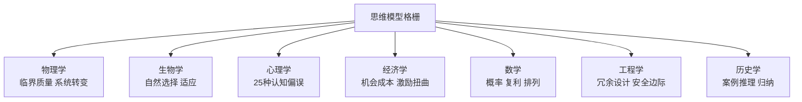

# 穷查理宝典

《穷查理宝典》（Poor Charlie's Almanack）是[[查理·芒格]]（Charlie Munger，1924-2023）的思想文集，由彼得·考夫曼（Peter Kaufman）编辑，2005年首版，2023年推出扩充版。书名致敬本杰明·富兰克林的《穷理查年鉴》，传承其务实、自立的生活哲学传统。全书收录芒格在哈佛大学、南加州大学、魏斯科金融股东会等场合发表的11篇演讲，是理解其思想体系的一手文献。

## 思维模型格栅

芒格认为人犯错的根本原因是用单一框架看复杂问题，他称之为"铁锤人综合症"：手里只有锤子，眼中一切都像钉子。他的解法是建立思维模型格栅（Latticework of Mental Models）：从每个重要学科提取最核心的1至2个模型，整合为协同运作的认知工具库。

学科之间的交叉点往往是最有价值的洞见来源。芒格从未公布标准版本，但研究者从其演讲中归纳出的核心分析变量超过100个，涵盖竞争格局、成本结构、管理层激励、护城河可持续性、监管风险、资本分配能力等维度。这套多变量清单是他分析每一家潜在投资标的的基础框架。

## 逆向思维

逆向思维（Inversion）是芒格最常援引的思维工具之一，来源于德国数学家雅可比（Carl Jacobi）的格言：

> "反过来想，总是反过来想。"（Invert, always invert.）

应用方式是：与其问"我如何才能成功"，先问"我如何才能确保失败"，再系统规避那些失败路径。负面清单（what to avoid）比正面清单（what to do）更可靠，原因在于人对损失的判断比对收益的判断更准确，也更少受到自我欺骗干扰。

在投资实践中，逆向思维体现为"先想为什么不能投"。他与[[巴菲特]]在伯克希尔的大量决策，起点是主动排除不符合标准的机会，而非积极寻找机会。这与[[价值投资]]中安全边际的防御性逻辑一脉相承。

## 人类误判心理学：25种认知偏误

芒格在《关于人类误判心理学》演讲中列举了25种认知偏误，是将心理学系统纳入商业分析框架的早期尝试。影响最广的偏误包括：

| 偏误 | 核心描述 |
|------|---------|
| 激励扭曲 | 人按激励行事，而非按道德行事；设计制度必须先审激励结构 |
| 社会认同 | 不确定时跟随多数人，导致群体性错误 |
| 喜爱偏误 | 对喜欢的人更难拒绝，倾向于认同其观点、忽视其缺点 |
| 厌恶偏误 | 对讨厌的人或事物的判断系统性偏低 |
| 厌恶损失 | 损失的痛苦约是同等收益快乐的2倍，导致持亏不割 |
| 禀赋效应 | 拥有某物后，评估其价值高于未拥有时的出价 |
| 沉没成本 | 因已投入而继续追加，而非根据未来预期决策 |
| 可得性偏误 | 更易回忆的信息被赋予更高权重，生动案例胜过枯燥统计 |
| 过度自信 | 高估自身能力和判断的准确性，在专业领域尤为严重 |
| 对比谬误 | 判断受参照物影响而非绝对值影响 |
| 权威偏误 | 对权威来源的信息采信度远高于同等质量的非权威来源 |
| 关联效应 | 长期在特定激励环境中工作后，潜意识将正确结论与个人利益挂钩 |

芒格认为这些偏误常叠加发生，形成他所称的"Lollapalooza效应"：多个偏误同方向叠加时，合力远超各自独立作用之和，是历史上重大灾难性决策的根源。

## 商业分析清单

芒格描述的企业分析框架覆盖100余个变量，主要维度包括：

- **生意模式** ：这家公司靠什么盈利？护城河来源是什么？
- **竞争格局** ：谁在竞争？竞争是价格战还是体验战？
- **成本结构** ：固定成本与可变成本的比例；规模效应是否存在
- **管理层激励** ：股权结构、薪酬机制是否与长期股东利益一致
- **资本分配能力** ：管理层历史上如何使用自由现金流
- **监管与法律风险** ：商业模式是否依赖特定政策环境
- **文化可持续性** ：企业文化是否能在创始人离开后延续

这套清单无标准官方版本，芒格从未发布完整列表，但其核心逻辑贯穿全书所有演讲。[[段永平投资哲学]] 中的"本分"筛选标准与这套清单高度呼应，尤其是管理层激励与文化评估两个维度。

## 与价值投资体系的关系

芒格是[[巴菲特]]的长期合伙人。他在伯克希尔的核心贡献是将巴菲特偏向格雷厄姆式定量分析的框架，扩展为包含定性判断、心理分析和跨学科推理的更完整体系。

巴菲特曾公开表示，是芒格说服他从"以合理价格买普通公司"转向"以合理价格买优秀公司"。

[[段永平]] 深受芒格影响。其投资铁律"不懂不碰"对应芒格的能力圈原则，"本分"评估对应芒格的管理层激励分析，三条铁律对逆向思维的应用也与芒格的负面清单方法论一致。更多详见[[段永平投资哲学]]。

详见 → [[价值投资]]、[[段永平投资哲学]]、[[巴菲特]]
