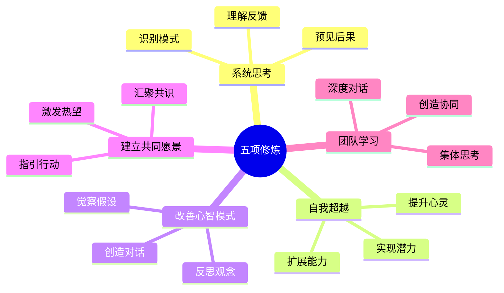
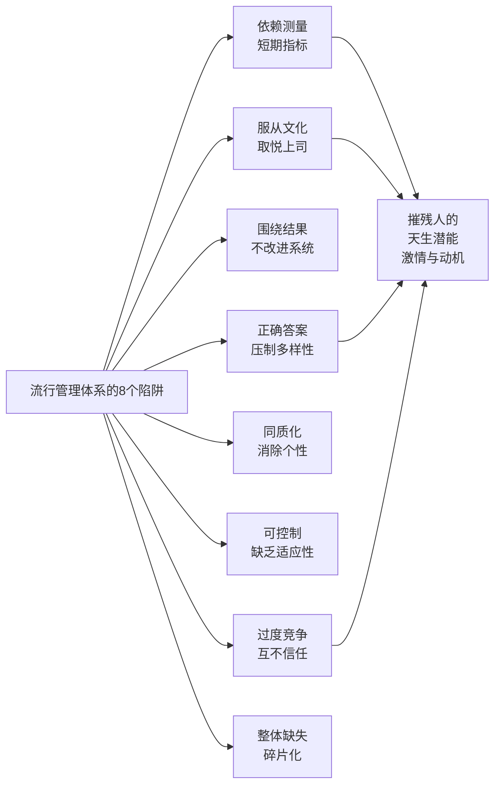

# 第五项修炼——学习型组织的艺术与实践

## 章节概述

彼得·圣吉的《第五项修炼》是全球管理学领域的经典著作，全球畅销超过百万册。2009年全新扩充修订版将原有理论与15年实践经验相结合，增加100多页新内容。本书通过系统论述五项修炼——系统思考、自我超越、改善心智模式、建立共同愿景、团队学习——揭示了组织如何通过学习能力获得可持续竞争优势。

## 书籍信息

| 项目 | 内容 |
|-----|------|
| 作者 | 彼得·圣吉（Peter M. Senge） |
| 原版 | 1990年英文版 + 2006年修订版 |
| 中文版 | 2009年全新扩充修订版 |
| 翻译 | 张成林 |
| 出版社 | 中信出版社 |
| 总字数 | 约 327,173 字 |
| 章节 | 18 章 + 3 个附录 |

## 核心框架

### 五项修炼（Five Disciplines）

本书的中心是五项修炼框架，用来开发三种核心学习能力：激发热望、开展反思性交流、理解复杂事物。

### 系统思考的11条法则

系统思考是"第五项修炼"，贯穿其他四项修炼之上。书中阐述了系统行为的11条基本法则：

1. **今天的问题来自昨天的"解决方法"** — 快速解决的办法往往产生新问题
2. **越使劲儿推，系统的反弹力越大** — 系统会产生反作用力抵消干预
3. **情况变糟之前会先变好** — 延迟效应导致改革初期似乎有效
4. **选择容易的办法往往会无功而返** — 最佳办法常与直觉相反
5. **疗法可能比疾病更糟糕** — 表面上的救济措施可能加重长期问题
6. **快就是慢** — 缓慢而稳定的改革胜过急功近利
7. **因和果在时空中并不紧密相连** — 因果关系间隔巨大，难以察觉
8. **微小的变革可能产生很大的成果** — 撬动点的力量（杠杆作用）
9. **鱼和熊掌可以兼得，但不是马上** — 短期与长期目标的权衡
10. **把大象切成两半得不到两头小象** — 整体大于部分之和
11. **不去责怪** — 系统中人人都是参与者

### 基本系统模式

书中识别了两种支配事件的基本模式：

**增长极限（Limits to Growth）**
- 现象：快速增长突然停止并开始衰退
- 原因：系统中存在内在制约或资源限制
- 应对：识别制约因素，寻找突破点

**转移负担（Shifting the Burden）**
- 现象：解决表面问题反而强化基础问题
- 原因：快速修复掩盖了根本原因
- 应对：停止依赖症状缓解，直面根本问题

## 五项修炼详解

### 自我超越（Personal Mastery）

**定义**：个人持续扩展能力、提升精神境界的修炼过程。

**关键要素**：
- 明确个人愿景（真实渴望，非应该）
- 认清现实（诚实客观的评估）
- 保持创造性张力（愿景与现实的能量差）

**在组织中的体现**：
- 鼓励员工探索真正关心的事
- 创造允许失败和学习的文化
- 培育内在动机而非依赖奖惩

### 改善心智模式（Mental Models）

**定义**：觉察并改变深层思维假设和观念模式。

**常见心智模式陷阱**：
- "我就是我的职位"
- "敌人在外部"
- 掌控的幻觉
- 执著于事件（而非模式）
- "煮蛙寓言"（渐进式威胁难以察觉）
- 从经验中学习的错觉
- 管理团队的神话

**修炼方法**：
- 反思性交流（暂停，问"为什么我会这样想"）
- 倾听与表达（理解他人观点）
- 在团队中实践（集体觉察）

### 建立共同愿景（Shared Vision）

**定义**：在组织中激发并汇聚集体的真正渴望。

**特征**：
- 不是管理层押下来的目标
- 源于成员真实的共同关怀
- 动力是"我真心想要"而非"应该"

**价值**：
- 产生持久的聚焦和承诺
- 激发创造性紧张
- 超越服从与承诺的被动性

### 团队学习（Team Learning）

**定义**：团队通过对话与讨论共同思考，产生个人无法达成的创造力。

**核心实践**：
- 深度汇谈（dialogue）：悬挂假设，共同探究
- 讨论（discussion）：多方观点交流与论证

**修炼技能**：
- 学会暂停和倾听
- 在安全的容器中表露脆弱
- 识别集体防卫机制
- 演练（rehearsal）：在低风险环境中练习新模式

### 系统思考（Systems Thinking）

**定义**：识别支配事件、行为和结果的模式和结构。

**三个积木**：
- 正反馈（reinforcing）：增长或衰退的循环
- 负反馈（balancing）：稳定或抵制的力量
- 延迟（delay）：因果间隔造成的难以察觉

**应用**：
- 看到短期症状与长期结构的关系
- 识别高杠杆点（微小改变产生大效果）
- 预见政策延迟与反作用

## 流行管理体系的陷阱

书中（通过爱德华·戴明的影响）识别了现代组织普遍存在的8个问题：

**根本问题**：这些做法摧残了人与生俱来的激情、内在动机、尊严、好奇心和学习的快乐。

## 学习障碍

组织学习被七种根本障碍所阻滞：

1. **我就是我的职位** — 身份与角色混淆
2. **敌人在外部** — 归咎心态
3. **掌控的幻觉** — 被动地应对而非主动塑造
4. **执著于事件** — 关注表面而非模式
5. **煮蛙寓言** — 对渐进威胁的麻木
6. **从经验中学习的错觉** — 经验被过滤与歪曲
7. **管理团队的神话** — 精英竞争胜于集体学习

## 领导力的新工作

圣吉指出，学习型组织中的领导力不再是权位的自然结果，而是新的工作方式：

**设计师（Designer）**
- 塑造组织愿景、价值观与目的
- 建立学习型基础设施
- 创造深度思考的容量

**老师（Teacher）**
- 帮助成员看清系统
- 发展反思与系统思维能力
- 促进对心智模式的觉察

**受托人（Steward）**
- 为更大目的服务
- 维护组织的长期健康
- 培育对集体未来的承诺

## 实践案例

### 全球实践

书中新增部分收录了来自多个行业的深度案例：
- **企业**：BP、联合利华、英特尔、福特、惠普、沙特阿拉伯阿美石油公司
- **非营利**：波士顿社区组织罗卡、牛津乐施会、世界银行

### 核心发现

- 学习型组织并非"一种模式"，而是持续的修炼过程
- 组织学习的决定性特征：优秀领导者广泛分布在各个角落，而非集中在高位
- 成功需要个人修炼与集体修炼相结合

## 与中国文化的对话

圣吉在中文版序言中指出，东方文化中蕴含的修炼传统与本书思想高度契合：

**儒家传统**
- "学而优则仕" — 强调先修身后领导
- 注重人的修养与道德教化
- 强调修炼的必要性

**修炼文化的转变**
- 过去：个人修炼时代（瑜伽、禅修等）
- 当今：集体修炼时代（团队与组织学习）

**东西方整合**
- 古代修炼传统 + 现代科学 + 管理创新的融合
- 通过理性认知与感性修炼的结合
- 从"个人成长"到"系统健康"的扩展

## 可持续发展挑战

书中强调，系统思考和学习型组织对应对全球挑战至关重要：

**当代挑战**
- 气候变化：需要理解全球系统
- 资源枯竭：线性"攫取-制造-废弃"模式已不可持续
- 社会分裂：需要跨界协作而非竞争

**转型需要**
- 从反应式解决问题到主动塑造未来
- 从短期获利到长期福祉
- 从个人英雄到集体领导力

## 关键引言

> "流行的管理体系很摧残人。人与生俱来的是激情和固有的内在动机、自重、尊严、好奇心和学习的快乐。" 
— 爱德华·戴明

> "这个时代已经不再是个人修炼的时代，而是集体修炼的时代。"
— 木村靖彦

> "穷则变，变则通，通则久。"
— 《易经》

## 思考问题

1. 您所在的组织中存在哪些学习障碍？如何识别"我们思想的囚徒"？
2. 系统思考的11条法则中，哪一条与您的经历最相关？给出具体例子。
3. 在个人修炼与集体修炼之间，您经历过怎样的张力？如何平衡？
4. 共同愿景与管理层的目标之间是否必然冲突？如何协调？
5. 您所在组织的"杠杆点"在哪里？微小的改变如何产生大成果？

## 衍生研究

圣吉在《第五项修炼》之后陆续出版了相关著作：
- 《第五项修炼·实践篇》（1994）
- 《第五项修炼·变革篇》（1999）
- 《第五项修炼·教育篇》（2000）
- 《第五项修炼·心灵篇》（2004）
- 《必要的革命》（2008）— 应对可持续发展挑战的应用

## 背景与影响

### 思想来源
- **爱德华·戴明的"深刻知识"**：系统、认知理论、心理学、变异理论
- **系统动力学**：麻省理工学院杰·福瑞斯特的方法论
- **组织行为学**：克里斯·阿吉瑞斯的学习理论

### 全球影响
- 管理学、教育学、公共政策领域的范式转变
- "组织学习"成为学术与实践热点
- 国际组织学习学会（SoL）形成全球实践网络

## 核心启示

1. **竞争优势的真正来源**：不是产品、技术或市场位置，而是学习能力
2. **改变的困难**：根深蒂固的心智模式与系统结构会顽强抵制表面改革
3. **领导力的本质**：不是权力与控制，而是创造空间让他人成长
4. **集体智慧的力量**：超过任何个人英雄的成就
5. **东西方融合的可能**：古代修炼智慧与现代科学管理的深层一致性
