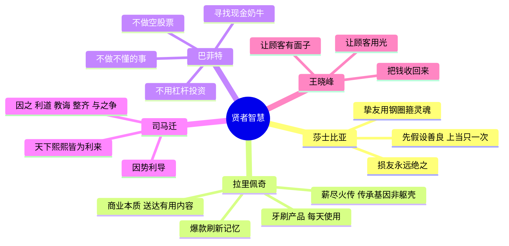
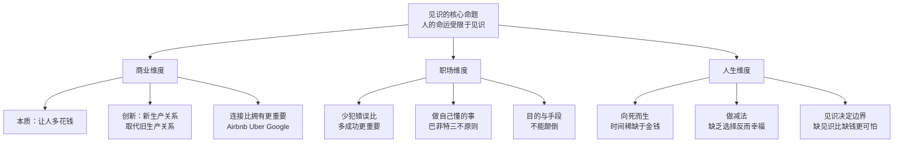

# 见识：商业的本质和人生的智慧

作者吴军，谷歌资深研究员、腾讯搜索副总裁、硅谷丰元资本创始合伙人。本书脱胎于"得到"平台的《硅谷来信》专栏，有 8 万订阅读者。书名取自吴军的核心判断：人一生的命运在很大程度上受限于见识，命运的改变首先需要见识的提高。

全书分上下两篇，上篇谈商业本质，下篇谈人生智慧。最后一章汇集了他从莎士比亚、拉里·佩奇、巴菲特、司马迁、摩拜创始人王晓峰等"贤者"处学到的具体方法论。

---

## 商业的本质

### 让人多花钱，而不是省钱

吴军的商业第一原则：**商业的本质是让人多花钱，** 而不是省钱。这与直觉相反——人们本能地认为省钱是美德，而商业需要逆着这个本能走。理解这一点，才能理解为什么豪华酒店、奢侈品、高端餐饮的商业逻辑与折扣超市完全不同。

"消费者剩余"的概念是理解商业的核心工具：消费者愿意支付的最高价格，减去实际价格，就是消费者剩余。好的商业模式是让消费者以为赚到了（剩余为正），同时让生产者尽可能多拿走价值。

### 颠覆式创新的本质

颠覆式创新不是用更好的方式做同样的事，而是用新的生产关系取代旧的生产关系。成功的小公司是"用洋枪洋炮对付大公司的大刀长矛"——它们与老公司不属于同一代。

柯达发明了数码相机，却因为不愿颠覆自己的胶卷业务而失败。诺基亚的硬件工程能力无人能及，却输给了触控屏和软件生态。颠覆者通常在某个维度远弱于被颠覆者，但在另一个维度建立了不对称优势。

### 信息不对称与中间商消亡

互联网的核心作用是消灭信息不对称。传统中间商（旅行社、房产中介、唱片公司）的价值建立在信息差之上，信息对称后毛利润趋近于零。Airbnb 没有房子，Uber 没有车，它们的价值在于连接——**连接比拥有更重要。**

吴军把这个洞察称为"互联网经济的本质"，并与拉里·佩奇观察 DirecTV 后得出的结论相印证：DirecTV 不拥有卫星、不制作节目、不生产机顶盒，只做一件事——将好内容送达终端用户，市值就超过 100 亿美元。谷歌从中受到启发，放弃了企业级搜索服务（曾占收入 90%），转型为"将有用信息送达千家万户"的广告平台，才成为世界最大的互联网公司。

### 二八定律与好内容的护城河

在任何市场中，20% 的用户贡献 80% 的收入。这意味着服务好头部用户的回报远高于服务所有用户。谷歌搜索严格禁止购买排名和 SEO 作弊，就是因为内容的质量是其唯一护城河——垃圾内容会破坏用户信任，继而摧毁整个商业模式。

---

## 职场方法论

### 目的与手段不能颠倒

王晓峰（摩拜单车创始人，前腾讯搜索广告总经理）给出销售的三条本质：

**第一，把钱收回来。** 卖出东西只完成了销售的一半，另一半是收款。中国传统行业三角债普遍，要账成本吞噬利润。目的是收钱，卖货只是手段——一旦把手段当目的，就"背本趋末"了。

**第二，让顾客把买的东西用光。** 可持续的生意不是让顾客充值，而是让他们消费光充值，才有动力继续购买。王晓峰在腾讯两年内将搜索广告销售额提高了 6 倍，靠的就是这个洞察。

**第三，让顾客有面子。** 苹果手机性能不如同价位安卓，却更贵，原因是使用苹果有面子。摩拜宁愿做重资产、自己造车，是因为共享破旧自行车让白领没面子，而骑设计感十足的摩拜则很酷。

### 少犯错误比多几次成功更重要

巴菲特在与中国企业家共进午餐时给出的人生建议：不做自己不懂的事情，不做空股票，不用杠杆投资。他把这总结为"一生不要两次富有"——即不要让自己在富有之后因为贪婪而归零，再从零开始，因为两次峰值之间的低谷会损耗生命中无法弥补的时间。

万达做电商（"腾百万"联盟）是典型的"做自己不懂的事情"。一位二十年始终专注手机硬件的企业家则讲：当年央视标王们纷纷成立广告公司，他唯一没做，结果二十年后他还在，其余全消亡了。

巴菲特选股的秘密不是选最快增长的公司，而是寻找"现金奶牛"——能产生稳定现金流的公司，将股息收入再投资，实现复合增长。他认为投资是艺术而非技术，无法通过学习线性传授，也无法遗传给子孙。

---

## 人生哲学

### 人生影响力的三个维度

吴军用"人生是一条河"的比喻，将一个人对世界的影响力拆解为三个维度：**宽度**（影响了多少人）× **深度**（影响的深刻程度）× **长度**（影响持续了多久）。

以莫扎特和迈克尔·杰克逊做比较：MJ 的宽度远超莫扎特（几十亿人认识他），但深度浅、持续时间短，如同一条很宽很浅的河流；莫扎特的受众相对少，但他的音乐影响了 250 年来几乎所有古典乐领域，是一条细长但极深的河。两者哪条"河"更大，取决于三维乘积。

吴军认为，人的幸福感有两个根本来源：**基因传承**（通过后代让自己的基因延续）和**影响力**（通过思想、作品或行动在他人心中留下印记）。这两者都是让人感到"活过"的东西，而金钱本身不在此列。

### 社会分层与逆袭的真相

吴军将社会分成 100 层，底层的人要进入顶层，需要付出的努力是中层人的指数级倍数——而不只是翻倍。但这不是悲观主义，而是现实主义的出发点：**接受起跑线的差距，才能制定真正有效的策略。**

吴军引用了 19 世纪英国铁路工程师史蒂芬森的故事：他出身文盲矿工家庭，靠自学成为发明蒸汽机车的工程师，并参与建设了世界上第一条商业铁路。他的成功不是靠"逆袭"，而是靠彻底改变了自己所在的时代格局——在蒸汽机车出现之前，"底层"的定义本身改变了。这是最高级的逆袭：**不是在旧游戏里追赶，而是参与创造新游戏。**

### 人生最重要的投资：选择配偶

吴军认为，对于大多数人而言，人生中最重要的一项"投资"不是股票，不是房产，而是配偶的选择。他引用了三位名人的建议：

- **摩根**（金融家）：找一个比自己聪明的配偶
- **巴菲特**：找一个和自己价值观一致的配偶，价值观不同的婚姻是最大的"坏生意"
- **沙皮拉**（商人）：找一个真正欣赏你的人，而不是你必须不断取悦的人

对男性的建议：不要只看外貌，要看是否聪明、是否有共同价值观。对女性的建议：不要只看经济条件，要看对方能否长期成长。吴军认为，婚姻是需要经营的，而不是"找到了对的人"就会自然幸福。

### 先让父母成熟起来

吴军讨论了中国家庭关系中一个反常的问题：很多中国父母在子女成年后，反而在情感上越来越依赖子女，甚至干涉子女的重大决策。他以歌手张靓颖母亲阻挠婚礼的案例为例，指出这是父母自身情感不成熟的表现。

吴军认为，成熟的父母有三个特点：①能够让子女独立，鼓励而非阻拦；②不把自己未完成的愿望强加给子女；③在子女做出重大决定时，给予支持而非控制。

他进一步指出，如果父母本身不够成熟，子女最好的"投资"之一是帮助父母成长——不是通过说教，而是通过扩展他们的见识和圈子。

### 向死而生

吴军辞去谷歌高薪职位写书，理由是"时间比金钱更稀缺"。他的方法是列一张清单，写下生命中最重要的事，从最重要的开始做，不管明天还有没有时间。

在这一节他直接批评了[[奇点临近（库兹韦尔）]] 的作者：

> "至于谷歌半人半仙的'科学疯子'库兹韦尔，天天吃一把维生素，一定要坚持活到他所谓的人可以永生的年代，更是荒唐。"

吴军引用顶级生物学专家的研究，指出正常人寿命极限约为 115 岁，库兹韦尔的愿望"可能更多是安慰自己罢了"。他还批评了谷歌旗下抗衰老公司 Calico 投入巨资对抗衰老——认为接受死亡是人生智慧的一部分，执着于续命反而是秦始皇式的恐惧。

### 人生需要做减法

印度人在婚姻和职场中缺乏选择，反而幸福感更高——包办婚姻使人专注于经营婚姻本身而非筛选；职场无退路使人死心塌地向上爬。谷歌的印度老员工面对太多选择反而停滞，晚来的无选择者（皮柴）反而升得最快。

苹果在乔布斯回归后第一件事是砍掉产品线，从 70 个 SKU 减少到 4 个，才有了后来的 iMac。雅虎做了一堆小功能、收购了无数公司，最终失败。西瓜和芝麻同时追，只能都掉落。

减法的本质不是勤奋选优，而是**跳出思维定式，敢于放弃看似有价值但实际上是芝麻的东西。**

林黛玉代表作诗性格（意境唯美、理想纯粹、不屑俗务），宝钗代表做人性格（情商高但工于心计）。吴军认为在 AI 时代，人的独特价值恰恰在于黛玉式的创造力和浪漫梦想，而不是宝钗式的处世圆滑。

### 大学之道

选志愿的优先级：**城市 > 学校 > 专业。** 北大清华之下断崖式领先，其余学校差距不大。一流城市提供更大的信息密度和资源网络，比学校名气更重要。

大学最应该做的三件事：谈恋爱（校园中动机最单纯）、交挚友（出了社会功利心变强）、参加活动（完成从父母孩子到社会人的转变）。

在二流大学接受一流教育的关键不是课程，而是主动性和圈子。伯克利前 20% 的学生不输哈佛——差距在生源圈子，不在课程质量。

西点军校：8% 录取率，90% 有运动队经历，25% 当过学生会主席。核心是"德智体 + 领导力"，军事课只占约 10 门，其余是工程与人文。哈佛商学院的两大秘密是"玩儿"（营造人脉圈子）和"骗钱"（学会用别人的钱挣钱）。

### 见识的力量

**比贫穷更可怕的三件事：缺乏见识、缺乏爱、缺乏规矩。** 没有钱，有一辈子的机会能获得；而这三样缺失，后天弥补的难度极大，且与贫穷本身没有必然关系。

庄子的"鲲鹏"寓意是见识决定边界——鲲变鹏需要九万里高度，才能看见整个天地。吴军自述 29 岁放弃国内优厚待遇赴约翰·霍普金斯大学读博，是因为见识到世界级水平后无法再接受更低的眼界。

---

## 贤者的智慧

### 拉里·佩奇：薪尽火传

佩奇在公司内部讲过，世界上只有一种生物可以不死——一种海蜇。用针刺激它，它会长出新细胞，母体死亡后新细胞发育成完整的新个体。佩奇希望谷歌能不断孵化新业务部门，每个部门都像新细胞，最终不依赖母体独立存活。

因此谷歌成立了谷歌风投和谷歌 X 实验室，后来重组为 Alphabet。佩奇把成熟业务交给皮柴（谷歌），自己负责最需要支持的新业务。其逻辑是：创始人管新业务比职业经理人更有成效，因为公司基因决定论意味着职业经理人主导的新业务会退化成 IBM 的个人电脑部门或微软的在线业务。

### 司马迁：因势利导

《史记·货殖列传》是吴军认为"太史公真正的智慧所在"的一篇。核心观点：统治者（管理者）对人性趋利本能的处理方式，决定了效果高下。

最高明的方式是"因之"——顺应人的本性，让市场自己运作。差一等的是"利道之"，用利益引导。再差是"教诲之"，灌输式说教。更差是"整齐之"，命令管控。最差是"与之争"，政府直接入场做生意与民争利。

硅谷成功的秘诀之一，是政府没有能力干预，让商业完全由市场决定。"天下熙熙，皆为利来；天下攘攘，皆为利往"——现代经济学建立在人是理性经济人这一公理上，司马迁在 2000 年前就已洞见。

---

## 核心框架

---

## 与其他思想的对比

吴军对[[奇点临近（库兹韦尔）]] 的批评是全书最直接的观点冲突：他以"半人半仙的科学疯子"讽刺库兹韦尔的永生执念，并以生物学证据作为反驳依据，认为接受死亡才是真正的向死而生。

吴军与[[安迪·格鲁夫]] 在产品爆款节奏上的观点高度吻合：格鲁夫的英特尔以 18 个月为周期推出新产品，是同类竞争对手（36 个月周期）的两倍，靠刷新用户记忆而非技术代际优势取胜。吴军把这个模式总结为"牙刷 + 爆款"，并将其用于自己的写作和专栏运营。

吴军的"见识"哲学与庄子的鲲鹏意象相通：高度决定视野，视野决定行动边界。他本人 29 岁的出国留学决策，就是这个理论的自我践行。
