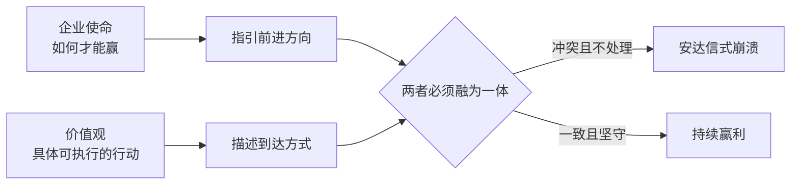
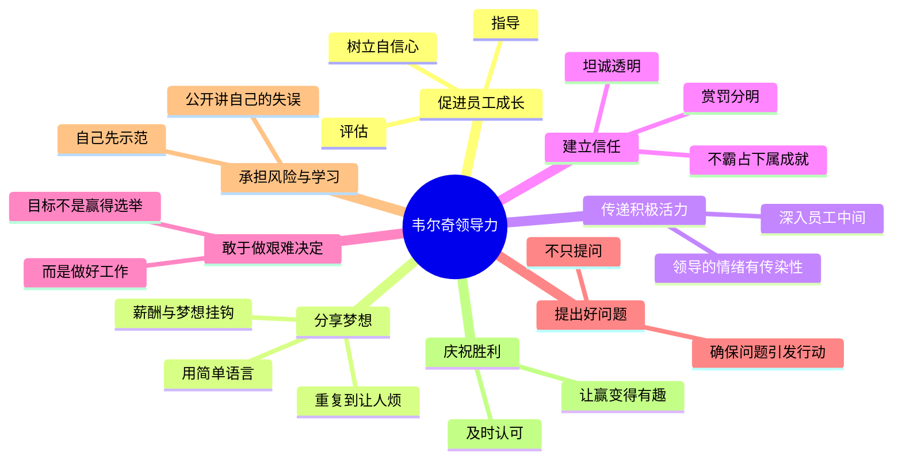
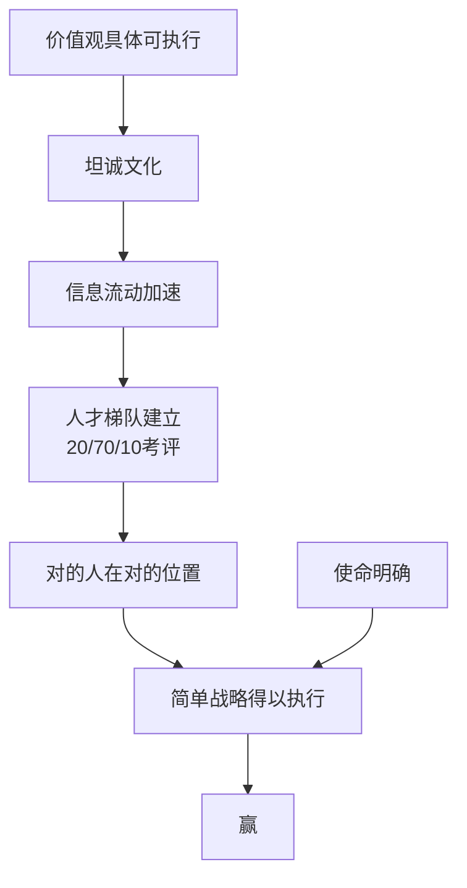

# 赢

> "做生意不过是游戏而已，而赢得游戏就是最快乐的事！"
> ——杰克·韦尔奇

《赢》（Winning，2005年）是杰克·韦尔奇卸任通用电气（GE）CEO后，根据全球巡回演讲中收到的上千个问题整理而成的实战手册。全书20章，覆盖从企业文化到个人职业生涯的全部管理场景。韦尔奇的底层逻辑只有一句话：**赢靠的是人，人靠的是坦诚，坦诚靠的是文化。**

---

## 核心问题：赢为什么伟大？

韦尔奇开篇就为"赢利"正名。赢利的企业创造就业、缴纳税款、让员工有能力送孩子上大学、支持慈善事业。失败的企业让所有人承受损失。

他的逻辑：**企业赢利是健康社会的发动机，不是道德问题，是工程问题。**

---

## 第一部分：基础篇——四条原则

### 1. 使命与价值观：两件不同的事

韦尔奇给出了一个简洁的区别：

- **使命**：我们的业务**如何才能赢**？（方向）
- **价值观**：引领我们到达目的地的**具体行动**（不是口号，是可执行的行为准则）

他特别鄙视挂在大厅里的标语——"顾客至上""追求卓越"——这些说的是正派公司的最低门槛，不是价值观。

真正有用的价值观是这种写法（他引用第一银行案例）：

> "不要忘记说'谢谢'。"
> "消除官僚作风。无情地消灭浪费现象。"

韦尔奇说，价值观越具体，越有执行力。安达信和安然倒闭的本质原因是：公司的使命（诚实审计、输送天然气）和内部价值观（咨询牛仔文化、贸易谈判桌精神）发生了根本冲突，而没有人正视这一冲突。

### 2. 坦诚：商界最卑劣的秘密

> "缺乏坦诚是商业生活中最卑劣的秘密。"

韦尔奇认为大多数公司里流行的是**假坦诚**：人们在会议室点头称是，出了会议室立刻否定；绩效评估写的是好话，真实想法从没说出口；战略报告里人人说"可行"，私下全知道不靠谱。

坦诚的好处是经济的：它加速信息流动，减少无效会议，让真正的问题更快暴露。坦诚文化要靠领导者用行动示范——奖励说真话的人，惩罚说假话的人，哪怕真话让人不舒服。

### 3. 考评：建立精英文化

韦尔奇最著名的管理工具：**20/70/10原则**。

每年对所有员工进行强制性排名：

| 类型 | 比例 | 做法 |
|------|------|------|
| 明星 | 前20% | 大力奖励，留住他们 |
| 中坚 | 中间70% | 是公司的心脏，不能忽视 |
| 末尾 | 最后10% | 给机会改进，否则请走 |

他承认这看起来残酷，但认为**更残酷的是让不适合的人待着浪费彼此的时间**。另外，中间70%才是公司真正的主体——未来的明星常常藏在这里，不能只盯着前20%。

### 4. 发言权与尊严

每个员工都有权说出自己的意见，哪怕他们不同意最终的决定。领导者的工作是创造一个让人敢说话的环境，然后作出决定并清楚解释原因。

---

## 第二部分：公司如何赢——领导力与人才

### 领导力的8条准则

### 招聘：4E1P框架

韦尔奇的招聘标准，适用于任何岗位的领导者：

| 要素 | 英文 | 含义 |
|------|------|------|
| 活力 | Energy | 本人充满活力、精力旺盛 |
| 激发他人 | Energize | 能点燃周围人的热情 |
| 敏锐 | Edge | 面对困难选择时能够斩钉截铁 |
| 执行 | Execute | 把想法变成行动，完成任务 |
| 激情 | Passion | 对工作发自内心的热爱 |

前四个E是必要条件，但没有P（激情）的人"工作起来像是只要拿到薪水就行了"。

### 解雇：不要让人感到惊讶

韦尔奇把解雇分三种：
1. **违背品行**：立即处理，公开说明原因
2. **经济裁员**：提前分享公司财务状况，让员工有心理准备
3. **业绩不佳**：最复杂，也最常见

处理绩效不佳解雇的两条原则：
- **不要让人感到惊讶**：如果一个人被解雇，他的上司早该多次明确告诉他问题在哪里
- **减少羞辱感**：尊重是最低限度的要求

---

## 第三部分：赢得竞争——战略与增长

### 战略：三步法

韦尔奇对战略大师和厚达百页的战略报告持明显嘲讽态度：

> "忘记那些所谓大师们告诉你的战略方法吧，因为它们只是烦琐而费力的数据堆砌。"

他的战略三步法极为简洁：

**第一步：找大方向**（用"5张幻灯片"回答5个问题）
1. 你的行业现在是什么状况？谁是你的主要竞争对手，他们的优劣势是什么？
2. 你在过去两年里做了什么？
3. 你的竞争对手在过去两年里做了什么？
4. 你最担心什么？竞争对手可能做什么让你噩梦连连？
5. 你打算怎么做才能赢？

**第二步：把合适的人放到合适的位置**

**第三步：不断探索最佳实践，建立学习型组织**

他的核心观点：**大众化（commodity）是糟糕的，差异化是唯一出路。** GE战略的底层逻辑就两句话："大众化是糟糕的，人才决定一切。"

### 有机增长：三条原则

从内部孵化新业务时，公司最常犯的错误是：资源不足、宣传太少、限制太多。

解法：
1. **投入最好的人**，而不是"那个快退休的老员工"
2. **夸大宣传**新业务的潜力，哪怕让人烦——新项目需要啦啦队
3. **给足自由度**，允许犯错，像孩子上大学一样放手但关注

### 危机管理：5条假设

韦尔奇的危机管理框架来自GE亲历的多次危机（工时卡欺诈、电冰箱压缩机召回、基德证券丑闻、以色列行贿案）：

1. **假设问题比你想象的更严重**
2. **假设消息无法在组织内部保密**
3. **假设外部有媒体和律师等着你**——不能坐以待毙，必须先发声
4. **假设过程中有人和事会改变**——危机必须以血的代价告终
5. **假设你的组织会从危机中挺过来，而且更强大**

---

## 第四部分：个人职业生涯

### 好工作的4个信号

1. **志趣相投的人**：如果与同事格格不入，早发现早离开
2. **成长机遇**：工作应该让你感觉"有所发展，而不是刚刚够用"
3. **未来价值**：在好公司工作是"奥运会奖牌"——麦肯锡、GE的经历会在简历上加分
4. **工作内容令你兴奋**：至少某些部分让你每天渴望回来

韦尔奇在书中讲了一个故事：哈佛毕业生来咨询职业，全程无精打采，却在谈起汽车设计时眼睛发光——他真正想做的是去底特律。"告诉我你的底特律之梦在哪里。"

### 晋升：业绩只是入场券

韦尔奇认为晋升不只靠业绩，还需要：
- **公开表态**：让高层知道你想晋升，而不是等别人发现
- **团队视角**：不抱怨、不传播负能量
- **积极参与重要项目**：主动承担高曝光度的任务

他用一个矩阵描述最糟糕的情况：**业绩好但不符合价值观**的人，必须请走，越快越好——否则会给整个组织发送"价值观可以妥协"的错误信号。

### 糟糕的老板：不要做受害者

韦尔奇最反感"受害者心态"。遇到坏老板，先问自己三个问题：

1. **为什么他对我特别这样？** 先在自己身上找原因，检查业绩和态度
2. **这个坏老板会有什么结局？** 如果他即将离开，等待就是策略；如果他会长期在位，评估值不值得继续
3. **如果我继续好好工作，我会得到什么？** 如果答案不清楚，就要有退出计划

> "不管遇到多么糟糕的老板，你都不能让自己表现为一名受害者。"

### 工作与生活的平衡：积分换弹性

韦尔奇的观点很现实：

- 工作弹性是**用业绩换来的**，不是公司手册里写的权利
- 最好的20%员工几乎从不抱怨平衡问题，因为他们有组织力和资源应对复杂情况
- 弹性的实现靠**一对一谈判**，而不是援引公司政策

他承认自己是这方面的反面教材：41年来工作优先，错过了大量陪伴家人的时光。"照我说的那样做，但不要学我。"

---

## 这本书在说什么

《赢》的底层逻辑可以压缩为一张图：

韦尔奇的贡献不是发明了新理论，而是把"常识管理"做到极致：**把该说的说出来，把该做的做到，把不合适的人请走，把资源压上去**。

他自己的总结：没有魔法，只有原则、规律和避免失误。

---

## 延伸阅读

- [[格鲁夫给经理人的第一课]]：同时代的管理经典，聚焦中层管理者的杠杆率理论
- [[俞军产品方法论]]：中国互联网语境下的产品与用户价值框架
