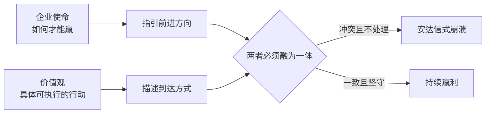
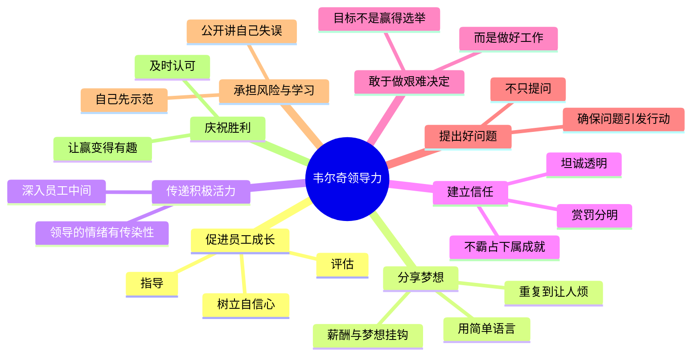
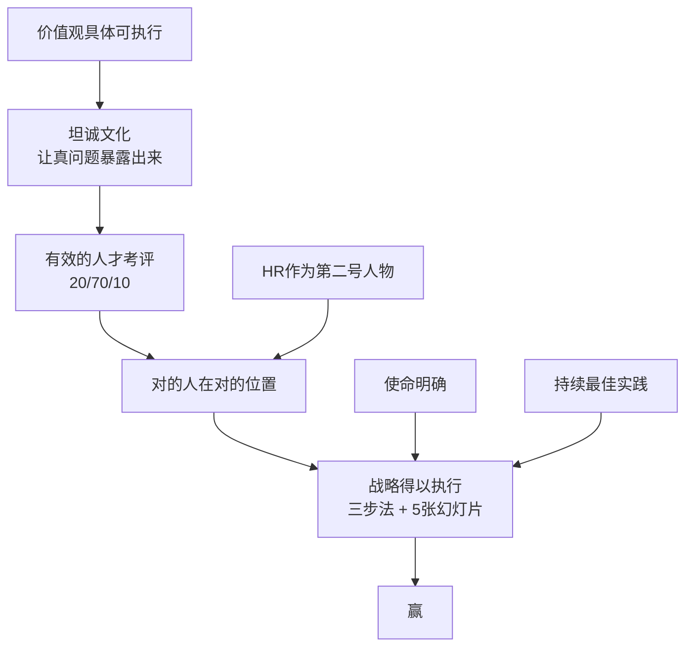

# 赢

> "做生意不过是游戏而已，而赢得游戏就是最快乐的事！"
>
> 杰克·韦尔奇

《赢》（Winning，2005年）是杰克·韦尔奇卸任通用电气（GE）CEO后，根据全球巡回演讲中收到的上千个问题整理而成的实战手册。全书20章，覆盖从企业文化到个人职业生涯的全部管理场景。核心逻辑只有一句话：**赢靠的是人，人靠的是坦诚，坦诚靠的是文化。**

---

## 赢的价值

韦尔奇开篇为"赢利"正名。赢利的企业创造就业、缴纳税款、让员工有能力送孩子上大学、支持慈善事业。失败的企业让所有人承受损失。他的逻辑：**企业赢利是健康社会的发动机，不是道德问题，是工程问题。**

---

## 第一部分：基础篇

### 使命与价值观：两件不同的事

- **使命**：我们的业务 **如何才能赢**？（方向）
- **价值观**：引领我们到达目的地的 **具体行动**（不是口号，是可执行的行为准则）

他特别鄙视挂在大厅里的标语，如"顾客至上""追求卓越"，这些说的是正派公司的最低门槛，不是价值观。第一银行的价值观是："不要忘记说'谢谢'""消除官僚作风，无情地消灭浪费现象"，越具体，越有执行力。

安达信和安然倒闭的本质是：公司的使命（诚实审计、输送天然气）和内部实际价值观（咨询牛仔文化、贸易谈判桌精神）发生了根本冲突，而没有人正视这一冲突。

### 坦诚：商界最卑劣的秘密

> "缺乏坦诚是商业生活中最卑劣的秘密。"

韦尔奇在退休后的演讲中调查发现：过去一年接受过面对面、诚实坦白的业绩反馈会谈的人，**运气好的时候20%举手，绝大多数时候不超过10%**。这一数字在5000人的人力资源大会上也同样如此。

缺乏坦诚的根本原因是康德早就指出的：不坦诚是自私的表现：让自己的生活更轻松，代价是别人得到的是扭曲的信息。坦诚的经济价值在于：加速信息流动，减少无效会议，让真正的问题更快暴露。

坦诚需要领导者用行动示范。韦尔奇1963年负责Noryl事业部（GE最小的部门，4名下属），就在全公司没有开放气氛的情况下坚持了坦诚文化。GE花了 **将近10年** 才让坦诚精神成为理所当然的事。

### 考评：建立精英文化（20/70/10）

韦尔奇最著名的管理工具，见 [[20-70-10人才梯队管理]]。每年对所有员工进行强制性排名：

| 类型 | 比例 | 做法 |
|------|------|------|
| 明星 | 前20% | 大力奖励，奖金期权表扬青睐培训 |
| 中坚 | 中间70% | 公司心脏和灵魂，持续培训和激励 |
| 末尾 | 最后10% | 给机会改进，否则请走 |

他用扬基棒球队举例：明星球员1800万年薪，普通球员30万美元年薪，区别一目了然，团队还是总冠军。他认为区别考评对每个人都更公平：好人如果因为业绩长期被掩盖，到40多岁才被裁员，那才是真正的残忍。

### 发言权与尊严：解放头脑

> 有位中年仪表工人告诉韦尔奇："25年来，公司一直为我的双手支付报酬，但实际上，公司完全可以用上我的头脑——而且什么钱也不用花。"

克罗顿维尔培训中心的员工反映，他们不敢向自己的老板提那些在培训课上提出的问题，原因是"那样会被开除"。韦尔奇的回应是推行 **业务讨论会**（Workout）：30~100人团队，配外来辅导员，老板承诺对75%建议现场给"行"或"不行"，对25%在30天内给答案，然后离开房间不干预。这样的讨论会后来每年开了好几万次，路易斯维尔工厂的喷漆程序、达勒姆喷气引擎工厂的制造周期、辛辛那提信用卡中心的清算效率，全都因此改进了。

---

## 第二部分：人才管理

### 领导力的8条准则

关于"提出好问题"的反面教训：韦尔奇多次询问医疗部门，患者为何不能接受孔道更宽、成像略差的核磁共振扫描仪（尤其是手肘和膝盖等简单检查）？每次都被礼貌地搪塞"会认真考虑"。一年后日立公司凭宽孔道设备夺取了大量市场份额，GE花了整整两年才追上。韦尔奇说这是他最后悔的失误之一：**说过的话没有引发行动，等于没说过。**

### 人力资源：第二号重要人物

2002年墨西哥城，一次5000人参加的人力资源经理大会上，韦尔奇宣布："人力资源的负责人应当是任何组织中的第二号重要人物，至少应当与CFO平起平坐。"会场出奇地安静。他举手调查，5000人中只有 **50人** 说自己公司CEO对HR负责人和CFO同等尊重。

他说出了HR实际上在做的三件重要事情：**牧师**（倾听、处理冲突）、**父母**（教育、援助、推动成长），以及公司最重要的战略执行者：谁在什么位置上决定了战略是否真正发生。

人员管理的6条准则：
1. 把HR提升到首位，找牧师-父母型负责人
2. 建立严格而非官僚化的业绩评价体系
3. 用奖金、认同、培训机会激励和留住员工
4. 主动管理与工会、明星、边缘人、捣乱分子的复杂关系
5. 不忽略中间70%，他们是公司的心脏和灵魂
6. 组织结构尽量扁平化：管理幅度至少10人，清晰的汇报关系

明星管理中有个关键做法：**8小时内任命替代者**。当明星宣布离职，当天下午就任命接替者，让整个公司看到没有人是不可替代的。2001年，GE设备部门CEO拉里·约翰斯顿宣布去艾伯森公司，当天下午4点就任命了吉姆·坎贝尔接替。

### 招聘：4E1P框架

见 [[4E1P招聘框架]]。三个前提考验（正直、智慧、成熟）之后，考察：

| 要素 | 英文 | 含义 |
|------|------|------|
| 活力 | Energy | 本人充满活力，热爱生活 |
| 激发他人 | Energize | 能点燃周围人，承担看似不能完成的任务 |
| 决断力 | Edge | 面对困难选择时斩钉截铁 |
| 执行力 | Execute | 把决定付诸行动，最终到达终点 |
| 激情 | Passion | 对工作发自内心的热爱 |

执行力是他们最晚发现需要加上的一个E：GE的审计部门经理们在填写"前三个E都满"的表格时，有些人的业绩却很差，缺的正是"执行"这一块。

高层领导还需要额外4个特征：真诚（authentic）、对变化来临的敏感性、爱才（希望周围人比自己更聪明）、坚韧弹性（被打倒后能重新站起来）。

### 解雇：不要让人感到惊讶

解雇分三种情形。业绩不佳的解雇最复杂，有三种常见错误：行动太匆忙（理查德的反击）、不够坦诚（盖尔的震惊）、拖得太久（史蒂夫被公开羞辱近一年）。

两条原则：**不要让人感到惊讶**（靠持续坦诚的绩效反馈实现），**减少羞辱感**（帮助被解雇者软着陆、树立自信）。韦尔奇说，每一位离开公司的雇员在此后5到20年都会继续代表这家公司，或以愤怒，或以赞扬。

---

## 第三部分：赢得竞争

### 战略：三步法 + 5张幻灯片

韦尔奇对厚达百页的战略报告持明显嘲讽态度：**"战略不过是选准一个努力方向，然后不顾一切地实现它。"**

战略三步法：1）找大方向；2）把合适的人放到合适的位置；3）不断探索最佳实践。

**5张幻灯片** 验证战略可行性：

| 幻灯片 | 核心问题 |
|--------|---------|
| 1 | 今天的竞技场：行业特征，竞争者优劣势，主要顾客 |
| 2 | 最近竞争形势：对手过去一年有哪些改变游戏的动作 |
| 3 | 你的近况：过去一年你的动作对竞争格局有何影响 |
| 4 | 潜伏的变量：你最担心什么？对手可能做什么封杀你 |
| 5 | 你的胜招：怎样改变竞争格局，怎样让顾客更黏性 |

GE医疗部门在1976年的CT扫描仪大战中，洞察到医院厌倦了每隔半年就要换新设备，推出了Continuum系列：承诺10万美元/年持续升级，让顾客技术不过时，一举坐上行业老大位置并维持数十年。幻灯片3和4的对比让他们看到了这个机会。

GE的战略逻辑底层只有两句话："**大众化是糟糕的，人才决定一切。**"因此分离了电视机、小家电、空调、煤炭，加大投资GE资本、收购RCA、发展能源医疗飞机引擎。20多年坚守这一大方向，中间用四个运动补充推进：全球化、附加服务、六西格玛、电子商务。

### 预算：运营计划取代传统预算

传统预算有两种毒药：**谈判式解决**（业务部门尽量压低目标，总部拼命往高推，双方妥协在一个都不满意的数字）；**虚伪的笑容**（业务部门做了漂亮的规划，总部点头微笑，然后私下把投资砍半，不解释原因）。这两种都在制造内耗，而非推动增长。

韦尔奇的解法：把预算变成 **运营计划**，奖励不再基于"是否完成预算目标"，而基于"与上一年相比、与竞争环境相比的实际表现"。1995年，GE设备部门比计划低10%、与竞争对手比却表现出色；塑料部门超出计划25%、但竞争对手赚了30%~35%。结果两个部门奖励相当。这个故事在全公司500名高层的会议上赢得了掌声。

3M公司在中国用这套方法：原增长率15%，改成运营计划后，肯尼斯·尤提出大胆目标40%增长，三年内中国业务从5.2亿增至13亿美元。

### 变革：4条准则

1. 确立清晰目的：为变革而变革会产生消极影响
2. 招募和提拔 **真正的变革者**（真正的变革者不超过全部商业人士的10%，特征：傲慢、精力过剩、有点妄想狂）
3. **清除反对者**，即使他们业绩不错：摩根大通CEO比尔·哈里森在自身声誉处于低谷（安然危机）时，仍然清除了最大的反对者
4. 利用意外的机会：1997年亚洲金融危机，GE收购了估值偏低的泰国汽车贷款；安然崩溃时巴菲特收购了管道业务，GE得到了风力发电业务

### 有机增长：三条原则

公司孵化新业务最常犯的错误：资源不足、宣传太少、限制太多。

1. **投入最好的人**：GE把吉姆·麦克纳尼（销售额40亿、25000名下属的部门CEO）派去香港只带一名助理开拓中国市场，这个任命本身就是信号，所有部门随之跟进，中国业务最终达40亿美元年销售额
2. **夸大宣传**：NBC有线频道CNBC/MSNBC几乎没有收入时，韦尔奇在所有高层会议上都着重问有线项目进展，而非黄金时段新喜剧
3. **给足自由度**：Noryl塑料1964年起步，韦尔奇坚持要独立销售队伍（"你可以坐扶手椅随便就把Lexan卖掉，但销售Noryl需要四处奔波的疯狂劲！"），最终发展为年销售额10亿以上的大产业

### 并购：7个陷阱

成功的并购产生"1+1=3"效应，但绝大多数并购会遇到以下陷阱：

1. **相信平等合并**：戴姆勒-克莱斯勒用两年时间互派人员横跨大西洋开会，什么都没决定，直到德方承认这本就是收购
2. **忽略文化融合**：GE收购基德公司，在危机现场有经理三次溜过来问"这件事会影响我们今年的奖金吗"，最终卖给了佩恩韦伯
3. **被人质劫持**：花3亿买下半导体公司Intersil，对方CEO要求自己全权管理，GE无法介入，最终平价卖掉
4. **整合太保守**：应该在90天内完成，新荷兰/凯斯合并后领导层迟疑，市场下行时一起沉没
5. **征服者综合征**：收购博格华纳塑料业务，裁撤了90%的老销售队伍，市场份额下降15%（他们擅长个人关系式销售，而非技术性销售）
6. **出价太高**：时代华纳与美国在线合并是最恶劣的例子
7. **被收购方抵制**：福力特银行被美洲银行收购，布赖恩·莫伊尼汉不但没有抵制，反而成了"现成的合伙人"，最终升为整个资产管理业务负责人

### 危机管理：5条假设

GE经历过工时卡欺诈（1985年，弗吉谷导弹工厂）、电冰箱压缩机全国召回（5亿美元冲销）、基德证券丑闻（交易员乔·杰特虚假交易3亿美元）、以色列空军行贿案（罚款6900万美元）：

1. **假设问题比你想象的更严重**：工时卡危机，0.5%的错误率在当时的政治环境下变成了国会听证
2. **假设消息无法保密**：与其等别人替你抖出来，不如自己先说清楚
3. **假设外部将以最敌对态度描述你**：强生泰诺危机每天开两次新闻发布会，开放工厂接受检查，最终赢得信任；GE被叫做"中子杰克"时，韦尔奇说那是无法避免的
4. **假设有人和事会改变**：真正的危机不逐渐平息，必须以血的代价告终
5. **假设你的组织会更强大**：冰箱召回后GE更快决策；以色列案后制定了20.4政策的严格执行标准

### 六西格玛：消灭波动

1995年从摩托罗拉引进。核心不是关于平均数，而是 **关于方差**：承诺10天交货的三次分别在第5、10、15天，平均10天，但每次不一样，顾客无法依赖。六西格玛要求三次都在第9~11天，让顾客的预期可以依赖。

它对GE最大的未被宣传的好处：帮助建立了伟大的领导团队。大量经理人通过负责六西格玛项目进入视野，其中沙琳·贝格利从实习生升至GE铁路事业部董事长兼CEO，韦恩·休伊特从太平洋塑料业务到全球硅酮CEO，都走了这条路。

---

## 第四部分：个人职业生涯

### 好工作的4个信号

1. **志趣相投的人**：格格不入就要早离开（克莱尔在非营利机构苦撑多年，错过了自己真正匹配的咨询行业）
2. **成长机遇**：应该让你感觉"有所发展，而不是刚刚够用"
3. **未来价值**：麦肯锡、GE、沃尔玛是"员工品牌"，离开后在市场上持续加分
4. **工作内容令你兴奋**：哈佛生来咨询职业，全程无精打采，却在谈起汽车设计时眼睛发光，韦尔奇告诉他"你应该去底特律"

金钱当然重要。韦尔奇第一年在GE与其他公司相差1500美元，这对刚出研究生院的他至关重要，直接影响了职业决定。但找到合适工作的关键标准不是薪水，而是"做真实的自己"：他说成绩平平的应聘者最好的策略是坦诚承认，而不是虚张声势。

### 晋升：没有捷径

最重要的两条：**交出远超期望的业绩，并且扩展工作职责**；**不要让老板为你动用政治资本**。

韦尔奇28岁时准备向副总裁汇报PPO塑料项目，额外做了五年展望、全行业成本对比和竞争优势大纲，震惊了所有人，这是他此后40年一直看到有效的方式。

晋升之道还包括：对下属像对待老板一样认真（韦尔奇争夺CEO职位时，正是他的下属们向董事长推荐了他）；早举手参与重要但不起眼的项目（六西格玛、全球化展开时，那些第一批参与的人后来都得到了提升）；保持积极态度（"9·11"后桑德勒·奥尼尔公司177名员工中68人遇难，CEO吉米·邓恩靠的就是"我能行"的精神重建公司）；不让挫折打垮自己（马克·利特尔被降职负责蒸汽涡轮机后没有抱怨，用出色表现重新赢得了更大的职位）。

### 糟糕的老板：不要做受害者

遇到坏老板，先自我检查：业绩如何？是否违反了公司价值观？还是本人就厌恶权威？GE费尔菲尔德总部有个"幻灭团队"，6~7个人每天聚在餐厅抱怨，他们每个人都在自己的本职工作上出色，但没有一个做管理者。

如果自己没有问题，再评估坏老板的走向（业绩好+不符合价值观的人，好的公司最终会处理，但往往需要等待一个触发事件）。最重要的原则：**不要做受害者**。受害者心态在职业市场上是信号："我对这里不感兴趣"，没有推荐信，只有凄婉故事。

### 工作与生活的平衡：积分换弹性

老板最关心的是竞争力。弹性是 **用业绩换来的**，不是公司手册里写的权利。苏珊·彼得斯在GE工作多年出色业绩，1998年被要求调密尔沃基时说"我有家庭事务要处理"，公司立刻同意等待，她2000年恢复后被任命为NBC人力资源负责人。

最好的20%员工几乎从不抱怨平衡问题：他们有组织力、有资源（保姆、预案），而且知道如何区分"工作时间"和"生活时间"。韦尔奇承认自己是反面教材：41年来工作优先，孩子们主要由前妻卡罗琳带大。**"照我说的那样做，但不要学我。"**

---

## 核心逻辑

韦尔奇的贡献不是发明新理论，而是把常识管理做到极致：**把该说的说出来，把该做的做到，把不合适的人请走，把资源压上去。** 没有魔法，只有原则、规律和避免失误。

---

## 延伸阅读

- [[格鲁夫给经理人的第一课]]：[[安迪·格鲁夫]] 的中层管理实战手册，聚焦杠杆率理论
- [[好战略坏战略]]：鲁梅尔特的战略核框架，与韦尔奇5张幻灯片战略验证方法形成对照
- [[高产出管理]]：格鲁夫的人才考核和绩效体系，与20/70/10有共鸣
- [[OKR]]：预算/目标改革的另一种实现路径
- [[俞军产品方法论]]：中国互联网语境下的产品与用户价值框架
