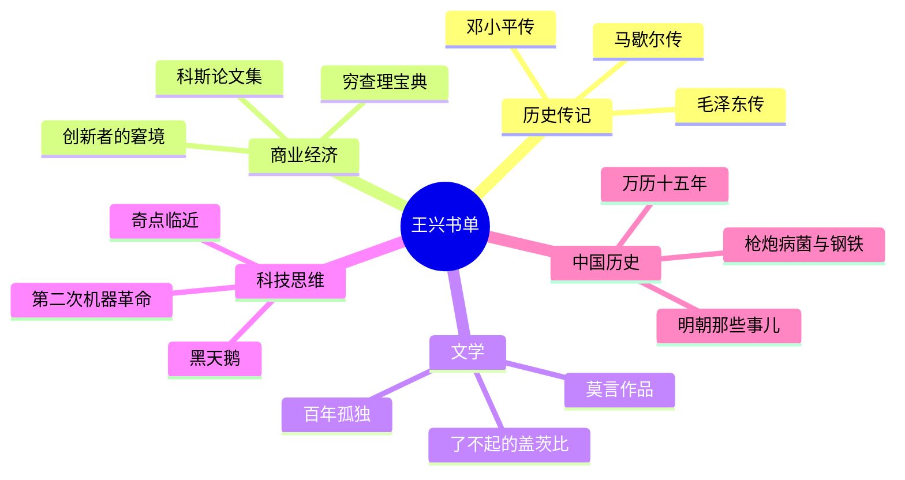

# 阅读与书单

王兴在饭否上记录的阅读活动横跨十余年，涵盖传记、历史、小说、经济学、科技和管理类书籍。他的阅读习惯是将kindle作为主要工具，在电子书和纸质二手书之间灵活选择，并常在阅读过程中随手发帖分享感想。

## 阅读习惯

王兴对"古人读书三上"（床上、马上、厕上）的说法做过现代改写："三上全会被我用来手机上网"（2007-05-18）。他在国家图书馆、公园长椅、火车上、候机大厅都有阅读记录。

他使用Kindle多年，在亚马逊上购买了大量英文书。他的英文阅读速度他自己认为较慢——"一个小时才看了33页"，但从未因此停止英文阅读。对于英文纸质书，他有一套经济实惠的采购策略："一般在amazon上买二手，很多都是约1美元书钱加3.99运费，其实比kindle电子书还便宜"（2013-02-02）。

他对"互联网使买书变得容易了，但是它并不帮我们看书"这一矛盾有清醒认识（2009-01-03）。

## 早期阅读（2007—2010）

**《Founders at Work》** ：2007年，他正在阅读这本收录早期科技创始人访谈的书（2007-07-19），是他早期最认同的创业类读物之一。

**《自私的基因》** （The Selfish Gene，道金斯）：2007年他在与友人讨论人类本能时，援引此书认为"人的本能是生存和繁殖，分析得还是蛮有道理的"（2007-07-22）。

**《The Tipping Point》** （格拉德威尔）：2007年他将某种内容的病毒式传播解读为"典型的tipping point一书里分析的现象"（2007-11-28），显示此书已成为他的思维工具。

## 历史与传记

**马歇尔传记** ：王兴在亚马逊上购入两本关于美国将军乔治·马歇尔的传记（一本200页，一本850页），对其"军校毕业，却从未亲自带兵上过战场"却成为二战美国最高军事统帅感到敬佩，尤其是他在3年间将美国陆军从20万扩充到800万的能力（2011-08-03）。

**林登·约翰逊传记** （《林登约翰逊的岁月》）：他认为此书"开头依然给我极深刻的印象"，认为约翰逊的形象被"刻画得极其生动鲜明"（2015-11-27）。

**《美国种族简史》** （Ethnic America: A History）：他对这本书评价极高，认为"写得通俗易懂，条理清晰，读起来如行云流水，不仅有助于了解美国历史，也有助于了解人性"，并期待有一本类似水准的写中国各族/各地人的书（2012-06-10）。

**《Chinese Among Others》** （孔飞力）：他对讲华人移民史的书有天然兴趣，因其福建背景和散居各处的家族史（2014-10-12）。

## 商业与管理

**Zappos创始人谢家华《Delivering Happiness》** ：他在积了大半年灰尘的kindle一代上重新读起此书，反映了他对企业文化建设的持续关注（2010-12-31）。

**《素书》** （黄石公赠张良）：他认为此书"确实是奇书，言简意赅"（2011-05-22），是他对中国传统管理智慧的少数正面评价之一。

**《Done Deals: Venture Capitalists Tell Their Stories》** ：介绍风险投资历程的书，他给四星（2009-03-12）。

## 小说与文学

**《了不起的盖茨比》** ：他从古登堡计划下载英文原著在Kindle上阅读，认为"菲茨杰拉德的文笔配合我的想象力并不能构建出电影里那一大一小两个狂欢派对的场面，导演的再创作能力还是很值得钦佩的"。他的最终判断是："盖茨比并不了不起，但《了不起的盖茨比》这小说确实很了不起。"（2013-09-07）

**《Life of Pi》** ：他认为文字比电影有更多细节，"更惊心动魄"，认为李安改编时删去了"最直接挑战人性的部分"，从而也"把那最黑暗处残留的一点人性之光也一道删了，很可惜"（2013-01-10）。

**莫言小说** ：他认为莫言小说水平"比《白鹿原》高出一截"（2012-11-04），并指出莫言的文字"比影像更令人毛骨悚然"（2012-12-07）。

**王小波** ：他在饭否上多次提及王小波，记录了《我的精神家园》自序入选高中语文读本的事实，并在某次重读《黄金时代》时写道"感觉比十几年前年少时读多懂了一些"（2012-02-26）。

## 科学与科技

**《大数据》** ：他注意到此书中文版竟然比英文版更早出版，认为这"也算中美的差异之一"（2013-07-28）。

**《10,000 Year Explosion》** （科克伦/哈彭丁）：2013年他在反思人类文明史的野蛮性时，指认这本讲述过去一万年人类进化加速的书为思想来源（2013-05-13）。书中关于不同人群基因差异与文明兴衰关系的论述，使他对学校历史教育的缺失有了更清晰的认识。

**《格调》** （Class，保罗·福塞尔）：2013年他读到此书，评价"太牛了，堪称三十年前的美国版装逼指南合集，作者戳中了许多人的痛处"（2013-01-15）。2017年再次提及，认为此书对美国不同阶层"比的东西不一样"有清晰阐释（2017-05-07）。

**《奇点临近》** （雷·库兹韦尔）：2013年12月，在一次北京的商业会议上有人提到这本书，他随后确认书名并分享（2013-12-10）。书中对技术加速进化的预测与他对 AI 和科技冲击的持续关注相呼应。

**《Who Rules America》** ：他对这本美国阶层研究的书感兴趣，起因是"对中国的情况感兴趣，但是实在找不到像样的公开信息，所以只好看看别国的"（2011-01-06）。

**《未来之路》** （比尔·盖茨）：他认为这本1995年出版的书"完全没提到internet，和《未来之路》这名字实在是不相符"（2011-03-05），揭示了一流企业家在书本写作和商业判断上的差距。

## 经济学读物

他在读《国富论》之前建议朋友先读某本经济学教程。他对经济学家科斯的推崇来自读书和思考后的独立判断（2009-02-19），而非随波逐流的评价。他在读《有中国特色的资本主义》时认为书名"起得真到位"（2010-10-22）。

## 2014—2020 年的补充书目

**《The Prize》** （丹尼尔·耶金）：2014年他描述这本"波澜壮阔的专讲石油历史的书"（2014-12-03），与他对地缘政治和能源的持续兴趣相关。

**《The Luxury Strategy》** （卡普费雷尔/巴斯蒂安）：他回顾2016年读过的书时，认为给他"最深刻印象"的竟是这本关于奢侈品品牌策略的书，出乎自己意料（2017-01-04）。

**《八月炮火》** （芭芭拉·塔奇曼）：2014年8月，在一战爆发一百周年之际，他开始阅读这本关于一战开局的经典著作。2018年11月11日（英联邦一战结束纪念日）他坦言"四年多，一次世界大战都打完了，这本书我还没读完"（2018-11-11），成为他读书习惯中自嘲色彩最浓的一则记录。

**《了不起的盖茨比》与《老人与海》的长期比较** ：2020年，他将两本书做了一次长期比较："两本书我都读过不止一遍。目前我觉得后者更打动我，但我有种预感，十年、二十年或者三十年后，我有可能会变得更喜欢前者。"（2020-01-15）他同时指出读懂《了不起的盖茨比》需要对美国的1920年代有相当了解，而"中国的2010s有相似之处"。

**塞林格作品** ：2013年，他在帖文中多次引用塞林格语录，着迷于其中"想触碰又收回手"的情感克制（2013-12-14）。2018年，他在曼哈顿的清晨把塞林格早期短篇《The Heart of a Broken Story》读了一遍，并指出它被常误记为《The Story of a Broken Heart》，调侃"仿佛能看到塞林格那种'就知道你会搞错'的小小的得意"（2018-01-23）。他读《麦田守望者》时"已经过了青春期，已经过了最适合读这小说的年纪，但是正好和塞林格写这小说时的年纪差不多"（2018-01-24）。

他认为读书的境界是"从薄读到厚，再从厚读到薄"（2009-01-08），并坦承自己仍在第一阶段。他对议论文结构"像凡尔赛的花园，工整对称、一目了然"的说法有共鸣，"才明白其意义"（2015-06-05）。他对"小说开始于作者的想象，完成于读者的想象"这个说法也有保留（2015-10-05）。
