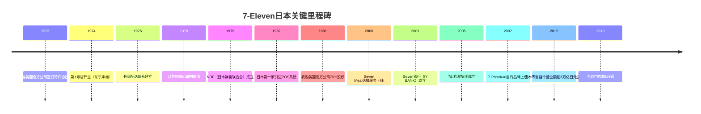
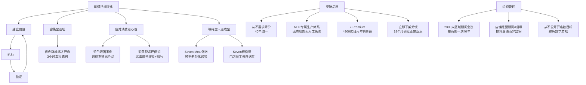

# 零售的哲学：7-Eleven便利店创始人自述

铃木敏文著，7-Eleven日本公司创始人回顾40年零售经营历程的总结之作。书中以7-Eleven的实际案例为主线，阐述了一套以"应对变化"为核心的零售经营哲学。

## 铃木敏文其人

铃木敏文（1932年生）并非零售业出身。他在东贩出版社工作多年后，加入伊藤洋华堂，1973年主导从美国南方公司引进7-Eleven便利店特许经营权，创立"株式会社York Seven"。

他自述对零售业并无特别兴趣，正因如此，反而养成了习惯性地站在顾客立场思考的方式，不被行业经验所束缚。书中反复强调的核心判断力，正来自于这种"门外汉视角"。

1974年5月15日，7-Eleven第1号店在东京都江东区丰洲开业（由酒坊转型而来的山本宪司担任加盟店主）。此后40年，铃木将这家便利店发展为日本零售业史上第一个年营业额突破3万亿日元的品牌（2012年）。

## 核心哲学：读懂变化、建立假设

铃木贯穿全书的方法论只有一个框架：

```
假设 → 执行 → 验证 → 新假设
```

他将产品滞销的原因总结为唯一一条：**当前的工作方法已无法满足时代和消费者需求的变化。** 不接受"经济不景气""老龄化"等宏观借口，因为同一环境下7-Eleven业绩持续增长。

对变化的判断，他强调要挖掘"本质"而非"表象"。表象是消费多样化，本质是日本消费形态高度统一化——贫富差距小、义务教育均等，SNS进一步放大爆款效应，畅销品种类极度集中。

## 密集型选址战略

7-Eleven最初进驻市场时，同行普遍认为应在全国广泛铺开门店。铃木做出反向判断：在特定区域以"面"而非"点"密集开店。

三大优势显现：
- 品牌认知在区域内形成饱和度
- 物流效率大幅提升（配送距离短、频次高）
- 促销活动产生规模效应

这一判断贯穿至今：7-Eleven直至2013年才进入四国地区，原因是"供应链各环节没有成功完成衔接之前，绝不会盲目开店"——专用工厂必须建好，门店只在距工厂3小时车程以内开设。

## 产品体系：NDF与7-Premium

铃木拒绝降价竞争，坚持"追求品质"路线40年，从未要求供应商降价。

**NDF（日本鲜食联合会）** ，1979年成立，核心原则是"只为7-Eleven制造产品"。到2013年，已有80余家米饭、面包、配菜生产商加入。NDF实现了统一原材料标准与品质管控，无需防腐剂和人工色素。所有新品必须通过包括铃木在内的全体高层董事试吃方可上市。

铃木警告：合作伙伴关系不能变成"好朋友"。过于亲密会导致"算了，让他通过"的松懈心态。7-Eleven从未向任何一家工厂投资，保持相互独立以维持紧张感。

**7-Premium自有品牌** ，2007年上线，49款增至1700款，第一年800亿日元销售额，2012年突破4900亿日元。定位不是"价格低廉"，而是"价格以上的价值"。

两个经典案例：
- **红豆糯米饭团** ：试吃发现口感不对，追查原因，要求改用蒸笼蒸制（而非锅煮），引进新设备，成为长年人气产品
- **停售炒饭** ：2003年试吃发现饭粒黏连，当天命令全店下架，历时1年8个月研发新设备与工艺，以"正宗炒饭"重新上市后大受欢迎

铃木的判断："越美味的东西越容易腻。" 每天购买的经典款（便当、饭团、面包）口味必须比家里做的更好，要有"家中难以实现的味道"——例如地道汤汁、现磨咖啡（Seven咖啡，100日元，2013年正式推出）。

## 信息革命：POS系统与单品管理

1978年，与NEC合作研发订货终端机，实现条形码扫描订货，为日本流通业首创。1982年，成为日本第一家引进POS系统的零售企业。

但铃木反复警告：不能把POS数据当成预测工具——今天的数据对明天而言只是历史记录，不存在直接关联。

**单品管理** 不是数据依赖，而是"主动建立假设"：

1. 以销售数据为出发点
2. 结合明天的天气、气温、街市活动等前瞻信息
3. 预判顾客消费心理，以此订货
4. 通过当天POS数据验证假设
5. 调整后进入下一轮

单品管理同样要求关注关联产品：旅游旺季备齐三明治，若不同步增加咖啡订货，饮料会迅速断货。

铃木在重组美国7-Eleven时，打破了"临时工不负责订货"的惯例，让每天站在收银台前的兼职员工也拥有订货权限。这不仅提升了备货精度，更重要的是激发了员工对工作的热情。

## 组织管理：区域顾问会议

7-Eleven有约2300名店铺经营顾问，每两周一次全体聚集东京总部开会，40年从未改变。

坚持面对面的原因：铃木认为信息传递中"传话游戏"会导致失真。再精妙的指示，经过多级转达后都会变味。

**店铺经营顾问与督导的核心区别：** 督导是监察合规，顾问是帮助提升业绩。这一定义影响了整个组织的服务导向。

铃木从不公开宣布开店数量目标，40年如一。他的判断：数字目标会导致为追数字牺牲品质，形成劣质扩张。

## 消费即心理战

铃木对消费税的判断：消费税提高2%-3%，表面看影响有限，但在主妇群体的心理账户中会引发"涨价警报"，产生抵触情绪，消费意愿骤然冷却。1989年导入3%消费税后，内需在冰点徘徊长达1年半。

他的反向操作：在伊藤洋华堂开展"返还5%消费税"促销。董事会反对，他坚持先在北海道试点，结果营业额同比增长75%，第二周推广至全国。

**特色饭团案例** 是其消费心理判断的典型体现：2001年通货紧缩期，各家公司大打价格战（麦当劳汉堡65日元、吉野家牛肉饭280日元），当研发负责人提议推出更低价饭团时，铃木反向推出定价160-170日元的"特色饭团"（严选海苔、大米、馅料，精致日本纸包装）。当年饭团销售额同比增长率达两位数。

他的判断：100日元饭团畅销，是因为出现了前所未有的价格区间带来的新鲜感；再次降价只会让顾客觉得"黔驴技穷"，失去新鲜感。消费者选择的是"新的价值"，而非"更低的价格"。

## 从等待型经营到进攻型经营

铃木在2009年重新定义7-Eleven的经营姿态：**"近距离的便利"** ——从"24小时开着就有人来"转变为主动贴近顾客生活。

这一转变在2011年东日本大地震中得到验证：灾区顾客最迫切的需求不是救援物资，而是"7-Eleven招牌的灯光重新亮起"——熟悉的便利店恢复营业，才能消除内心不安。

进攻型经营的具体形态：
- **Seven Meal（2000年）** ：送餐上门，500日元套餐免费配送。预判老龄化、小家庭增加、个体商店减少三大趋势
- **Seven轻松送货（2012年）** ：用超小型电动车，由门店员工（而非快递员）直接送货上门，建立"熟悉的安全感"
- **掌控网络=掌控现实** ：网络热销产品在实体店货柜的销售效率高出其他货柜30%；Seven Spot免费WiFi引导客流在集团店铺间流转
- **便利店作为生活基础设施** ：代收公共事业费、打印住民票、ATM、与地方政府签订突发状况支援协议

## 美国南方公司的衰败与重组

1991年，铃木以640亿日元收购美国南方公司70%股权。南方公司败因：多元化扩张失败（房地产、石油、LBO债务）加上主营业务被价格战拖垮，陷入恶性循环。

重组第一步：改变"由物流中心强塞货品给门店"的做法，赋予一线员工（包括临时工）自主订货权。铃木在美国被称为"飓风铃木"，因其坚持"破坏性变革"而得名。

重组成果：美国7-Eleven推行单品管理后业绩大幅提升，北美门店总数突破1万家。铃木的结论：**经营的基本原则在任何国家都大同小异。**

## 全球化策略

2013年，7-Eleven在全球16个国家和地区拥有超过5万家门店。

海外策略不是"入乡随俗"的妥协，而是用同一套方法——捕捉目标国社会形势与居民需求变化——置换本地产品。

北京经验（2004年进驻）：调研发现当地居民习惯吃热食，而既有便利店完全没有热餐，于是填补空白，推出现场烹饪服务。由中央厨房配送切好的食材，门店完成加热，绕过了难以取得明火经营许可证的障碍。

产品全球化研发案例：Yosemite Road红酒（2009年），日美共同研发，加利福尼亚葡萄，从培育到品质管理全程统一化管理，在日本售价980日元，美国3.99美金，热销后推向中国市场。

## 7-Eleven成长路径



## 铃木的经营原则图谱



## 铃木语录

> "7-Eleven是一家不断主动做出改变的公司。"

> "妥协即是终结。"

> "消费者购买产品的动机永远不会只停留在价格便宜上。比起价格，产品的新价值、口味更好的体验更能促进购买意愿。"
