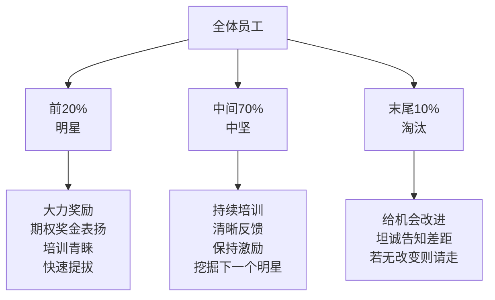

# 20-70-10 人才梯队管理

## 问题：为什么"一视同仁"反而不公平？

大多数公司的绩效评估是"假坦诚"：表格上写的是好话，面谈时尽量回避批评，发奖金时差距微乎其微。结果是：表现出色的人感觉不受重视，表现糟糕的人在幻觉中待了几年，直到40多岁才被迫听到真相。韦尔奇说，**这才是真正的残酷**。

他用棒球队类比：纽约扬基棒球队的明星球员年薪1800万美元，而板凳球员可能只有30万，区别一目了然——但球队还是年年争冠。用"平等主义"管理员工，等于用同一把尺子量投手和接球手，结果每个人都受了委屈。

## 方法：三层排名，差异化对待

每年对所有员工进行强制性排名，将人分为三类：

**前20%（明星）**：不只是给高薪，还要青睐、赞扬、提供学习机会，让他们知道自己的价值。韦尔奇说，这些人是公司的引擎，必须不惜一切留住他们。

**中间70%（中坚）**：这是韦尔奇最反复强调被忽视的一组——公司大部分工作由这70%完成。未来的明星常常藏在这里。错误做法是只盯着前20%和末尾10%，中间70%被放任自流。优秀公司要求经理人**至少把50%的人员管理时间放在中间层**，给他们及时的反馈和培训。

在中间70%内部，还存在自己的分层。**中间70%里最好的那部分人最容易流失**——他们接近明星标准，却被当成普通中坚对待，感到不被认可后悄悄离开，这是最大的浪费。

**末尾10%（淘汰）**：每年必须清除。韦尔奇的理由不是冷酷，而是更人道：如果一个人的业绩一年比一年差，却从来没有人告诉过他实情，那么他在40多岁时才被告知"你不适合这里"，才是真正的残酷。早点告知、早点请走，给他机会找到更适合自己的地方。

## 争议与反驳

韦尔奇在书中专门回应了几个常见批评：

**"在文化上行不通"**：他说这只是借口。GE在日本推行时，最初也有人说文化障碍，结果实施后，日本员工和美国俄亥俄州的员工对这套制度的接受度是一样的——因为区别考评本质上是**诚实、公平、透明**的，跨越文化。

**"会让中间70%失去动力"**：不一定。对前20%，中间70%是压力；对中间70%，晋入前20%是可见的目标；对整体，这是一个公开的游戏规则，知道自己位置的人反而更有安全感。

**"偏向外向者，忽视内向者"**：韦尔奇承认这种偏向存在，但指出在业务世界里这种偏好是普遍的——他说这不是考评制度的问题，而是社会价值观的问题。

## 关键支撑：克罗顿维尔的转型

20-70-10推行以前，GE位于纽约克罗顿维尔镇的培训中心是"提前退休大道上的一个休息站"——业务部门把表现不佳的员工打发到这里来。推行之后，培训中心被改造成了**交流平台**，只接受前20%和中间70%里最好的那部分员工，CEO和高层也亲自来每个培训班上交流数小时。培训中心的存在变成了一个信号：公司真的在投资最优秀的人。

## 核心前提：好的绩效评价体系

20-70-10的运转需要一套严肃执行的绩效评价体系作为基础。韦尔奇说，他演讲时每次调查"过去一年有多少人接受过面对面、诚实坦白的绩效反馈"——运气好时20%举手，通常不到10%。没有这套体系，区别考评就成了无源之水。

一套好的评价体系的四个要素：
1. 简单明了（最多两页）
2. 标准一致，与个人行为直接相关
3. 每年至少一次正式面谈，让员工知道自己和同事相比处于什么位置
4. 包括职业发展内容，经理人要能说出2~3个可能替代自己的人选

---

*本框架来自 [[赢]]，与 [[高产出管理]] 中格鲁夫的绩效评估框架形成对照。*
