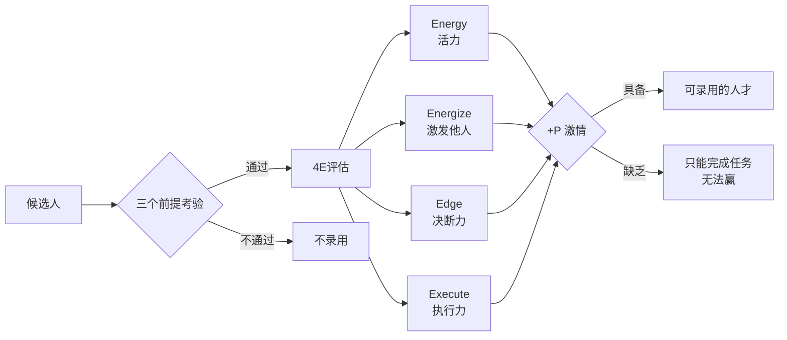

# 4E1P 招聘框架

## 问题：你能用一个问题决定雇不雇一个人吗？

韦尔奇在加利福尼亚州圣迭戈的一次保险业经理人聚会上，被问到："在面试中，您可以提一个什么样的问题，以帮助自己决定到底雇用谁呢？"他当场被问倒，摇头说答不上来。他后来想了好几年，答案是：**问他上一次离职的原因** ——那个答案里藏着比任何数据都更重要的信息。

但离职原因只是入口。在进入4E1P评估之前，韦尔奇要求先通过三个前提考验：

| 考验 | 含义 |
|------|------|
| 正直 | 说真话，守信用，承认错误，尊重游戏规则 |
| 智慧 | 强烈的求知欲，宽广的知识面，能与优秀的人共事 |
| 成熟 | 能控制怒火，承受压力，幽默感，尤其是对自己 |

这三个考验应在招聘程序**开始之前** 就进行，而不是等到最后签字时才考虑。

## 方法：四个E，一个P

### Energy（活力）

充满活力的人热爱生活。他们是外向的、乐观的，善于与人交流。他们不抱怨工作的辛苦，总是满怀热情地开始和结束一天的工作，很少在中途显出疲惫。

韦尔奇说，这种特质很难通过培训培养——它属于个人的本性。**如果一个人缺乏活力，不要录用他，因为没有活力的人将削弱整个组织的动力。**

### Energize（激发他人）

激发他人的能力不只是会演讲，而是对业务有精深了解，能让其他人承担看似不可能完成的任务，并享受战胜困难的喜悦。与这样的人共事，是一种荣幸。

**案例：沙琳·贝格利**。1988年以财务管理实习生身份进入GE，后被选拔负责GE交通运输产业的六西格玛计划。她的激励方式是综合能力的体现：清晰表达目标、绝对认真但不过分在乎自己、有幽默感、总是乐观向上。通过六西格玛项目，她从众人中脱颖而出，最终成为GE铁路事业部董事长兼CEO（38岁，年销售额30亿美元的事业部）。

### Edge（决断力）

有决断力的人知道什么时候应该停止评论，**即使他没有得到全部的信息，也需要做出果断的决定**。

最糟糕的类型是迟疑不决者："把事情推迟一个月，我们再好好地、认真地考虑一下。"还有一种人，明明同意了你的建议，等其他人来到他房间后，想法又改变了——韦尔奇把这类人叫"首鼠两端的老板"。

韦尔奇发现，即使是最精明的人，有些人在作决断时也遇到了致命困难，尤其是从咨询业过来的人——他们能想到太多备选方案，这反而妨碍了下决心。

### Execute（执行力）

执行力是韦尔奇们最晚发现需要加入的第四个E。GE审计部门的比尔·康纳狄在看完一周中西部地区视察的人才资料后说："杰克，我们肯定遗漏了某些重要的指标，这些人看起来都有三个满圆，但有些人业绩却很不好。"被遗漏的正是执行力。

执行力意味着：知道怎样把决定付诸行动，经历阻力、混乱和意外干扰后仍然继续前进，最终实现目标。有执行力的人非常明白，**"赢"才是结果**。

执行力可以通过培训提高（不像活力那样属于本性难移）。GE审计部门每年吸收约120人，在3~6人的小组里完成12周令人筋疲力尽的财务分析，向CFO和CEO汇报问题。3~5年后，他们变得像剃刀一样锋芒毕露——学会了如何让自己的建议被采纳，如何对结果负责。GE规模最大的几个事业部门CEO都是审计部门培养出来的。

### Passion（激情）

激情是指对工作有衷心的、强烈的、真实的兴奋感，**不只是对工作，而是对周围的一切**。充满激情的人是体育比赛的忠实观众，是母校的狂热拥护者，或者对政治充满兴趣。无论怎样，他们的血管里奔流着旺盛的生命力。

没有激情的人，"工作起来像是只要拿到薪水就行了"。

## 高层候选人的额外4个特征

4E1P适用于任何岗位。但在招聘高层领导时，韦尔奇还要考察4个额外特征：

| 特征 | 含义 |
|------|------|
| 真诚（Authenticity） | 有自知之明，有强烈的自信，能以真诚触动别人，不伪装 |
| 对变化来临的敏感性 | 能看到不可想象的事物，像保罗·福雷斯科那样总能预判对手下一步 |
| 爱才 | 希望周围的人比自己更优秀、更聪明，敢于把会议室里最精明的位置让给别人 |
| 坚韧弹性 | 犯错、跌倒后能从中学到教训，以更强的速度和自信继续前进 |

关于弹性：韦尔奇说，"我特别喜欢那些曾经被完全击倒，却又能站起来，并且在下一个回合里能以更强的姿态出现的人。"

## 如何甄别

在面试中，韦尔奇建议：

- **永远不要完全依赖一次面试** ——安排多人多次接触候选人，找组织里有识别天赋的人参与（比尔·康纳狄只需要一次握手和一个微笑就能判断应聘者的情况）
- **夸大招聘职位的挑战性** ，描述最糟糕的情况——如果对方不停说"是的，是的，没问题"，可能是没有其他选择；如果他开始反问"我有多少人可以展开工作"，值得关注
- **尽量不做例行的推荐电话** ，强迫自己发现不好的信息——韦尔奇无数次得到这样的回答："你被那个家伙愚弄了！我们很高兴摆脱了他！"

关于失败的坦诚面对：韦尔奇说，他选对人的概率从28岁时的**50%** 提高到退休时的**约80%**。"如果你有时候用人不当，不要太为难自己——情况是会转变的。但每次在人员招聘上的失败都是你自己的责任。"

---

*本框架来自 [[赢]]，与 [[20-70-10人才梯队管理]] 共同构成韦尔奇的人才系统。*
