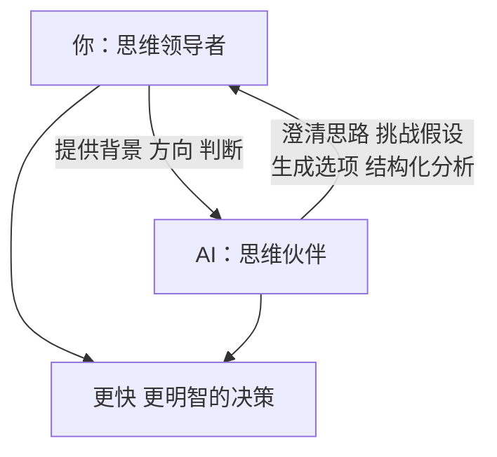
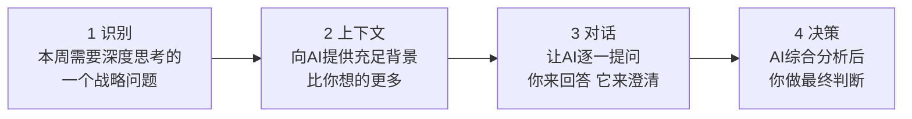
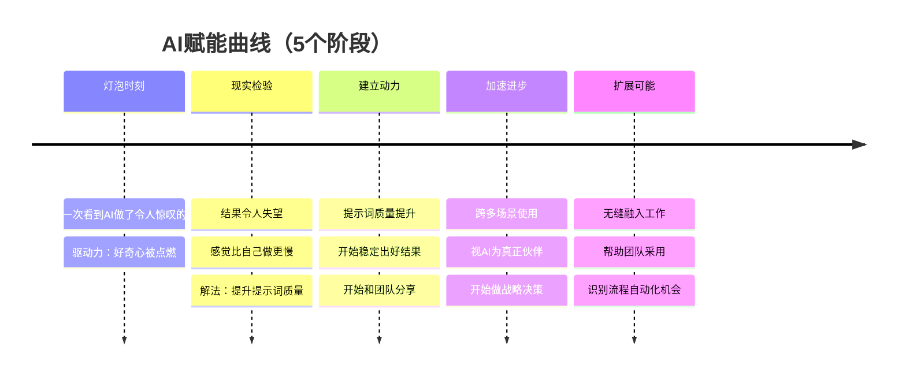
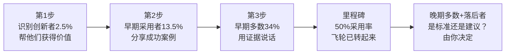

# AI思维伙伴框架

> 来源：《[[AI驱动的领导力]]》——Geoff Woods（2024）

---

## 框架定义

**AI思维伙伴框架（AI Thought Partner Framework）** 是一套将AI定位为战略决策伙伴（而非效率工具）的操作性方法论。核心主张：领导者应以"Thought Leader（思维领导者）+ AI Thought Partner（AI思维伙伴）"的二元架构组织决策过程。

适用场景：任何需要战略思考的领导力任务——战略规划、假设验证、数据解读、决策评估、团队沟通。

---

## 核心架构



**分工原则：**
- 你是指挥棒：AI缺乏你的背景和视角，无法替代你的领导判断
- AI是乐器：做计算性、结构性、探索性工作，把你的时间还给战略

---

## 五大使用场景与核心提示词

### 1. 战略思考（挑战假设）

当你需要验证一个战略计划或重大决策时：

```
Attached is our strategic plan. I want you to act as my AI Thought 
Partner™ by asking me one question at a time to challenge my biases 
and the assumptions we have made. I also want you to challenge if our 
plan has the sufficiency to achieve our goal. Once you have enough 
information, give me a summary of where you think our plan is strong 
and where you see potential weaknesses, and recommend ways we can 
improve it.
```

### 2. 创造"灯泡时刻"（第一次体验AI的价值）

当你或你的团队成员还没体验过AI价值时：

```
I would like you to act as a Thought Partner by asking me one question 
at a time. Here's the situation: [提供背景]. Here's what I'm trying 
to solve: [描述问题]. Please help me think through potential solutions.
```

如果不知道从哪里开始：

```
I'm new to AI and unsure how it can help me. Interview me by asking 
one question at a time to identify how you can help me.
```

### 3. 短期/长期平衡（情景规划）

当面临短期压力可能侵蚀长期战略时：

```
Here are our current short-term pressures: [列举]. Here is our long-term 
vision: [描述]. Help me conduct a scenario planning exercise by asking 
me questions to identify actions we could take in the short term that 
align with and advance our long-term goals.
```

### 4. 数据到决策（压缩分析时间）

当你有数据集但需要快速洞见时：

```
Here is our [数据类型/CSV/报告]. Act as a strategic analyst. Ask me 
one question at a time to understand our business context, then identify 
the 3 most important patterns in this data and their strategic implications.
```

### 5. 克服"错误问题"的陷阱

当你感觉自己在战略上陷入死胡同时：

```
I want you to challenge the questions I'm asking myself about [主题]. 
Act as a Thought Partner. Ask me one question at a time to uncover the 
assumptions underlying my questions, and then suggest better questions 
I should be asking.
```

---

## 四步操作流程



**核心技巧：**
- 不要一次给出所有信息，让AI通过问问题来提取你的假设
- 每个会话聚焦一个决策，避免上下文稀释
- 不满意结果时说"你遗漏了什么"或"还有哪些视角我没考虑"

---

## AI赋能曲线：个人采用路径



**在现实检验阶段（最常见的放弃点），三条出路：**
1. 给自己宽容：你在正确的位置上
2. 学习提示词工程：质量=提示词质量
3. 设定承诺：接下来30天累计使用10小时

---

## 组织层面：10倍员工影响力

从工业时代管理方式→AI驱动管理方式的转变：

| 维度 | 工业时代 | AI驱动时代 |
|------|---------|----------|
| 领导者角色 | 告诉人们要做什么 | 传达愿景和战略，让团队决定怎么做 |
| 员工时间分配 | 大部分在低价值任务和会议 | 高影响力优先项 + AI强化 |
| 绩效衡量 | 任务完成率 | 业务结果和战略贡献 |
| 学习模式 | 学一次，用一辈子 | 持续学习，持续迭代 |

**实操：帮助员工转型的三步**
1. 明确员工角色中最高影响力的优先项（不是日常任务，是战略贡献）
2. 识别哪些任务可以用AI自动化或加速（把时间还给高影响力工作）
3. 教员工用AI作为Thought Partner（不只是内容生成工具）

---

## 变革管理：顺滑过渡策略

**采用曲线策略**（不要试图一次说服所有人）：



**处理员工恐惧的话术框架（PACE）：**
- **同理心（P）**：承认AI带来的恐惧是合理的
- **澄清（A）**：技能和流程会变，但你作为人不会被取代
- **支持（C）**：公司有责任帮你开发AI时代需要的技能
- **期望（E）**：清晰说明这是组织标准还是个人选择

---

## 与其他框架的关联

| 框架 | 关联点 |
|------|-------|
| [[高产出管理]]（格鲁夫）| 高杠杆活动的识别方法；AI可以做格鲁夫定义的大部分"信息收集"工作 |
| OKR系统 | 第10章战略清晰度与OKR对齐；AI可强化季度战略复盘 |
| [[第五项修炼]]（圣吉）| "心智模式"障碍与AI的偏见挑战功能形成互补 |

---

## 核心限制与批判

**不适合的场景：**
- AI幻觉风险高的领域（法律合规、医疗诊断等）需要专业人工验证
- 框架假设你已有清晰战略可以输入AI；如果战略本身模糊，AI会放大而非解决这个问题
- "Strategy first"的前提是领导者本身有足够战略能力——AI不能替代领导者学习战略思维

**最常见的误用：**
1. 把AI当搜索引擎（问事实性问题而非对话探索）
2. 一次性提问而非迭代对话（失去Thought Partner效果）
3. 接受AI第一个回答而不追问（放弃了挑战假设的机会）
