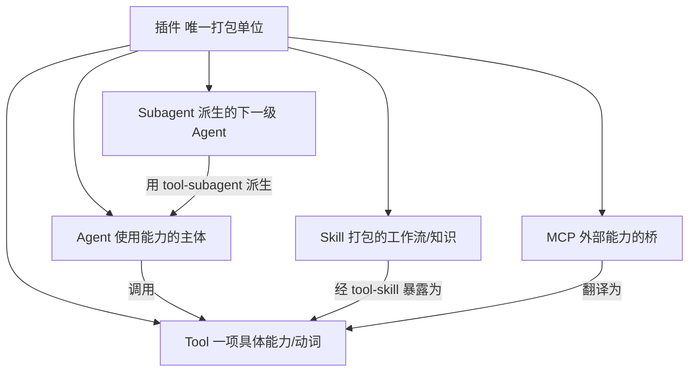
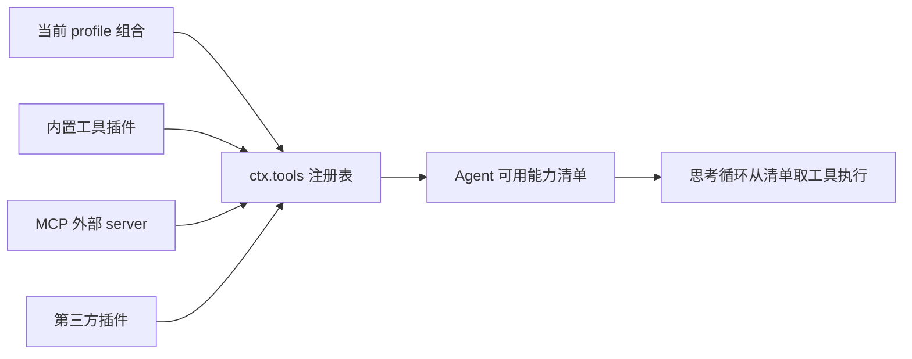
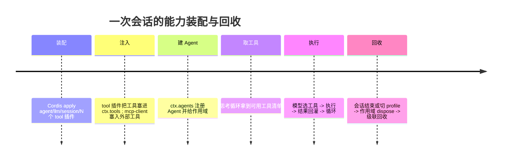

# Agent能力体系

Agent 能力体系指 DeepSeek Harness 中 Agent、Tool、Skill、MCP、Subagent 五者的角色关系。它们不是并列的五种东西，而是一种机制（[[Cordis插件架构]]的插件）加五类用途。插件是唯一打包单位，其余是围绕"Agent 调用 Tool"这一核心长出的角色。

---

## 五个角色

- Agent。使用能力的主体。`core/agent` 注册 `ctx.agents` 服务（AgentRegistry），本身零 loop 依赖，思考循环可替换。Agent 只是主体加作用域，能用什么取决于往它作用域注入了哪些 Tool。
- Tool。一项具体能力。每个工具包是一个插件，在 apply 里 `ctx.tools.register(defineTool(...))`。上游自带几十个：fs、bash、pwsh、web、lsp、todo、workflow、jobs、goal、session-query、ask-user、terminal、cordis 等。
- Skill。打包好的领域知识与操作流程，通过 `tool-skill` 以工具形式暴露给 Agent，机制上是 `ctx.tools` 里的一等条目。
- MCP。Model Context Protocol 客户端，把外部 server 的工具动态注册进 `ctx.tools`。是一种批量引入工具的来源，而非与 Tool 并列的东西。
- Subagent。一个 Agent 通过 `tool-subagent` 工具生出另一个 Agent，底层复用同一套 `ctx.agents` 注册台，多了创建者与被创建者的 owner 关系。

---

## 一个 Agent 有多少能力

能力等于当前 profile 里 `ctx.tools` 注册的工具集合，无上限、非写死，随 generation 动态增减。装多少就有多少：上游默认带几十个工具插件，再加 MCP 引入的外部工具与社区第三方插件。加一个插件就多一项能力。

---

## 一次运行

每一项能力都用相同的"声明依赖、register 拿 disposer、随作用域回收"三步接入，彼此不知道对方存在，只通过 `ctx.<service>` 这块公共黑板协作。这就是"一切皆插件"在能力层面的含义：从读文件到派生子 Agent 到接入外部 MCP，机制上是同一件事。底层机制见[[Cordis插件架构]]。
