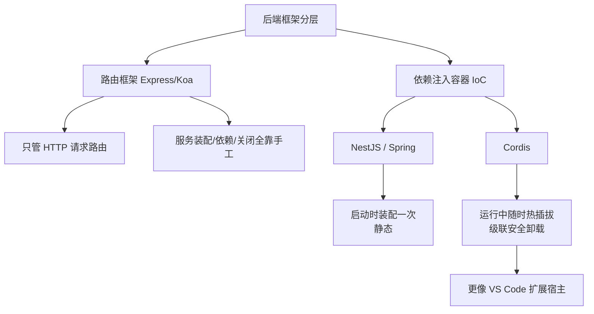
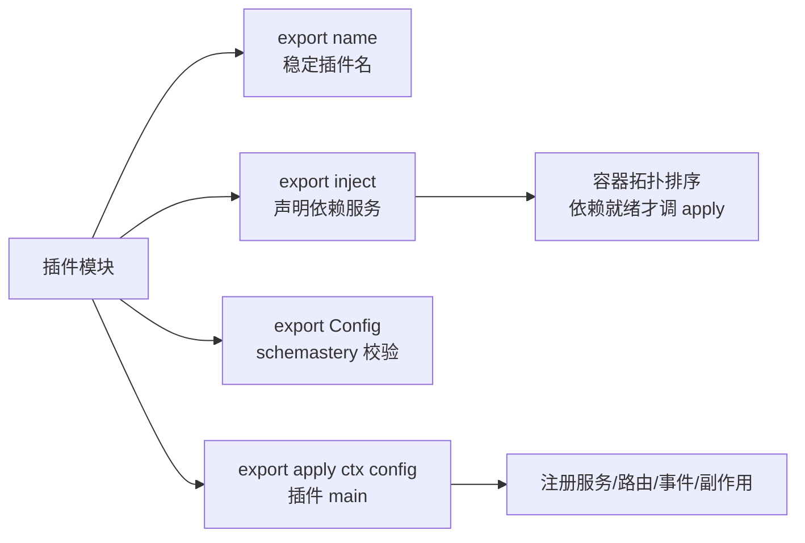
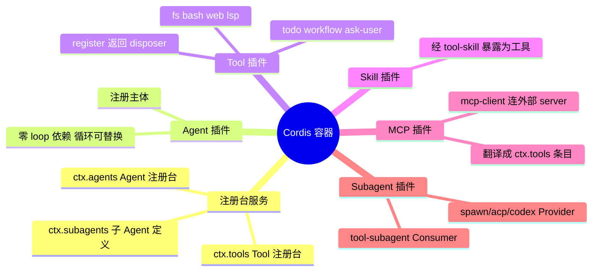
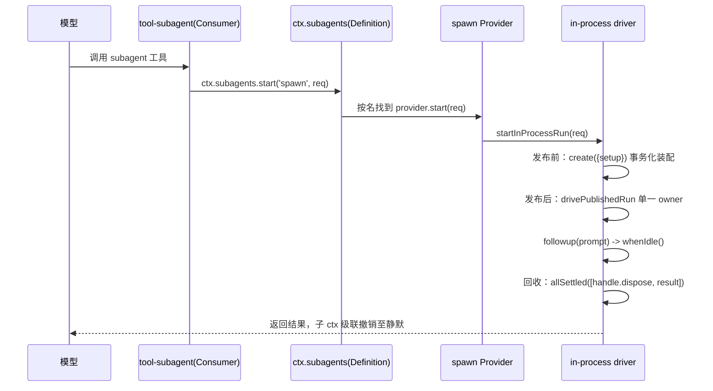
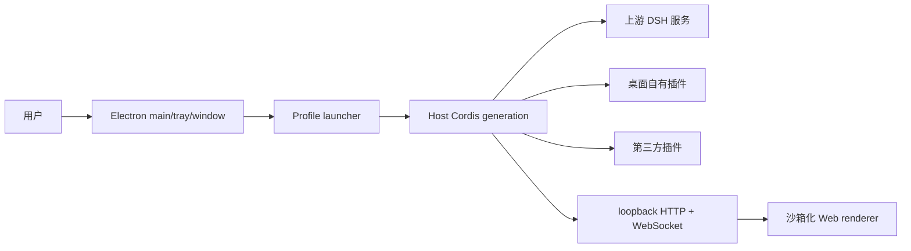

# Cordis 插件架构

Cordis 是 Cordiverse（源自 Koishi.js 生态）的通用插件运行时框架，可理解为"控制反转（IoC）容器 + 响应式生命周期管理器"。DeepSeek Harness 用它作为整个 Agent 运行时的骨架，DSH Desktop 把桌面能力也写成 Cordis 插件挂进去。核心命题是"一切皆插件"：从读一个文件、接入外部 MCP server，到派生一个子 Agent，机制上是同一件事。

> "everything is a plugin" ——DeepSeek Harness 仓库根 AGENTS.md 首句

Cordis 处于后端进程装配层，与 React 不在同一维度。React 管 UI（把数据渲染成界面）；Cordis 管后端进程装配（把很多能力装进一个 Node 进程并管理依赖与生死）。两者可共存：上游用 Cordis 组织服务，服务吐出的 Web UI 内部用 React 渲染。

---

## 定位：属于依赖注入容器一档

后端框架的核心分歧在于"服务怎么创建、谁先谁后、互相怎么找到、进程关闭时怎么按序拆掉"。按这个标准，Cordis 与 Express 不在一层。

Cordis 与 NestJS、Spring 同属依赖注入容器，但专精"运行时动态热插拔 + 级联安全卸载"，因此更贴近 VS Code 扩展宿主：一堆扩展贡献并消费彼此的能力，可随时装卸而不影响其他扩展。详见[[依赖注入与控制反转]]。

---

## 三条核心原语

Cordis 把服务黏在一起的胶水，始终是这三条原语。它们一致覆盖 Tool、Skill、MCP、Subagent、桌面壳。

| 原语 | 代码形态 | 作用 |
|------|---------|------|
| 服务（Service） | `class X extends Service { constructor(ctx){ super(ctx,'key') } }` 配合 `declare module` 把 `key: X` 挂到 Context | 把能力挂到 `ctx.key`，消费者只认名字；ctx 销毁时自动注销 |
| 注册即 effect | 任何 `register()` 返回 `() => void`（disposer） | 资源挂在作用域上，卸载时精确回收 |
| 依赖注入 | `export const inject = ['tools','settings']` | 容器保证依赖就绪后才调 `apply`；拓扑排序，松耦合 |

`super(ctx, 'tools')` 这一行是枢纽：Service 基类构造时把 `this` 挂到容器服务表的键上，从此任何插件写 `ctx.tools` 就拿到实例；提供它的 ctx 销毁时又自动注销。服务的生与死都由 Cordis 托管。

`ctx.effect(() => cleanup)` 是生命周期精髓：传入建立副作用的函数，返回清理函数，ctx 被销毁时清理函数自动执行。它与 React 的 `useEffect` 写法相似，但触发时机不同——React 由渲染驱动，Cordis 由插件生命周期（加载/卸载、generation 切换）驱动。

---

## 一个插件的形态

一个 Cordis 插件就是导出 `name`、`inject`、`Config`、`apply` 的模块。服务包则默认导出服务类。两种形式不能混用，否则 Loader 会丢弃函数插件的命名空间。

装配方式是声明式的：Cordis 官方 Loader 按配置树加载插件，DSH Desktop 不改上游配置，而用 `cordis.patch.yml` 以 `insert` 把自己的 row（desktop-shell、terminal、diagnostics、pnpm、profiles、updates 等）注入上游 bundle。配置支持 `!!js` 表达式做条件组合。

---

## 与 Agent 能力体系的关系

在这套架构里，Agent、Tool、Skill、MCP、Subagent 全都是 Cordis 插件，区别只是扮演的角色。插件是唯一打包单位，其余是围绕"Agent 调用 Tool"这一核心长出的角色。

一个 Agent 有多少能力，等于当前 profile 里 `ctx.tools` 注册了多少工具。无上限、非写死，随 generation 动态增减；MCP 与第三方插件都能加。详见[[Agent能力体系]]。

---

## 能力接缝：Definition / Provider / Consumer 三段式

capability seam 是这套系统反复出现的设计模式。一个能力由三个角色组成，永不只有一个。

| 角色 | 例子 | 只关心 |
|------|------|--------|
| Service Definition | `ctx.tools`、`ctx.subagents` | "有这种能力"的接口 + 生命周期 |
| Consumer | `tool-subagent`、`tool-fs` | 用能力，不管谁实现 |
| Provider | `subagent-spawn-in-process`、mcp-client 提供的工具 | 具体实现，注册进 Definition |

Consumer 用名字找 Provider（如 `config.provider = 'spawn'`），三者从不直接 import 对方实现。换一行配置就能把同一个 `subagent` 工具的执行后端从 spawn 换成 Codex 或 Claude Code，模型看到的工具不变。

---

## 一次 subagent 工具调用的完整链路

从模型的一次工具调用，可以一路看到底层的并发生命周期事务。

这条链体现了并发/生命周期设计的三个要点，来自 `subagent-in-process-driver` 的 `startInProcessRun`：

1. 发布边界。子 Agent 的一生以"发布"为界切成两段。发布前由创建事务拥有未发布装配与回滚，失败则静默且不发布任何子 Agent，绝不留半个僵尸。发布后由返回的 AgentHandle 作为唯一生命周期 owner。
2. 单一 owner。`drivePublishedRun` 把信号接管、一轮对话、结果结算、静默回收全部收拢到一个对象，对应"一个异步操作用一个生命周期控制器表示"。
3. 静默回收。`dispose` 用 `Promise.allSettled([handle.dispose(), result])` 同时等释放句柄与结算那一轮，即使出错也不阻止句柄释放。run 错由 result 通道报，dispose 只报释放句柄失败。

---

## MCP：把外部能力翻译成本地工具

`mcp-client` 是一个只依赖 `tools` 的 Cordis 插件。它连接一个外部 MCP server，把该 server 声明的工具动态注册进 `ctx.tools`，公共名统一加 `mcp__<serverName>__` 前缀。注册在 `syncTools` 里整代原子替换：先拉清单构建下一代，再逐个 `ctx.tools.register(definition)`，出错则整代回滚，模型永远看不到半套工具。外部工具注册完之后，与内置工具完全平级，Agent 的思考循环分不出哪个是外部的。MCP 只是一个批量引入工具的来源。

---

## 桌面壳侧的落点

DSH Desktop 是一个把自己也做成插件的 Electron 桌面壳。它固定并原样运行上游 DeepSeek Harness，桌面能力通过 Cordis 插件机制组合进同一个运行时，而不改上游源码。

关键约束：不另造 renderer IPC 插件系统，也不把 Electron API 暴露给页面；Web UI 只通过 127.0.0.1 环回 HTTP/WS 与 Host 通信。每次切 profile 或切模式，整代 generation 被销毁再重建，因所有资源都挂在 `ctx.effect` 上而自动级联回收。对外只暴露 `profile-service` 与 `pnpm` 两个公开 contract。

---

## 核心结论

"一切皆插件"不是口号，而是从架构顶层到并发底层同一套机制的自然结果。三条贯穿始终的原语可复述全部：声明服务（`declare module` + `super(ctx, key)`）、注册即 effect（`register()` 返回 disposer）、发布边界加单一 owner 加静默回收。这套东西一致覆盖 Tool、Skill、MCP、Subagent 与桌面壳，所以读一个文件与派生一个子 Agent 在机制上是同一件事。
